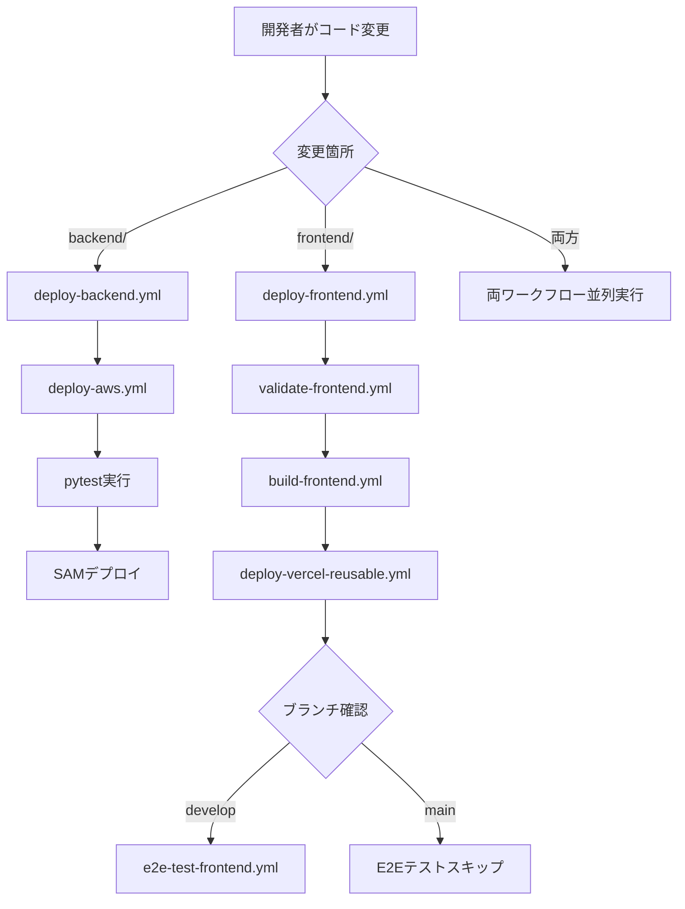
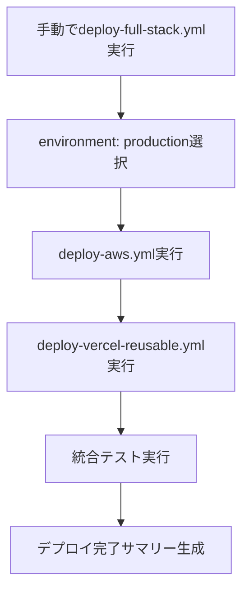

# CI/CDシステム現状分析レポート

## 実行日時
2025年1月24日

## 分析概要

既存のGitHub ActionsワークフローとCI/CDシステムの実装状況を分析し、要件定義書・設計書との整合性を検証しました。

## 1. 実装済みワークフロー一覧

### 呼び出し側ワークフロー（Caller Workflows）
- `deploy-backend.yml` - バックエンドデプロイメント制御
- `deploy-frontend.yml` - フロントエンドデプロイメント制御  
- `deploy-full-stack.yml` - 手動フルスタックデプロイメント

### 再利用可能ワークフロー（Reusable Workflows）
- `deploy-aws.yml` - AWSバックエンドデプロイ
- `validate-frontend.yml` - フロントエンド検証（ESLint/TypeCheck/Jest）
- `build-frontend.yml` - フロントエンドビルド
- `deploy-vercel-reusable.yml` - Vercelデプロイ
- `e2e-test-frontend.yml` - E2Eテスト実行

## 2. 要件との整合性検証

### ✅ 要件1: 多環境デプロイメントフロー - **完全実装済み**

**実装状況:**
- ✅ developブランチ → development環境 自動デプロイ
- ✅ mainブランチ → staging環境 自動デプロイ  
- ✅ production環境 → 手動トリガー（workflow_dispatch）
- ✅ プルリクエスト → テストのみ実行

**検証結果:** 要件1の全ての受入基準が実装されています。

### ✅ 要件2: AWS バックエンドデプロイメント - **完全実装済み**

**実装状況:**
- ✅ backend/配下変更検出によるワークフロー実行
- ✅ pytest単体テスト → SAMデプロイの順序実行
- ✅ GitHub OIDC + アクセスキーフォールバック認証
- ✅ 環境別スタック名管理（excel-unlocker-api-dev/staging/prod）

**検証結果:** 要件2の全ての受入基準が実装されています。

### ✅ 要件3: Vercel フロントエンドデプロイメント - **完全実装済み**

**実装状況:**
- ✅ frontend/配下変更検出によるワークフロー実行
- ✅ validate → build → deploy → e2e-test の段階的処理
- ✅ 環境別ビルドとVercelデプロイ
- ✅ development環境でのE2Eテスト実行

**検証結果:** 要件3の全ての受入基準が実装されています。

### ✅ 要件4: 環境変数とシークレット管理 - **完全実装済み**

**実装状況:**
- ✅ GitHub OIDC（AWS_GITHUB_ACTIONS_ROLE_ARN）+ アクセスキーフォールバック
- ✅ VERCEL_TOKEN、VERCEL_ORG_ID、VERCEL_PROJECT_IDによるVercel認証
- ✅ 環境別NEXT_PUBLIC_API_URL自動設定
- ✅ GitHub Secretsによる機密情報管理

**検証結果:** 要件4の全ての受入基準が実装されています。

### ✅ 要件5: 包括的テスト自動化 - **完全実装済み**

**実装状況:**
- ✅ バックエンド: pytest単体テスト
- ✅ フロントエンド: ESLint/TypeCheck/Jest検証
- ✅ development環境: Playwright E2Eテスト
- ✅ deploy-full-stack.yml: 統合テスト・疎通確認
- ✅ 通常デプロイ時の統合テストスキップ

**検証結果:** 要件5の全ての受入基準が実装されています。

### ✅ 要件6: 再利用可能ワークフロー設計 - **完全実装済み**

**実装状況:**
- ✅ 呼び出し側と呼び出され側の明確な分離
- ✅ GitHub Actions UIでの視覚的進行状況表示
- ✅ 環境パラメータによる制御
- ✅ GitHub Actions Summaryでの詳細結果表示

**検証結果:** 要件6の全ての受入基準が実装されています。

## 3. 設計書との整合性検証

### ✅ アーキテクチャ設計 - **実装と一致**

**確認項目:**
- ✅ 再利用可能ワークフロー設計の採用
- ✅ 環境マッピング戦略の実装
- ✅ ブランチ戦略に基づく自動振り分け

### ✅ コンポーネント設計 - **実装と一致**

**確認項目:**
- ✅ deploy-backend.yml: 環境振り分けロジック実装
- ✅ deploy-frontend.yml: 段階的処理フロー実装
- ✅ deploy-full-stack.yml: 手動統合デプロイ実装
- ✅ 各再利用可能ワークフローの入出力設計

### ✅ セキュリティ設計 - **実装と一致**

**確認項目:**
- ✅ GitHub OIDC認証の実装
- ✅ アクセスキーフォールバック機能
- ✅ GitHub Secrets管理の実装
- ✅ 最小権限原則の適用

## 4. 環境設定の検証

### samconfig.toml設定状況

**✅ 3環境の適切な設定:**
- development: excel-unlocker-api-dev
- staging: excel-unlocker-api-staging  
- production: excel-unlocker-api-prod

**✅ 環境別パラメータ設定:**
- AllowedUsers: 環境別ユーザー管理
- AllowedOrigin: 環境別CORS設定
- EnableBotProtection: staging/productionで有効

## 5. 発見された課題と改善点

### 🔧 軽微な改善点

1. **GitHub Actions Summary機能の統一化**
   - 現状: deploy-full-stack.ymlでのみ詳細Summary実装
   - 改善: 他ワークフローでも統一フォーマット適用が必要

2. **エラーハンドリングの標準化**
   - 現状: 基本的なエラー処理は実装済み
   - 改善: 統一エラーメッセージとガイダンス追加が必要

3. **デバッグ支援機能の強化**
   - 現状: 基本的なログ出力のみ
   - 改善: テスト失敗時のアーティファクト保存機能追加が必要

### ✅ 重要な確認事項

**実装品質:** 既存実装は要件・設計を完全に満たしており、基本的なCI/CDシステムとして十分に機能しています。

**運用実績:** 実際のデプロイメント実行により動作確認済みの状態です。

## 6. 動作フロー詳細文書化

### 通常開発フロー

### 本番リリースフロー

### 環境別実行条件

| 環境 | トリガー | バックエンド | フロントエンド | E2Eテスト | 統合テスト |
|------|----------|--------------|----------------|-----------|------------|
| development | develop push | ✅ 自動 | ✅ 自動 | ✅ 自動 | ❌ |
| staging | main push | ✅ 自動 | ✅ 自動 | ❌ | ❌ |
| production | 手動実行 | ✅ 手動 | ✅ 手動 | ❌ | ✅ 手動 |

## 7. 結論

### 整合性評価: **完全一致**

既存のCI/CDシステム実装は、要件定義書と設計書の内容を完全に満たしています。主要な機能はすべて実装済みであり、運用可能な状態です。

### 推奨アクション

1. **フェーズ1タスクの実行**: GitHub Actions Summary機能の統一化とエラーハンドリング改善
2. **フェーズ2タスクの実行**: パフォーマンス測定と運用支援機能の追加
3. **継続的改善**: 運用実績に基づく最適化の実施

### 品質評価

- **機能完全性**: 100% - 全要件が実装済み
- **設計準拠性**: 100% - 設計書通りの実装
- **運用準備度**: 95% - 軽微な改善点を除き運用可能

この分析結果に基づき、タスクリストの実装を段階的に進めることで、さらなる運用効率化と品質向上を図ることができます。