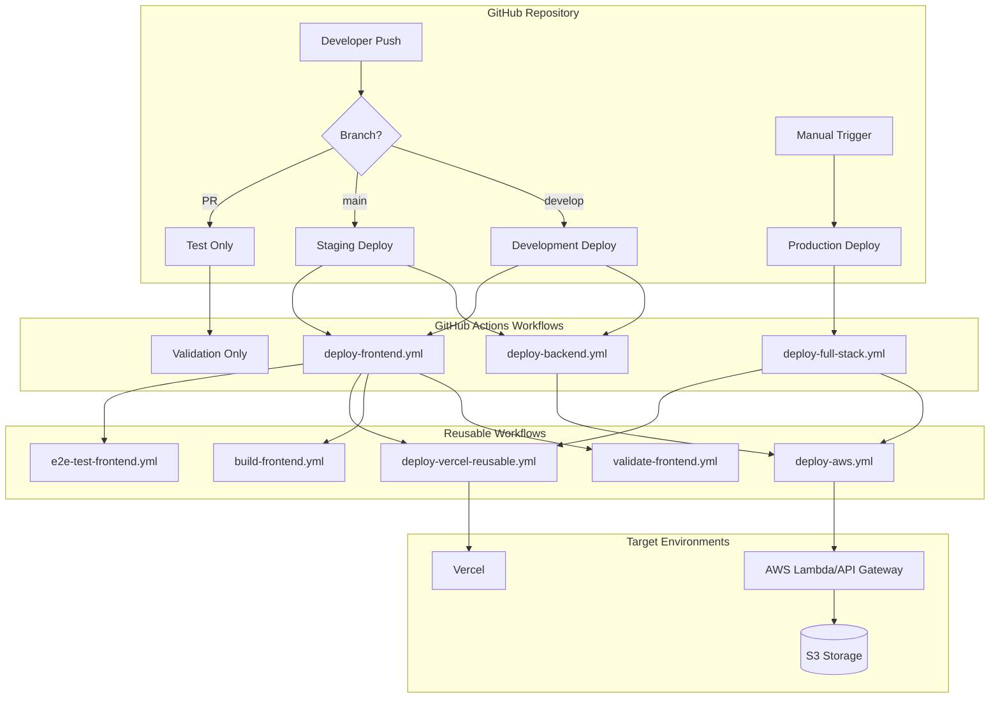
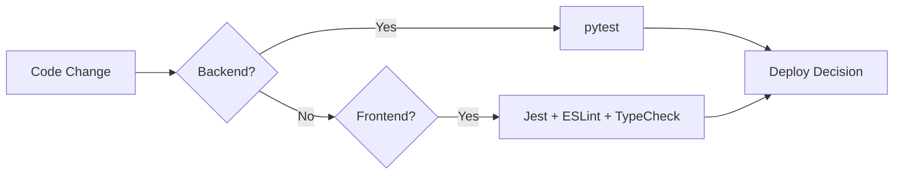

# CI/CD デプロイメント自動化 - 設計書

## 概要

本設計書は、Secure Excel UnlockアプリケーションのCI/CDシステムの技術設計を定義します。GitHub Actionsを基盤とした再利用可能ワークフロー設計により、AWS（バックエンド）とVercel（フロントエンド）への多環境デプロイメントを実現します。

## アーキテクチャ

### 全体アーキテクチャ



### 環境マッピング戦略

| ブランチ/トリガー | 環境 | AWSスタック名 | Vercelプロジェクト | 自動実行 |
|------------------|------|---------------|-------------------|----------|
| develop | development | excel-unlocker-api-dev | development | ✅ |
| main | staging | excel-unlocker-api-staging | staging | ✅ |
| workflow_dispatch | production | excel-unlocker-api-prod | production | 🔧 手動 |
| pull_request | - | - | - | テストのみ |

## コンポーネントと インターフェース

### 1. 呼び出し側ワークフロー（Caller Workflows）

#### deploy-backend.yml
```yaml
# 責務: バックエンド変更の検出と環境振り分け
triggers:
  - push: [main, develop] + backend/** paths
  - pull_request: main + backend/** paths  
  - workflow_dispatch: 環境選択可能

environment_mapping:
  - develop → development
  - main → staging
  - workflow_dispatch → 選択可能
```

#### deploy-frontend.yml
```yaml
# 責務: フロントエンド変更の検出と段階的処理
stages:
  1. validate-frontend.yml (ESLint/TypeCheck)
  2. build-frontend.yml (環境別ビルド)
  3. deploy-vercel-reusable.yml (Vercelデプロイ)
  4. e2e-test-frontend.yml (非mainブランチまたは非production環境)
```

#### deploy-full-stack.yml
```yaml
# 責務: 手動による全体デプロイと統合テスト
execution_flow:
  1. deploy-aws.yml (バックエンド)
  2. deploy-vercel-reusable.yml (フロントエンド)
  3. integration-test (疎通確認)
  4. deployment-summary (結果レポート)
```

### 2. 再利用可能ワークフロー（Reusable Workflows）

#### deploy-aws.yml
```yaml
inputs:
  - environment: string (development/staging/production)
  - skip_deploy: boolean (テストのみ実行)

process:
  1. Python環境セットアップ
  2. pytest実行 (backend/tests/)
  3. SAM build & deploy
  4. API Gateway URL出力

authentication:
  - GitHub OIDC (推奨)
  - AWS Access Key (フォールバック)
```

#### validate-frontend.yml
```yaml
process:
  1. Node.js環境セットアップ
  2. 依存関係インストール (キャッシュ活用)
  3. ESLint実行
  4. TypeScript型チェック
  5. Jest単体テスト実行
```

#### build-frontend.yml
```yaml
inputs:
  - environment: string
  - api_url: string (オプション)

process:
  1. 環境別API URL決定（入力がない場合はデフォルトURL使用）
  2. Vercel環境情報取得とプロジェクト設定正規化
  3. Vercel CLIによるビルド実行
  4. ビルド成果物アーティファクトアップロード
  5. API URL出力
```

#### deploy-vercel-reusable.yml
```yaml
inputs:
  - environment: string
  - api_url: string (オプション、参照のみ)

secrets:
  - VERCEL_TOKEN: Vercel CLI認証用
  - VERCEL_ORG_ID: Vercel組織ID
  - VERCEL_PROJECT_ID: VercelプロジェクトID

process:
  1. ビルド成果物アーティファクトダウンロード
  2. Vercel環境情報取得とプロジェクト設定正規化
  3. 環境別デプロイ実行（production時は--prodフラグ）
  4. デプロイURL出力

note: 環境変数更新はdeploy-aws.ymlで実施
```

#### e2e-test-frontend.yml
```yaml
inputs:
  - deployment-url: string
  - api-url: string

process:
  1. Playwright環境セットアップ
  2. E2Eテスト実行
  3. テスト結果レポート
```

## データモデル

### 環境設定データ

```typescript
interface EnvironmentConfig {
  name: 'development' | 'staging' | 'production';
  aws: {
    stackName: string;
    region: string;
    parameters: {
      Environment: string;
      AllowedUsers: string;
      AllowedOrigin: string;
      EnableBotProtection: boolean;
    };
  };
  vercel: {
    projectName: string;
    environmentVariables: {
      NEXT_PUBLIC_API_URL: string;
      NODE_ENV: string;
    };
  };
}
```

### ワークフロー実行コンテキスト

```typescript
interface WorkflowContext {
  trigger: 'push' | 'pull_request' | 'workflow_dispatch';
  branch: string;
  environment: string;
  changedPaths: string[];
  skipDeploy: boolean;
  skipTests: boolean;
}
```

### デプロイメント結果

```typescript
interface DeploymentResult {
  backend: {
    status: 'success' | 'failure' | 'skipped';
    stackName: string;
    apiUrl: string;
    duration: number;
  };
  frontend: {
    status: 'success' | 'failure' | 'skipped';
    vercelUrl: string;
    previewUrl: string;
    duration: number;
  };
  tests: {
    unit: TestResult;
    e2e: TestResult;
    integration: TestResult;
  };
}
```

## エラーハンドリング

### 1. 認証エラー対応

```yaml
# AWS認証フォールバック戦略
- name: Configure AWS Credentials (OIDC)
  if: env.AWS_ROLE_ARN != ''
  uses: aws-actions/configure-aws-credentials@v4
  with:
    role-to-assume: ${{ env.AWS_ROLE_ARN }}
    
- name: Configure AWS Credentials (Access Key)
  if: env.AWS_ROLE_ARN == ''
  uses: aws-actions/configure-aws-credentials@v4
  with:
    aws-access-key-id: ${{ secrets.AWS_ACCESS_KEY_ID }}
    aws-secret-access-key: ${{ secrets.AWS_SECRET_ACCESS_KEY }}
```

### 2. デプロイメント失敗時の対応

```yaml
# 現在の実装: GitHub Actions標準のエラー表示
# 将来拡張案: 詳細ログ収集とSummary生成
error_handling:
  - GitHub Actions標準ログ
  - ワークフロー実行結果表示
  - 失敗ステップの詳細確認

future_enhancements:
  - カスタムエラーサマリー生成
  - 失敗時アーティファクト自動収集
  - 外部通知システム連携
```

## テスト戦略

### 1. 単体テスト



### 2. E2Eテスト

```yaml
# 実行条件（実装ベース）
conditions:
  - push && branch != 'main' (developブランチ等)
  - workflow_dispatch && environment != 'production' && skip_e2e == 'false'

test_scenarios:
  - ユーザー認証フロー
  - ファイルアップロード・処理・ダウンロード
  - エラーハンドリング
  - レスポンシブデザイン確認
```

### 3. 統合テスト

```yaml
# deploy-full-stack.yml手動実行時のみ
test_types:
  - API疎通確認
  - フロントエンド・バックエンド連携確認
  - 環境変数設定確認
  - 基本的なワークフロー動作確認
```

## セキュリティ設計

### 1. 認証・認可

```yaml
# GitHub OIDC設定 (推奨)
permissions:
  id-token: write
  contents: read

# IAMロール信頼関係（複数ブランチ対応）
trust_policy:
  - Effect: Allow
    Principal:
      Federated: arn:aws:iam::ACCOUNT:oidc-provider/token.actions.githubusercontent.com
    Condition:
      StringLike:
        token.actions.githubusercontent.com:sub: 
          - repo:OWNER/REPO:ref:refs/heads/main
          - repo:OWNER/REPO:ref:refs/heads/develop
```

### 2. シークレット管理

```yaml
# GitHub Secrets (必須)
required_secrets:
  - VERCEL_TOKEN: Vercelデプロイ用トークン
  - AWS_ACCESS_KEY_ID: AWS認証用 (OIDC未使用時)
  - AWS_SECRET_ACCESS_KEY: AWS認証用 (OIDC未使用時)

# 環境変数 (リポジトリ設定)
environment_variables:
  - AWS_ROLE_ARN: GitHub OIDC用IAMロールARN
  - AWS_REGION: ap-northeast-1
```

### 3. 権限最小化

```json
{
  "Version": "2012-10-17",
  "Statement": [
    {
      "Effect": "Allow",
      "Action": [
        "cloudformation:*",
        "s3:*",
        "lambda:*",
        "apigateway:*",
        "iam:PassRole"
      ],
      "Resource": "*",
      "Condition": {
        "StringLike": {
          "cloudformation:StackName": "excel-unlocker-api-*"
        }
      }
    }
  ]
}
```

## パフォーマンス最適化

### 1. キャッシュ戦略

```yaml
# Node.js依存関係キャッシュ
- uses: actions/setup-node@v4
  with:
    node-version: '18'
    cache: 'npm'
    cache-dependency-path: frontend/package-lock.json

# Python依存関係キャッシュ
- uses: actions/setup-python@v4
  with:
    python-version: '3.9'
    cache: 'pip'
    cache-dependency-path: backend/src/requirements.txt
```

### 2. 並列実行

```yaml
# 変更パス検出による独立実行
# backend/変更時: deploy-backend.ymlのみ実行
# frontend/変更時: deploy-frontend.ymlのみ実行
# 両方変更時: 両ワークフローが並列実行

path_based_triggers:
  - backend/** → deploy-backend.yml
  - frontend/** → deploy-frontend.yml
```

### 3. 条件分岐による最適化

```yaml
# パス変更検出による不要処理スキップ
on:
  push:
    paths:
      - 'backend/**'
      - 'template.yaml'
      - 'samconfig.toml'
      - '.github/workflows/deploy-backend.yml'
```

## 監視とロギング

### 1. GitHub Actions標準監視

```yaml
# ワークフロー実行状況
monitoring_points:
  - 実行時間とステップ別所要時間
  - 成功/失敗率
  - リソース使用量
  - 並列実行状況

# GitHub Actions Summary活用（現在の実装状況）
current_implementation:
  - deploy-full-stack.yml: 詳細サマリー実装済み
  - deploy-aws.yml: 基本的なサマリー実装済み
  - その他: 標準ログのみ

# 改善予定（フェーズ1タスク）
planned_improvements:
  - 全ワークフローでの統一フォーマット
  - エラー時の詳細ガイダンス
  - トラブルシューティングリンク
```

### 2. 外部監視連携（将来拡張）

```yaml
# CloudWatch Alarms連携
cloudwatch_integration:
  - Lambda関数エラー率監視
  - API Gateway応答時間監視
  - S3アクセスパターン監視

# Vercel Analytics連携
vercel_monitoring:
  - デプロイメント成功率
  - ビルド時間推移
  - 実行時パフォーマンス
```

## 運用手順

### 1. 通常の開発フロー

```bash
# 1. 機能開発
git checkout -b feature/new-feature
# 開発作業...

# 2. プルリクエスト作成
git push origin feature/new-feature
# → テスト・ビルドチェックのみ実行

# 3. developブランチマージ
git checkout develop
git merge feature/new-feature
git push origin develop
# → development環境に自動デプロイ + E2Eテスト

# 4. mainブランチマージ
git checkout main  
git merge develop
git push origin main
# → staging環境に自動デプロイ
```

### 2. 本番リリース手順

```bash
# 1. GitHub Actions画面でdeploy-full-stack.ymlを手動実行
# 2. environment: production を選択
# 3. 統合テスト実行確認
# 4. デプロイ完了確認
```

### 3. ロールバック手順

```bash
# 1. 前のコミットに戻す
git revert <commit-hash>
git push origin main

# 2. または直接的なロールバック
# GitHub Actions画面でdeploy-full-stack.ymlを手動実行
# 前のバージョンのコミットハッシュを指定
```

## 設計決定事項

### 1. 再利用可能ワークフロー採用理由

- **保守性**: 共通処理の一元管理
- **視覚性**: GitHub Actions UIでの進捗確認
- **柔軟性**: 環境パラメータによる制御
- **テスタビリティ**: 個別ワークフローの独立テスト

### 2. 多環境戦略採用理由

- **段階的検証**: development → staging → production
- **リスク軽減**: 本番環境への影響最小化
- **開発効率**: 環境別の並列開発支援
- **品質保証**: 環境別テスト戦略

### 3. 手動本番デプロイ採用理由

- **安全性**: 意図しない本番変更の防止
- **承認プロセス**: 明示的な本番リリース判断
- **統合テスト**: 本番デプロイ時の包括的検証
- **運用制御**: リリースタイミングの制御

## 制約事項と前提条件

### 技術的制約

- GitHub Actions実行時間制限: 6時間
- 同時実行ジョブ数制限: 20ジョブ
- AWS Lambda同時実行数制限: 1000
- Vercel無料プランビルド時間制限

### 運用制約

- 本番デプロイは手動承認必須
- GitHub OIDC設定は事前準備必要
- 機密情報はGitHub Secrets管理必須
- samconfig.toml環境設定は手動メンテナンス

### 前提条件

- GitHub Actionsが有効化されている
- AWS IAMロール・ポリシーが適切に設定されている
- Vercelプロジェクトが作成・設定されている
- 必要なGitHub Secretsが設定されている