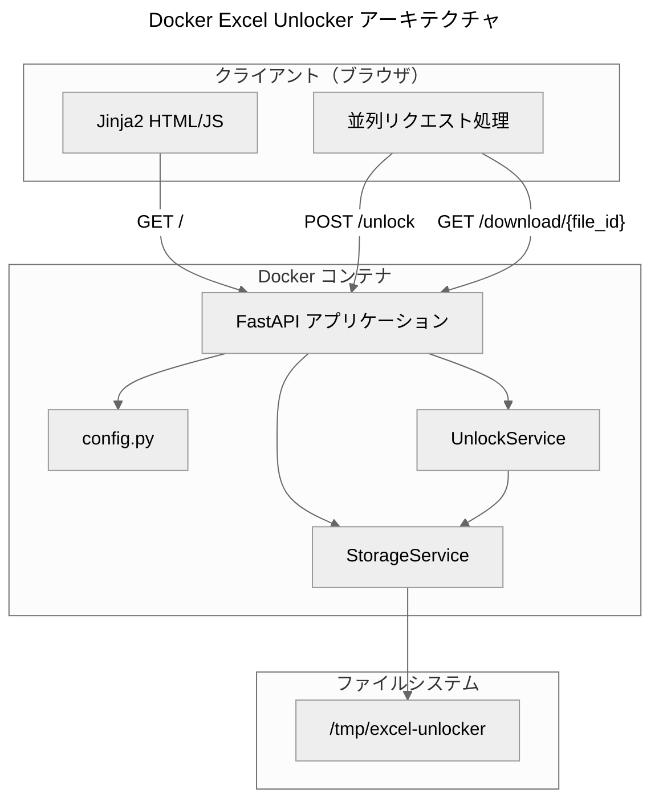
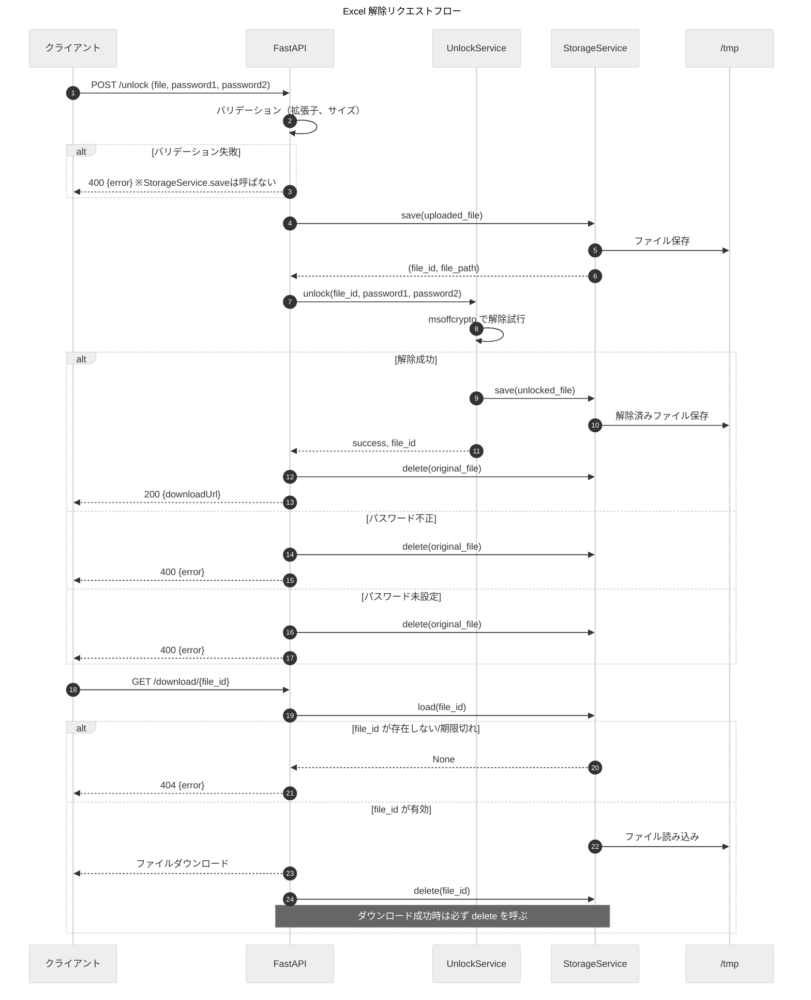

# Docker Excel Unlocker - 設計書

## Overview

本設計書は、Docker コンテナで動作する Excel パスワード解除ツールの技術設計を定義します。FastAPI + Jinja2 の単一コンテナ構成で、Tailscale VPN 経由でマルチデバイスからアクセス可能なシンプルな Web アプリケーションを実現します。

### 設計方針

1. **シンプルさ優先**: 単一コンテナ、単一プロセス、最小限の依存関係
2. **将来拡張性**: StorageService 抽象化により Cloud Run + GCS への移行を容易に
3. **1ファイル1リクエスト**: クライアント側並列でスケーラビリティを確保

## Architecture



### リクエストフロー



## Components and Interfaces

### ディレクトリ構成

```
excel-unlocker/
├── app/
│   ├── __init__.py
│   ├── main.py              # FastAPI エントリポイント
│   ├── config.py            # 設定一元管理
│   ├── routers/
│   │   ├── __init__.py
│   │   ├── unlock.py        # /unlock エンドポイント
│   │   ├── download.py      # /download エンドポイント
│   │   └── health.py        # /health エンドポイント
│   ├── services/
│   │   ├── __init__.py
│   │   ├── unlock_service.py    # Excel 解除ロジック
│   │   └── storage_service.py   # ファイル保存/削除
│   ├── models/
│   │   ├── __init__.py
│   │   └── schemas.py       # Pydantic スキーマ
│   └── templates/
│       └── index.html       # Jinja2 テンプレート
├── static/
│   ├── css/
│   │   └── style.css
│   └── js/
│       └── app.js           # クライアント側並列処理
├── tests/
│   ├── __init__.py
│   ├── test_unlock.py
│   ├── test_storage.py
│   └── conftest.py
├── scripts/
│   └── perf-smoke.sh        # パフォーマンステスト
├── Dockerfile
├── docker-compose.yml
├── requirements.txt
└── README.md
```

### コンポーネント詳細

#### 1. config.py - 設定一元管理

```python
from pydantic_settings import BaseSettings
import platform

class Settings(BaseSettings):
    PORT: int = 3000
    HOST: str = "0.0.0.0"
    MAX_FILE_SIZE_MB: int = 50
    ALLOWED_EXTENSIONS: str = ".xlsx,.xls"
    TMP_DIR: str = "C:\\tmp\\excel-unlocker" if platform.system() == "Windows" else "/tmp/excel-unlocker"
    MAX_WORKERS: int = 4
    CLIENT_CONCURRENCY: int = 3
    DOWNLOAD_EXPIRY_SECONDS: int = 300  # 5分
    MAX_RETRY_COUNT: int = 3
    
    class Config:
        env_file = ".env"

settings = Settings()
```

#### 2. StorageService - ファイル保存抽象化

```python
from abc import ABC, abstractmethod
from typing import Optional, Tuple, BinaryIO
import uuid

class StorageService(ABC):
    @abstractmethod
    def save(self, file_like: BinaryIO, filename: str) -> Tuple[str, str]:
        """
        ファイルを保存し、(file_id, file_path) を返す
        
        Args:
            file_like: SpooledTemporaryFile 等のファイルライクオブジェクト
            filename: 元のファイル名
        
        Returns:
            (file_id, file_path): 生成されたIDと保存先パス
        """
        pass
    
    @abstractmethod
    def get_path(self, file_id: str) -> Optional[str]:
        """file_id からファイルパスを取得（msoffcrypto 用）"""
        pass
    
    @abstractmethod
    def load(self, file_id: str) -> Optional[bytes]:
        """file_id からファイル内容を取得（ダウンロード用）"""
        pass
    
    @abstractmethod
    def delete(self, file_id: str) -> bool:
        """ファイルを削除"""
        pass
    
    @abstractmethod
    def generate_download_url(self, file_id: str) -> str:
        """
        ダウンロード URL を生成
        
        MVP: /download/{file_id} を返すだけ（署名処理なし）
        将来 GCS: 署名付き URL を返す
        """
        pass
    
    @abstractmethod
    def get_filename(self, file_id: str) -> Optional[str]:
        """file_id から元のファイル名を取得"""
        pass
    
    @abstractmethod
    def is_expired(self, file_id: str) -> bool:
        """file_id が期限切れかどうかを判定"""
        pass

class LocalStorageService(StorageService):
    """MVP 用ローカルストレージ実装"""
    
    def __init__(self, base_dir: str, expiry_seconds: int = 300):
        self.base_dir = base_dir
        self.expiry_seconds = expiry_seconds
        self._file_registry: dict = {}  # file_id -> {path, filename, created_at}
    
    def save(self, file_like: BinaryIO, filename: str) -> Tuple[str, str]:
        file_id = str(uuid.uuid4())
        file_path = os.path.join(self.base_dir, f"{file_id}_{filename}")
        # チャンク書き込みでメモリを抑制（50MB上限でも一括読み込みを避ける）
        CHUNK_SIZE = 1024 * 1024  # 1MB
        with open(file_path, "wb") as f:
            while chunk := file_like.read(CHUNK_SIZE):
                f.write(chunk)
        self._file_registry[file_id] = {
            "path": file_path,
            "filename": filename,
            "created_at": datetime.now()
        }
        return file_id, file_path
    
    def get_path(self, file_id: str) -> Optional[str]:
        """UnlockService が msoffcrypto にパスを渡すために使用"""
        entry = self._file_registry.get(file_id)
        if entry and not self.is_expired(file_id):
            return entry["path"]
        return None
    
    # 他メソッドも同様に実装
```

**設計ポイント:**
- `save` は file-like オブジェクトを受け取り、大きなファイルでもメモリを圧迫しない
- チャンクサイズは固定1MB（50MB上限で十分、設定値化は不要な複雑化を招くため固定）
- `get_path` により UnlockService は msoffcrypto にローカルパスを渡せる
- 将来 GCS 移行時は `get_path` を署名付き URL 経由のダウンロードに置き換え

#### 3. UnlockService - Excel 解除ロジック

```python
import msoffcrypto
from typing import List, Dict, Any
import os

class UnlockService:
    def __init__(self, storage: StorageService):
        self.storage = storage
    
    def unlock(self, file_id: str, password1: str, password2: Optional[str] = None) -> Dict[str, Any]:
        """
        Excel ファイルのパスワード解除を試行
        
        Args:
            file_id: StorageService.save で返された file_id
            password1: 第1パスワード（必須）
            password2: 第2パスワード（任意、空欄可）
        
        Returns:
            {
                "success": bool,
                "unlocked_file_id": Optional[str],
                "message": str,
                "original_filename": str,
                "unlocked_filename": str
            }
        """
        # storage.get_path(file_id) でローカルパスを取得
        file_path = self.storage.get_path(file_id)
        if not file_path:
            return {"success": False, "message": "ファイルが見つかりません"}
        
        # パスワードリストを構築（第1 → 第2 の順で試行）
        passwords_to_try = [password1]
        if password2:  # 空欄でなければ追加
            passwords_to_try.append(password2)
        
        # msoffcrypto を使用した解除ロジック
        # 1. OfficeFile(file_path) でファイルを開く
        # 2. is_encrypted() で暗号化状態をチェック
        #    - False なら「パスワードが設定されていません」エラー
        # 3. passwords_to_try を順次試行:
        #    - load_key(password=pw) でパスワード設定
        #    - decrypt(open(unlocked_path, "wb")) で解除
        #    - 成功したら storage.save で解除済みファイルを保存
        # 4. 全パスワード失敗なら「パスワードが正しくありません」エラー
        
        # 戻り値の形式:
        # 成功時: {"success": True, "unlocked_file_id": "<id>", "message": None,
        #          "original_filename": "<str>", "unlocked_filename": "<str>_解除.<ext>"}
        # パスワード不正: {"success": False, "unlocked_file_id": None,
        #                  "message": "パスワードが正しくありません", ...}
        # パスワード未設定: {"success": False, "unlocked_file_id": None,
        #                    "message": "パスワードが設定されていません", ...}
        pass
    
    def _generate_unlocked_filename(self, original: str) -> str:
        """
        解除後のファイル名を生成
        例: sample.xlsx -> sample_解除.xlsx
        """
        name, ext = os.path.splitext(original)
        if ext:
            return f"{name}_解除{ext}"
        return f"{original}_解除"
```

#### 4. Pydantic スキーマ

```python
from pydantic import BaseModel
from typing import Optional

class UnlockRequest(BaseModel):
    password1: str  # 第1パスワード（必須）
    password2: Optional[str] = None  # 第2パスワード（任意、空欄可）

class UnlockResponse(BaseModel):
    fileName: str
    status: str  # "success" | "error"
    message: Optional[str]
    downloadUrl: Optional[str]

class TooManyRequestsResponse(BaseModel):
    error: str = "Too Many Requests"
    message: str = "サーバーが混雑しています。しばらく待ってから再試行してください。"
    retryAfter: int = 5

class HealthResponse(BaseModel):
    status: str = "ok"
```

## Data Models

### ファイルレジストリ（インメモリ）

```python
@dataclass
class FileEntry:
    file_id: str
    file_path: str
    original_filename: str
    unlocked_filename: str
    created_at: datetime
    downloaded: bool = False
```

### エラーメッセージ定数

```python
class ErrorMessages:
    PASSWORD_INCORRECT = "パスワードが正しくありません"
    PASSWORD_NOT_SET = "パスワードが設定されていません"
    UNSUPPORTED_FORMAT = "サポートされていないファイル形式です"
    FILE_TOO_LARGE = "ファイルサイズが大きすぎます"
    SERVER_BUSY = "サーバーが混雑しています。しばらく待ってから再試行してください。"
```

## Correctness Properties

*A property is a characteristic or behavior that should hold true across all valid executions of a system-essentially, a formal statement about what the system should do. Properties serve as the bridge between human-readable specifications and machine-verifiable correctness guarantees.*

### Property 1: パスワード解除の成功条件
*For any* 暗号化された Excel ファイルと正しいパスワードを含むパスワードリストに対して、解除処理は成功し、downloadUrl を含むレスポンスを返す
**Validates: Requirements 1.1, 1.2**

### Property 2: パスワード不正時のエラーメッセージ
*For any* 暗号化された Excel ファイルと不正なパスワードのみを含むリストに対して、解除処理は「パスワードが正しくありません」というエラーメッセージを返す
**Validates: Requirements 1.3**

### Property 3: 一時ファイルの削除
*For any* 解除処理（成功・失敗問わず）の完了後、アップロードされた元ファイルは TMP_DIR から削除される
**Validates: Requirements 1.4, 6.1**

### Property 4: 過負荷時の 429 レスポンス
*For any* MAX_WORKERS を超える同時リクエストに対して、超過分のリクエストは HTTP 429 と retryAfter を含むレスポンスを返す
**Validates: Requirements 1.5**

### Property 5: パスワード未設定ファイルのエラー
*For any* パスワード保護されていない Excel ファイルに対して、解除処理は「パスワードが設定されていません」というエラーメッセージを返す
**Validates: Requirements 1.6**

### Property 6: ファイル名変更規則
*For any* 解除成功したファイルに対して、出力ファイル名は `{元ファイル名}_解除.{拡張子}` の形式になる（拡張子なしの場合は `{元ファイル名}_解除`）
**Validates: Requirements 1.7**

### Property 7: 設定の環境変数優先
*For any* 環境変数が設定されている設定項目に対して、config.py はデフォルト値ではなく環境変数の値を返す
**Validates: Requirements 5.1, 5.2, 5.3, 5.4**

### Property 8: ファイル形式バリデーション
*For any* ALLOWED_EXTENSIONS に含まれない拡張子のファイルに対して、アップロード処理は「サポートされていないファイル形式です」というエラーを返す
**Validates: Requirements 6.2**

### Property 9: ファイルサイズバリデーション
*For any* MAX_FILE_SIZE_MB を超えるファイルに対して、アップロード処理は「ファイルサイズが大きすぎます」というエラーを返す
**Validates: Requirements 6.3**

### Property 10: リトライ上限
*For any* 429 レスポンスを受けたクライアントは、最大3回までリトライし、それ以上はリトライしない
**Validates: Requirements 2.6**

## Error Handling

### エラー分類とHTTPステータス

| エラー種別 | HTTPステータス | レスポンス形式 |
|-----------|---------------|---------------|
| 拡張子違反 | 400 | UnlockResponse (status: error) |
| サイズ超過 | 400 | UnlockResponse (status: error) |
| パスワード不正 | 400 | UnlockResponse (status: error) |
| パスワード未設定 | 400 | UnlockResponse (status: error) |
| 過負荷 | 429 | TooManyRequestsResponse |
| 未存在/期限切れ file_id | 404 | {"error": "Not Found", "message": "ファイルが見つかりません"} |
| 内部エラー | 500 | {"error": "Internal Server Error"} |

**404 レスポンス例（/download/{file_id}）:**
```json
{
  "error": "Not Found",
  "message": "ファイルが見つかりません"
}
```

### エラーハンドリング実装

```python
from fastapi import HTTPException
from fastapi.responses import JSONResponse

@app.exception_handler(Exception)
async def global_exception_handler(request, exc):
    logger.exception(f"Unhandled exception: {exc}")
    return JSONResponse(
        status_code=500,
        content={"error": "Internal Server Error", "message": str(exc)}
    )
```

## Testing Strategy

### テストフレームワーク

- **ユニットテスト**: pytest
- **プロパティベーステスト**: hypothesis
- **E2Eテスト**: pytest + httpx（TestClient）

### テストデータ

`data/` ディレクトリに実際のパスワード保護された Excel ファイルを配置しています。

| ファイル | パスワード | 用途 |
|---------|-----------|------|
| `data/sample_protected.xlsx` | `test1234` | 正常系テスト |

**テストデータの使用方針:**
- UnlockService の実装テストで実際のパスワード解除を検証
- API 統合テストで E2E フローを検証
- パフォーマンステストで処理時間を計測

**テスト用定数（tests/conftest.py で定義）:**
```python
TEST_DATA_DIR = "data"
TEST_PASSWORD = "test1234"
TEST_FILES = [
    "sample_protected.xlsx",
]
```

### ユニットテスト

```python
# tests/test_unlock.py
import pytest
from app.services.unlock_service import UnlockService

def test_generate_unlocked_filename_with_extension():
    service = UnlockService(storage=None)
    assert service._generate_unlocked_filename("sample.xlsx") == "sample_解除.xlsx"

def test_generate_unlocked_filename_without_extension():
    service = UnlockService(storage=None)
    assert service._generate_unlocked_filename("sample") == "sample_解除"

def test_generate_unlocked_filename_multiple_dots():
    service = UnlockService(storage=None)
    assert service._generate_unlocked_filename("sample.backup.xlsx") == "sample.backup_解除.xlsx"
```

### プロパティベーステスト

```python
# tests/test_properties.py
from hypothesis import given, strategies as st
import pytest

# **Feature: docker-excel-unlocker, Property 7: 設定の環境変数優先**
# **Validates: Requirements 5.1, 5.2, 5.3, 5.4**
@given(port=st.integers(min_value=1, max_value=65535))
def test_config_env_override(port, monkeypatch):
    monkeypatch.setenv("PORT", str(port))
    from app.config import Settings
    settings = Settings()
    assert settings.PORT == port

# **Feature: docker-excel-unlocker, Property 6: ファイル名変更規則**
# **Validates: Requirements 1.7**
@given(filename=st.text(min_size=1, max_size=100).filter(lambda x: "/" not in x and "\\" not in x))
def test_filename_transformation(filename):
    from app.services.unlock_service import UnlockService
    service = UnlockService(storage=None)
    result = service._generate_unlocked_filename(filename)
    assert "_解除" in result
    if "." in filename:
        assert result.endswith(filename.split(".")[-1])
```

### テスト実行コマンド

```bash
# ユニットテスト
pytest tests/ -v

# プロパティベーステスト（100回実行）
pytest tests/test_properties.py -v --hypothesis-seed=0

# カバレッジ
pytest tests/ --cov=app --cov-report=html
```
