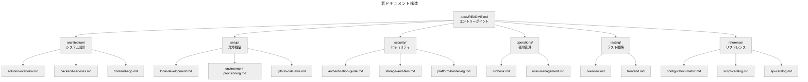
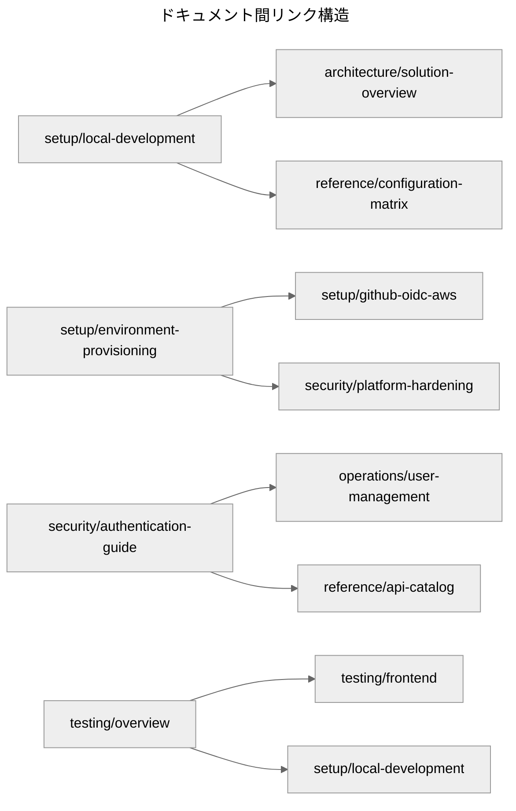

# ドキュメント再構成設計書

## 概要

現在のプロジェクトドキュメントを、用途別カテゴリに基づいた新しい構造に再構成し、現状のコードベースに合致した正確で実用的なドキュメント体系を構築する。

## アーキテクチャ

### ドキュメント構造設計



### 情報アーキテクチャ

#### カテゴリ分類原則
- **architecture/**: システム設計・技術構成・データフロー
- **setup/**: 環境構築・デプロイ・初期設定
- **security/**: 認証・認可・セキュリティ対策
- **operations/**: 運用・監視・保守・障害対応
- **testing/**: テスト戦略・実行方法・品質保証
- **reference/**: 設定項目・API仕様・スクリプト一覧

## コンポーネントと責務

### 1. エントリーポイント (docs/README.md)

**責務**: 全体像の提示と適切なガイドへの誘導

**内容構成**:
- プロジェクト概要と目的
- 「まず読む」ガイドライン（役割別）
- 各カテゴリへのリンクマップ
- クイックスタートガイド

### 2. アーキテクチャドキュメント

#### solution-overview.md
**責務**: システム全体の技術構成とデータフローの説明

**内容構成**:
- システム構成図（Next.js + Lambda + S3 + Google OAuth）
- データフロー（アップロード → 解除 → Drive保存）
- 採用技術リストと依存関係
- 環境別構成の違い

#### backend-services.md
**責務**: バックエンドサービスの詳細設計

**内容構成**:
- Lambda関数ごとの責務（get_upload_url/unlock）
- template.yamlの主要リソース説明
- S3バケット構成とプレフィックス運用ポリシー
- IAMロール設計とセキュリティ境界

#### frontend-app.md
**責務**: フロントエンドアプリケーションの構成

**内容構成**:
- App Router構成と主要ページ/コンポーネント
- 認証（Auth.js設定、JWT伝搬方法）
- Google Drive API サーバー呼び出しフロー
- 状態管理とエラーハンドリング

### 3. セットアップドキュメント

#### local-development.md
**責務**: ローカル開発環境の構築手順

**内容構成**:
- 前提ツール（Node 18, Python 3.9, SAM CLI）
- .env.local 設定例（JWTベース, drive.fileのみ）
- SAM Local + Next.js の連携ステップ
- 主要テストスクリプトの使い方

#### environment-provisioning.md
**責務**: 各環境へのデプロイ手順

**内容構成**:
- AWSリソースのデプロイ手順（sam deploy, パラメータ例）
- Vercel環境の初期化と環境変数登録
- 環境ごとの AllowedOrigin / ALLOWED_USERS 設定指針
- 環境間の設定差分管理

#### github-oidc-aws.md
**責務**: GitHub Actions から AWS への OIDC 連携設定

**内容構成**:
- GitHub Actions から AWS へ OIDC 連携する手順
- IAM Role 設計、trust policy サンプル
- deploy-aws.yml との紐付け説明
- トラブルシューティング

### 4. セキュリティドキュメント

#### authentication-guide.md
**責務**: 認証・認可システムの詳細説明

**内容構成**:
- 現行の JWT 認証仕様（Authorization: Bearer）
- Google OAuth クライアント設定 / スコープ（drive.file）
- ALLOWED_USERS と環境判定ロジックの説明
- Bot保護（reCAPTCHA/Turnstile）の有効化手順

#### storage-and-files.md
**責務**: ファイル処理とストレージセキュリティ

**内容構成**:
- S3 署名付き URL の TTL とキー命名ルール
- file_security.py の検査内容（サイズ/拡張子/マジックバイト）
- cleanup_local_file / cleanup_s3_object の挙動
- ファイルライフサイクル管理

#### platform-hardening.md
**責務**: プラットフォームレベルのセキュリティ強化

**内容構成**:
- CORS の単一 AllowedOrigin ポリシー
- API Gateway + WAF 設定概要
- CloudWatch Dashboard/アラームの監視ポイント
- Secrets 管理の方針（NEXTAUTH_SECRET など）

### 5. 運用ドキュメント

#### runbook.md
**責務**: 日常運用と障害対応の手順書

**内容構成**:
- 定常運用手順（監視、ログ確認）
- 代表的な障害時の復旧フロー（ログイン失敗、ファイル処理失敗）
- 緊急対応コマンド（API疎通確認、CloudWatch Logs参照）
- エスカレーション手順

#### user-management.md
**責務**: ユーザー管理の運用手順

**内容構成**:
- ALLOWED_USERS の更新手順
- スクリプト manage-users.sh の使い方
- 監査レポート活用方法
- アクセス権限のテスト手順

### 6. テストドキュメント

#### overview.md
**責務**: テスト戦略と全体的な実行方法

**内容構成**:
- テスト分類（ユニット/統合/E2E）
- tests/run-integration-tests.sh と SAM Local の連携
- Google Drive 連携のモック方針
- CI/CDでのテスト実行フロー

#### frontend.md
**責務**: フロントエンドテストの詳細

**内容構成**:
- Jest/RTL のカバレッジ範囲
- Playwright E2E フローと事前条件
- NEXT_PUBLIC_USE_MOCK_API のテスト用途
- アクセシビリティテスト

### 7. リファレンスドキュメント

#### configuration-matrix.md
**責務**: 環境設定の一覧表

**内容構成**:
- 環境別設定表（AWS, Vercel, Secrets）
- SAM パラメータと実際の環境変数の対応
- setup-config.json と config_manager.py の出力項目一覧
- 設定値の検証方法

#### script-catalog.md
**責務**: スクリプト一覧と使用方法

**内容構成**:
- scripts/ 配下のスクリプト一覧・目的
- 入出力、注意点、前提環境
- 自動生成されるアーティファクト位置
- 実行例とトラブルシューティング

#### api-catalog.md
**責務**: API仕様の詳細

**内容構成**:
- 公開 API エンドポイント（/presigned-urls, /unlock, /api/drive/*）
- リクエスト/レスポンス例（JWT 前提）
- エラーコードとユーザーメッセージ仕様
- レート制限とセキュリティ制約

## データモデル

### ドキュメントメタデータ

```yaml
document:
  category: string  # architecture/setup/security/operations/testing/reference
  title: string
  description: string
  target_audience: string[]  # developer/operator/security/qa
  prerequisites: string[]
  related_docs: string[]
  last_updated: date
  code_version: string  # 対応するコードベースのバージョン
```

### クロスリンク構造



## エラーハンドリング

### ドキュメント品質保証

1. **コード整合性チェック**
   - ドキュメント内のコード例と実際のコードベースの整合性検証
   - 環境変数名、API エンドポイント、設定項目の一致確認

2. **リンク整合性チェック**
   - 内部リンクの有効性検証
   - 外部リンクの生存確認

3. **書式統一チェック**
   - ステアリングルールへの準拠確認
   - Markdown 記法の統一性検証

### 更新管理

1. **変更追跡**
   - コードベース変更時の影響ドキュメント特定
   - 自動更新が必要な箇所の識別

2. **レビュープロセス**
   - 技術的正確性のレビュー
   - 可読性・使いやすさのレビュー

## テスト戦略

### ドキュメントテスト

1. **手順検証テスト**
   - セットアップ手順の実行可能性確認
   - コマンド例の動作確認

2. **情報正確性テスト**
   - API仕様とコードの一致確認
   - 設定項目の有効性確認

3. **ユーザビリティテスト**
   - 新規開発者による手順実行テスト
   - 情報検索効率の測定

### 継続的品質保証

1. **自動チェック**
   - リンク切れ検出
   - コード例の構文チェック

2. **定期レビュー**
   - 四半期ごとの内容更新確認
   - フィードバック収集と改善

## 結論

この設計により、開発者・運用者・セキュリティ担当者それぞれのニーズに応じた効率的なドキュメント体系を構築する。カテゴリ別の整理により情報アクセス性を向上させ、現状のコードベースとの整合性を保った実用的なドキュメントを提供する。