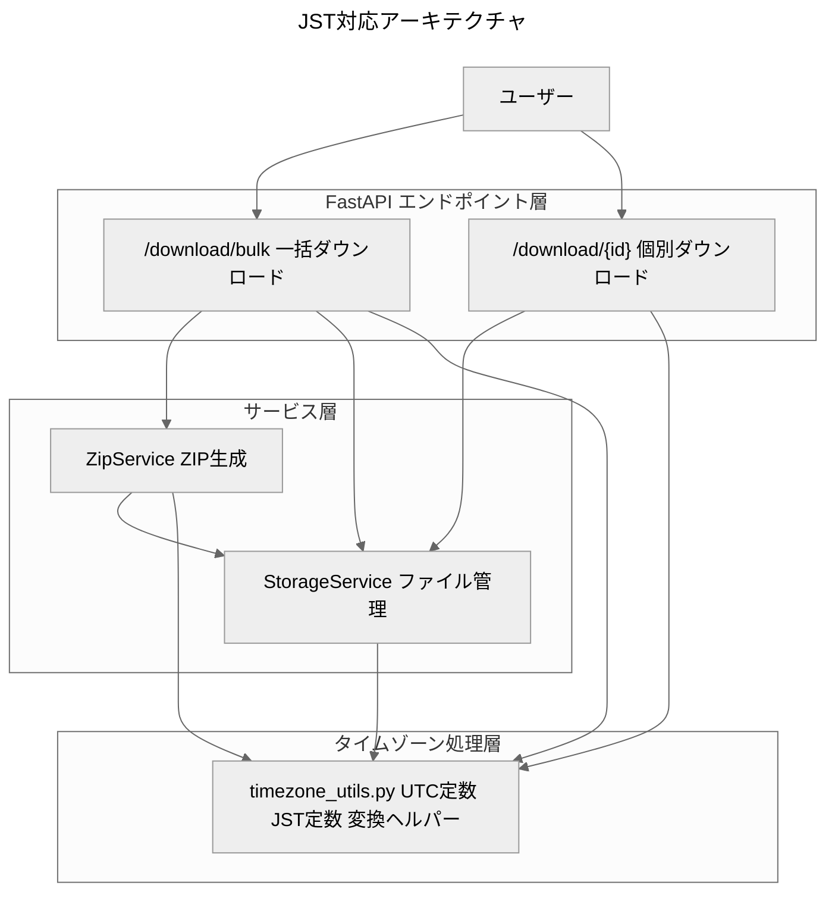

# 設計書

## 概要

本ドキュメントは、Excel パスワード解除ツールにおける日本時間（JST）対応機能の設計を定義します。現在、システムはすべての時刻表示をUTC基準で行っているため、日本のユーザーにとって不自然な時刻表示となっています。本機能では、ユーザーが目にする時刻（ZIPファイル名、ZIP内ファイルの更新日時、ダウンロード時のLast-Modifiedヘッダー）を日本時間基準に統一し、UXを改善します。

重要な設計方針として、内部ロジック（有効期限計算、ログ記録など）はUTCのまま維持し、システムの動作を変更しないことを前提とします。

## アーキテクチャ

### 全体構成



### 設計原則

1. **タイムゾーン定数の一元管理**: すべてのタイムゾーン処理は `timezone_utils.py` で定義された定数を使用
2. **tz-awareの徹底**: すべてのdatetimeオブジェクトはタイムゾーン情報を持つ（naive禁止）
3. **UTC基準の維持**: 内部ロジックはUTCのまま、表示のみJSTに変換
4. **明示的な変換**: `astimezone()` メソッドを使用した明示的な変換のみ許可

## コンポーネントとインターフェース

### 1. タイムゾーンユーティリティ（新規作成）

**ファイル**: `app/utils/timezone_utils.py`

**責務**: タイムゾーン定数の提供と変換ヘルパー関数の提供

**インターフェース**:

```python
from datetime import datetime, timezone
from zoneinfo import ZoneInfo

# タイムゾーン定数（全サービスで共有）
UTC = timezone.utc
JST = ZoneInfo('Asia/Tokyo')

def get_jst_now() -> datetime:
    """
    現在時刻をJSTで取得（tz-aware）
    
    実装: datetime.now(UTC).astimezone(JST)
    理由: ローカルTZやTZ環境変数に依存せず、UTC起点でJSTへ変換
    """
    
def ensure_utc(dt: datetime) -> datetime:
    """datetimeをUTCに正規化（naiveの場合はUTCとして扱う）"""
    
def to_jst(dt: datetime) -> datetime:
    """datetimeをJSTに変換"""
    
def to_utc(dt: datetime) -> datetime:
    """datetimeをUTCに変換"""
    
def format_http_date(dt: datetime) -> str:
    """
    datetimeをHTTP-date形式（RFC 7231準拠）に変換
    
    入力: tz-aware UTC datetime
    処理: email.utils.format_datetime(dt.astimezone(UTC), usegmt=True)
    出力: RFC 7231準拠のHTTP-date文字列（GMT表記）
    """
    
def datetime_to_zip_tuple(dt: datetime) -> tuple:
    """
    datetimeをZipInfo.date_time用のタプルに変換（JST基準）
    
    入力: tz-aware datetime（通常はUTC）
    処理: ensure_utc(dt) → to_jst(...) でJST変換 → timetuple()[:6] で6要素タプル化
    出力: (year, month, day, hour, minute, second) のJST基準タプル
    """
```

### 2. StorageService（拡張）

**ファイル**: `app/services/storage_service.py`

**変更内容**:
- `FileEntry.created_at` をtz-aware UTC datetimeに変更
  - デフォルトファクトリを `datetime.now()` から `datetime.now(UTC)` に変更
- `get_mtime()` メソッドを追加（tz-aware UTC datetimeを返す）
  - `os.path.getmtime()` から取得した秒を `datetime.fromtimestamp(ts, UTC)` でtz-aware UTCに変換
- `is_expired()` の比較を `datetime.now()` から `datetime.now(UTC)` に変更

**新規メソッド**:

```python
def get_mtime(self, file_id: str) -> Optional[datetime]:
    """
    ファイルの最終更新時刻を取得（tz-aware UTC）
    
    実装:
        ts = os.path.getmtime(file_path)
        return datetime.fromtimestamp(ts, UTC)
    
    Args:
        file_id: ファイルID
    
    Returns:
        tz-aware UTC datetime、存在しない場合は None
    """
```

### 3. ZipService（拡張）

**ファイル**: `app/services/zip_service.py`

**変更内容**:
- `create_zip()` メソッドでZipInfoを使用してJST基準のタイムスタンプを設定

**実装詳細**:

```python
import shutil

def create_zip(self, file_ids: List[str]) -> Tuple[BytesIO, List[str], List[str]]:
    """
    複数ファイルからZIPを生成（JST基準のタイムスタンプ）
    
    重要: チャンク転送でメモリ使用量を抑制（全読み込み禁止）
    """
    # ... 既存のロジック ...
    
    # ZipInfoを使用してタイムスタンプを明示的に設定
    zip_info = zipfile.ZipInfo(filename=original_filename)
    zip_info.date_time = datetime_to_zip_tuple(file_mtime)  # JST基準
    
    # チャンク転送でメモリを抑制（全読み込みは禁止）
    with zf.open(zip_info, 'w') as zip_file:
        with open(file_path, 'rb') as source_file:
            shutil.copyfileobj(source_file, zip_file, length=1024*1024)  # 1MBチャンク
```

### 4. bulk_download エンドポイント（修正）

**ファイル**: `app/routers/bulk_download.py`

**変更内容**:
- ZIPファイル名生成をJST基準に変更

**実装詳細**:

```python
from app.utils.timezone_utils import get_jst_now

def bulk_download(request: Request, body: BulkDownloadRequest) -> Response:
    # ... 既存のロジック ...
    
    # JST基準のファイル名生成
    jst_now = get_jst_now()
    filename = f"解除済み_{jst_now.strftime('%Y%m%d_%H%M%S')}_JST.zip"
```

### 5. download エンドポイント（拡張）

**ファイル**: `app/routers/download.py`

**変更内容**:
- Last-Modifiedヘッダーの追加

**実装詳細**:

```python
from app.utils.timezone_utils import format_http_date

async def download_file(request: Request, file_id: str) -> Response:
    # ... 既存のロジック ...
    
    # Last-Modifiedヘッダーを追加
    # 注意: FileResponse(path=...)使用時はFastAPIが自動付与するため不要
    # BytesIOなどストリームレスポンス時のみ自前で付与
    mtime = storage_service.get_mtime(file_id)
    if mtime:
        last_modified = format_http_date(mtime)  # UTC→HTTP-date(GMT)
        headers["Last-Modified"] = last_modified
```

## データモデル

### FileEntry（修正）

```python
@dataclass
class FileEntry:
    """ファイルレジストリのエントリ"""
    file_id: str
    file_path: str
    original_filename: str
    created_at: datetime  # tz-aware UTC datetime
    downloaded: bool = False
```

**変更点**:
- `created_at` のデフォルトファクトリを `datetime.now()` から `datetime.now(UTC)` に変更

## 正確性プロパティ

*プロパティは、システムのすべての有効な実行において真であるべき特性または動作の形式的な記述です。プロパティは、人間が読める仕様と機械検証可能な正確性保証の橋渡しとなります。*

### プロパティ 1: ZIPファイル名のJST表示

*すべての* 一括ダウンロードリクエストに対して、生成されるZIPファイル名は `解除済み_YYYYMMDD_HHMMSS_JST.zip` 形式であり、タイムスタンプはJST基準でなければならない

**検証**: 要件 1.1, 1.2, 1.3

### プロパティ 2: ZIP内ファイルのJSTタイムスタンプ

*すべての* ZIPアーカイブ内のファイルエントリに対して、date_timeはJST基準のタイムスタンプでなければならず、解凍時にJSTとして表示されなければならない

**検証**: 要件 2.1, 2.2, 2.3

### プロパティ 3: タイムゾーン変換の一貫性

*すべての* タイムゾーン変換に対して、共通定数（UTC, JST）を経由した明示的な `astimezone()` 変換でなければならず、手作業の加減算は禁止される

**検証**: 要件 1.4, 2.5, 5.4, 5.5

### プロパティ 4: naive datetime の禁止

*すべての* datetime処理に対して、tz-awareなdatetimeのみが使用され、naiveが検出された場合はUTCとして補正されなければならない

**検証**: 要件 2.4, 3.6, 3.7

### プロパティ 5: Last-Modifiedの正確性

*すべての* 個別ダウンロードに対して、Last-ModifiedヘッダーはRFC 7231準拠のHTTP-date形式であり、UTC基準の最終更新時刻を正確に表現しなければならない

**検証**: 要件 3.1, 3.2, 3.3, 3.4

### プロパティ 6: 内部ロジックのUTC維持

*すべての* 内部計算（有効期限、ログ、比較）に対して、UTC基準のタイムスタンプが使用され、JST変換は表示目的のみに限定されなければならない

**検証**: 要件 4.1, 4.2, 4.3, 4.4, 4.5

## エラーハンドリング

### 1. naive datetime の検出

**シナリオ**: tz-naiveなdatetimeが渡された場合

**対応**:
- `ensure_utc()` 関数でUTCとして補正
- ログに警告を出力
- 処理は継続

### 2. タイムゾーン変換エラー

**シナリオ**: ZoneInfoの初期化に失敗した場合

**対応**:
- システム起動時にJST定数の初期化を検証
- 失敗時はエラーログを出力して起動を中止

### 3. ファイルmtimeの取得失敗

**シナリオ**: ファイルのmtimeが取得できない場合

**対応**:
- Last-Modifiedヘッダーを省略
- ログに警告を出力
- ダウンロードは継続

## テスト戦略

### ユニットテスト

**対象**:
- `timezone_utils.py` の各関数
- `StorageService.get_mtime()`
- `ZipService.create_zip()` のタイムスタンプ設定
- `bulk_download` のファイル名生成
- `download_file` のLast-Modifiedヘッダー生成

**重点項目**:
- 共通定数（UTC, JST）の使用検証
- naive datetime の補正動作検証
- タイムゾーン変換の正確性検証

### プロパティベーステスト

本機能では、以下のプロパティベーステストを実装します。

#### プロパティテスト 1: タイムゾーン変換の可逆性

*任意の* tz-aware UTC datetimeに対して、UTC→JST→UTCの変換は元の値と等しくなければならない

**検証**: プロパティ 3

**実装**:
```python
@given(st.datetimes(timezones=st.just(UTC)))
def test_timezone_conversion_roundtrip(dt):
    jst_dt = to_jst(dt)
    utc_dt = to_utc(jst_dt)
    assert dt == utc_dt
```

#### プロパティテスト 2: naive datetime の補正

*任意の* naive datetimeに対して、`ensure_utc()` はtz-aware UTC datetimeを返さなければならない

**検証**: プロパティ 4

**実装**:
```python
@given(st.datetimes())
def test_ensure_utc_makes_aware(dt):
    result = ensure_utc(dt)
    assert result.tzinfo is not None
    assert result.tzinfo == UTC
```

#### プロパティテスト 3: ZIPタイムスタンプの範囲

*任意の* tz-aware datetimeに対して、`datetime_to_zip_tuple()` は有効な6要素タプル（年、月、日、時、分、秒）を返さなければならない

**検証**: プロパティ 2

**実装**:
```python
@given(st.datetimes(timezones=st.just(UTC)))
def test_zip_tuple_format(dt):
    result = datetime_to_zip_tuple(dt)
    assert len(result) == 6
    assert all(isinstance(x, int) for x in result)
    assert 1980 <= result[0] <= 2107  # ZIP形式の年範囲
```

#### プロパティテスト 4: HTTP-date形式の正確性

*任意の* tz-aware datetimeに対して、`format_http_date()` はRFC 7231準拠の文字列を返さなければならない

**検証**: プロパティ 5

**実装**:
```python
@given(st.datetimes(timezones=st.just(UTC)))
def test_http_date_format(dt):
    result = format_http_date(dt)
    # RFC 7231形式: "Day, DD Mon YYYY HH:MM:SS GMT"
    assert result.endswith(" GMT")
    # email.utils.parsedate_to_datetime で解析可能
    parsed = email.utils.parsedate_to_datetime(result)
    assert parsed.tzinfo == UTC
```

### 統合テスト

**対象**:
- `/download/bulk` エンドポイントの完全なフロー
- `/download/{file_id}` エンドポイントの完全なフロー

**検証項目**:
- ZIPファイル名がJST基準であること
- ZIP内ファイルのタイムスタンプがJST基準であること
- Last-ModifiedヘッダーがRFC 7231準拠であること
- 既存の機能（有効期限、エラーハンドリング）が正常に動作すること

### 回帰テスト

**対象**:
- 既存のすべてのユニットテスト
- 既存のすべての統合テスト

**検証項目**:
- JST対応による既存機能への影響がないこと
- 内部ロジック（有効期限計算、ログ記録）がUTCのまま動作すること

## 実装の詳細

### タイムゾーン定数の配置

**ファイル**: `app/utils/timezone_utils.py`

**理由**:
- 全サービスで共有する定数を一元管理
- インポートパスを統一（`from app.utils.timezone_utils import UTC, JST`）
- テストでのモック化が容易

### ZipInfo.date_time の設定

**実装方法**:

```python
import shutil
from app.utils.timezone_utils import datetime_to_zip_tuple, ensure_utc

# ファイルのmtimeを取得（tz-aware UTC）
file_mtime = storage_service.get_mtime(file_id)
if not file_mtime:
    # フォールバック: 現在時刻（UTC）
    file_mtime = datetime.now(UTC)

# naive の場合は補正
file_mtime = ensure_utc(file_mtime)

# ZipInfoを作成してJST基準のタイムスタンプを設定
zip_info = zipfile.ZipInfo(filename=original_filename)
zip_info.date_time = datetime_to_zip_tuple(file_mtime)

# チャンク転送でメモリを抑制（全読み込みは禁止）
with zf.open(zip_info, 'w') as zip_file:
    with open(file_path, 'rb') as source_file:
        shutil.copyfileobj(source_file, zip_file, length=1024*1024)  # 1MBチャンク
```

### Last-Modified ヘッダーの生成

**実装方法**:

```python
from app.utils.timezone_utils import format_http_date, ensure_utc

# ファイルのmtimeを取得（tz-aware UTC）
mtime = storage_service.get_mtime(file_id)
if mtime:
    # naive の場合は補正（本来は例外を投げるべき）
    mtime = ensure_utc(mtime)
    # UTC→HTTP-date(GMT)に直接変換（中間でJST変換は不要）
    last_modified = format_http_date(mtime)
    headers["Last-Modified"] = last_modified
```

## パフォーマンス考慮事項

### タイムゾーン定数のキャッシュ

**方針**: `UTC` と `JST` 定数はモジュールレベルで定義し、再利用

**理由**:
- `ZoneInfo('Asia/Tokyo')` の初期化コストを削減
- 全サービスで同一インスタンスを共有

### ZipInfo の使用によるオーバーヘッド

**影響**: `zf.write()` から `zipfile.ZipInfo + zf.open(..., 'w') + shutil.copyfileobj` への変更により、わずかなオーバーヘッドが発生

**対策**: 
- ストリーミング書き込み（1MBチャンク）でメモリ使用量を抑制
- 全読み込み（`writestr`）は使用せず、従来の `zf.write()` と同等のメモリ効率を維持
- ファイルサイズが50MB以下のため、チャンク転送のオーバーヘッドは無視できる

## セキュリティ考慮事項

### タイムゾーン情報の漏洩

**リスク**: ZIPファイル名やLast-Modifiedヘッダーから、サーバーのタイムゾーンが推測される

**対策**: 
- 意図的にJSTを表示しているため、問題なし
- 内部ロジックはUTCのまま維持

### naive datetime による脆弱性

**リスク**: naive datetime の使用により、タイムゾーン依存のバグが発生

**対策**:
- `ensure_utc()` 関数でnaiveを検出・補正
- ログに警告を出力して追跡可能にする

## デプロイメント考慮事項

### 環境変数の設定

**不要**: TZ環境変数に依存しない設計のため、環境変数の設定は不要

### tzdata パッケージの依存

**必須**: IANA TZデータが無い環境（軽量Dockerイメージ等）に備え、`tzdata` パッケージを依存に追加

**理由**:
- `ZoneInfo('Asia/Tokyo')` の初期化にはIANA TZデータが必要
- tzデータ欠落時の起動失敗を防ぐ
- `requirements.txt` に `tzdata` を追加（Python 3.9+では条件付き依存）

### 後方互換性

**影響**: ZIPファイル名の形式が変更されるため、既存のファイル名パターンに依存するスクリプトがある場合は影響を受ける

**対策**:
- リリースノートで変更を明記
- 旧形式のファイル名も受け入れるようにする（必要に応じて）

### ロールバック計画

**手順**:
1. `timezone_utils.py` の削除
2. 各サービスの変更を元に戻す
3. テストを実行して動作確認

**影響**:
- ZIPファイル名がUTC基準に戻る
- Last-Modifiedヘッダーが削除される
- 内部ロジックは影響を受けない

## 依存関係

### 新規依存関係

**なし**: Python標準ライブラリのみを使用

- `datetime.timezone`
- `zoneinfo.ZoneInfo`（Python 3.9+）
- `email.utils.format_datetime`

### 既存依存関係への影響

**なし**: 既存の依存関係に変更なし

## マイグレーション計画

### フェーズ 1: タイムゾーンユーティリティの作成

1. `app/utils/timezone_utils.py` を作成
2. ユニットテストを作成
3. プロパティベーステストを作成

### フェーズ 2: StorageService の拡張

1. `FileEntry.created_at` をtz-aware UTC に変更
2. `get_mtime()` メソッドを追加
3. ユニットテストを更新

### フェーズ 3: ZipService の拡張

1. `create_zip()` でZipInfoを使用
2. JST基準のタイムスタンプを設定
3. ユニットテストを更新

### フェーズ 4: エンドポイントの修正

1. `bulk_download` のファイル名生成を修正
2. `download_file` にLast-Modifiedヘッダーを追加
3. 統合テストを更新

### フェーズ 5: 統合テストと検証

1. すべてのテストを実行
2. 手動テストで動作確認
3. ドキュメントを更新

## 今後の拡張性

### 他のタイムゾーンへの対応

**方針**: 設定ファイルでタイムゾーンを指定可能にする

**実装**:
```python
# config.py
DISPLAY_TIMEZONE: str = "Asia/Tokyo"

# timezone_utils.py
DISPLAY_TZ = ZoneInfo(settings.DISPLAY_TIMEZONE)
```

### ユーザーごとのタイムゾーン設定

**方針**: ユーザープロファイルにタイムゾーン設定を追加

**実装**:
- ユーザー認証機能の実装後に検討
- リクエストヘッダーからタイムゾーンを取得

## 参考資料

- [RFC 7231 - HTTP/1.1 Semantics and Content](https://tools.ietf.org/html/rfc7231)
- [Python datetime documentation](https://docs.python.org/3/library/datetime.html)
- [Python zoneinfo documentation](https://docs.python.org/3/library/zoneinfo.html)
- [ZIP File Format Specification](https://pkware.cachefly.net/webdocs/casestudies/APPNOTE.TXT)
