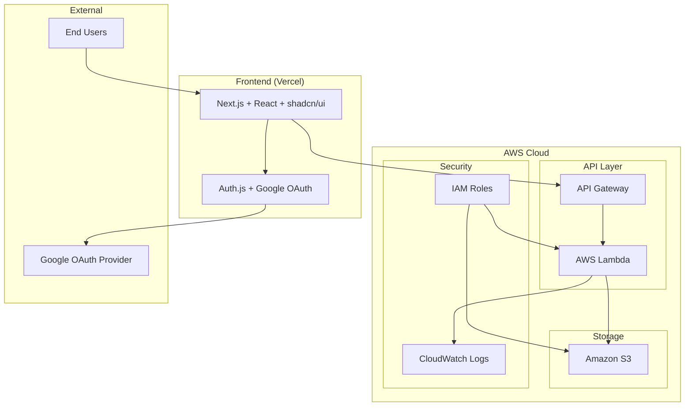
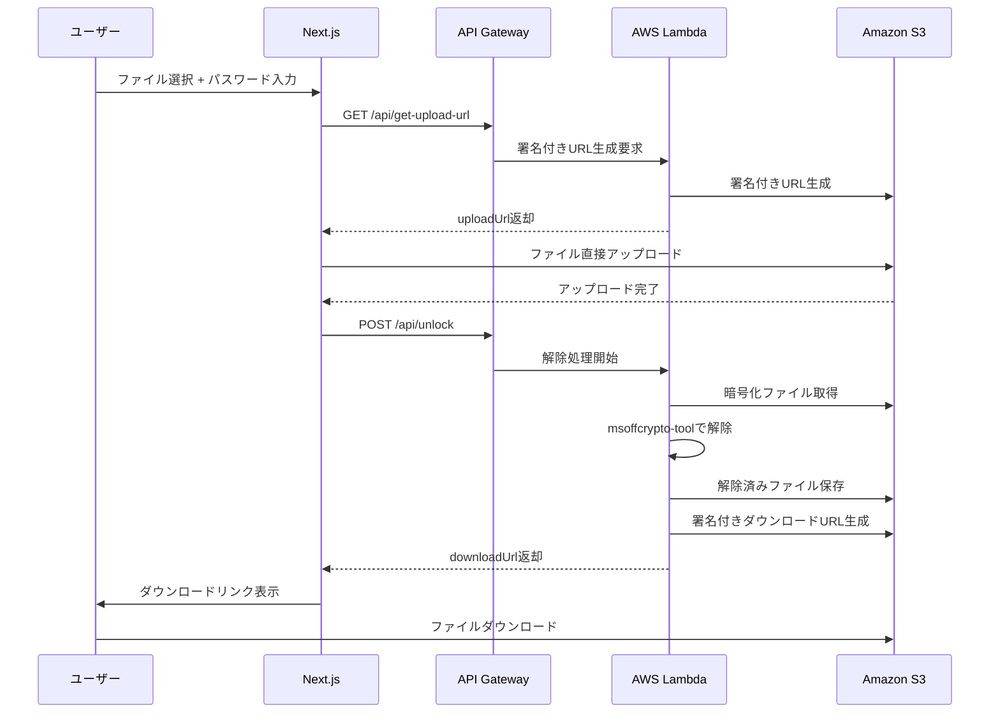
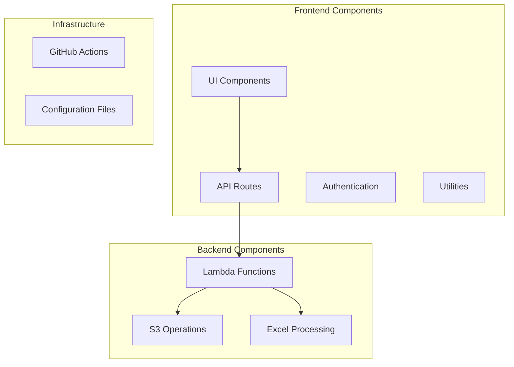
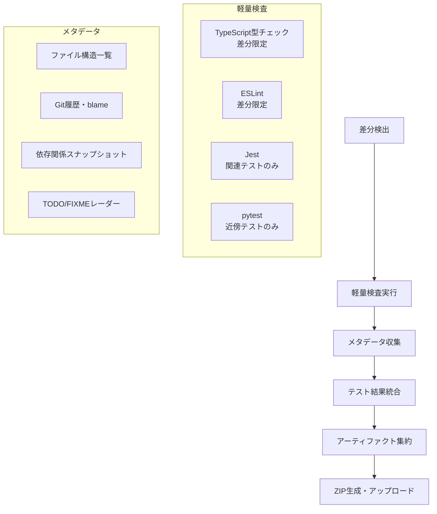
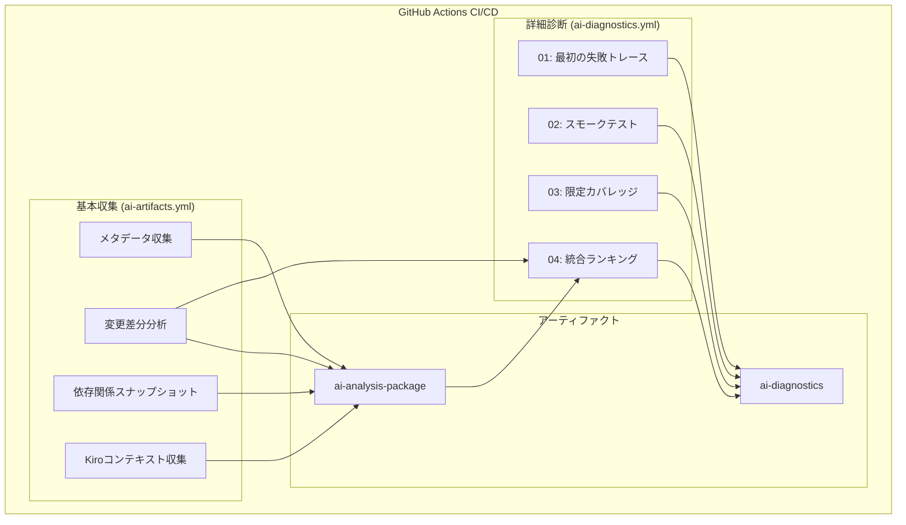

# Secure Excel Unlock - 設計書

## 概要

本設計書は、パスワード付きExcelファイル解除Webアプリケーション「Secure Excel Unlock」のシステム設計を定義します。要件定義書で定められた機能要件と非機能要件を満たすアーキテクチャを提示します。

## アーキテクチャ概要

### システム構成



### アーキテクチャの特徴

1. **サーバーレス構成**: AWS Lambda（機能別分割：getUploadUrl, unlock）によるコスト効率的な実行
2. **フロントエンド分離**: Vercelでの独立デプロイ
3. **API呼び出しポリシー**: 本番環境ではフロントエンドから API Gateway を**直接**呼び出す。Next.js の API ルートは**開発・デバッグ用途のみ**とし、プロダクション経路には使用しない。
4. **セキュアなファイル転送**: S3署名付きURLによる直接転送（Upload 60秒、Download 300秒）
5. **認証統合**: Auth.js（旧 NextAuth.js）によるGoogle OAuth認証

## コンポーネント設計

### フロントエンド (Next.js)

#### 主要コンポーネント
- **AuthProvider**: Google OAuth認証の管理
- **FileUpload**: ドラッグ&ドロップファイルアップロード
- **PasswordForm**: パスワード入力フォーム（第一・第二候補）
- **ProcessingStatus**: 処理状況の表示
- **DownloadManager**: 解除済みファイルのダウンロード管理

#### 技術スタック
- **Framework**: Next.js 15.4 (App Router)
- **UI Library**: shadcn/ui + Radix UI
- **Authentication**: Auth.js（旧 NextAuth.js）
- **Form Validation**: zod + react-hook-form
- **State Management**: React hooks + Context API

### バックエンド (AWS Lambda)

#### Lambda 分割ポリシー
Lambda は機能単位で分割する（例：getUploadUrl／unlock）。これにより IAM 権限の最小化、障害切り分け、メトリクス計測が明瞭になる。

#### API エンドポイント

##### 1. **API Gateway 経由の対応エンドポイント（例：POST https://{api-id}.execute-api.{region}.amazonaws.com/prod/getUploadUrl）**
**目的**: S3への安全なファイルアップロード用署名付きURL生成

**リクエスト**:
```json
{
  "fileName": "example.xlsx",
  "fileSize": 1024000,
  "contentType": "application/vnd.openxmlformats-officedocument.spreadsheetml.sheet"
}
```

**レスポンス**:
```json
{
  "uploadUrl": "https://s3.amazonaws.com/bucket/key?signature=...",
  "fileKey": "uploads/uuid-filename.xlsx",
  "expiresIn": 60
}
```

##### 2. **API Gateway 経由の対応エンドポイント（例：POST https://{api-id}.execute-api.{region}.amazonaws.com/prod/unlock）**
**目的**: パスワード付きExcelファイルの解除処理

**リクエスト**:
```json
{
  "fileKey": "uploads/uuid-filename.xlsx",
  "passwords": ["password1", "password2"]
}
```

**レスポンス**:
```json
{
  "success": true,
  "downloadUrl": "https://s3.amazonaws.com/bucket/unlocked/key?signature=...",
  "fileName": "unlocked-example.xlsx",
  "expiresIn": 300,
  "processingTime": 2.5
}
```

**エラーレスポンス**:
```json
{
  "success": false,
  "error": "password_incorrect",
  "message": "両方のパスワードで解除できませんでした",
  "suggestion": "別のパスワード候補をお試しください"
}
```

#### 処理フロー



### データモデル

#### ファイル処理状態
```typescript
interface ProcessingStatus {
  fileKey: string;
  fileName: string;
  status: 'uploading' | 'processing' | 'completed' | 'failed';
  progress: number;
  error?: ErrorInfo;
  downloadUrl?: string;
  processingTime?: number;
}

interface ErrorInfo {
  code: 'password_incorrect' | 'unsupported_format' | 'timeout' | 'file_corrupted';
  message: string;
  suggestion: string;
}
```

#### 認証情報
```typescript
interface UserSession {
  id: string;
  email: string;
  name: string;
  image?: string;
  allowedDomains: string[];
  permissions: string[];
}
```

## セキュリティ設計

### 認証・認可

#### Google OAuth 2.0 + OIDC
- **プロバイダー**: Google OAuth 2.0
- **フロー**: Authorization Code with PKCE
- **トークン管理**: httpOnly Cookie + Refresh Token Rotation
- **セッション**: 24時間有効期限

#### アクセス制御
```typescript
// 許可されたユーザーリスト（環境変数）
const ALLOWED_USERS = [
  "user1@nsc-company.com",
  "user2@nsc-company.com"
];

// ミドルウェアでの認証チェック
async function authenticateUser(request: Request) {
  const session = await getSession(request);
  if (!session || !ALLOWED_USERS.includes(session.user.email)) {
    throw new UnauthorizedError();
  }
  return session;
}
```

### データ保護

#### ファイル暗号化・保護
- **転送時暗号化**: HTTPS/TLS 1.3
- **保存時暗号化**: S3 Server-Side Encryption (SSE-S3)
- **アクセス制御**: S3バケットポリシー + IAM最小権限
- **データ保持**: 処理完了後即時削除

#### 署名付きURL設定
Pre-signed URL の有効期限は Upload 60秒、Download 300秒とする。全ドキュメントでこの値に統一し、変更時は一括で更新する。

```python
def generate_presigned_url(bucket: str, key: str, expiration: int = 60):
    return s3_client.generate_presigned_url(
        'put_object',
        Params={'Bucket': bucket, 'Key': key},
        ExpiresIn=expiration,  # Upload: 60秒, Download: 300秒
        HttpMethod='PUT'
    )
```

### ログ・監査

#### ログ設計
```json
{
  "timestamp": "2025-01-17T10:30:00Z",
  "event": "unlock_attempt",
  "outcome": "success",
  "duration_ms": 2500,
  "file_ext": "xlsx",
  "size_class": "1-10MB",
  "user_id": "hashed_user_id",
  "request_id": "uuid",
  "app_version": "v1.0.0"
}
```

**ログに含めない情報**:
- 平文パスワード
- ファイル名・内容
- 個人識別情報

## エラーハンドリング

### エラー分類と対応

#### 1. パスワード関連エラー
```typescript
const PASSWORD_ERRORS = {
  password_incorrect: {
    message: "入力されたパスワードでは解除できませんでした",
    suggestion: "別のパスワード候補をお試しください",
    action: "retry"
  }
};
```

#### 2. ファイル関連エラー
```typescript
const FILE_ERRORS = {
  unsupported_format: {
    message: "サポートされていないファイル形式です",
    suggestion: ".xlsx または .xls ファイルを選択してください",
    action: "reselect"
  },
  file_corrupted: {
    message: "ファイルが破損している可能性があります",
    suggestion: "元のファイルを確認して再度お試しください",
    action: "reselect"
  }
};
```

#### 3. システムエラー
```typescript
const SYSTEM_ERRORS = {
  timeout: {
    message: "処理がタイムアウトしました",
    suggestion: "しばらく待ってから再度お試しください",
    action: "retry"
  },
  service_unavailable: {
    message: "サービスが一時的に利用できません",
    suggestion: "しばらく待ってから再度お試しください",
    action: "wait"
  }
};
```

### リトライ機構
```typescript
async function retryWithBackoff<T>(
  operation: () => Promise<T>,
  maxRetries: number = 3,
  baseDelay: number = 1000
): Promise<T> {
  for (let attempt = 1; attempt <= maxRetries; attempt++) {
    try {
      return await operation();
    } catch (error) {
      if (attempt === maxRetries) throw error;
      
      const delay = baseDelay * Math.pow(2, attempt - 1);
      await new Promise(resolve => setTimeout(resolve, delay));
    }
  }
}
```

## パフォーマンス最適化

### フロントエンド最適化

#### 1. コード分割
```typescript
// 動的インポートによるコード分割
const FileUpload = dynamic(() => import('./FileUpload'), {
  loading: () => <Skeleton className="h-32 w-full" />
});
```

#### 2. キャッシュ戦略
```typescript
// SWRによるデータキャッシュ
const { data, error } = useSWR('/api/status', fetcher, {
  refreshInterval: 1000,
  revalidateOnFocus: false
});
```

### バックエンド最適化

#### 1. Lambda最適化
```python
# コールドスタート対策
import json
import boto3
from msoffcrypto import OfficeFile

# グローバル変数でクライアント初期化
s3_client = boto3.client('s3')

def lambda_handler(event, context):
    # 処理ロジック
    pass
```

#### 2. 並列処理
```python
import asyncio
import concurrent.futures

async def process_multiple_files(file_keys: list, passwords: list):
    with concurrent.futures.ThreadPoolExecutor(max_workers=5) as executor:
        tasks = [
            executor.submit(process_single_file, key, passwords)
            for key in file_keys
        ]
        results = await asyncio.gather(*tasks)
    return results
```

## テスト戦略

### 差分テスト戦略

#### コンポーネント境界とテスト範囲


#### 変更検出基準
| 変更パス | テスト範囲 | 実行条件 |
|---------|-----------|----------|
| `frontend/src/components/` | フロントエンド単体テスト | 常時 |
| `frontend/src/app/api/` | API統合テスト + フロントエンド | 常時 |
| `backend/src/` | バックエンド単体テスト + API統合 | 常時 |
| `frontend/e2e/` | E2Eテスト | PR時のみ |
| `.github/workflows/` | ワークフロー検証 | 常時 |
| `template.yaml` | インフラテスト | main ブランチ |

#### テスト実行マトリックス
```yaml
# 開発段階別テスト戦略
stages:
  development:
    - unit_tests: always
    - integration_tests: on_api_changes
    - e2e_tests: manual_trigger
  
  pull_request:
    - unit_tests: always
    - integration_tests: always
    - e2e_tests: always
    - performance_tests: on_backend_changes
  
  main_branch:
    - all_tests: always
    - deployment_tests: always
    - security_scans: always
```

### 単体テスト
- **フロントエンド**: Jest + React Testing Library
- **バックエンド**: pytest + moto (AWS mocking)
- **カバレッジ目標**: 80%以上

### 統合テスト
- **API テスト**: Postman/Newman
- **E2E テスト**: Playwright
- **認証フロー**: 実際のGoogle OAuth環境

### パフォーマンステスト
- **負荷テスト**: Artillery.js
- **目標値**: P95 < 8秒、同時実行50

### AI向けアーティファクト構造

#### アーティファクト構造設計
```
ai-analysis-package/
├── project-metadata/          # プロジェクト構造・メタデータ
│   ├── file-structure.txt     # リポジトリ全ファイルの相対パス一覧
│   ├── change-map.json        # git diff --numstat の要約
│   ├── git-history.txt        # 直近コミットのメタ情報
│   ├── blame-map.json         # 変更ファイルの最終更新者・時刻
│   ├── npm-deps.json          # Node.js依存関係ツリー
│   ├── pip-freeze.txt         # Python依存関係
│   └── dependency-diff.json   # 依存関係ロックファイルの差分
├── test-results/              # テスト・検査結果
│   ├── junit-fe.xml           # フロントエンドテスト結果（Jest）
│   ├── junit-be.xml           # バックエンドテスト結果（pytest）
│   ├── coverage-fe.json       # フロントエンドカバレッジ
│   ├── tsc.log                # TypeScript型チェック（差分限定）
│   └── eslint.json            # ESLint結果（差分限定）
└── analysis_data/             # AI分析用データ
    ├── runtime.json           # Node/Python/OSバージョン情報
    ├── todo-fixme.json        # 変更箇所のTODO/FIXME抽出
    ├── change-context/        # 変更箇所の前後5行コンテキスト
    │   ├── full-diff.patch    # 全体差分
    │   └── *.patch            # ファイル別差分（前後5行）
    ├── file-metrics.json      # ファイルサイズ・行数・複雑度統計
    ├── hotspots.json          # 過去30日の変更頻度分析
    ├── recent-commits.json    # 最近20コミットのパターン分析
    ├── error-patterns.json    # ログファイルからのエラーパターン抽出
    ├── npm-vulnerabilities.json # 依存関係の脆弱性情報
    ├── kiro-context/          # プロジェクト全体像（要件・設計・タスク）
    │   ├── .kiro_specs_*_requirements.md
    │   ├── .kiro_specs_*_design.md
    │   ├── .kiro_specs_*_tasks.md
    │   ├── .kiro_steering_*.md
    │   └── kiro-files-list.txt
    └── codeframes/            # JUnit失敗時のコードフレーム（±10行）
        ├── junit-fe.txt
        └── junit-be.txt
```

#### 生成フロー


#### 堅牢性設計
- **`if: always()`**: テスト失敗時でも必ずアーティファクト生成
- **`continue-on-error: true`**: 依存インストール失敗でも収集継続
- **ベストエフォート**: 取得できない情報があっても処理継続
- **相対パス記録**: ファイル構造は相対パスで記録（移植性確保）

#### 差分限定実行の前提
- **tj-actions/changed-files**: 変更ファイル検出
- **TypeScript**: 変更された.ts/.tsxファイルのみ型チェック
- **ESLint**: 変更されたファイルのみリント
- **Jest**: `--findRelatedTests`で関連テストのみ実行
- **pytest**: 変更ディレクトリ近傍のテストのみ実行

## 運用・監視

### メトリクス収集
```python
# CloudWatch カスタムメトリクス
def put_custom_metric(metric_name: str, value: float, unit: str = 'Count'):
    cloudwatch.put_metric_data(
        Namespace='SecureExcelUnlock',
        MetricData=[{
            'MetricName': metric_name,
            'Value': value,
            'Unit': unit,
            'Timestamp': datetime.utcnow()
        }]
    )
```

### アラート設定
- **エラー率**: 5%以上で警告
- **レスポンス時間**: P95 > 10秒で警告
- **Lambda エラー**: 連続3回失敗で警告

## デプロイメント

### CI/CD パイプライン
```yaml
# GitHub Actions
name: Deploy
on:
  push:
    branches: [main]

jobs:
  deploy-backend:
    runs-on: ubuntu-latest
    steps:
      - uses: actions/checkout@v3
      - name: Deploy Lambda
        run: |
          sam build
          sam deploy --no-confirm-changeset
  
  deploy-frontend:
    runs-on: ubuntu-latest
    steps:
      - uses: actions/checkout@v3
      - name: Deploy to Vercel
        run: vercel --prod
```

### 環境管理
- **開発環境**: 個人AWS アカウント
- **本番環境**: 同一アカウント（別リソース）
- **設定管理**: AWS Systems Manager Parameter Store

## AI分析・診断支援システム設計

### アーキテクチャ概要

GitHub Actionsベースの2層構造で、基本メタデータ収集と詳細診断を分離実行します。



### 再利用可能ワークフロー設計

#### 1. ai-diagnostics.yml（新規作成）

**目的**: 詳細診断シグナル（01-04）の実行と結果収集

**入力パラメータ**:
```yaml
inputs:
  run_js:
    description: 'JS/TS系診断を実行するか'
    required: false
    default: true
    type: boolean
  run_py:
    description: 'Python系診断を実行するか'
    required: false
    default: true
    type: boolean
  node_version:
    description: 'Node.jsバージョン'
    required: false
    default: '20'
    type: string
  python_version:
    description: 'Pythonバージョン'
    required: false
    default: '3.11'
    type: string
```

**ジョブ構成**:
```yaml
jobs:
  js-quick-fail:      # 01-JS: 最初の失敗でbail
  py-quick-fail:      # 01-Py: pytest -x --maxfail=1
  next-api-smoke:     # 02-JS: APIハンドラモック呼び出し
  py-import-smoke:    # 02-Py: 再帰的import
  coverage-js:        # 03-JS: 限定カバレッジ
  coverage-py:        # 03-Py: 限定カバレッジ
  rank-suspects:      # 04: 統合ランキング生成
  publish:            # アーティファクト公開
```

#### 2. ci.yml（既存更新）

**変更内容**: 診断ジョブを追加

```yaml
jobs:
  ai-artifacts:
    name: "🧭 Collect AI Artifacts"
    uses: ./.github/workflows/ai-artifacts.yml
    secrets: inherit
  
  ai-diagnostics:
    name: "🔎 Diagnostics (01–04)"
    needs: [ai-artifacts]
    uses: ./.github/workflows/ai-diagnostics.yml
    with:
      run_js: true
      run_py: true
      node_version: '20'
      python_version: '3.11'
    secrets: inherit
```

### 診断シグナル詳細設計

#### 診断シグナル01: 最初の失敗トレース

**JavaScript/TypeScript**:
```bash
# Vitest検出時
NODE_OPTIONS=--enable-source-maps vitest run --bail 1 --reporter=json > analysis_data/logs/vitest-first.json

# Jest検出時  
NODE_OPTIONS=--enable-source-maps jest --bail --json --outputFile=analysis_data/logs/jest-first.json
```

**Python**:
```bash
PYTHONFAULTHANDLER=1 pytest -x --maxfail=1 -vv --tb=long | tee analysis_data/logs/pytest-first.txt
```

#### 診断シグナル02: スモークテスト

**Next.js APIハンドラ**:
```javascript
// frontend/src/app/**/route.ts を走査
const routes = glob.sync('frontend/src/app/**/route.ts');
for (const route of routes) {
  const handlers = await import(route);
  for (const method of ['GET', 'POST', 'PUT', 'DELETE']) {
    if (handlers[method]) {
      try {
        await Promise.race([
          handlers[method](mockRequest),
          new Promise((_, reject) => setTimeout(() => reject(new Error('timeout')), 2000))
        ]);
      } catch (error) {
        fs.appendFileSync('analysis_data/logs/next-smoke.txt', 
          `SMOKE_FAIL ${route} ${method} ${error.stack}\n`);
      }
    }
  }
}
```

**Python import**:
```python
import importlib
import glob

for py_file in glob.glob('backend/src/**/*.py', recursive=True):
    if 'test_' not in py_file:
        module_name = py_file.replace('/', '.').replace('.py', '')
        try:
            importlib.import_module(module_name)
        except Exception as e:
            with open('analysis_data/logs/py-import-smoke.txt', 'a') as f:
                f.write(f'SMOKE_FAIL {module_name} {str(e)}\n')
```

#### 診断シグナル03: 限定カバレッジ

**JavaScript/TypeScript**:
```bash
vitest run --bail 1 --coverage.enabled --coverage.reporter=json --coverage.reportsDirectory=analysis_data/coverage
```

**Python**:
```bash
coverage run -m pytest -x --maxfail=1
coverage json -o analysis_data/coverage/py-coverage.json
```

#### 診断シグナル04: 統合ランキング

**スコアリングアルゴリズム**:
```python
def calculate_suspects():
    suspects = {}
    
    # スタックトレースから上位フレーム (+50点)
    for trace_file in ['vitest-first.json', 'jest-first.json', 'pytest-first.txt']:
        frames = extract_stack_frames(trace_file)
        for frame in frames[:3]:  # 上位3フレーム
            key = (frame.file, frame.line)
            suspects[key] = suspects.get(key, 0) + 50
    
    # 直近変更ファイル (+20点)
    change_map = load_json('project-metadata/change-map.json')
    for file_path in change_map.get('changed_files', []):
        key = (file_path, None)
        suspects[key] = suspects.get(key, 0) + 20
    
    # ホットスポット (+15点)
    hotspots = load_json('analysis_data/hotspots.json')
    for hotspot in hotspots.get('files', []):
        key = (hotspot['file'], None)
        suspects[key] = suspects.get(key, 0) + 15
    
    # 降順ソートして上位50件
    sorted_suspects = sorted(suspects.items(), key=lambda x: x[1], reverse=True)[:50]
    
    return [
        {'file': file, 'line': line, 'score': score}
        for (file, line), score in sorted_suspects
    ]
```

### セキュリティ・パフォーマンス設計

#### セキュリティ対策

**機密情報マスキング**:
```bash
# パスワード、トークン、APIキーをマスク
echo "::add-mask::$SECRET_VALUE"
sed -i 's/password=[^[:space:]]*/password=***MASKED***/g' analysis_data/logs/*.txt
```

**最小権限実行**:
```yaml
permissions:
  contents: read
  actions: read
  security-events: read
```

#### パフォーマンス最適化

**条件付きセットアップ**:
```yaml
- name: Setup Node.js
  if: ${{ hashFiles('frontend/package*.json') != '' }}
  uses: actions/setup-node@v4
  with:
    node-version: ${{ inputs.node_version }}

- name: Setup Python  
  if: ${{ hashFiles('backend/src/requirements.txt') != '' }}
  uses: actions/setup-python@v4
  with:
    python-version: ${{ inputs.python_version }}
```

**失敗時継続実行**:
```yaml
- name: Run diagnostics
  continue-on-error: true
  run: |
    command_that_might_fail || true
```

### 視覚化設計

#### GitHub Step Summary

各診断ステップで以下の形式でサマリーを出力:

```bash
echo "## 🧨 01/JS: 失敗テストの先頭1件" >> $GITHUB_STEP_SUMMARY
echo "| ファイル | 行 | エラー |" >> $GITHUB_STEP_SUMMARY
echo "|---------|----|---------| " >> $GITHUB_STEP_SUMMARY
echo "| src/components/FileUpload.tsx | 45 | TypeError: Cannot read property |" >> $GITHUB_STEP_SUMMARY
```

#### ログ折りたたみ

```bash
echo "::group::🔍 詳細ログ"
cat analysis_data/logs/vitest-first.json
echo "::endgroup::"
```

### データモデル

#### suspects.json構造
```typescript
interface Suspect {
  file: string;
  line: number | null;
  score: number;
}

interface SuspectsReport {
  generated_at: string;
  total_suspects: number;
  top_suspects: Suspect[];
  scoring_breakdown: {
    stack_traces: number;
    recent_changes: number;
    hotspots: number;
  };
}
```

#### アーティファクト構造
```
ai-diagnostics/
├── analysis_data/
│   ├── logs/
│   │   ├── vitest-first.json
│   │   ├── jest-first.json
│   │   ├── pytest-first.txt
│   │   ├── next-smoke.txt
│   │   └── py-import-smoke.txt
│   ├── coverage/
│   │   ├── js-coverage.json
│   │   └── py-coverage.json
│   └── suspects.json
```

## 実装済み機能

### ✅ 完了済み機能
- **Google Drive 連携**: フォルダ選択、個別・一括保存機能
- **複数ファイル一括処理UI**: ドラッグ&ドロップ、並列処理対応
- **認証システム**: Google OAuth 2.0 + セッション管理
- **レスポンシブUI**: shadcn/ui ベースの統一デザイン
- **基本AI分析システム**: ai-artifacts.yml による基本メタデータ収集

### 将来拡張計画

#### Phase 2: 追加機能
- 処理履歴機能
- 管理者ダッシュボード
- ファイル形式拡張（.xlsm対応等）

#### Phase 3: スケール対応
- 非同期ジョブ処理 (SQS + Step Functions)
- マルチリージョン対応
- CDN導入 (CloudFront)

#### Phase 4: AI分析強化
- 診断シグナルの拡張（05-08）
- 機械学習による問題予測
- 自動修正提案機能

この設計書に基づいて、要件定義書で定められた全ての機能要件と非機能要件を満たすシステムを構築します。