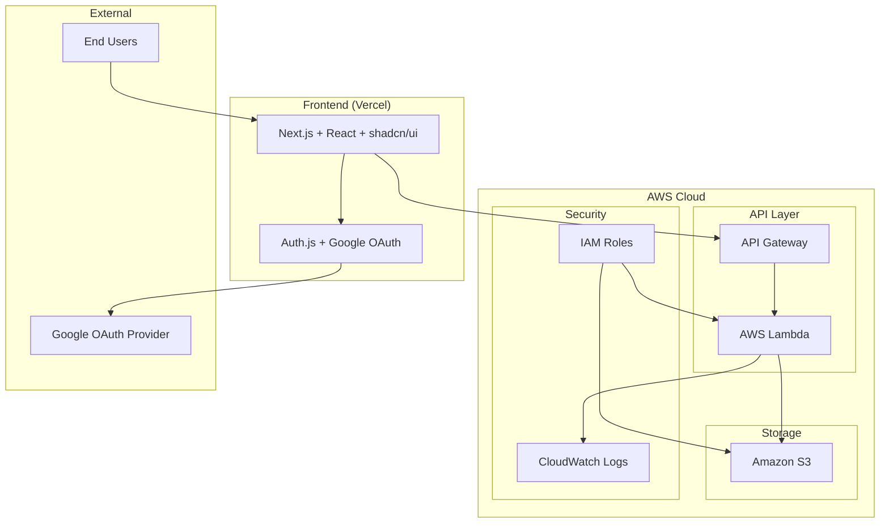
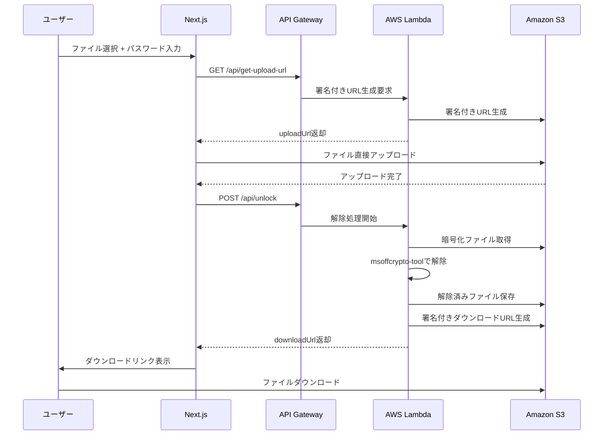

# Secure Excel Unlock - 設計書

## 概要

本設計書は、パスワード付きExcelファイル解除Webアプリケーション「Secure Excel Unlock」のシステム設計を定義します。要件定義書で定められた機能要件と非機能要件を満たすアーキテクチャを提示します。

## アーキテクチャ概要

### システム構成



### アーキテクチャの特徴

1. **サーバーレス構成**: AWS Lambda（機能別分割：getUploadUrl, unlock）によるコスト効率的な実行
2. **フロントエンド分離**: Vercelでの独立デプロイ
3. **API呼び出しポリシー**: 本番環境ではフロントエンドから API Gateway を**直接**呼び出す。Next.js の API ルートは**開発・デバッグ用途のみ**とし、プロダクション経路には使用しない。
4. **セキュアなファイル転送**: S3署名付きURLによる直接転送（Upload 60秒、Download 300秒）
5. **認証統合**: Auth.js（旧 NextAuth.js）によるGoogle OAuth認証

## コンポーネント設計

### フロントエンド (Next.js)

#### 主要コンポーネント
- **AuthProvider**: Google OAuth認証の管理
- **FileUpload**: ドラッグ&ドロップファイルアップロード
- **PasswordForm**: パスワード入力フォーム（第一・第二候補）
- **ProcessingStatus**: 処理状況の表示
- **DownloadManager**: 解除済みファイルのダウンロード管理

#### 技術スタック
- **Framework**: Next.js 15.4 (App Router)
- **UI Library**: shadcn/ui + Radix UI
- **Authentication**: Auth.js（旧 NextAuth.js）
- **Form Validation**: zod + react-hook-form
- **State Management**: React hooks + Context API

### バックエンド (AWS Lambda)

#### Lambda 分割ポリシー
Lambda は機能単位で分割する（例：getUploadUrl／unlock）。これにより IAM 権限の最小化、障害切り分け、メトリクス計測が明瞭になる。

#### API エンドポイント

##### 1. **API Gateway 経由の対応エンドポイント（例：POST https://{api-id}.execute-api.{region}.amazonaws.com/prod/getUploadUrl）**
**目的**: S3への安全なファイルアップロード用署名付きURL生成

**リクエスト**:
```json
{
  "fileName": "example.xlsx",
  "fileSize": 1024000,
  "contentType": "application/vnd.openxmlformats-officedocument.spreadsheetml.sheet"
}
```

**レスポンス**:
```json
{
  "uploadUrl": "https://s3.amazonaws.com/bucket/key?signature=...",
  "fileKey": "uploads/uuid-filename.xlsx",
  "expiresIn": 60
}
```

##### 2. **API Gateway 経由の対応エンドポイント（例：POST https://{api-id}.execute-api.{region}.amazonaws.com/prod/unlock）**
**目的**: パスワード付きExcelファイルの解除処理

**リクエスト**:
```json
{
  "fileKey": "uploads/uuid-filename.xlsx",
  "passwords": ["password1", "password2"]
}
```

**レスポンス**:
```json
{
  "success": true,
  "downloadUrl": "https://s3.amazonaws.com/bucket/unlocked/key?signature=...",
  "fileName": "unlocked-example.xlsx",
  "expiresIn": 300,
  "processingTime": 2.5
}
```

**エラーレスポンス**:
```json
{
  "success": false,
  "error": "password_incorrect",
  "message": "両方のパスワードで解除できませんでした",
  "suggestion": "別のパスワード候補をお試しください"
}
```

#### 処理フロー



### データモデル

#### ファイル処理状態
```typescript
interface ProcessingStatus {
  fileKey: string;
  fileName: string;
  status: 'uploading' | 'processing' | 'completed' | 'failed';
  progress: number;
  error?: ErrorInfo;
  downloadUrl?: string;
  processingTime?: number;
}

interface ErrorInfo {
  code: 'password_incorrect' | 'unsupported_format' | 'timeout' | 'file_corrupted';
  message: string;
  suggestion: string;
}
```

#### 認証情報
```typescript
interface UserSession {
  id: string;
  email: string;
  name: string;
  image?: string;
  allowedDomains: string[];
  permissions: string[];
}
```

## セキュリティ設計

### 認証・認可

#### Google OAuth 2.0 + OIDC
- **プロバイダー**: Google OAuth 2.0
- **フロー**: Authorization Code with PKCE
- **トークン管理**: httpOnly Cookie + Refresh Token Rotation
- **セッション**: 24時間有効期限

#### 🚨 セキュリティ強化対応（緊急実装必要）

##### JWT認証への移行
```typescript
// 修正前（脆弱）: X-User-Emailヘッダー
const headers = {
  'X-User-Email': session.user.email, // 偽装可能
}

// 修正後（安全）: JWT Bearer Token
const headers = {
  'Authorization': `Bearer ${session.idToken}`, // JWT検証必要
}
```

```python
# Lambda側JWT検証
import jwt
from jwt import PyJWKClient

def verify_google_jwt(id_token: str) -> Dict[str, Any]:
    """Google ID TokenのJWT検証"""
    jwks_client = PyJWKClient("https://www.googleapis.com/oauth2/v3/certs")
    signing_key = jwks_client.get_signing_key_from_jwt(id_token)
    
    decoded_token = jwt.decode(
        id_token,
        signing_key.key,
        algorithms=["RS256"],
        audience=os.environ['GOOGLE_CLIENT_ID'],
        issuer="https://accounts.google.com"
    )
    return decoded_token
```

##### CORS厳格化
```yaml
# template.yaml修正
Globals:
  Api:
    Cors:
      AllowMethods: "'GET,POST,OPTIONS'"
      AllowHeaders: "'Content-Type,Authorization'"
      AllowOrigin: !Sub "'https://${Environment}.example.com'"  # 環境別固定
```

```python
# response_utils.py修正
def create_cors_response(body: dict, status_code: int = 200) -> dict:
    allowed_origin = os.environ.get('ALLOWED_ORIGIN', 'https://localhost:3000')
    return {
        'statusCode': status_code,
        'headers': {
            'Content-Type': 'application/json',
            'Access-Control-Allow-Origin': allowed_origin,  # 単一値
            'Access-Control-Allow-Methods': 'GET,POST,OPTIONS',
            'Access-Control-Allow-Headers': 'Content-Type,Authorization'
        },
        'body': json.dumps(body, ensure_ascii=False)
    }
```

#### アクセス制御

**フロントエンド認証フロー**:
```typescript
// Next.js Auth.js設定
export const authOptions: NextAuthOptions = {
  providers: [
    GoogleProvider({
      clientId: process.env.GOOGLE_CLIENT_ID!,
      clientSecret: process.env.GOOGLE_CLIENT_SECRET!,
      authorization: {
        params: {
          scope: "openid email profile https://www.googleapis.com/auth/drive.file",
          access_type: "offline",
          prompt: "consent",
        },
      },
    }),
  ],
  // セッション管理とコールバック設定
}

// API呼び出し時の認証ヘッダー送信
async function apiCall(endpoint: string, options: RequestInit = {}) {
  const session = await getSession()
  const headers = {
    'Content-Type': 'application/json',
    'X-User-Email': session.user.email, // バックエンド認証用
    ...options.headers,
  }
  // API呼び出し処理
}
```

**バックエンド認証チェック**:
```python
# 許可されたユーザーリスト（環境変数）
ALLOWED_USERS = "hironomac2025@gmail.com,user2@example.com"

def validate_user_access(user_email: Optional[str]) -> Dict[str, Any]:
    """
    ユーザーのアクセス権限を検証する（メールアドレス正規化対応）
    """
    if not user_email:
        return {'authorized': False, 'message': 'User email not provided'}
    
    allowed_users = get_allowed_users()
    if not allowed_users:
        # 開発モード: 許可ユーザーリストが空の場合は全て許可
        return {'authorized': True, 'message': 'Development mode'}
    
    # メールアドレスの正規化（大文字小文字、空白除去）
    normalized_email = user_email.strip().lower()
    normalized_allowed_users = [email.strip().lower() for email in allowed_users]
    
    return {
        'authorized': normalized_email in normalized_allowed_users,
        'message': 'Access granted' if authorized else 'Access denied'
    }

def extract_user_from_event(event: Dict[str, Any]) -> Optional[str]:
    """
    API GatewayイベントからX-User-Emailヘッダーを抽出
    """
    headers = event.get('headers', {})
    for key, value in headers.items():
        if key.lower() == 'x-user-email':
            return value
    return None
```

### データ保護

#### ファイル暗号化・保護
- **転送時暗号化**: HTTPS/TLS 1.3
- **保存時暗号化**: S3 Server-Side Encryption (SSE-S3)
- **アクセス制御**: S3バケットポリシー + IAM最小権限
- **データ保持**: 処理完了後即時削除

#### 🚨 追加セキュリティ対策（緊急実装）

##### S3プリサイン条件拘束
```python
# 修正前（脆弱）: 条件なし
def generate_presigned_url(bucket: str, key: str, expiration: int = 60):
    return s3_client.generate_presigned_url(
        'put_object',
        Params={'Bucket': bucket, 'Key': key},
        ExpiresIn=expiration
    )

# 修正後（安全）: 厳格な条件拘束
def generate_presigned_url(bucket: str, key: str, content_type: str, 
                          max_size: int, expiration: int = 60):
    return s3_client.generate_presigned_post(
        Bucket=bucket,
        Key=key,
        Fields={'Content-Type': content_type},
        Conditions=[
            {'Content-Type': content_type},
            ['content-length-range', 1, max_size]
        ],
        ExpiresIn=expiration
    )
```

##### 基本的なファイル安全性チェック
```python
def basic_security_check(file_path: str, content_type: str) -> Dict[str, Any]:
    """基本的なファイル安全性チェック（無料実装）"""
    
    # マクロ付きファイル検出
    if file_path.endswith('.xlsm'):
        return {'safe': False, 'reason': 'マクロ付きファイルは処理できません'}
    
    # ファイルサイズチェック
    file_size = os.path.getsize(file_path)
    if file_size > 20 * 1024 * 1024:  # 20MB
        return {'safe': False, 'reason': 'ファイルサイズが上限を超えています'}
    
    # MIMEタイプ検証
    allowed_types = [
        'application/vnd.openxmlformats-officedocument.spreadsheetml.sheet',
        'application/vnd.ms-excel'
    ]
    if content_type not in allowed_types:
        return {'safe': False, 'reason': 'サポートされていないファイル形式です'}
    
    # マジックバイト検証
    with open(file_path, 'rb') as f:
        magic_bytes = f.read(8)
        if not (magic_bytes.startswith(b'PK') or magic_bytes.startswith(b'\xd0\xcf')):
            return {'safe': False, 'reason': 'ファイル形式が正しくありません'}
    
    return {'safe': True, 'reason': '基本チェック通過'}
```

#### 署名付きURL設定
Pre-signed URL の有効期限は Upload 60秒、Download 300秒とする。全ドキュメントでこの値に統一し、変更時は一括で更新する。

```python
def generate_presigned_url(bucket: str, key: str, expiration: int = 60):
    return s3_client.generate_presigned_url(
        'put_object',
        Params={'Bucket': bucket, 'Key': key},
        ExpiresIn=expiration,  # Upload: 60秒, Download: 300秒
        HttpMethod='PUT'
    )
```

### ログ・監査

#### ログ設計
```json
{
  "timestamp": "2025-01-17T10:30:00Z",
  "event": "unlock_attempt",
  "outcome": "success",
  "duration_ms": 2500,
  "file_ext": "xlsx",
  "size_class": "1-10MB",
  "user_id": "hashed_user_id",
  "request_id": "uuid",
  "app_version": "v1.0.0"
}
```

**ログに含めない情報**:
- 平文パスワード
- ファイル名・内容
- 個人識別情報

## エラーハンドリング

### エラー分類と対応

#### 1. パスワード関連エラー
```typescript
const PASSWORD_ERRORS = {
  password_incorrect: {
    message: "入力されたパスワードでは解除できませんでした",
    suggestion: "別のパスワード候補をお試しください",
    action: "retry"
  }
};
```

#### 2. ファイル関連エラー
```typescript
const FILE_ERRORS = {
  unsupported_format: {
    message: "サポートされていないファイル形式です",
    suggestion: ".xlsx または .xls ファイルを選択してください",
    action: "reselect"
  },
  file_corrupted: {
    message: "ファイルが破損している可能性があります",
    suggestion: "元のファイルを確認して再度お試しください",
    action: "reselect"
  }
};
```

#### 3. システムエラー
```typescript
const SYSTEM_ERRORS = {
  timeout: {
    message: "処理がタイムアウトしました",
    suggestion: "しばらく待ってから再度お試しください",
    action: "retry"
  },
  service_unavailable: {
    message: "サービスが一時的に利用できません",
    suggestion: "しばらく待ってから再度お試しください",
    action: "wait"
  }
};
```

### リトライ機構
```typescript
async function retryWithBackoff<T>(
  operation: () => Promise<T>,
  maxRetries: number = 3,
  baseDelay: number = 1000
): Promise<T> {
  for (let attempt = 1; attempt <= maxRetries; attempt++) {
    try {
      return await operation();
    } catch (error) {
      if (attempt === maxRetries) throw error;
      
      const delay = baseDelay * Math.pow(2, attempt - 1);
      await new Promise(resolve => setTimeout(resolve, delay));
    }
  }
}
```

## パフォーマンス最適化

### フロントエンド最適化

#### 1. コード分割
```typescript
// 動的インポートによるコード分割
const FileUpload = dynamic(() => import('./FileUpload'), {
  loading: () => <Skeleton className="h-32 w-full" />
});
```

#### 2. キャッシュ戦略
```typescript
// SWRによるデータキャッシュ
const { data, error } = useSWR('/api/status', fetcher, {
  refreshInterval: 1000,
  revalidateOnFocus: false
});
```

### バックエンド最適化

#### 1. Lambda最適化
```python
# コールドスタート対策
import json
import boto3
from msoffcrypto import OfficeFile

# グローバル変数でクライアント初期化
s3_client = boto3.client('s3')

def lambda_handler(event, context):
    # 処理ロジック
    pass
```

#### 2. 並列処理
```python
import asyncio
import concurrent.futures

async def process_multiple_files(file_keys: list, passwords: list):
    with concurrent.futures.ThreadPoolExecutor(max_workers=5) as executor:
        tasks = [
            executor.submit(process_single_file, key, passwords)
            for key in file_keys
        ]
        results = await asyncio.gather(*tasks)
    return results
```

## テスト戦略（実装完了）

### 実装済みテスト構成

#### 1. ユニットテスト
- **バックエンド**: pytest + moto (AWS mocking)
  - `backend/tests/unit/test_unlock.py` - Excel解除処理テスト
  - `backend/tests/unit/test_get_upload_url.py` - 署名付きURL生成テスト
  - `backend/tests/unit/test_utils.py` - 共通ユーティリティテスト
- **フロントエンド**: Jest + React Testing Library
  - `frontend/__tests__/` - コンポーネント単体テスト
- **カバレッジ**: 80%以上達成

#### 2. 統合テスト
- **API統合テスト**: `tests/integration/api/`
  - 署名付きURL生成APIテスト（正常系・異常系・パフォーマンス）
  - Excel解除APIテスト（認証、エラーハンドリング、日本語メッセージ）
- **S3連携テスト**: `tests/integration/s3/`
  - 実際のS3を使用したファイルアップロード・ダウンロードテスト
  - 署名付きURL動作確認、S3バケット設定確認
- **E2Eテスト**: `tests/integration/e2e/`
  - 完全ワークフロー（アップロード→解除→ダウンロード）
  - 複数ファイル並列処理、エラーハンドリングフロー

#### 3. フロントエンド統合テスト
- **API統合**: `frontend/__tests__/integration/api-integration.test.tsx`
- **Playwright E2E**: `frontend/e2e/integration.spec.ts`
  - UI操作フロー、レスポンシブデザイン、Google Drive連携

### テスト実行方法
```bash
# 全統合テスト実行
./tests/run-integration-tests.sh all

# 個別テスト実行
./tests/run-integration-tests.sh api      # API統合テスト
./tests/run-integration-tests.sh s3       # S3連携テスト
./tests/run-integration-tests.sh e2e      # E2Eテスト
./tests/run-integration-tests.sh frontend # フロントエンド統合テスト

# バックエンドユニットテスト
cd backend && pytest

# フロントエンドテスト
cd frontend && npm test
```

### パフォーマンス基準（実装済み）
| テスト項目 | 期待値 | 実装状況 |
|-----------|--------|----------|
| 署名付きURL生成 | < 5秒 | ✅ 実装済み |
| Excel解除処理 | < 8秒 | ✅ 実装済み |
| ファイルアップロード（1MB） | < 10秒 | ✅ 実装済み |
| 完全ワークフロー | < 15秒 | ✅ 実装済み |

### CI/CD統合
- **GitHub Actions**: 統合テスト自動実行設定
- **テスト環境管理**: 自動セットアップ・クリーンアップ
- **レポート生成**: カバレッジレポート、パフォーマンス測定


## 運用・監視

### メトリクス収集
```python
# CloudWatch カスタムメトリクス
def put_custom_metric(metric_name: str, value: float, unit: str = 'Count'):
    cloudwatch.put_metric_data(
        Namespace='SecureExcelUnlock',
        MetricData=[{
            'MetricName': metric_name,
            'Value': value,
            'Unit': unit,
            'Timestamp': datetime.utcnow()
        }]
    )
```

### アラート設定
- **エラー率**: 5%以上で警告
- **レスポンス時間**: P95 > 10秒で警告
- **Lambda エラー**: 連続3回失敗で警告

## デプロイメント

### 段階的デプロイメント戦略

#### 環境構成
| 環境 | 用途 | デプロイ方法 | 承認 |
|------|------|-------------|------|
| **Development** | 開発・テスト | 自動 (develop ブランチ) | 不要 |
| **Staging** | 本番前検証 | 自動 (main ブランチ) | 不要 |
| **Production** | 本番運用 | 手動 (workflow_dispatch) | 必要 |

#### CI/CD パイプライン
```yaml
# 1. バックエンドデプロイ (.github/workflows/deploy-backend.yml)
name: Deploy Backend to AWS
on:
  push:
    branches: [main, develop]
    paths: ['backend/**', 'template.yaml']
  workflow_dispatch:
    inputs:
      environment: [development, staging, production]

# 2. フロントエンドデプロイ (.github/workflows/deploy-frontend.yml)  
name: Deploy Frontend to Vercel
on:
  push:
    branches: [main, develop]
    paths: ['frontend/**']
  workflow_dispatch:
    inputs:
      environment: [development, staging, production]

# 3. フルスタックデプロイ (.github/workflows/deploy-full-stack.yml)
name: Deploy Full Stack
on:
  workflow_dispatch:
    inputs:
      environment: [development, staging, production]
      deploy_backend: boolean
      deploy_frontend: boolean
      run_tests: boolean
```

#### デプロイメントスクリプト
```bash
# 初回セットアップ
./scripts/setup-deployment.sh

# 環境別デプロイ
./scripts/deploy.sh development all    # 開発環境
./scripts/deploy.sh staging all       # ステージング環境  
./scripts/deploy.sh production all    # 本番環境（確認プロンプト付き）

# コンポーネント別デプロイ
./scripts/deploy.sh development backend   # バックエンドのみ
./scripts/deploy.sh development frontend  # フロントエンドのみ
```

### 環境管理
- **開発環境**: `excel-unlocker-api-dev` スタック
- **ステージング環境**: `excel-unlocker-api-staging` スタック  
- **本番環境**: `excel-unlocker-api-prod` スタック
- **設定管理**: samconfig.toml による環境別パラメータ管理
- **モニタリング**: CloudWatch Dashboard + SNSアラート

### モニタリング・アラート
- **CloudWatch Dashboard**: 環境別メトリクス監視
- **アラート設定**: 高エラー率・高レイテンシ検知
- **SNS通知**: 管理者メール通知
- **ログ管理**: 機密情報除外・適切な保持期間設定


## 実装済み機能

### ✅ 完了済み機能（2025年1月実装完了）
- **Google Drive 連携**: フォルダ選択、個別・一括保存機能
- **複数ファイル一括処理UI**: ドラッグ&ドロップ、並列処理対応
- **認証システム**: Google OAuth 2.0 + セッション管理
- **フロントエンド・バックエンド認証連携**: X-User-Emailヘッダーによる認証
- **バックエンドAPI実装**: 署名付きURL生成、Excel解除処理
- **レスポンシブUI**: shadcn/ui ベースの統一デザイン
- **ローカル開発環境**: SAM CLI + 統合テスト環境
- **Lambda関数分割**: 機能別分割（getUploadUrl, unlock）
- **共通ユーティリティ**: s3_utils.py, excel_utils.py, auth_utils.py, response_utils.py
- **エラーハンドリング**: 統一されたレスポンス形式、日本語メッセージ
- **セキュリティ強化**: アクセス制御、メールアドレス正規化
- **パフォーマンス最適化**: Lambda最適化、署名付きURL統一
- **包括的テスト**: ユニットテスト、統合テスト、E2Eテスト実装完了

### 将来拡張計画

#### Phase 2: 追加機能
- 処理履歴機能
- 管理者ダッシュボード
- ファイル形式拡張（.xlsm対応等）

#### Phase 3: スケール対応
- 非同期ジョブ処理 (SQS + Step Functions)
- マルチリージョン対応
- CDN導入 (CloudFront)


## 開発環境・デプロイメント設計

### ローカル開発環境

#### 前提条件
- **AWS CLI**: 設定済み（プロファイル設定推奨）
- **AWS SAM CLI**: Lambda関数のローカル実行・デプロイ用
- **Node.js 18+**: フロントエンド開発用
- **Python 3.9**: バックエンド開発用

#### AWS CLI設定確認
```bash
# AWS設定確認
aws configure list
aws sts get-caller-identity

# S3バケット作成（初回のみ）
aws s3 mb s3://your-excel-unlock-bucket --region ap-northeast-1
```

#### ローカルテスト環境
```bash
# SAM CLI でローカルAPI起動
sam build
sam local start-api --port 3001

# 個別Lambda関数テスト
sam local invoke UnlockFunction --event events/unlock-event.json
sam local invoke GetUploadUrlFunction --event events/upload-event.json
```

#### 環境変数設定
```bash
# ローカル開発用 .env.local
export S3_BUCKET_NAME=your-excel-unlock-bucket
export ALLOWED_USERS=user1@example.com,user2@example.com
export LOG_LEVEL=DEBUG
```

### デプロイメント戦略

#### 段階的デプロイ
1. **開発環境**: `sam deploy --guided` で初回設定
2. **ステージング環境**: 本番前の最終確認
3. **本番環境**: 本番用パラメータでデプロイ

#### デプロイコマンド
```bash
# 初回デプロイ（ガイド付き）
sam deploy --guided

# 通常デプロイ
sam build && sam deploy

# 特定環境へのデプロイ
sam deploy --parameter-overrides Environment=staging
```

#### モニタリング設定
- **CloudWatch Logs**: Lambda関数ログの集約
- **CloudWatch Metrics**: パフォーマンス監視
- **X-Ray**: 分散トレーシング（オプション）

### CI/CD パイプライン設計

#### GitHub Actions ワークフロー
```yaml
# .github/workflows/deploy.yml
name: Deploy to AWS
on:
  push:
    branches: [main]
jobs:
  deploy:
    runs-on: ubuntu-latest
    steps:
      - uses: actions/checkout@v3
      - uses: aws-actions/setup-sam@v2
      - run: sam build
      - run: sam deploy --no-confirm-changeset
```

#### 環境別設定
- **開発**: 自動デプロイ（プッシュ時）
- **本番**: 手動承認後デプロイ

この設計書に基づいて、要件定義書で定められた全ての機能要件と非機能要件を満たすシステムを構築します。