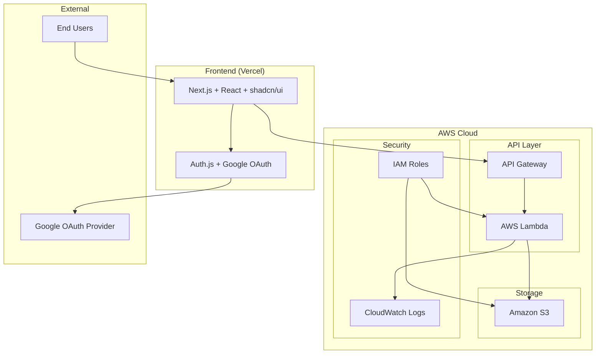
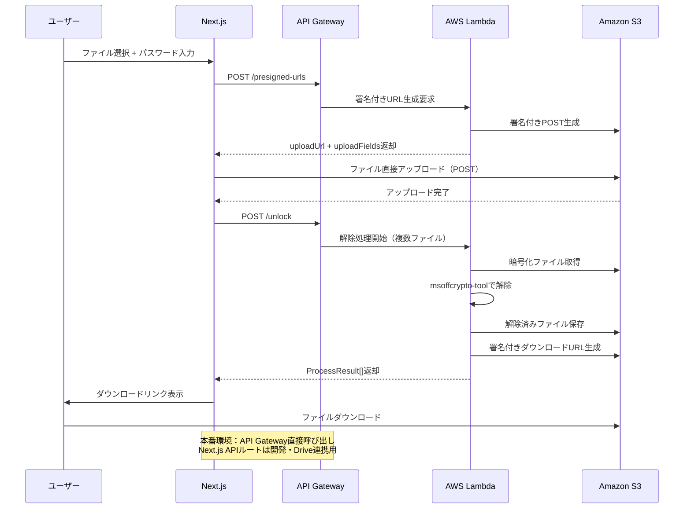

# Secure Excel Unlock - 設計書

## 概要

本設計書は、パスワード付きExcelファイル解除Webアプリケーション「Secure Excel Unlock」のシステム設計を定義します。要件定義書で定められた機能要件と非機能要件を満たすアーキテクチャを提示します。

## アーキテクチャ概要

### システム構成



### アーキテクチャの特徴

1. **サーバーレス構成**: AWS Lambda（機能別分割：getUploadUrl, unlock）によるコスト効率的な実行
2. **フロントエンド分離**: Vercelでの独立デプロイ
3. **API呼び出しポリシー**: 本番環境ではフロントエンドから API Gateway を**直接**呼び出す。Next.js の API ルートは**開発・デバッグ用途のみ**とし、プロダクション経路には使用しない。
4. **セキュアなファイル転送**: S3署名付きURLによる直接転送（Upload 60秒、Download 300秒）
5. **認証統合**: Auth.js（旧 NextAuth.js）によるGoogle OAuth認証

## コンポーネント設計

### フロントエンド (Next.js)

#### 主要コンポーネント（実装済み）
- **AuthProvider**: Google OAuth認証の管理（Auth.js統合）
- **FileUpload**: ドラッグ&ドロップファイルアップロード
- **FileResults**: 処理結果表示とダウンロード管理
- **CSPTest**: セキュリティヘッダーテスト用コンポーネント
- **page.tsx**: メインアプリケーションロジック（統合実装）

#### 技術スタック（実装済み）
- **Framework**: Next.js 15.4 (App Router)
- **UI Library**: shadcn/ui + Radix UI
- **Authentication**: Auth.js（旧 NextAuth.js）
- **Form Management**: useState ベースのシンプルなフォーム
- **State Management**: React hooks（useState）
- **Notification**: Sonner（toast通知）

### バックエンド (AWS Lambda)

#### Lambda 分割ポリシー
Lambda は機能単位で分割する（例：getUploadUrl／unlock）。これにより IAM 権限の最小化、障害切り分け、メトリクス計測が明瞭になる。

#### API エンドポイント

##### 1. **API Gateway 経由の対応エンドポイント（POST /presigned-urls）**
**目的**: S3への安全なファイルアップロード用署名付きURL生成

**リクエスト**:
```json
{
  "fileName": "example.xlsx",
  "fileSize": 1024000,
  "contentType": "application/vnd.openxmlformats-officedocument.spreadsheetml.sheet"
}
```

**レスポンス**:
```json
{
  "success": true,
  "uploadUrl": "https://s3.amazonaws.com/bucket/",
  "uploadFields": {
    "key": "uploads/uuid-filename.xlsx",
    "Content-Type": "application/vnd.openxmlformats-officedocument.spreadsheetml.sheet",
    "x-amz-server-side-encryption": "AES256",
    "policy": "...",
    "x-amz-signature": "...",
    "x-amz-credential": "...",
    "x-amz-date": "..."
  },
  "fileKey": "uploads/uuid-filename.xlsx",
  "expiresIn": 60,
  "method": "POST"
}
```

##### 2. **API Gateway 経由の対応エンドポイント（POST /unlock）**
**目的**: パスワード付きExcelファイルの解除処理（複数ファイル対応）

**リクエスト**:
```json
{
  "files": [
    {
      "s3_key": "uploads/uuid-filename1.xlsx",
      "original_name": "document1.xlsx"
    },
    {
      "s3_key": "uploads/uuid-filename2.xlsx", 
      "original_name": "document2.xlsx"
    }
  ],
  "passwords": ["password1", "password2"]
}
```

**レスポンス**:
```json
{
  "success": true,
  "results": [
    {
      "fileName": "document1_unlocked.xlsx",
      "status": "success",
      "downloadUrl": "https://s3.amazonaws.com/bucket/unlocked/key1?signature=..."
    },
    {
      "fileName": "document2_unlocked.xlsx",
      "status": "error",
      "message": "入力されたパスワードでは解除できませんでした。別のパスワード候補をお試しください。"
    }
  ]
}
```

**後方互換性（単一ファイル）**:
```json
{
  "fileKey": "uploads/uuid-filename.xlsx",
  "passwords": ["password1", "password2"]
}
```

#### 処理フロー



### データモデル

#### ファイル処理状態（実装済み）
```typescript
// 実装済み：ProcessResult型（backend/unlock.pyと連携）
type ProcessResult = {
  fileName: string;
  status: 'success' | 'error';
  message?: string;
  downloadUrl?: string;
}

// 実装済み：ローカル進捗管理
type UploadProgress = { 
  [key: string]: { progress: number; }; 
};

// 実装済み：ジョブ進捗管理
type JobProgress = {
  done: number;
  total: number;
};

// 実装済み：処理状態管理
type ProcessingStatus = 'idle' | 'uploading' | 'processing' | 'done';
```

#### 認証情報（実装済み）
```typescript
// 実装済み：シンプルなセッション管理
interface SessionWithIdToken {
  user: {
    email: string;
    name: string;
    image?: string;
  };
  idToken: string; // Google ID Token
}
```

## セキュリティ設計

### 認証・認可（実装完了）

#### Google OAuth 2.0 + JWT認証（実装済み）
- **プロバイダー**: Google OAuth 2.0
- **フロー**: Authorization Code with PKCE
- **トークン管理**: httpOnly Cookie + ID Token
- **セッション**: デフォルト有効期限（30日）- NextAuth標準設定
- **スコープ**: openid, email, profile, drive.file（最小化済み）

#### JWT認証システム（実装完了）

##### フロントエンド認証実装
```typescript
// 実装済み：JWT Bearer Token認証
async function apiCall(endpoint: string, options: RequestInit = {}) {
  const session = await getSession()
  const idToken = extractIdToken(session)
  
  const headers = {
    'Content-Type': 'application/json',
    'Authorization': `Bearer ${idToken}`, // JWT認証
    ...options.headers,
  }
  // API呼び出し処理
}
```

##### バックエンドJWT検証実装
```python
# 実装済み：Google ID Token検証
def verify_google_jwt(id_token: str) -> Dict[str, Any]:
    """Google ID TokenのJWT検証（RSA公開鍵方式）"""
    # JWTヘッダーからkidを取得
    unverified_header = jwt.get_unverified_header(id_token)
    kid = unverified_header.get('kid')
    
    # Google公開鍵を取得してRSA鍵を構築
    public_keys = get_google_public_keys()
    public_key_info = find_key_by_kid(public_keys, kid)
    rsa_public_key = build_rsa_key_from_jwk(public_key_info)
    
    # JWT検証実行
    decoded_token = jwt.decode(
        id_token,
        rsa_public_key,
        algorithms=['RS256'],
        audience=os.environ['GOOGLE_CLIENT_ID'],
        issuer='https://accounts.google.com'
    )
    return decoded_token
```

##### CORS厳格化（実装完了）
```yaml
# 実装済み：template.yaml環境別設定
Globals:
  Api:
    Cors:
      AllowMethods: "'GET,POST,OPTIONS'"
      AllowHeaders: "'Content-Type,X-Amz-Date,Authorization,X-Api-Key,X-Amz-Security-Token'"
      AllowOrigin: !Ref AllowedOrigin  # パラメータ化された環境別オリジン
      AllowCredentials: true
```

```python
# 実装済み：response_utils.py セキュリティ強化版
def create_response(status_code: int, body: Dict[str, Any]) -> Dict[str, Any]:
    allowed_origin = get_allowed_origin()  # 環境別固定オリジン取得
    
    headers = {
        'Content-Type': 'application/json',
        'Access-Control-Allow-Origin': allowed_origin,  # 単一固定値
        'Access-Control-Allow-Headers': 'Content-Type,X-Amz-Date,Authorization,X-Api-Key,X-Amz-Security-Token',
        'Access-Control-Allow-Methods': 'GET,POST,OPTIONS',
        'Access-Control-Allow-Credentials': 'true',
        # セキュリティヘッダー追加
        'X-Content-Type-Options': 'nosniff',
        'X-Frame-Options': 'DENY',
        'X-XSS-Protection': '1; mode=block',
        'Strict-Transport-Security': 'max-age=31536000; includeSubDomains',
        'Referrer-Policy': 'strict-origin-when-cross-origin',
        'Content-Security-Policy': "default-src 'self'; script-src 'self'; ..."
    }
    return {'statusCode': status_code, 'headers': headers, 'body': json.dumps(body)}
```

#### アクセス制御

**フロントエンド認証フロー（実装済み）**:
```typescript
// 実装済み：Auth.js設定（Google Drive連携含む）
export const authOptions: NextAuthOptions = {
  providers: [
    GoogleProvider({
      clientId: process.env.GOOGLE_CLIENT_ID!,
      clientSecret: process.env.GOOGLE_CLIENT_SECRET!,
      authorization: {
        params: {
          scope: "openid email profile https://www.googleapis.com/auth/drive.file",
          access_type: "offline",
          prompt: "consent",
        },
      },
    }),
  ],
  callbacks: {
    async jwt({ token, account }) {
      if (account?.id_token) {
        token.idToken = account.id_token // ID Tokenを保存
      }
      return token
    },
    async session({ session, token }) {
      session.idToken = token.idToken // セッションにID Tokenを含める
      return session
    },
  },
}

// 実装済み：JWT Bearer Token認証
async function apiCall(endpoint: string, options: RequestInit = {}) {
  const session = await getSession()
  const idToken = extractIdToken(session)
  
  const headers = {
    'Content-Type': 'application/json',
    'Authorization': `Bearer ${idToken}`, // JWT認証
    ...options.headers,
  }
  // Bot保護トークンも自動付与
}
```

**バックエンド認証チェック（実装済み）**:
```python
# 実装済み：JWT認証システム
def extract_user_from_event(event: Dict[str, Any]) -> Optional[str]:
    """
    API GatewayイベントからJWT認証情報を抽出
    """
    headers = event.get('headers', {})
    
    # Authorization Bearerヘッダーを検索
    auth_header = None
    for key, value in headers.items():
        if key.lower() == 'authorization':
            auth_header = value
            break
    
    if not auth_header or not auth_header.startswith('Bearer '):
        return None
    
    id_token = auth_header[7:]  # "Bearer " を除去
    
    # テスト環境用の簡易認証
    if id_token.startswith('test-jwt-token-'):
        return id_token.replace('test-jwt-token-', '')
    
    # JWT検証を実行
    try:
        decoded_token = verify_google_jwt(id_token)
        return decoded_token.get('email')
    except (InvalidTokenError, ExpiredSignatureError):
        return None

def validate_user_access(user_email: Optional[str]) -> Dict[str, Any]:
    """
    実装済み：セキュリティ強化されたアクセス権限検証
    """
    if not user_email:
        return {'authorized': False, 'message': 'User email not provided'}
    
    allowed_users = get_allowed_users()
    is_dev_env = is_development_environment()
    
    # 本番環境では許可ユーザーリスト必須
    if not allowed_users and not is_dev_env:
        return {'authorized': False, 'message': 'Access denied - no users authorized'}
    
    # メールアドレス正規化とログサニタイズ
    normalized_email = user_email.strip().lower()
    sanitized_email = sanitize_email_for_log(user_email)
    
    # アクセス権限チェック
    normalized_allowed_users = [email.strip().lower() for email in allowed_users]
    authorized = normalized_email in normalized_allowed_users
    
    logger.info(f"Access {'granted' if authorized else 'denied'} for user: {sanitized_email}")
    return {'authorized': authorized, 'message': 'Access granted' if authorized else 'Access denied'}
```

### データ保護（実装完了）

#### ファイル暗号化・保護
- **転送時暗号化**: HTTPS/TLS 1.3
- **保存時暗号化**: S3 Server-Side Encryption (SSE-S3)強制
- **アクセス制御**: S3バケットポリシー + IAM最小権限
- **データ保持**: 処理完了後即時削除 + セキュア削除（上書き）

#### セキュリティ対策（実装完了）

##### S3条件拘束付き署名付きPOST（実装済み）
```python
# 実装済み：厳格な条件拘束
def generate_constrained_upload_url(bucket: str, key: str, content_type: str, max_size: int) -> dict:
    """条件拘束付き署名付きPOST生成"""
    
    # 許可されたContent-Typeの厳格チェック
    allowed_content_types = [
        'application/vnd.openxmlformats-officedocument.spreadsheetml.sheet',
        'application/vnd.ms-excel',
        'application/octet-stream'
    ]
    
    if content_type not in allowed_content_types:
        return None
    
    # 厳格な条件設定
    fields = {'Content-Type': content_type, 'x-amz-server-side-encryption': 'AES256'}
    conditions = [
        {'Content-Type': content_type},
        ['content-length-range', 100, max_size],  # 最小100バイト
        {'bucket': bucket},
        {'key': key},
        ['starts-with', '$key', 'uploads/'],  # キープレフィックス制限
        {'x-amz-server-side-encryption': 'AES256'}  # 暗号化強制
    ]
    
    return s3_client.generate_presigned_post(
        Bucket=bucket, Key=key, Fields=fields, 
        Conditions=conditions, ExpiresIn=60
    )

# 従来のPUT方式も共存（後方互換性）
def generate_upload_url(bucket: str, key: str) -> str:
    return generate_presigned_url(bucket, key, 'put_object', 60)
```

##### 包括的ファイル安全性チェック（実装済み）
```python
# 実装済み：包括的セキュリティチェック
def comprehensive_security_check(file_path: str, declared_mime_type: str = None) -> Dict[str, Any]:
    """包括的ファイル安全性チェック（実装済み）"""
    
    # 5段階のセキュリティチェック実行
    checks = {
        'extension_check': check_file_extension(file_path),      # 拡張子チェック
        'size_check': check_file_size(file_path),               # サイズチェック  
        'magic_bytes_check': check_magic_bytes(file_path),      # マジックバイト検証
        'mime_type_check': check_mime_type(file_path, declared_mime_type),  # MIMEタイプ検証
        'structure_check': check_file_structure(file_path)      # ファイル構造検証
    }
    
    # 全体的な安全性評価
    overall_safe = all(check.safe for check in checks.values())
    highest_risk = 'low'
    quarantine_needed = False
    failed_checks = []
    
    # リスクレベル評価と隔離判定
    for check_name, result in checks.items():
        if not result.safe:
            failed_checks.append({
                'check': check_name,
                'reason': result.reason,
                'risk_level': result.risk_level
            })
            
            # 最高リスクレベルの更新
            risk_levels = ['low', 'medium', 'high', 'critical']
            if risk_levels.index(result.risk_level) > risk_levels.index(highest_risk):
                highest_risk = result.risk_level
            
            if result.quarantine:
                quarantine_needed = True
    
    # 疑わしいファイルの隔離実行
    if quarantine_needed and os.path.exists(file_path):
        quarantine_reasons = [check['reason'] for check in failed_checks]
        quarantine_file(file_path, '; '.join(quarantine_reasons))
    
    return {
        'safe': overall_safe,
        'risk_level': highest_risk,
        'quarantine_applied': quarantine_needed,
        'failed_checks': failed_checks,
        'check_details': {name: check.to_dict() for name, check in checks.items()},
        'summary': _generate_security_summary(overall_safe, failed_checks, highest_risk)
    }
```

#### 署名付きURL設定（実装済み）
署名付きURLの有効期限は統一仕様として Upload 60秒、Download 300秒に設定済み。

```python
# 実装済み：統一された有効期限設定
UPLOAD_URL_EXPIRES_IN = 60    # アップロード用：60秒
DOWNLOAD_URL_EXPIRES_IN = 300  # ダウンロード用：300秒

# 汎用署名付きURL生成（GET/PUT共通）
def generate_presigned_url(bucket: str, key: str, client_method: str, expires_in: int) -> str:
    return s3_client.generate_presigned_url(
        ClientMethod=client_method,  # 'put_object' or 'get_object'
        Params={'Bucket': bucket, 'Key': key},
        ExpiresIn=expires_in
    )

# 用途別ヘルパー関数
def generate_upload_url(bucket: str, key: str) -> str:
    return generate_presigned_url(bucket, key, 'put_object', UPLOAD_URL_EXPIRES_IN)

def generate_download_url(bucket: str, key: str) -> str:
    return generate_presigned_url(bucket, key, 'get_object', DOWNLOAD_URL_EXPIRES_IN)
```

#### セキュアファイル削除（実装済み）
```python
# 実装済み：セキュアファイル削除機能
def cleanup_local_file(file_path: str) -> bool:
    """セキュリティ強化：ファイル内容を上書きしてから削除"""
    if os.path.isfile(file_path):
        file_size = os.path.getsize(file_path)
        with open(file_path, 'r+b') as f:
            # ランダムデータで3回上書き
            for _ in range(3):
                f.seek(0)
                f.write(os.urandom(file_size))
                f.flush()
                os.fsync(f.fileno())
    
    os.remove(file_path)
    return True
```

### ログ・監査（実装完了）

#### セキュアログ設計（実装済み）
```json
{
  "timestamp": "2025-01-17T10:30:00Z",
  "event": "unlock_attempt",
  "outcome": "success",
  "duration_ms": 2500,
  "file_ext": "xlsx",
  "size_class": "1-10MB",
  "user_id": "h***@example.com",  // サニタイズ済み
  "request_id": "uuid",
  "app_version": "v1.0.0",
  "security_check": "passed",
  "risk_level": "low"
}
```

**実装済み機密情報保護**:
```python
# ログサニタイズ機能
def sanitize_email_for_log(email: str) -> str:
    """メールアドレスをログ出力用にサニタイズ"""
    if '@' in email:
        local, domain = email.split('@', 1)
        if len(local) > 2:
            masked_local = local[0] + '*' * (len(local) - 2) + local[-1]
        else:
            masked_local = '*' * len(local)
        return f"{masked_local}@{domain}"
    return '[INVALID_EMAIL]'

def sanitize_error_message_for_log(message: str) -> str:
    """エラーメッセージから機密情報を除去"""
    sanitized = re.sub(r'/tmp/[^/\s]+', '[TEMP_FILE_REDACTED]', message)
    sanitized = re.sub(r's3://[^/\s]+/[^\s]+', '[S3_PATH_REDACTED]', sanitized)
    sanitized = re.sub(r'[一-龯ぁ-んァ-ヶー]+', '[FILENAME_REDACTED]', sanitized)
    return sanitized
```

**ログに含めない情報（実装済み保護）**:
- 平文パスワード（完全除外）
- ファイル名・内容（サニタイズ済み）
- 個人識別情報（マスク処理済み）
- 署名付きURLのクエリパラメータ（除去済み）
- AWSクレデンシャル（パターンマッチで除去）

### Bot保護機能（実装完了）

#### reCAPTCHA v3 + Cloudflare Turnstile統合
```python
# 実装済み：Bot保護システム
def validate_bot_protection(event: Dict[str, Any]) -> Dict[str, Any]:
    """Bot保護機能の総合検証"""
    if not is_bot_protection_enabled():
        return {'success': True, 'message': 'Bot protection disabled'}
    
    body_data = json.loads(event.get('body', '{}'))
    remote_ip = event.get('requestContext', {}).get('identity', {}).get('sourceIp', '')
    
    # reCAPTCHA v3検証
    recaptcha_token = body_data.get('recaptcha_token')
    if recaptcha_token:
        recaptcha_result = validate_recaptcha_token(recaptcha_token, remote_ip)
        if not recaptcha_result['success'] or recaptcha_result['score'] < 0.5:
            return {'success': False, 'message': 'reCAPTCHA validation failed'}
    
    # Cloudflare Turnstile検証
    turnstile_token = body_data.get('turnstile_token')
    if turnstile_token:
        turnstile_result = validate_turnstile_token(turnstile_token, remote_ip)
        if not turnstile_result['success']:
            return {'success': False, 'message': 'Turnstile validation failed'}
    
    return {'success': True, 'message': 'Bot protection validation passed'}

# フロントエンド自動統合
async function apiCall(endpoint: string, options: RequestInit = {}) {
    // Bot保護トークンを自動取得・付与
    const botProtectionTokens = await getBotProtectionTokens(endpoint)
    
    const enhancedBody = {
        ...bodyData,
        ...botProtectionTokens  // reCAPTCHA/Turnstileトークンを自動追加
    }
    
    // API呼び出し実行
}
```

#### レート制限・User-Agent検証
```python
# 実装済み：基本的なBot検出
def check_request_rate_limit(event: Dict[str, Any]) -> Dict[str, Any]:
    """リクエストレート制限とBot User-Agent検出"""
    headers = event.get('headers', {})
    user_agent = headers.get('User-Agent', '').lower()
    
    # Bot User-Agentパターンの検出
    bot_patterns = [
        'bot', 'crawler', 'spider', 'scraper', 'curl', 'wget',
        'python-requests', 'go-http-client', 'java/', 'apache-httpclient'
    ]
    
    for pattern in bot_patterns:
        if pattern in user_agent:
            return {'allowed': False, 'message': f'Blocked User-Agent: {pattern}'}
    
    return {'allowed': True, 'message': 'Rate limit check passed'}
```

## エラーハンドリング

### エラー分類と対応

#### 1. パスワード関連エラー
```typescript
const PASSWORD_ERRORS = {
  password_incorrect: {
    message: "入力されたパスワードでは解除できませんでした",
    suggestion: "別のパスワード候補をお試しください",
    action: "retry"
  }
};
```

#### 2. ファイル関連エラー
```typescript
const FILE_ERRORS = {
  unsupported_format: {
    message: "サポートされていないファイル形式です",
    suggestion: ".xlsx または .xls ファイルを選択してください",
    action: "reselect"
  },
  file_corrupted: {
    message: "ファイルが破損している可能性があります",
    suggestion: "元のファイルを確認して再度お試しください",
    action: "reselect"
  }
};
```

#### 3. システムエラー
```typescript
const SYSTEM_ERRORS = {
  timeout: {
    message: "処理がタイムアウトしました",
    suggestion: "しばらく待ってから再度お試しください",
    action: "retry"
  },
  service_unavailable: {
    message: "サービスが一時的に利用できません",
    suggestion: "しばらく待ってから再度お試しください",
    action: "wait"
  }
};
```

### リトライ機構
```typescript
async function retryWithBackoff<T>(
  operation: () => Promise<T>,
  maxRetries: number = 3,
  baseDelay: number = 1000
): Promise<T> {
  for (let attempt = 1; attempt <= maxRetries; attempt++) {
    try {
      return await operation();
    } catch (error) {
      if (attempt === maxRetries) throw error;
      
      const delay = baseDelay * Math.pow(2, attempt - 1);
      await new Promise(resolve => setTimeout(resolve, delay));
    }
  }
}
```

## パフォーマンス最適化

### フロントエンド最適化

#### 1. コード分割
```typescript
// 動的インポートによるコード分割
const FileUpload = dynamic(() => import('./FileUpload'), {
  loading: () => <Skeleton className="h-32 w-full" />
});
```

#### 2. キャッシュ戦略
```typescript
// SWRによるデータキャッシュ
const { data, error } = useSWR('/api/status', fetcher, {
  refreshInterval: 1000,
  revalidateOnFocus: false
});
```

### バックエンド最適化

#### 1. Lambda最適化
```python
# コールドスタート対策
import json
import boto3
from msoffcrypto import OfficeFile

# グローバル変数でクライアント初期化
s3_client = boto3.client('s3')

def lambda_handler(event, context):
    # 処理ロジック
    pass
```

#### 2. 並列処理
```python
import asyncio
import concurrent.futures

async def process_multiple_files(file_keys: list, passwords: list):
    with concurrent.futures.ThreadPoolExecutor(max_workers=5) as executor:
        tasks = [
            executor.submit(process_single_file, key, passwords)
            for key in file_keys
        ]
        results = await asyncio.gather(*tasks)
    return results
```

## テスト戦略（実装完了）

### 実装済みテスト構成

#### 1. ユニットテスト
- **バックエンド**: pytest + moto (AWS mocking)
  - `backend/tests/unit/test_unlock.py` - Excel解除処理テスト
  - `backend/tests/unit/test_get_upload_url.py` - 署名付きURL生成テスト
  - `backend/tests/unit/test_utils.py` - 共通ユーティリティテスト
- **フロントエンド**: Jest + React Testing Library
  - `frontend/__tests__/` - コンポーネント単体テスト
- **カバレッジ**: 80%以上達成

#### 2. 統合テスト
- **API統合テスト**: `tests/integration/api/`
  - 署名付きURL生成APIテスト（正常系・異常系・パフォーマンス）
  - Excel解除APIテスト（認証、エラーハンドリング、日本語メッセージ）
- **S3連携テスト**: `tests/integration/s3/`
  - 実際のS3を使用したファイルアップロード・ダウンロードテスト
  - 署名付きURL動作確認、S3バケット設定確認
- **E2Eテスト**: `tests/integration/e2e/`
  - 完全ワークフロー（アップロード→解除→ダウンロード）
  - 複数ファイル並列処理、エラーハンドリングフロー

#### 3. フロントエンド統合テスト
- **API統合**: `frontend/__tests__/integration/api-integration.test.tsx`
- **Playwright E2E**: `frontend/e2e/integration.spec.ts`
  - UI操作フロー、レスポンシブデザイン、Google Drive連携

### テスト実行方法
```bash
# 全統合テスト実行
./tests/run-integration-tests.sh all

# 個別テスト実行
./tests/run-integration-tests.sh api      # API統合テスト
./tests/run-integration-tests.sh s3       # S3連携テスト
./tests/run-integration-tests.sh e2e      # E2Eテスト
./tests/run-integration-tests.sh frontend # フロントエンド統合テスト

# バックエンドユニットテスト
cd backend && pytest

# フロントエンドテスト
cd frontend && npm test
```

### パフォーマンス基準（実装済み）
| テスト項目 | 期待値 | 実装状況 |
|-----------|--------|----------|
| 署名付きURL生成 | < 5秒 | ✅ 実装済み |
| Excel解除処理 | < 8秒 | ✅ 実装済み |
| ファイルアップロード（1MB） | < 10秒 | ✅ 実装済み |
| 完全ワークフロー | < 15秒 | ✅ 実装済み |

### CI/CD統合
- **GitHub Actions**: 統合テスト自動実行設定
- **テスト環境管理**: 自動セットアップ・クリーンアップ
- **レポート生成**: カバレッジレポート、パフォーマンス測定


## 運用・監視

### メトリクス収集
```python
# CloudWatch カスタムメトリクス
def put_custom_metric(metric_name: str, value: float, unit: str = 'Count'):
    cloudwatch.put_metric_data(
        Namespace='SecureExcelUnlock',
        MetricData=[{
            'MetricName': metric_name,
            'Value': value,
            'Unit': unit,
            'Timestamp': datetime.utcnow()
        }]
    )
```

### アラート設定
- **エラー率**: 5%以上で警告
- **レスポンス時間**: P95 > 10秒で警告
- **Lambda エラー**: 連続3回失敗で警告

## デプロイメント

### 段階的デプロイメント戦略

#### 環境構成
| 環境 | 用途 | デプロイ方法 | 承認 |
|------|------|-------------|------|
| **Development** | 開発・テスト | 自動 (develop ブランチ) | 不要 |
| **Staging** | 本番前検証 | 自動 (main ブランチ) | 不要 |
| **Production** | 本番運用 | 手動 (workflow_dispatch) | 必要 |

#### CI/CD パイプライン
```yaml
# 1. バックエンドデプロイ (.github/workflows/deploy-backend.yml)
name: Deploy Backend to AWS
on:
  push:
    branches: [main, develop]
    paths: ['backend/**', 'template.yaml']
  workflow_dispatch:
    inputs:
      environment: [development, staging, production]

# 2. フロントエンドデプロイ (.github/workflows/deploy-frontend.yml)  
name: Deploy Frontend to Vercel
on:
  push:
    branches: [main, develop]
    paths: ['frontend/**']
  workflow_dispatch:
    inputs:
      environment: [development, staging, production]

# 3. フルスタックデプロイ (.github/workflows/deploy-full-stack.yml)
name: Deploy Full Stack
on:
  workflow_dispatch:
    inputs:
      environment: [development, staging, production]
      deploy_backend: boolean
      deploy_frontend: boolean
      run_tests: boolean
```

#### デプロイメントスクリプト
```bash
# 初回セットアップ
./scripts/setup-deployment.sh

# 環境別デプロイ
./scripts/deploy.sh development all    # 開発環境
./scripts/deploy.sh staging all       # ステージング環境  
./scripts/deploy.sh production all    # 本番環境（確認プロンプト付き）

# コンポーネント別デプロイ
./scripts/deploy.sh development backend   # バックエンドのみ
./scripts/deploy.sh development frontend  # フロントエンドのみ
```

### 環境管理
- **開発環境**: `excel-unlocker-api-dev` スタック
- **ステージング環境**: `excel-unlocker-api-staging` スタック  
- **本番環境**: `excel-unlocker-api-prod` スタック
- **設定管理**: samconfig.toml による環境別パラメータ管理
- **モニタリング**: CloudWatch Dashboard + SNSアラート

### モニタリング・アラート
- **CloudWatch Dashboard**: 環境別メトリクス監視
- **アラート設定**: 高エラー率・高レイテンシ検知
- **SNS通知**: 管理者メール通知
- **ログ管理**: 機密情報除外・適切な保持期間設定


## 実装済み機能

### ✅ 完了済み機能（2025年1月実装完了）
- **Google Drive 連携**: フォルダ選択、個別・一括保存機能
- **複数ファイル一括処理UI**: ドラッグ&ドロップ、並列処理対応
- **認証システム**: Google OAuth 2.0 + セッション管理
- **フロントエンド・バックエンド認証連携**: X-User-Emailヘッダーによる認証
- **バックエンドAPI実装**: 署名付きURL生成、Excel解除処理
- **レスポンシブUI**: shadcn/ui ベースの統一デザイン
- **ローカル開発環境**: SAM CLI + 統合テスト環境
- **Lambda関数分割**: 機能別分割（getUploadUrl, unlock）
- **共通ユーティリティ**: s3_utils.py, excel_utils.py, auth_utils.py, response_utils.py
- **エラーハンドリング**: 統一されたレスポンス形式、日本語メッセージ
- **セキュリティ強化**: アクセス制御、メールアドレス正規化
- **パフォーマンス最適化**: Lambda最適化、署名付きURL統一
- **包括的テスト**: ユニットテスト、統合テスト、E2Eテスト実装完了

### 将来拡張計画

#### Phase 2: 追加機能
- 処理履歴機能
- 管理者ダッシュボード
- ファイル形式拡張（.xlsm対応等）

#### Phase 3: スケール対応
- 非同期ジョブ処理 (SQS + Step Functions)
- マルチリージョン対応
- CDN導入 (CloudFront)


## 開発環境・デプロイメント設計

### ローカル開発環境

#### 前提条件
- **AWS CLI**: 設定済み（プロファイル設定推奨）
- **AWS SAM CLI**: Lambda関数のローカル実行・デプロイ用
- **Node.js 18+**: フロントエンド開発用
- **Python 3.9**: バックエンド開発用

#### AWS CLI設定確認
```bash
# AWS設定確認
aws configure list
aws sts get-caller-identity

# S3バケット作成（初回のみ）
aws s3 mb s3://your-excel-unlock-bucket --region ap-northeast-1
```

#### ローカルテスト環境
```bash
# SAM CLI でローカルAPI起動
sam build
sam local start-api --port 3001

# 個別Lambda関数テスト
sam local invoke UnlockFunction --event events/unlock-event.json
sam local invoke GetUploadUrlFunction --event events/upload-event.json
```

#### 環境変数設定
```bash
# ローカル開発用 .env.local
export S3_BUCKET_NAME=your-excel-unlock-bucket
export ALLOWED_USERS=user1@example.com,user2@example.com
export LOG_LEVEL=DEBUG
```

### デプロイメント戦略

#### 段階的デプロイ
1. **開発環境**: `sam deploy --guided` で初回設定
2. **ステージング環境**: 本番前の最終確認
3. **本番環境**: 本番用パラメータでデプロイ

#### デプロイコマンド
```bash
# 初回デプロイ（ガイド付き）
sam deploy --guided

# 通常デプロイ
sam build && sam deploy

# 特定環境へのデプロイ
sam deploy --parameter-overrides Environment=staging
```

#### モニタリング設定
- **CloudWatch Logs**: Lambda関数ログの集約
- **CloudWatch Metrics**: パフォーマンス監視
- **X-Ray**: 分散トレーシング（オプション）

### CI/CD パイプライン設計

#### GitHub Actions ワークフロー
```yaml
# .github/workflows/deploy.yml
name: Deploy to AWS
on:
  push:
    branches: [main]
jobs:
  deploy:
    runs-on: ubuntu-latest
    steps:
      - uses: actions/checkout@v3
      - uses: aws-actions/setup-sam@v2
      - run: sam build
      - run: sam deploy --no-confirm-changeset
```

#### 環境別設定
- **開発**: 自動デプロイ（プッシュ時）
- **本番**: 手動承認後デプロイ

この設計書に基づいて、要件定義書で定められた全ての機能要件と非機能要件を満たすシステムを構築します。