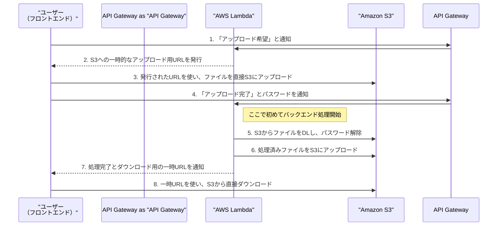

# Excelパスワード解除API 開発に向けた認識合わせ

このドキュメントは、APIの開発に着手する前に、私（AIアシスタント Cascade）とユーザー様の間の認識を合わせるためのものです。

## 更新ルール

1.  **質問は消さない**: 私からの質問は、編集・削除せずそのまま残してください。
2.  **回答を追記する**: 各質問の下にある「回答欄」に、ユーザー様の考えやご希望をご記入ください。
3.  **視覚的な区別**: 私（AI）の質問と、ユーザー様の回答が分かりやすいようにフォーマットを分けて管理します。

---

## 認識合わせのためのご質問

**【質問1】 APIの基本的な動作について**

APIの基本的な動作は、「ユーザーが **1つのパスワード付きExcelファイル** と **1つのパスワード** をAPIに送信し、APIは **パスワードが解除された1つのExcelファイル** を返す」という、1対1のシンプルな処理である、という認識で合っていますでしょうか？

**【回答欄】**
> シンプルな構造はあっています。
> しかし、解除するエクセルファイルは、パスワードが定期的に変わるため、ユーザーは第一パスワードと第二パスワードをAPIに渡せるようにしてほしい。
> 第一パスワードでダメなときは第二パスワードを試すようなフローにしてほしいです。
> *(ユーザー様からの [[2025-07-06]] のご指示を反映)*

---

**【質問1-2】 2段階パスワード解除の動作確認**

ご回答ありがとうございます。承知いたしました。
APIの動作を「第一パスワードで解除を試み、失敗したら第二パスワードで試す」というフローに変更します。

このフローについて、もし**両方のパスワードで解除に失敗した場合**、APIはどのような応答を返すのが望ましいですか？

(例: 「2つのパスワードで解除できませんでした」のような、両方試したことが分かるメッセージを返す)

**【回答欄】**
> 両方のパスワードが違うときは失敗で返して
> *(ユーザー様からの [[2025-07-06]] のご指示を反映)*

**【質問2】 ファイルとパスワードの渡し方について**

ユーザーがファイルとパスワードをAPIに渡す具体的な方法について、どのようなイメージをお持ちですか？

-   **A案**: Webページ上にファイル選択ボタンとパスワード入力欄を用意し、そこから送信する。
-   **B案**: [[Postman]]のようなツールや、他のプログラムから直接APIを呼び出す（例: [[JSON]]形式でファイルデータとパスワードを送信）。
-   **C案**: その他（具体的なイメージがあれば教えてください）。

**【回答欄】**
> どうしよう。いい案あれば提案してほしい。
> イメージは、フロントエンドとバックエンドを完全に分けたいです。
> フロントエンドはVercelとかで作れるといいなと思っています。
> バックエンドを分けたい理由は、Renderの実行時間を最低限にして、課金を抑えたいからです。
> 理想は、プログラム開始時にレジュームして、プログラムが終了したら休止状態にする。というのが理想です。
>
> パスワードの受け渡しは、安全性も含めてアイディアないので提案して。
>
> また、フロントエンドでは、認証機能を入れて、このサービスを使用できるユーザーを制限したいです。
>
> 今回は、バックエンドの作成に全力を使い。バックエンドが完成したらフロントエンド作成したいんだけど、それでいいと思う？
> *(ユーザー様からの [[2025-07-06]] のご指示を反映)*

---

**【提案と追加質問】**

素晴らしい構想をありがとうございます。また、`開発資料`フォルダでご確認いただいた通り、システムの安定性と拡張性のためにS3を導入する、という点についてもご理解いただきありがとうございます。
これらを踏まえ、システム構成と開発の進め方を以下のように更新させてください。

**【提案1】システム構成（AWS Lambda + S3連携版）**
- **フロントエンド**: [[Vercel]]に配置。ユーザーが操作する画面を担当。（例: [[Next.js]], [[React]]などで構築）
- **バックエンド**: **[[AWS Lambda]]** に配置。パスワード解除の処理を担当します。リクエストがあった時だけ実行されるため、コストを最小限に抑えられます。
- **APIゲートウェイ**: **[[Amazon API Gateway]]** を利用。Lambdaを外部から呼び出すための窓口（URL）を提供します。
- **ファイルストレージ**: **[[Amazon S3]]** に配置。ファイルの一時的な保管を担当します。

**【提案2】コストとパフォーマンスについて**
- ご提示いただいた比較資料の通り、**[[AWS Lambda]]** は「アクセスがあった時だけ即時に応答し、処理が終われば停止する」という要件に完全に合致しています。
- **SnapStart**機能を有効化することで、初回アクセス時の起動時間（コールドスタート）も大幅に短縮でき、快適な利用体験を実現できます。
- 無料利用枠も非常に大きく（月100万リクエスト等）、個人利用の範囲ではほぼ無料で運用可能です。

**【提案3】安全で安定したデータの受け渡し（S3利用）**
- Lambdaにも直接ファイルを送信する際のサイズ制限があるため、これまで通りS3を介したフローが最適です。

この方式（**署名付きURL**）により、大きなファイルも安定して送受信でき、Lambdaの負荷も最小限に抑えられます。パスワード自体は、ファイルとは別の経路で安全なHTTPS通信（4の通信）で送信します。

--- 

**【質問3】 新構成案のご確認**

上記の【提案1】〜【提案3】で示した、**AWS Lambda**とS3を連携させるシステム構成案について、こちらで開発を進めてもよろしいでしょうか？

**【回答欄】**
> OKです。
> *(ユーザー様からの [[2025-07-10]] のご指示を反映)*

**【質問4】 認証方法について（丁寧解説版）**

「フロントエンドでは、認証機能を入れて、このサービスを使用できるユーザーを制限したい」というご要望、承知しております。これを実現する方法として、Googleアカウントでログインする案が挙がっていますね。これは素晴らしいアイディアだと思います。

ここで、技術的な選択肢を２つ、それぞれのメリット・デメリットと共に解説します。

- **A案（シンプル）: APIキー認証**
  - **これは何？**: バックエンドとフロントエンドの間だけで通じる「秘密の合言葉（APIキー）」を決めておく方式です。フロントエンドのプログラムにこの合言葉を埋め込んでおき、バックエンドは合言葉を知っているリクエストだけを受け付けます。
  - **メリット**: 実装が非常にシンプルで、すぐに作れます。
  - **デメリット**: 「人間」のユーザーを区別できません。あくまでプログラム対プログラムの認証なので、「Aさんが使っている」「Bさんが使っている」という管理はできません。悪意のある人がフロントエンドのプログラムを解析すると、合言葉が漏れる可能性もゼロではありません。

- **B案（高機能）: Google認証 (OAuth2.0 + JWT)**
  - **これは何？**: ユーザー様に使い慣れたGoogleアカウントでログインしてもらう方式です。ログインに成功すると、Googleが「この人は正当なユーザーです」という証明書（トークン）を発行してくれます。フロントエンドはその証明書をバックエンドに提示し、バックエンドは証明書が本物かを確認して処理を受け付けます。
  - **メリット**: 非常に安全です。「許可されたGoogleアカウントのユーザーしか使えない」という、ご要望通りの厳密なユーザー管理が実現できます。
  - **デメリット**: A案に比べて実装が少し複雑になります。フロントエンド（ログイン画面）とバックエンド（証明書の検証）の両方で対応が必要です。

**【推奨】**
将来的に「このWebサービスを使える人をきちんと管理したい」という目的があるなら、**B案のGoogle認証**で進めるのが最適だと思います。最初に少し手間がかかりますが、セキュリティも信頼性も格段に向上します。

**B案のGoogle認証で開発を進める、という方針でよろしいでしょうか？**

**【回答欄】**

**【質問5】 エラー時の対応について（丁寧解説版）**

ユーザーがこのツールを使う上で、何か問題が起きた時に「何が原因で失敗したのか」が分からないと、とても不便です。例えば、パスワードを間違えただけなのに「原因不明のエラー」と表示されたら、ユーザーはどうすればいいか困ってしまいます。

そこで、「ユーザー体験」を良くするために、エラーの原因を具体的に伝える仕組みを入れることを提案します。

**【提案】**
以下のように、エラーの種類に応じて分かりやすいメッセージを返すように設計します。
- パスワードが2つとも違った場合 → 「パスワードが正しくありません」
- アップロードしたファイルがExcel形式ではなかった場合 → 「Excelファイルを選択してください」
- ファイルが壊れていて開けなかった場合 → 「ファイルが破損している可能性があります」

**このように、利用者に親切なエラー通知を行う方針でよろしいでしょうか？**

**【回答欄】**

**【質問6】 機能範囲の確認（丁寧解説版）**

ソフトウェア開発では、一度に多くの機能を作ろうとすると、完成までの時間が長くなり、途中で問題が起きやすくなります。そこで、まずは「絶対に必要」なコア機能だけを確実に完成させ、その後に便利な機能を追加していく、という進め方が一般的です。

今回のプロジェクトでいうと、最も重要なコア機能は「**1つのExcelファイルのパスワードを解除すること**」です。

**まずはこの「単一ファイル処理」に集中して開発を行い、確実に動作するバージョンを完成させる、という方針でよろしいでしょうか？**
（将来的には、複数ファイルを一括で処理する機能などを追加することも可能です）

**【回答欄】**

**【質問7】 開発の進め方について（最終確認）**

「今回は、バックエンドの作成に全力を使い。バックエンドが完成したらフロントエンド作成したい」というご意見に、私も賛成です。

これまでのご回答内容を踏まえると、私たちの最初のゴールは以下のようになりますね。

**【最初のゴール】**
**Google認証（質問4の回答次第）の仕組みを含んだ、Excelパスワード解除API（バックエンド）を、AWS LambdaとS3を使って完成させる。**

このバックエンドという「エンジン」部分が完成すれば、いつでもフロントエンドという「車体」を載せられる状態になります。

**この最終目標に向かって、開発をスタートしてよろしいでしょうか？**

**【回答欄】**

---

お手数ですが、上記の回答欄にご記入をお願いいたします。
ご回答をいただき次第、それを基に具体的な設計を進めてまいります。
