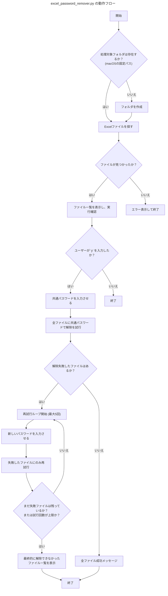

# `excel_password_remover.py` の解説書

このドキュメントは、`（旧）Excelのパスワード解除` フォルダに含まれる `excel_password_remover.py` スクリプトの機能、動作フロー、および使用上の注意点をまとめたものです。

## 1. このツールは何をするものか？

このスクリプトは、パスワードで保護された[[Excel]]ファイル（`.xls`, `.xlsx`, `.xlsm`）のロックを解除するための[[Python]]ツールです。

### 主な機能

-   **一括解除**: 複数のファイルに対し、共通のパスワードで一括解除を試みます。
-   **個別解除**: 共通パスワードで解除できなかったファイルを、個別のパスワード（最大5回まで試行可能）で解除します。
-   **自動保存**: 解除が完了したファイルは、元の場所にある `パスワード解除済みファイル` フォルダに保存されます。
-   **非保護ファイルのコピー**: パスワードがかかっていないファイルは、そのまま出力フォルダにコピーされます。

## 2. プログラムの動作フロー

このスクリプトは以下の流れで処理を実行します。



## 3. 重要な注意点と問題点

このスクリプトを現在の状態で使用するには、**2つの致命的な問題点**が存在します。

### 問題点1：フォルダパスがmacOS用に固定されている

コード内で参照されるフォルダのパスが、特定の[[macOS]]ユーザーの環境に固定（ハードコード）されています。

**該当コード箇所:**
```python
base_folder = os.path.join("/Users/hironomac2025/Library/Mobile Documents/com~apple~CloudDocs/Downloads", "Officeパスワード解除希望ファイル")
```

このため、**このままでは[[Windows]]環境では絶対に動作しません。**
使用するには、このパスを[[Windows]]用のパス（例: `C:\\Users\\hirok\\Downloads`）に書き換えるなどの修正が必須です。

### 問題点2：【危険】元のファイルを自動で削除する

パスワード解除に成功したファイル、および元々パスワードがかかっていなかったファイルは、処理後に**元のファイルが自動的に削除されます**。

**該当コード箇所:**
```python
os.remove(input_file)
```

万が一、処理後のファイルに問題があった場合、**元に戻すことができなくなる非常に危険な仕様**です。
使用する前には、**必ずファイルのバックアップを取る**か、この削除処理を行うコードを無効化することを強く推奨します。

## 4. まとめと提案

-   **ツール概要**: [[Excel]]ファイルのパスワードを効率的に解除できる便利なツール。
-   **現状での利用**: **不可**。[[Windows]]環境で動作させるにはコードの修正が必要。
-   **リスク**: **高**。バックアップなしで実行すると、元のファイルを失う危険性がある。

ご希望であれば、このスクリプトを[[Windows]]環境で安全に利用できるように修正することも可能です。
