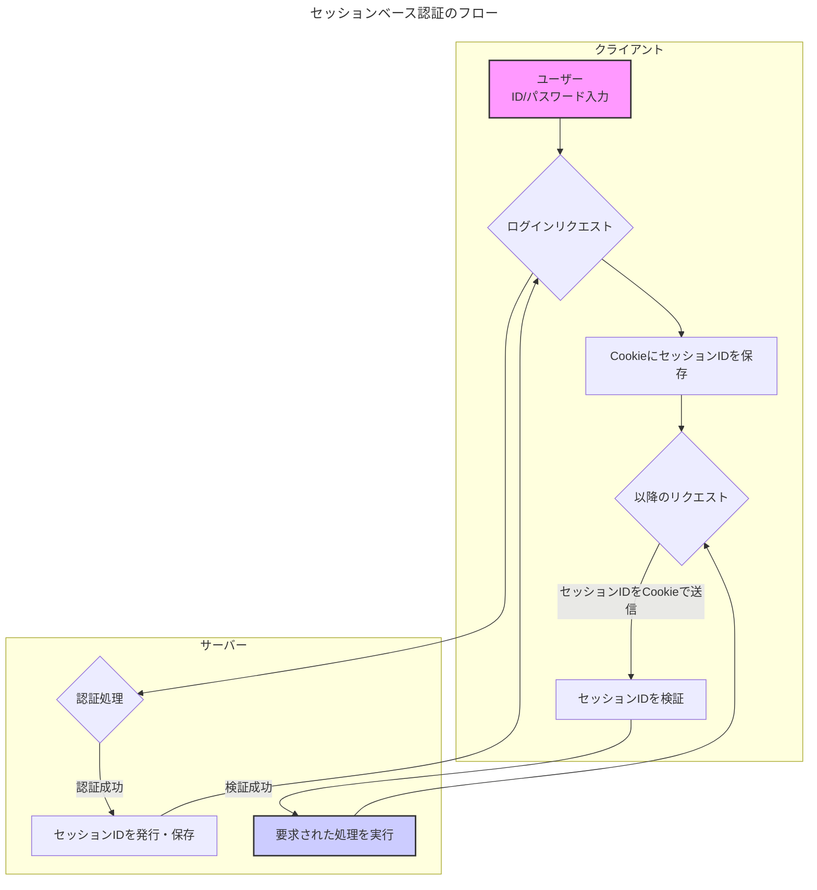
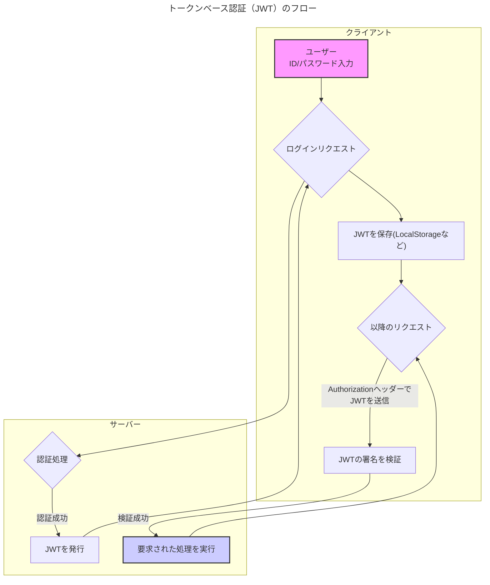
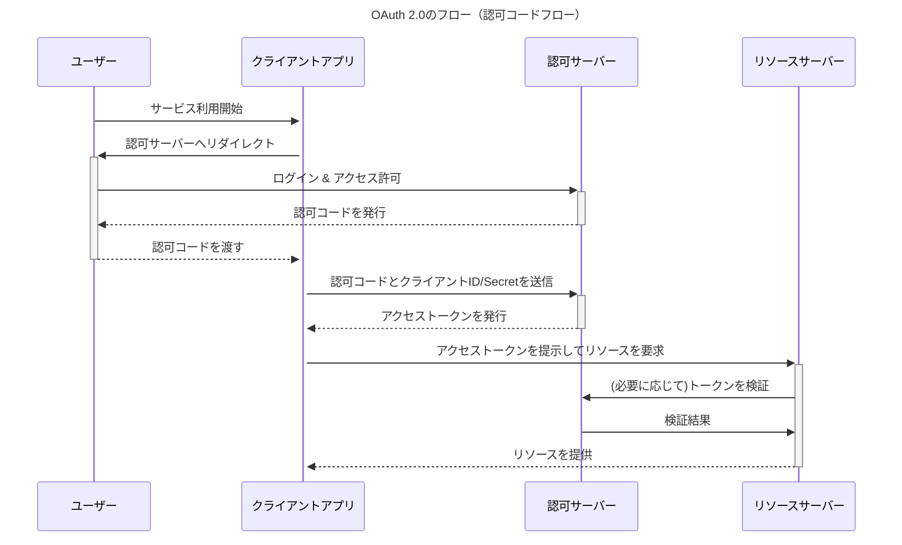

# 各種認証方法の解説と比較

WebアプリケーションやAPIにおけるユーザー認証は、セキュリティの根幹をなす非常に重要な要素です。ここでは、代表的な認証方法である「セッションベース認証」「トークンベース認証（JWT）」「OAuth 2.0」について、それぞれの仕組み、特徴、実装コストを解説します。

## 1. セッションベース認証

### 特徴
- **ステートフル**: サーバー側でユーザーのログイン状態（セッション情報）を保持する必要があります。
- **Cookieベース**: 主にCookieを利用してセッションIDをクライアントとサーバー間でやり取りします。
- **実装が比較的容易**: 多くのWebフレームワークで標準的にサポートされており、古くから使われている実績のある方式です。
- **サーバー負荷**: ユーザー数が増えると、サーバー側で保持するセッション情報が増大し、負荷やメモリ使用量が増加する可能性があります。
- **拡張性**: サーバーが状態を持つため、複数サーバーへのスケールアウトが少し複雑になります（セッションストアの共有などが必要）。

### 実装コスト
- **低**: 多くのフレームワークに組み込まれているため、比較的簡単に実装できます。

### 仕組み（フロー図）

## 2. トークンベース認証 (JWT)

### 特徴
- **ステートレス**: サーバー側でユーザーの状態を保持する必要がありません。トークン自体に必要な情報が含まれており、自己完結しています。
- **拡張性が高い**: サーバーがステートレスなため、複数サーバーへのスケールアウトが容易です。
- **多様なクライアントに対応**: Webブラウザだけでなく、モバイルアプリやデスクトップアプリなど、様々なクライアントで利用しやすいです。
- **セキュリティ**: トークンには署名が付与されており、改ざんを検知できます。HTTPSでの通信が前提です。
- **トークンの無効化が困難**: 一度発行したトークンは有効期限が切れるまで基本的に有効です。強制的に無効化するには、ブラックリストなどの仕組みが別途必要になります。

### 実装コスト
- **中**: ライブラリを利用すれば実装は難しくありませんが、トークンの管理（保存場所、有効期限、リフレッシュトークンなど）を適切に設計する必要があります。

### 仕組み（フロー図）

`JWT` は `JSON Web Token` の略です。

## 3. OAuth 2.0

### 特徴
- **委任（Delegation）**: ユーザーが自身の認証情報（ID/パスワード）を直接クライアントアプリに渡すことなく、特定のリソースへのアクセス権限を委任するためのフレームワークです。
- **「認証」ではなく「認可」**: OAuth 2.0自体はユーザーを認証するプロトコルではなく、リソースへのアクセスを許可（認可）するためのものです。（認証には `OpenID Connect` などが組み合わせて使われます）
- **サードパーティ連携**: 「Googleアカウントでログイン」のように、外部サービスの認証機能を利用して自社サービスにログインさせる仕組みを安全に構築できます。
- **複雑性**: フローが複数あり（Authorization Code, Implicitなど）、他の方式に比べて仕組みが複雑です。

### 実装コスト
- **高**: プロトコルの理解が必要であり、実装は他の方式より複雑になります。しかし、多くの言語でライブラリが提供されているため、それらを利用することでコストを削減できます。

### 仕組み（フロー図 - Authorization Code Flow）

これは最も一般的で安全なフローです。

## まとめ：各方式の比較

| 項目 | セッションベース認証 | トークンベース認証 (JWT) | OAuth 2.0 |
| :--- | :--- | :--- | :--- |
| **状態管理** | ステートフル（サーバーで状態保持） | ステートレス（サーバーで状態不要） | ステートレス（トークンを利用） |
| **主な用途** | 従来のWebアプリケーション | SPA, API, モバイルアプリ | サードパーティ連携、APIのアクセス制御 |
| **拡張性** | △（セッション共有が必要） | ◎（ステートレスで容易） | ◎（ステートレスで容易） |
| **実装コスト** | **低** | **中** | **高** |
| **セキュリティ** | CSRF対策が必要 | HTTPS必須、トークン漏洩に注意 | プロトコルが複雑だが安全な仕組みを提供 |

どの認証方法を選択するかは、アプリケーションの要件、規模、将来の拡張性などを考慮して決定することが重要です。
