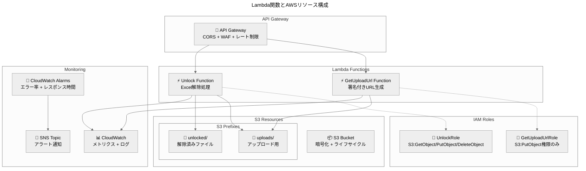
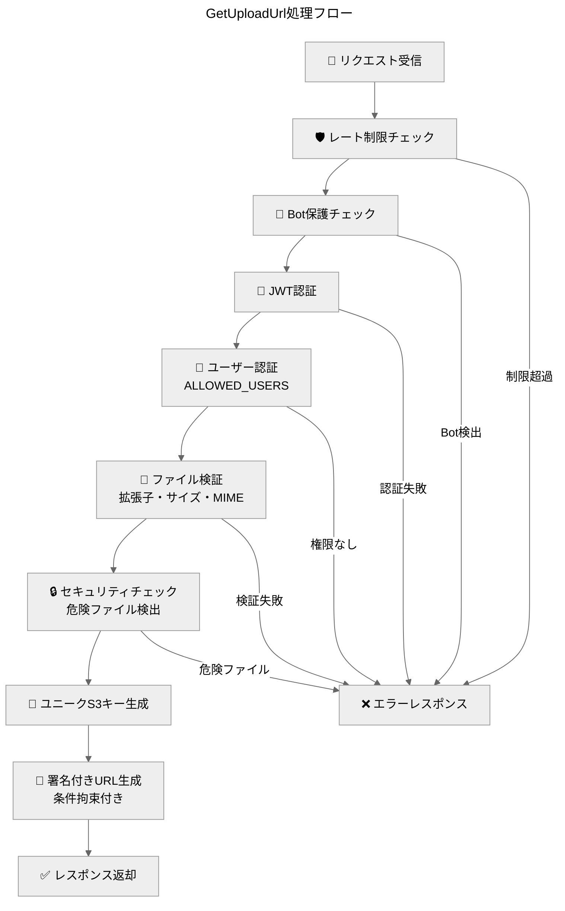
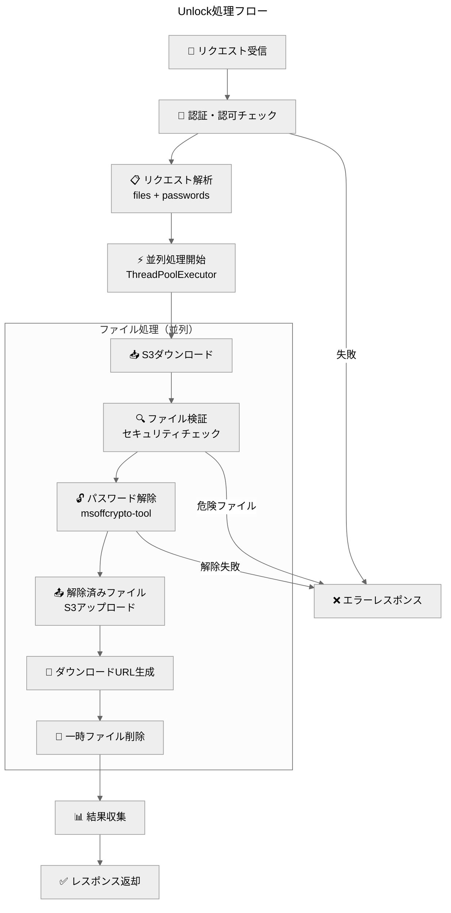
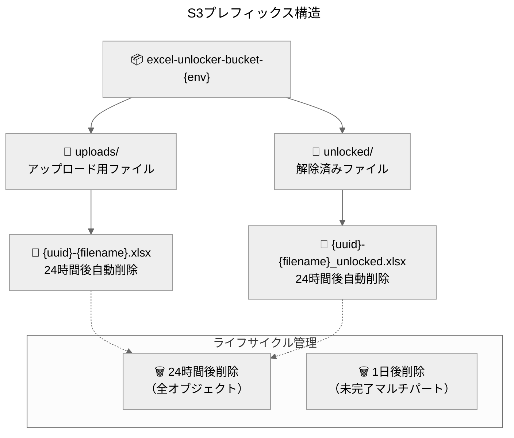
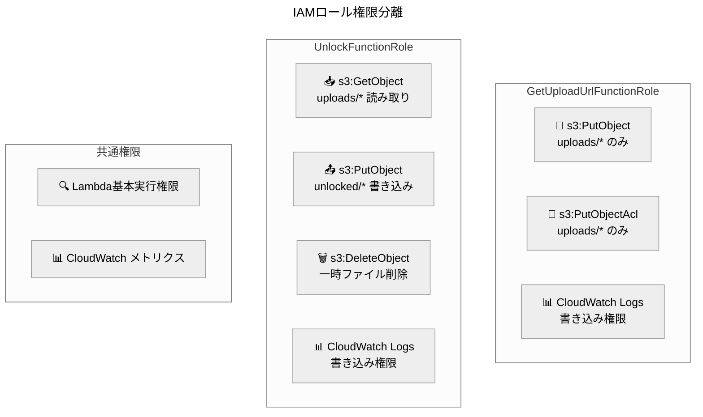
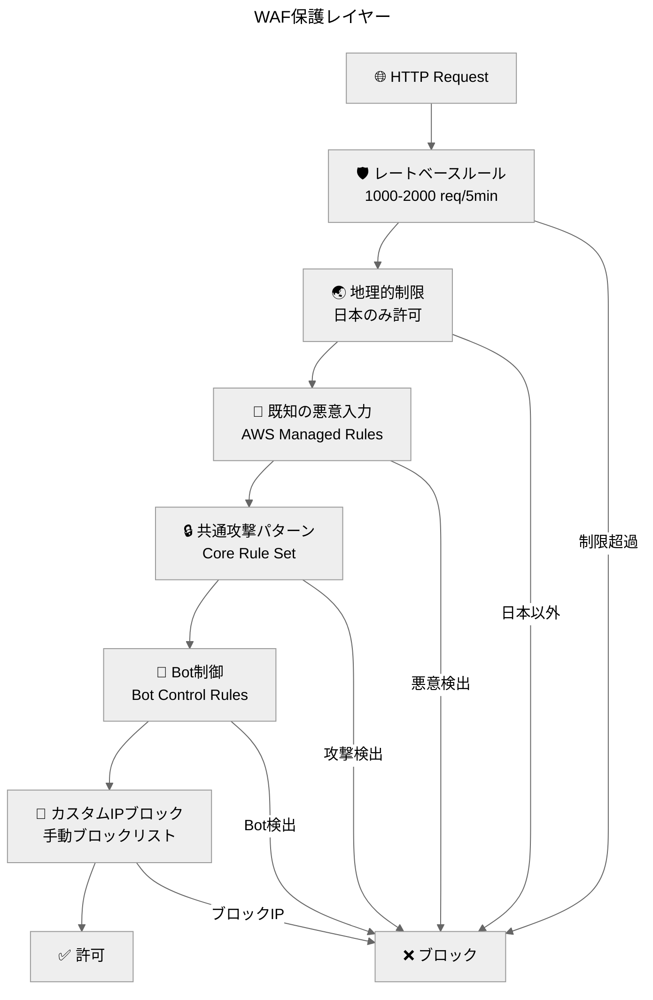

> **AI生成物の注意書き**：内容の最終確認が必要です。数値・日付は原典と照合してください。

**結論**：2つのLambda関数による責務分離とセキュリティ強化されたAWSリソース構成で高可用性を実現  
**対象**：バックエンド開発者、インフラ担当者、セキュリティ担当者  
**所要時間**：20分  
**次の一手**：1) Lambda関数の責務理解 → 2) AWSリソース設定確認 → 3) セキュリティ設定検証  
**根拠**：・責務分離による保守性向上／・IAMロール最小権限の原則／・S3署名付きURLによる安全なファイル転送

## Lambda関数アーキテクチャ

バックエンドは2つの専用Lambda関数で構成され、それぞれが明確な責務を持ちます。この設計により、セキュリティ境界の明確化、独立したスケーリング、効率的な監視を実現しています。

### Lambda関数構成図



## Lambda関数詳細

### 1. GetUploadUrl Function

**責務**: S3アップロード用署名付きURLの安全な生成

#### 基本仕様
- **関数名**: `excel-get-upload-url-function-{Environment}`
- **ランタイム**: Python 3.9
- **メモリ**: 256MB
- **タイムアウト**: 30秒
- **ハンドラー**: `get_upload_url.lambda_handler`

#### 処理フロー



#### セキュリティ機能
- **事前ファイル検証**: 拡張子（.xlsx/.xls）、サイズ（20MB以下）、MIMEタイプ
- **危険ファイル検出**: マクロ付きファイル（.xlsm）、実行可能ファイルの拒否
- **条件拘束付きURL**: Content-Type固定、サイズ制限、暗号化強制
- **短期間有効期限**: 60秒（統一仕様）

#### 実装例
```python
# 条件拘束付き署名付きURL生成
upload_data = generate_constrained_upload_url(
    bucket=bucket_name, 
    key=file_key,
    content_type='application/vnd.openxmlformats-officedocument.spreadsheetml.sheet',
    max_size=20 * 1024 * 1024  # 20MB
)

# 厳格な条件設定
conditions = [
    {'Content-Type': content_type},
    ['content-length-range', 100, max_size],
    {'x-amz-server-side-encryption': 'AES256'},
    ['starts-with', '$key', 'uploads/']
]
```

### 2. Unlock Function

**責務**: Excel解除処理とファイル管理

#### 基本仕様
- **関数名**: `excel-unlock-function-{Environment}`
- **ランタイム**: Python 3.9
- **メモリ**: 1024MB（並列処理対応）
- **タイムアウト**: 900秒（15分）
- **ハンドラー**: `unlock.lambda_handler`

#### 処理フロー



#### Excel処理エンジン
- **ライブラリ**: msoffcrypto-tool + openpyxl
- **対応形式**: .xlsx（Office Open XML）、.xls（Excel Binary）
- **暗号化検出**: 自動判定（暗号化なしファイルも処理可能）
- **並列処理**: 最大5ファイル同時処理

#### パフォーマンス最適化
```python
# ThreadPoolExecutorによる並列処理
executor = ThreadPoolExecutor(max_workers=min(5, os.cpu_count() or 1))

# 遅延インポートによるコールドスタート対策
def _get_msoffcrypto():
    global _msoffcrypto
    if _msoffcrypto is None:
        import msoffcrypto
        _msoffcrypto = msoffcrypto
    return _msoffcrypto
```

## AWSリソース構成

### S3バケット設計

#### バケット仕様
- **命名規則**: `excel-unlocker-bucket-{Environment}-{AccountId}-{Region}`
- **暗号化**: AES-256（サーバーサイド暗号化）
- **バージョニング**: 無効（一時ファイルのため）
- **パブリックアクセス**: 完全ブロック

#### プレフィックス運用ポリシー



#### セキュリティ設定
```yaml
# S3バケットポリシー（抜粋）
Statement:
  - Sid: AllowLambdaAccess
    Effect: Allow
    Principal:
      AWS: 
        - !GetAtt GetUploadUrlFunctionRole.Arn
        - !GetAtt UnlockFunctionRole.Arn
    Action: [s3:GetObject, s3:PutObject, s3:DeleteObject]
    
  - Sid: DenyPublicAccess
    Effect: Deny
    Principal: "*"
    Action: "s3:*"
    Condition:
      Bool:
        "aws:SecureTransport": "false"
```

### IAMロール設計

#### 最小権限の原則



#### 信頼関係ポリシー
```json
{
  "Version": "2012-10-17",
  "Statement": [
    {
      "Effect": "Allow",
      "Principal": {
        "Service": "lambda.amazonaws.com"
      },
      "Action": "sts:AssumeRole"
    }
  ]
}
```

### API Gateway設定

#### CORS設定（厳格化）
```yaml
Cors:
  AllowMethods: "'GET,POST,OPTIONS'"
  AllowHeaders: "'Content-Type,X-Amz-Date,Authorization,X-Api-Key,X-Amz-Security-Token'"
  AllowOrigin: !Sub "'${AllowedOrigin}'"  # 単一オリジン
  AllowCredentials: "'true'"
```

#### レート制限設定
```yaml
MethodSettings:
  - ResourcePath: "/*"
    HttpMethod: "*"
    ThrottlingBurstLimit: !If [IsProduction, 100, 200]
    ThrottlingRateLimit: !If [IsProduction, 50, 100]
```

### WAF v2設定

#### セキュリティルール



## 監視・アラート設定

### CloudWatchメトリクス

#### Lambda関数メトリクス
- **実行回数**: 関数呼び出し数の監視
- **エラー率**: 5分間で5回以上のエラーでアラート
- **実行時間**: 平均10秒以上でアラート
- **メモリ使用量**: リソース最適化のための監視

#### S3メトリクス
- **ストレージ使用量**: バケットサイズの監視
- **リクエスト数**: GET/PUT操作の監視
- **エラー率**: 4xx/5xxエラーの監視

### CloudWatchダッシュボード

```json
{
  "widgets": [
    {
      "type": "metric",
      "properties": {
        "metrics": [
          ["AWS/Lambda", "Invocations", "FunctionName", "excel-unlock-function"],
          [".", "Errors", ".", "."],
          [".", "Duration", ".", "."]
        ],
        "title": "Lambda Metrics - Unlock Function"
      }
    }
  ]
}
```

### SNSアラート設定
- **高エラー率アラーム**: 5分間で5回以上のエラー
- **高レスポンス時間アラーム**: 平均10秒以上の処理時間
- **WAFブロックアラーム**: 5分間で50回以上のブロック
- **Bot攻撃アラーム**: 5分間で10回以上のBot検知

## 環境別設定

### Development環境
```yaml
Parameters:
  Environment: development
  AllowedUsers: "hironomac2025@gmail.com"
  AllowedOrigin: "https://localhost:3000"
  EnableBotProtection: false
```

### Staging環境
```yaml
Parameters:
  Environment: staging
  AllowedUsers: "hironomac2025@gmail.com,staging-user@example.com"
  AllowedOrigin: "https://excel-unlocker-staging.vercel.app"
  EnableBotProtection: true
```

### Production環境
```yaml
Parameters:
  Environment: production
  AllowedUsers: "hironomac2025@gmail.com,user2@nsc.co.jp,user3@nsc.co.jp"
  AllowedOrigin: "https://excel-unlocker.vercel.app"
  EnableBotProtection: true
```

## デプロイメント

### SAMテンプレート構造
```yaml
AWSTemplateFormatVersion: '2010-09-09'
Transform: AWS::Serverless-2016-10-31

Globals:
  Function:
    Runtime: python3.9
    MemorySize: 256
    Timeout: 30
    Architectures: [x86_64]

Resources:
  # Lambda Functions
  GetUploadUrlFunction: # 署名付きURL生成
  UnlockFunction:       # Excel解除処理
  
  # S3 Resources
  ExcelBucket:          # ファイルストレージ
  ExcelBucketPolicy:    # セキュリティポリシー
  
  # IAM Roles
  GetUploadUrlFunctionRole: # 最小権限
  UnlockFunctionRole:       # 最小権限
  
  # Monitoring
  HighErrorRateAlarm:   # エラー監視
  HighLatencyAlarm:     # レスポンス時間監視
  MonitoringDashboard:  # 統合ダッシュボード
```

### デプロイコマンド
```bash
# ビルド
sam build --use-container

# 環境別デプロイ
sam deploy --config-env development  # 開発環境
sam deploy --config-env staging      # ステージング環境
sam deploy --config-env production   # 本番環境
```

## 依存関係管理

### Python依存関係
```txt
# backend/src/requirements.txt
msoffcrypto-tool    # Excel暗号化解除
boto3              # AWS SDK
openpyxl           # Excel操作
PyJWT[crypto]      # JWT検証
cryptography       # 暗号化処理
requests           # HTTP通信

# テスト用
pytest
pytest-cov
moto[s3]
```

### レイヤー構成
- **共通ライブラリ**: boto3, requests（AWS Lambda標準）
- **Excel処理**: msoffcrypto-tool, openpyxl（カスタムレイヤー）
- **暗号化**: PyJWT, cryptography（セキュリティレイヤー）

## 結論

バックエンドサービスは、責務分離された2つのLambda関数、セキュリティ強化されたS3バケット、最小権限のIAMロール、包括的な監視システムにより、高いセキュリティ、可用性、保守性を実現しています。WAF v2による多層防御、CloudWatchによる詳細な監視、環境別の適切な設定により、企業レベルの要件を満たすバックエンドインフラを提供します。