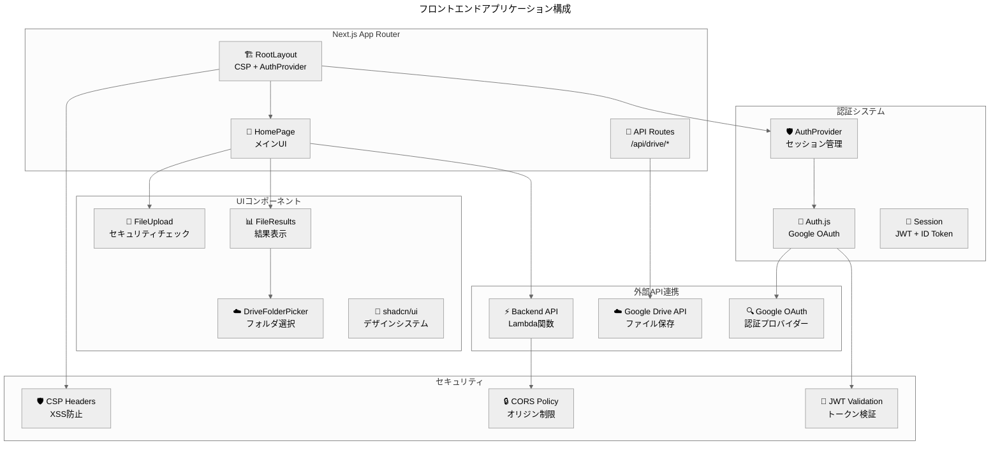
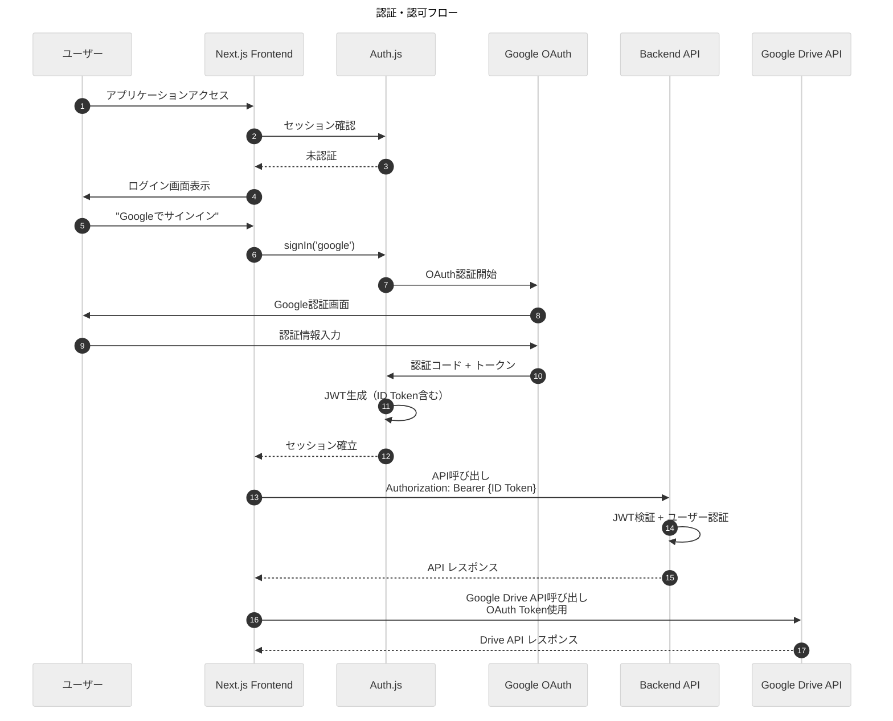
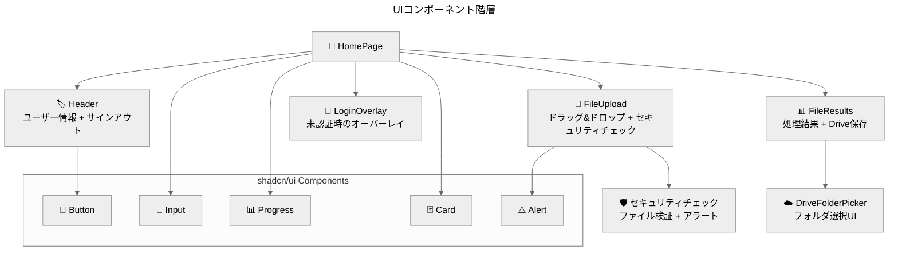
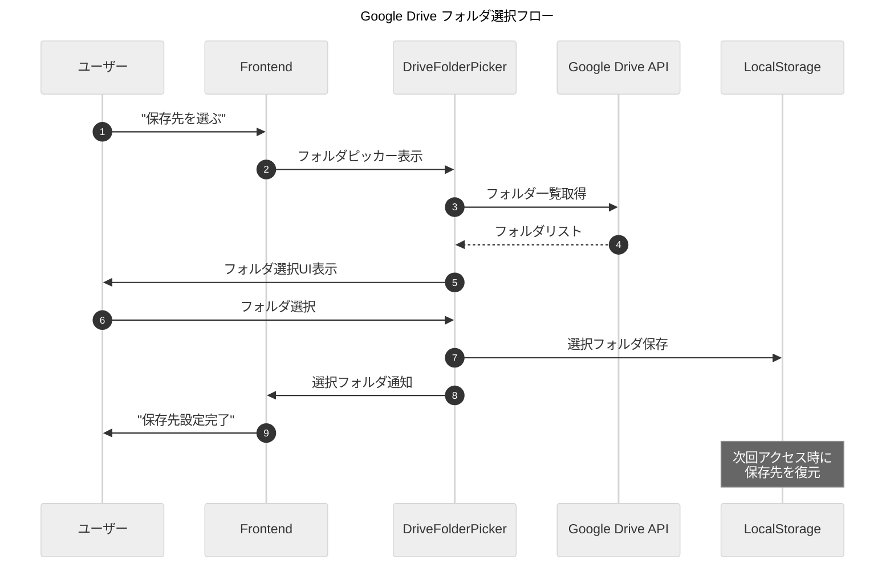

> **AI生成物の注意書き**：内容の最終確認が必要です。数値・日付は原典と照合してください。

**結論**：Next.js 15.4 + App Router + Auth.js による現代的なフロントエンドアーキテクチャで優れたUXを実現  
**対象**：フロントエンド開発者、UI/UX担当者、認証システム担当者  
**所要時間**：25分  
**次の一手**：1) App Router構成理解 → 2) 認証フロー確認 → 3) Google Drive連携実装  
**根拠**：・App Routerによる最新のNext.js機能活用／・Auth.jsによる堅牢な認証／・shadcn/uiによる一貫したデザインシステム

## フロントエンドアーキテクチャ概要

Secure Excel Unlock のフロントエンドは、Next.js 15.4 の App Router を基盤とした現代的な React アプリケーションです。TypeScript による型安全性、Tailwind CSS + shadcn/ui による一貫したデザインシステム、Auth.js による堅牢な認証システムを特徴としています。

### アプリケーション構成図



## App Router 構成

### ディレクトリ構造

```
frontend/src/
├── app/                    # App Router（Next.js 13+）
│   ├── layout.tsx         # ルートレイアウト（CSP + AuthProvider）
│   ├── page.tsx           # ホームページ（メインUI）
│   ├── globals.css        # グローバルスタイル
│   └── api/               # API Routes
│       └── drive/         # Google Drive API プロキシ
│           └── upload/    # ファイルアップロード
├── components/            # UIコンポーネント
│   ├── ui/               # shadcn/ui基本コンポーネント
│   ├── FileUpload.tsx    # ファイルアップロード
│   ├── FileResults.tsx   # 結果表示
│   ├── DriveFolderPicker.tsx # フォルダ選択
│   └── AuthProvider.tsx  # 認証プロバイダー
├── lib/                  # ユーティリティ
│   ├── api.ts           # バックエンドAPI呼び出し
│   ├── auth.ts          # Auth.js設定
│   ├── utils.ts         # shadcn/ui ユーティリティ
│   └── fileSecurity.ts  # ファイルセキュリティ
└── types/               # TypeScript型定義
    └── process-result.ts # 処理結果型
```

### ルートレイアウト設計

```typescript
// app/layout.tsx
export default async function RootLayout({
  children,
}: {
  children: React.ReactNode;
}) {
  const nonce = await getNonce();

  return (
    <html lang="ja">
      <head>
        {/* CSP meta tag for additional security */}
        <meta
          httpEquiv="Content-Security-Policy"
          content={`
            default-src 'self'; 
            script-src 'self' ${nonce ? `'nonce-${nonce}'` : "'unsafe-inline'"} 'strict-dynamic'; 
            style-src 'self' 'unsafe-inline'; 
            connect-src 'self' https://*.execute-api.ap-northeast-1.amazonaws.com https://accounts.google.com https://www.googleapis.com;
          `}
        />
      </head>
      <body className={inter.className}>
        <AuthProvider nonce={nonce}>{children}</AuthProvider>
      </body>
    </html>
  );
}
```

### 主要ページコンポーネント

#### ホームページ（page.tsx）
- **責務**: メインUIの提供、ファイル処理フローの管理
- **状態管理**: ファイル選択、処理進捗、結果表示
- **認証統合**: セッション状態に基づくUI制御

```typescript
// 処理状態の管理
const [processingStatus, setProcessingStatus] = useState<
  'idle' | 'uploading' | 'processing' | 'done'
>('idle');

// 認証状態に基づくUI制御
const isAuthenticated = status === 'authenticated';
{!isAuthenticated && status !== 'loading' && <LoginOverlay />}
```

## 認証システム

### Auth.js 設定

#### OAuth プロバイダー設定
```typescript
// lib/auth.ts
export const authOptions: NextAuthOptions = {
  providers: [
    GoogleProvider({
      clientId: process.env.GOOGLE_CLIENT_ID!,
      clientSecret: process.env.GOOGLE_CLIENT_SECRET!,
      authorization: {
        params: {
          scope: [
            "openid",
            "email", 
            "profile",
            "https://www.googleapis.com/auth/drive.file" // ファイル作成・編集のみ
          ].join(" "),
          access_type: "offline",
          prompt: "consent",
        },
      },
    }),
  ],
  session: { strategy: "jwt" },
  // JWT コールバック、セッション管理...
};
```

### 認証フロー



### JWT 認証実装

#### フロントエンド側
```typescript
// lib/api.ts
async function apiCall(endpoint: string, options: RequestInit = {}) {
  const session = await getSession();
  
  // ID Token を抽出
  const idToken = extractIdToken(session);
  if (!idToken) {
    throw new Error('認証トークンが見つかりません。再ログインしてください。');
  }
  
  // Authorization Bearer ヘッダーを設定
  const headers = {
    'Content-Type': 'application/json',
    'Authorization': `Bearer ${idToken}`,
    ...options.headers,
  };
  
  return fetch(`${API_BASE_URL}${endpoint}`, {
    ...options,
    headers,
  });
}
```

#### セッション管理
```typescript
// JWT コールバックでトークン管理
async jwt({ token, account }): Promise<JWT> {
  if (account?.access_token) {
    return {
      ...token,
      serverAccessToken: account.access_token,
      refreshToken: account.refresh_token,
      idToken: account.id_token, // バックエンド認証用
    };
  }
  
  // トークンリフレッシュロジック...
  return token;
}
```

## UIコンポーネント設計

### コンポーネント階層



### FileUpload コンポーネント

**責務**: ファイル選択とセキュリティチェック

```typescript
const FileUpload: React.FC<FileUploadProps> = ({ 
  onFilesAdded, 
  onSecurityCheckFailed 
}) => {
  // セキュリティチェック統合
  const processFiles = (files: File[]) => {
    const securityCheck = batchFileSecurityCheck(files);
    
    // 安全なファイルのみを親に渡す
    const safeFiles = securityCheck.results
      .filter(({ check }) => check.safe)
      .map(({ file }) => file);
    
    if (safeFiles.length > 0) {
      onFilesAdded(safeFiles);
    }
  };
  
  // ドラッグ&ドロップ + ファイル選択
  return (
    <div onDragOver={handleDragOver} onDrop={handleDrop}>
      {/* セキュリティアラート表示 */}
      {/* ファイル選択UI */}
    </div>
  );
};
```

### FileResults コンポーネント

**責務**: 処理結果表示とGoogle Drive保存

```typescript
export function FileResults({ results }: { results: ProcessResult[] }) {
  // Google Drive保存機能
  const handleSave = async (file: ProcessResult) => {
    const formData = new FormData();
    formData.append("file", blob);
    formData.append("filename", file.fileName);
    if (folder?.id) {
      formData.append("parentId", folder.id);
    }

    // サーバー経由でGoogle Driveにアップロード
    const response = await fetch("/api/drive/upload", {
      method: "POST",
      body: formData,
    });
  };
  
  return (
    <>
      {/* Drive保存先選択UI */}
      {/* 処理結果一覧 */}
      <DriveFolderPicker onPick={applyFolder} />
    </>
  );
}
```

## Google Drive API 連携

### API Routes 設計

#### ファイルアップロード（/api/drive/upload）
```typescript
// app/api/drive/upload/route.ts
export async function POST(request: Request) {
  const session = await getServerSession(authOptions);
  if (!session?.user?.email) {
    return NextResponse.json({ error: 'Unauthorized' }, { status: 401 });
  }

  const formData = await request.formData();
  const file = formData.get('file') as File;
  const filename = formData.get('filename') as string;
  const parentId = formData.get('parentId') as string;

  // Google Drive API呼び出し
  const drive = google.drive({ version: 'v3', auth: oauth2Client });
  
  const response = await drive.files.create({
    requestBody: {
      name: filename,
      parents: parentId ? [parentId] : undefined,
    },
    media: {
      mimeType: file.type,
      body: Readable.from(Buffer.from(await file.arrayBuffer())),
    },
  });

  return NextResponse.json({ fileId: response.data.id });
}
```

### Drive フォルダピッカー



## セキュリティ機能

### Content Security Policy (CSP)

```typescript
// CSP設定（layout.tsx）
const cspContent = `
  default-src 'self'; 
  script-src 'self' ${nonce ? `'nonce-${nonce}'` : "'unsafe-inline'"} 'strict-dynamic'; 
  style-src 'self' 'unsafe-inline'; 
  img-src 'self' data: https:; 
  font-src 'self' https://fonts.gstatic.com; 
  connect-src 'self' https://*.execute-api.ap-northeast-1.amazonaws.com https://accounts.google.com https://www.googleapis.com; 
  frame-src 'self' https://accounts.google.com; 
  object-src 'none'; 
  base-uri 'self'; 
  form-action 'self'; 
  frame-ancestors 'none';
`;
```

### ファイルセキュリティチェック

```typescript
// lib/fileSecurity.ts
export function batchFileSecurityCheck(files: File[]) {
  return {
    results: files.map(file => ({
      file,
      check: {
        safe: validateFileExtension(file) && validateFileSize(file),
        failedChecks: getFailedChecks(file),
      }
    }))
  };
}

// 危険ファイル検出
const DANGEROUS_EXTENSIONS = ['.xlsm', '.exe', '.bat', '.cmd'];
const validateFileExtension = (file: File) => {
  const ext = getFileExtension(file.name);
  return !DANGEROUS_EXTENSIONS.includes(ext);
};
```

## 状態管理

### ローカル状態管理

```typescript
// ホームページの状態管理
const [selectedFiles, setSelectedFiles] = useState<File[]>([]);
const [processingStatus, setProcessingStatus] = useState<
  'idle' | 'uploading' | 'processing' | 'done'
>('idle');
const [uploadProgress, setUploadProgress] = useState<UploadProgress>({});
const [results, setResults] = useState<ProcessResult[]>([]);
```

### セッション状態管理

```typescript
// Auth.js セッション管理
const { data: session, status } = useSession();

// 認証状態に基づくUI制御
const isAuthenticated = status === 'authenticated';
if (!isAuthenticated && status !== 'loading') {
  return <LoginOverlay />;
}
```

## パフォーマンス最適化

### コード分割
- **動的インポート**: 大きなコンポーネントの遅延読み込み
- **API Routes**: サーバーサイド処理の分離
- **shadcn/ui**: 必要なコンポーネントのみインポート

### 画像・アセット最適化
- **Next.js Image**: 自動最適化とレスポンシブ対応
- **フォント最適化**: Google Fonts の最適化読み込み
- **アイコン**: Lucide React による軽量アイコン

### キャッシュ戦略
- **LocalStorage**: Drive フォルダ選択の永続化
- **セッションキャッシュ**: 認証状態の効率的管理
- **API レスポンス**: 適切なキャッシュヘッダー設定

## テスト戦略

### ユニットテスト（Jest + RTL）
```typescript
// __tests__/components/FileUpload.test.tsx
describe('FileUpload', () => {
  it('should accept valid Excel files', () => {
    const mockOnFilesAdded = jest.fn();
    render(<FileUpload onFilesAdded={mockOnFilesAdded} />);
    
    const file = new File(['content'], 'test.xlsx', {
      type: 'application/vnd.openxmlformats-officedocument.spreadsheetml.sheet'
    });
    
    // ファイルドロップのシミュレーション
    fireEvent.drop(screen.getByText(/ドラッグ/), {
      dataTransfer: { files: [file] }
    });
    
    expect(mockOnFilesAdded).toHaveBeenCalledWith([file]);
  });
});
```

### E2Eテスト（Playwright）
```typescript
// e2e/auth-flow.spec.ts
test('should complete authentication flow', async ({ page }) => {
  await page.goto('/');
  
  // ログイン画面の確認
  await expect(page.getByText('Googleでサインイン')).toBeVisible();
  
  // 認証フローのテスト（モック環境）
  await page.click('text=Googleでサインイン');
  
  // 認証後のUI確認
  await expect(page.getByText('Excel パスワード解除')).toBeVisible();
});
```

## 環境設定

### 環境変数
```bash
# .env.local
NEXTAUTH_URL=https://localhost:3000
NEXTAUTH_SECRET=your-secret-key
GOOGLE_CLIENT_ID=your-google-client-id
GOOGLE_CLIENT_SECRET=your-google-client-secret
NEXT_PUBLIC_API_URL=https://your-api-gateway-url
NEXT_PUBLIC_USE_MOCK_API=false
```

### Vercel デプロイ設定
```json
{
  "buildCommand": "npm run build",
  "outputDirectory": ".next",
  "installCommand": "npm install",
  "framework": "nextjs",
  "nodeVersion": "18.x"
}
```

## 結論

フロントエンドアプリケーションは、Next.js 15.4 の App Router、Auth.js による堅牢な認証、shadcn/ui による一貫したデザインシステムを基盤として、優れたユーザーエクスペリエンスとセキュリティを両立しています。TypeScript による型安全性、包括的なテスト戦略、効率的な状態管理により、保守性と拡張性の高いフロントエンドアーキテクチャを実現しています。