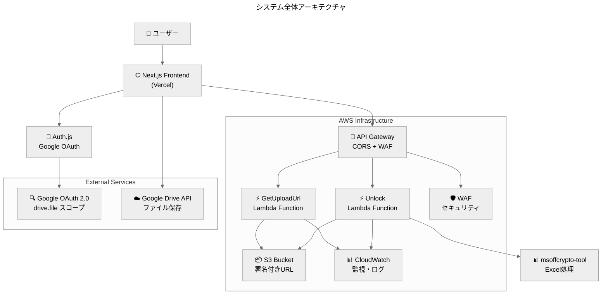
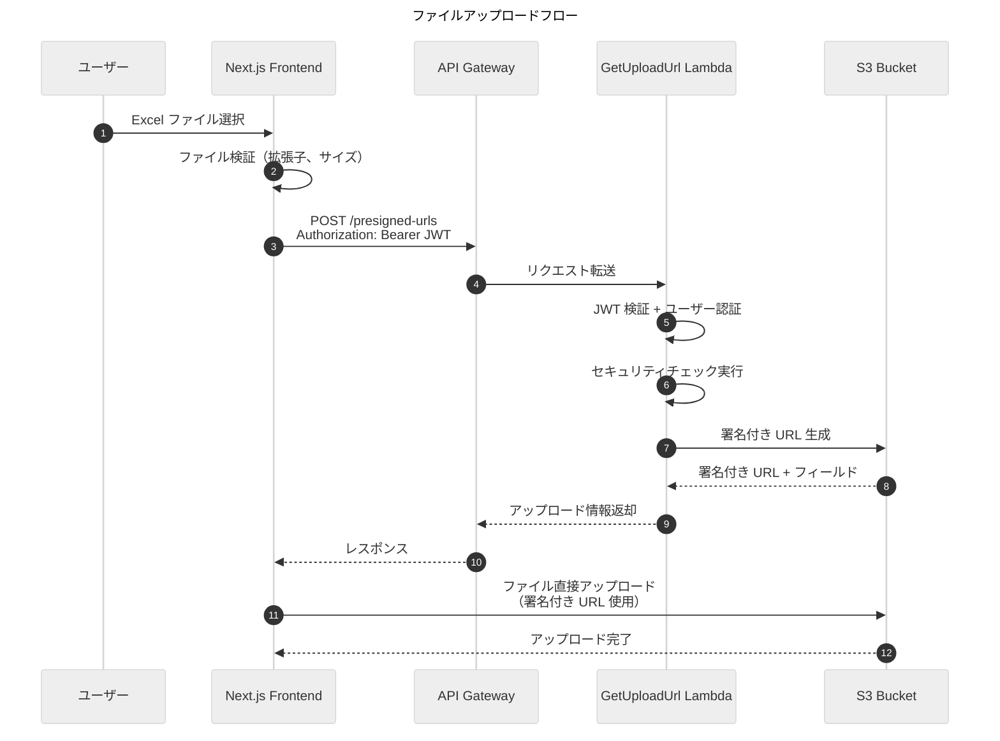
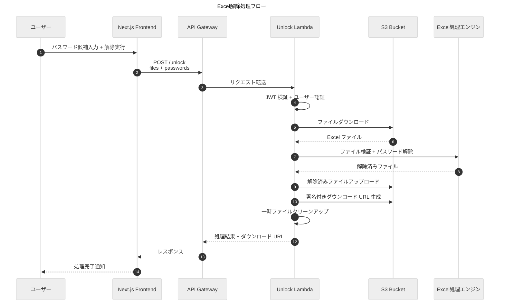
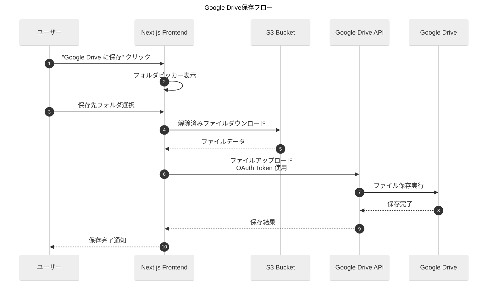
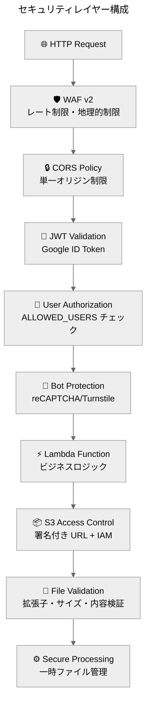

【出力】アーキテクチャ.システム設計_全体構成とデータフロー

```yaml
---
layout: default
title: 全体構成とデータフロー
description: Secure Excel Unlockシステムの技術スタック、アーキテクチャ、データフローの包括的説明
author: Hiroaki Endo
permalink: architecture-solution-overview
date: 2025-01-29
last_modified_at: 2025-01-29
published: false
Tags:
  - architecture
  - system_design
  - data_flow
  - technology_stack
  - aws_lambda
  - nextjs
---
```

> **AI生成物の注意書き**：内容の最終確認が必要です。数値・日付は原典と照合してください。

**結論**：Next.js + AWS Lambda + S3 + Google OAuth による高セキュリティなサーバーレス Excel 処理システム  
**対象**：開発者、システム設計者、運用担当者  
**所要時間**：15分  
**次の一手**：1) 技術スタック確認 → 2) データフロー理解 → 3) 環境別構成把握  
**根拠**：・サーバーレスによる運用コスト削減／・Google OAuth による強固な認証／・S3 署名付き URL による安全なファイル転送

## システム全体構成

Secure Excel Unlock は、パスワード保護された Excel ファイルを安全に解除するためのサーバーレス Web アプリケーションです。フロントエンドとバックエンドを分離したモダンなアーキテクチャを採用し、高いセキュリティと可用性を実現しています。

### アーキテクチャ概要図



### 技術スタック

#### フロントエンド
- **フレームワーク**: Next.js 15.4 with React 19
- **言語**: TypeScript
- **スタイリング**: Tailwind CSS + shadcn/ui components
- **認証**: Auth.js（旧 NextAuth.js）with Google OAuth
- **HTTP クライアント**: Axios
- **テスト**: Jest + React Testing Library, Playwright for E2E
- **ビルドツール**: Turbopack（Next.js built-in）
- **デプロイ**: Vercel

#### バックエンド
- **ランタイム**: Python 3.9 on AWS Lambda
- **フレームワーク**: AWS SAM（Serverless Application Model）
- **ストレージ**: AWS S3 with CORS configuration
- **Excel 処理**: msoffcrypto-tool, openpyxl
- **AWS SDK**: boto3
- **認証**: JWT 検証 + 環境変数ベースのユーザー許可リスト
- **テスト**: pytest with moto for AWS mocking

#### インフラストラクチャ
- **デプロイ**: AWS SAM CLI
- **リージョン**: ap-northeast-1（Tokyo）
- **API**: AWS API Gateway with Lambda integration
- **セキュリティ**: WAF v2 + CloudWatch monitoring
- **CI/CD**: GitHub Actions with OIDC

## データフロー

### 1. ファイルアップロードフロー



### 2. Excel 解除処理フロー



### 3. Google Drive 保存フロー



## 環境別構成

### Development 環境
- **フロントエンド**: `https://localhost:3000`
- **バックエンド**: SAM Local（`http://localhost:3001`）
- **認証**: 開発用 Google OAuth クライアント
- **ストレージ**: ローカル S3 エミュレーション（moto）
- **ユーザー制限**: 緩和（開発者全員アクセス可能）

### Staging 環境
- **フロントエンド**: `https://excel-unlocker-staging.vercel.app`
- **バックエンド**: AWS Lambda（`excel-unlocker-api-staging`）
- **認証**: ステージング用 Google OAuth クライアント
- **ストレージ**: AWS S3（`excel-unlocker-bucket-staging-*`）
- **ユーザー制限**: 限定的（テストユーザーのみ）

### Production 環境
- **フロントエンド**: `https://excel-unlocker.vercel.app`
- **バックエンド**: AWS Lambda（`excel-unlocker-api-prod`）
- **認証**: 本番用 Google OAuth クライアント
- **ストレージ**: AWS S3（`excel-unlocker-bucket-production-*`）
- **ユーザー制限**: 厳格（承認済みユーザーのみ）

## セキュリティアーキテクチャ

### 認証・認可レイヤー



### データ保護
- **転送時暗号化**: HTTPS/TLS 1.2+ 強制
- **保存時暗号化**: S3 AES-256 暗号化
- **アクセス制御**: IAM ロールベースの最小権限
- **ファイルライフサイクル**: 24時間後の自動削除
- **ログ保護**: CloudWatch Logs での機密情報マスキング

## パフォーマンス特性

### スケーラビリティ
- **フロントエンド**: Vercel Edge Network による世界規模配信
- **バックエンド**: AWS Lambda の自動スケーリング（同時実行数: 1000）
- **ストレージ**: S3 の無制限スケーラビリティ
- **API**: API Gateway の自動負荷分散

### レスポンス時間
- **ファイルアップロード**: 1-5秒（ファイルサイズ依存）
- **Excel 解除処理**: 5-30秒（ファイル複雑度・パスワード数依存）
- **Google Drive 保存**: 2-10秒（ファイルサイズ依存）
- **認証処理**: 1-2秒（Google OAuth レスポンス依存）

### リソース制限
- **ファイルサイズ**: 最大 20MB
- **同時処理**: Lambda 関数あたり最大 5 並列
- **処理時間**: 最大 15分（Lambda タイムアウト）
- **ストレージ**: S3 バケットあたり実質無制限

## 監視・運用

### CloudWatch メトリクス
- **Lambda 関数**: 実行回数、エラー率、実行時間、メモリ使用量
- **API Gateway**: リクエスト数、レスポンス時間、エラー率
- **S3**: ストレージ使用量、リクエスト数
- **WAF**: ブロック数、許可数、ルール別統計

### アラート設定
- **高エラー率**: 5分間で5回以上のエラー
- **高レスポンス時間**: 平均10秒以上の処理時間
- **WAF ブロック**: 5分間で50回以上のブロック
- **Bot 攻撃**: 5分間で10回以上の Bot 検知

## 依存関係

### 外部サービス依存
- **Google OAuth 2.0**: 認証プロバイダー
- **Google Drive API**: ファイル保存先
- **Vercel**: フロントエンドホスティング
- **AWS**: バックエンドインフラ

### ライブラリ依存
- **フロントエンド**: Next.js, React, Auth.js, Axios, Tailwind CSS
- **バックエンド**: boto3, msoffcrypto-tool, openpyxl, PyJWT, requests

### 開発・運用ツール依存
- **AWS SAM CLI**: バックエンドデプロイ
- **Vercel CLI**: フロントエンドデプロイ
- **GitHub Actions**: CI/CD パイプライン
- **Node.js 18+**: フロントエンド開発環境
- **Python 3.9+**: バックエンド開発環境

## 結論

Secure Excel Unlock は、モダンなサーバーレスアーキテクチャにより、高いセキュリティ、スケーラビリティ、運用効率を実現しています。Google OAuth による強固な認証、AWS Lambda による柔軟なスケーリング、S3 署名付き URL による安全なファイル転送を組み合わせることで、企業レベルのセキュリティ要件を満たしながら、優れたユーザーエクスペリエンスを提供します。