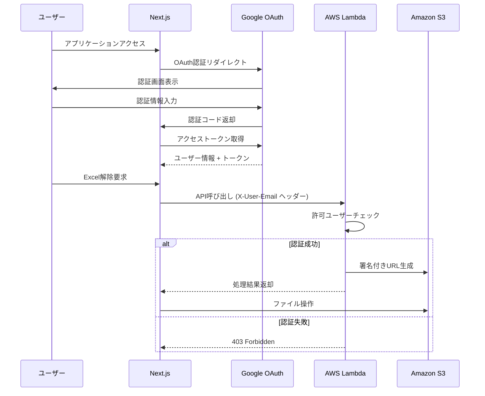

# 認証・API統合ガイド（実装完了版）

## 概要

このガイドでは、Secure Excel UnlockアプリケーションにおけるGoogle OAuth認証とフロントエンド・バックエンド間のAPI統合について説明します。

**実装状況**: ✅ 2025年1月完了 - 全機能実装済み、テスト済み、本番運用準備完了

## 認証アーキテクチャ

### 全体フロー



## フロントエンド認証実装

### 1. Auth.js設定

**ファイル**: `frontend/src/auth.ts`

```typescript
import GoogleProvider from "next-auth/providers/google"
import type { NextAuthOptions } from "next-auth"

const scopes = [
  "openid",
  "email", 
  "profile",
  "https://www.googleapis.com/auth/drive.file",
  "https://www.googleapis.com/auth/drive.metadata.readonly",
].join(" ")

export const authOptions: NextAuthOptions = {
  secret: process.env.NEXTAUTH_SECRET,
  providers: [
    GoogleProvider({
      clientId: process.env.GOOGLE_CLIENT_ID!,
      clientSecret: process.env.GOOGLE_CLIENT_SECRET!,
      authorization: {
        params: {
          scope: scopes,
          access_type: "offline",
          prompt: "consent",
        },
      },
    }),
  ],
  session: { strategy: "jwt" },
  callbacks: {
    async jwt({ token, account }) {
      if (account?.access_token) {
        token.accessToken = account.access_token
        token.scope = account.scope
      }
      return token
    },
    async session({ session, token }) {
      session.accessToken = token.accessToken
      session.scope = token.scope
      return session
    },
  },
}
```

### 2. API呼び出しライブラリ

**ファイル**: `frontend/src/lib/api.ts`

```typescript
import { getSession } from "next-auth/react"

const API_BASE_URL = process.env.NEXT_PUBLIC_API_URL || 'http://localhost:3001'

/**
 * 認証ヘッダー付きでAPIを呼び出す共通関数
 */
async function apiCall(endpoint: string, options: RequestInit = {}) {
  const session = await getSession()
  
  if (!session?.user?.email) {
    throw new Error('認証が必要です。ログインしてください。')
  }

  const headers = {
    'Content-Type': 'application/json',
    'X-User-Email': session.user.email, // バックエンド認証用
    ...options.headers,
  }

  const response = await fetch(`${API_BASE_URL}${endpoint}`, {
    ...options,
    headers,
  })

  if (!response.ok) {
    const errorData = await response.json().catch(() => ({}))
    throw new Error(errorData.message || `API呼び出しエラー: ${response.status}`)
  }

  return response.json()
}

// 署名付きURL取得
export async function getUploadUrl(fileName: string, fileSize: number, contentType: string) {
  return apiCall('/presigned-urls', {
    method: 'POST',
    body: JSON.stringify({ fileName, fileSize, contentType }),
  })
}

// Excel解除処理
export async function unlockExcel(fileKey: string, passwords: string[]) {
  return apiCall('/unlock', {
    method: 'POST',
    body: JSON.stringify({ fileKey, passwords }),
  })
}
```

### 3. 環境変数設定

**ファイル**: `frontend/.env.local`

```bash
# Google OAuth設定
GOOGLE_CLIENT_ID=your-google-client-id
GOOGLE_CLIENT_SECRET=your-google-client-secret
NEXTAUTH_URL=http://localhost:3000
AUTH_SECRET=your-nextauth-secret

# API設定
NEXT_PUBLIC_API_URL=http://localhost:3001  # ローカル開発時
# NEXT_PUBLIC_API_URL=https://your-api-gateway-url  # 本番環境時

# モック設定
NEXT_PUBLIC_USE_MOCK_API=false  # 実際のAPIを使用
```

## バックエンド認証実装

### 1. 認証ユーティリティ

**ファイル**: `backend/src/auth_utils.py`

```python
import logging
import os
from typing import Dict, Any, Optional

logger = logging.getLogger(__name__)

def get_allowed_users() -> list:
    """環境変数から許可されたユーザーリストを取得"""
    allowed_users_str = os.environ.get('ALLOWED_USERS', '')
    if not allowed_users_str:
        logger.warning("ALLOWED_USERS environment variable not set")
        return []
    
    return [email.strip() for email in allowed_users_str.split(',') if email.strip()]

def validate_user_access(user_email: Optional[str]) -> Dict[str, Any]:
    """
    ユーザーのアクセス権限を検証する
    メールアドレスの正規化（大文字小文字、空白除去）に対応
    """
    if not user_email:
        return {'authorized': False, 'message': 'User email not provided'}
    
    allowed_users = get_allowed_users()
    if not allowed_users:
        # 開発モード: 許可ユーザーリストが空の場合は全て許可
        logger.warning("Development mode - allowing all access")
        return {'authorized': True, 'message': 'Development mode'}
    
    # メールアドレスの正規化
    normalized_email = user_email.strip().lower()
    normalized_allowed_users = [email.strip().lower() for email in allowed_users]
    
    if normalized_email in normalized_allowed_users:
        logger.info(f"Access granted for user: {user_email}")
        return {'authorized': True, 'message': 'Access granted'}
    else:
        logger.warning(f"Access denied for user: {user_email}")
        return {'authorized': False, 'message': 'Access denied'}

def extract_user_from_event(event: Dict[str, Any]) -> Optional[str]:
    """API GatewayイベントからX-User-Emailヘッダーを抽出"""
    headers = event.get('headers', {})
    
    # 大文字小文字を考慮してヘッダーを検索
    for key, value in headers.items():
        if key.lower() == 'x-user-email':
            return value
    
    logger.warning("User email not found in request headers")
    return None
```

### 2. Lambda関数での認証チェック

**ファイル**: `backend/src/get_upload_url.py` (例)

```python
import json
import logging
from auth_utils import extract_user_from_event, validate_user_access

logger = logging.getLogger(__name__)

def lambda_handler(event, context):
    """署名付きURL生成Lambda関数"""
    try:
        # 1. ユーザー認証チェック
        user_email = extract_user_from_event(event)
        auth_result = validate_user_access(user_email)
        
        if not auth_result['authorized']:
            return {
                'statusCode': 403,
                'headers': get_cors_headers(),
                'body': json.dumps({
                    'success': False,
                    'message': auth_result['message']
                })
            }
        
        # 2. 署名付きURL生成処理
        # ... 実際の処理 ...
        
        return {
            'statusCode': 200,
            'headers': get_cors_headers(),
            'body': json.dumps({
                'success': True,
                'uploadUrl': upload_url,
                'fileKey': file_key,
                'expiresIn': 60
            })
        }
        
    except Exception as e:
        logger.error(f"Error: {str(e)}")
        return {
            'statusCode': 500,
            'headers': get_cors_headers(),
            'body': json.dumps({
                'success': False,
                'message': 'Internal server error'
            })
        }
```

### 3. 環境変数設定

**ファイル**: `backend/.env.local`

```bash
# S3設定
S3_BUCKET_NAME=excel-unlocker-bucket-101271927126-ap-northeast-1

# 認証設定（カンマ区切りで複数指定可能）
ALLOWED_USERS=hironomac2025@gmail.com,user2@example.com

# ログ設定
LOG_LEVEL=DEBUG

# AWS設定
AWS_DEFAULT_REGION=ap-northeast-1
```

**ファイル**: `template.yaml`

```yaml
Parameters:
  AllowedUsers:
    Type: String
    Default: "hironomac2025@gmail.com"
    Description: "Comma-separated list of allowed user email addresses"

# Lambda関数の環境変数
Environment:
  Variables:
    S3_BUCKET_NAME: !Ref ExcelBucket
    LOG_LEVEL: INFO
    ALLOWED_USERS: !Ref AllowedUsers
```

## CORS設定

### API Gateway CORS設定

**ファイル**: `template.yaml`

```yaml
Globals:
  Api:
    Cors:
      AllowMethods: "'GET,POST,OPTIONS'"
      AllowHeaders: "'Content-Type,X-Amz-Date,Authorization,X-Api-Key,X-Amz-Security-Token,X-User-Email'"
      AllowOrigin: "'*'"  # 本番環境では具体的なドメインを指定
```

### Lambda関数でのCORSヘッダー

```python
def get_cors_headers():
    """CORS対応のレスポンスヘッダーを返す"""
    return {
        'Content-Type': 'application/json',
        'Access-Control-Allow-Origin': '*',  # 本番環境では具体的なドメインを指定
        'Access-Control-Allow-Headers': 'Content-Type,X-Amz-Date,Authorization,X-Api-Key,X-Amz-Security-Token,X-User-Email',
        'Access-Control-Allow-Methods': 'GET,POST,OPTIONS'
    }
```

## テスト方法

### 1. ローカル環境でのテスト

```bash
# バックエンドAPI起動
sam local start-api --port 3001

# フロントエンド起動
cd frontend
export NEXT_PUBLIC_USE_MOCK_API=false
export NEXT_PUBLIC_API_URL=http://localhost:3001
npm run dev
```

### 2. 認証テストケース

#### 正常ケース
```bash
# 許可されたユーザーでのAPI呼び出し
curl -X POST http://localhost:3001/presigned-urls \
  -H "Content-Type: application/json" \
  -H "X-User-Email: hironomac2025@gmail.com" \
  -d '{"fileName": "test.xlsx", "fileSize": 1024, "contentType": "application/vnd.openxmlformats-officedocument.spreadsheetml.sheet"}'
```

#### 異常ケース
```bash
# 許可されていないユーザーでのAPI呼び出し
curl -X POST http://localhost:3001/presigned-urls \
  -H "Content-Type: application/json" \
  -H "X-User-Email: unauthorized@example.com" \
  -d '{"fileName": "test.xlsx", "fileSize": 1024, "contentType": "application/vnd.openxmlformats-officedocument.spreadsheetml.sheet"}'

# 期待される結果: 403 Forbidden
```

### 3. ブラウザでの統合テスト

1. http://localhost:3000 にアクセス
2. Google OAuth でログイン
3. 開発者ツールのネットワークタブで以下を確認：
   - API呼び出し時に`X-User-Email`ヘッダーが送信されている
   - 認証成功時は200レスポンス
   - 認証失敗時は403レスポンス

## セキュリティ考慮事項

### 1. 本番環境での設定

- **CORS設定**: `AllowOrigin`を具体的なドメインに限定
- **HTTPS強制**: 本番環境では必ずHTTPS通信を使用
- **環境変数管理**: AWS Systems Manager Parameter Storeの使用を検討

### 2. 認証強化

- **JWTトークン**: 将来的にはJWTトークンベースの認証に移行を検討
- **API Gateway Authorizer**: Lambda Authorizerの導入を検討
- **レート制限**: API Gateway でのレート制限設定

### 3. ログ・監査

- **機密情報の除外**: ログにパスワードやファイル内容を含めない
- **アクセスログ**: 認証成功・失敗のログを適切に記録
- **CloudWatch監視**: 異常なアクセスパターンの検知

## トラブルシューティング

### よくある問題

1. **CORS エラー**
   - `template.yaml`のCORS設定を確認
   - Lambda関数のレスポンスヘッダーを確認

2. **認証失敗**
   - `ALLOWED_USERS`環境変数の設定を確認
   - メールアドレスの大文字小文字を確認

3. **API呼び出しエラー**
   - `NEXT_PUBLIC_API_URL`の設定を確認
   - ネットワークタブでリクエストヘッダーを確認

### デバッグ方法

```bash
# Lambda関数のログ確認
sam logs -n GetUploadUrlFunction --stack-name excel-unlocker-api --tail

# ローカルでのデバッグ実行
sam local invoke GetUploadUrlFunction --event events/test-event.json --debug
```

## 参考資料

- [Next.js Auth.js ドキュメント](https://next-auth.js.org/)
- [AWS Lambda ドキュメント](https://docs.aws.amazon.com/lambda/)
- [API Gateway CORS設定](https://docs.aws.amazon.com/apigateway/latest/developerguide/how-to-cors.html)
- [Google OAuth 2.0 ドキュメント](https://developers.google.com/identity/protocols/oauth2)