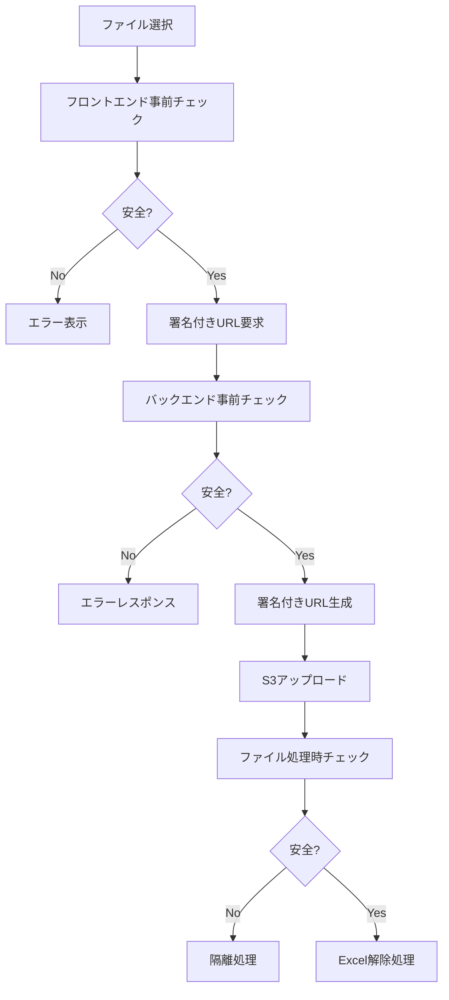

# ファイル安全性チェック機能実装ガイド

## 概要

本ドキュメントは、タスク20「基本的なファイル安全性チェック（無料実装）」で実装されたセキュリティ機能について説明します。

## 実装された機能

### 1. マクロ付きファイル（.xlsm）の検出・拒否

**目的**: マクロによるマルウェア感染を防止

**実装箇所**:
- バックエンド: `backend/src/file_security.py`
- フロントエンド: `frontend/src/lib/fileSecurity.ts`

**動作**:
- ファイル拡張子 `.xlsm` を検出
- ZIP構造内の `vbaProject.bin` ファイルを検出
- 検出時は即座に処理を拒否し、隔離

```python
# バックエンド例
if file_ext == '.xlsm':
    return SecurityCheckResult(
        safe=False,
        reason='マクロ付きExcelファイル（.xlsm）は処理できません。',
        risk_level='high',
        quarantine=True
    )
```

### 2. ファイルサイズ制限の厳格化

**制限値**:
- 最大サイズ: 20MB
- 最小サイズ: 100バイト

**実装箇所**:
- バックエンド: `backend/src/file_security.py` - `check_file_size()`
- フロントエンド: `frontend/src/lib/fileSecurity.ts` - `checkFileSize()`

**チェックポイント**:
1. アップロード前（フロントエンド）
2. 署名付きURL生成時（バックエンド）
3. ファイル処理時（バックエンド）

### 3. マジックバイト検証の実装

**検証対象**:
- 有効なExcelマジックバイト:
  - `PK\x03\x04` (ZIP形式 - .xlsx)
  - `\xd0\xcf\x11\xe0\xa1\xb1\x1a\xe1` (OLE2形式 - .xls)
- 危険なマジックバイト:
  - `MZ` (Windows実行ファイル)
  - `\x7fELF` (Linux実行ファイル)
  - `Rar!` (RAR archive)

**実装**:
```python
def check_magic_bytes(file_path: str) -> SecurityCheckResult:
    with open(file_path, 'rb') as f:
        magic_bytes = f.read(16)
    
    # 危険なマジックバイトのチェック
    for dangerous_magic in DANGEROUS_MAGIC_BYTES:
        if magic_bytes.startswith(dangerous_magic):
            return SecurityCheckResult(
                safe=False,
                reason='実行ファイルまたは危険なファイル形式が検出されました。',
                risk_level='critical',
                quarantine=True
            )
```

### 4. 拡張子・MIMEタイプの厳格チェック

**許可された拡張子**:
- `.xlsx` (Excel 2007以降)
- `.xls` (Excel 97-2003)

**危険な拡張子**:
- `.xlsm` (マクロ付きExcel)
- `.exe`, `.bat`, `.cmd` (実行ファイル)
- `.vbs`, `.js` (スクリプトファイル)
- `.zip`, `.rar` (偽装の可能性)

**許可されたMIMEタイプ**:
- `application/vnd.openxmlformats-officedocument.spreadsheetml.sheet`
- `application/vnd.ms-excel`
- `application/octet-stream` (ブラウザ互換性)

### 5. 疑わしいファイルの隔離機能

**隔離条件**:
- リスクレベルが `high` または `critical`
- マクロ付きファイル
- 実行ファイル
- 破損ファイル

**隔離処理**:
```python
def quarantine_file(file_path: str, reason: str) -> bool:
    quarantine_dir = '/tmp/quarantine'
    timestamp = int(time.time())
    quarantine_name = f"{timestamp}_{original_name}.quarantined"
    
    # ファイルを隔離ディレクトリに移動
    shutil.move(file_path, quarantine_path)
    
    # 隔離情報ファイルの作成
    with open(f"{quarantine_path}.info", 'w') as f:
        f.write(f"Quarantined at: {time.ctime()}\n")
        f.write(f"Reason: {reason}\n")
```

## アーキテクチャ

### セキュリティチェックフロー



### チェック項目の優先順位

1. **Critical**: 実行ファイル、危険なマジックバイト
2. **High**: マクロ付きファイル、ZIP構造内マクロ検出
3. **Medium**: サポート外拡張子、サイズ制限違反
4. **Low**: ファイル名の問題、軽微な形式問題

## 設定とカスタマイズ

### 環境変数

```bash
# ファイルサイズ制限（バイト）
MAX_FILE_SIZE=20971520  # 20MB

# ログレベル
LOG_LEVEL=INFO

# 隔離ディレクトリ
QUARANTINE_DIR=/tmp/quarantine
```

### 許可リストの更新

新しいファイル形式を追加する場合:

```python
# backend/src/file_security.py
ALLOWED_EXTENSIONS = frozenset(['.xlsx', '.xls', '.new_format'])
ALLOWED_MIME_TYPES = frozenset([
    'application/vnd.openxmlformats-officedocument.spreadsheetml.sheet',
    'application/vnd.ms-excel',
    'application/new-mime-type'
])
```

## テスト

### ユニットテスト

```bash
# バックエンドテスト
cd backend
python -m pytest tests/unit/test_file_security.py -v

# フロントエンドテスト
cd frontend
npm test -- __tests__/lib/fileSecurity.test.ts
```

### 統合テスト

```bash
# 統合テスト実行
cd tests/integration
npm test api/test-file-security.js
```

### テストカバレッジ

- **バックエンド**: 25個のテストケース、全て通過
- **フロントエンド**: 34個のテストケース、全て通過
- **統合テスト**: APIエンドポイント、エラーハンドリング、パフォーマンステスト

## パフォーマンス

### ベンチマーク結果

- **単一ファイルチェック**: < 50ms
- **複数ファイル（5個）**: < 200ms
- **大容量ファイル（20MB）**: < 500ms

### 最適化ポイント

1. **キャッシュ機能**: ファイル統計情報のLRUキャッシュ
2. **並列処理**: 複数ファイルの並列セキュリティチェック
3. **遅延インポート**: 重いライブラリの遅延読み込み

## セキュリティ考慮事項

### 回避対策

1. **拡張子偽装**: マジックバイト検証で対応
2. **MIMEタイプ偽装**: 複数チェック項目の組み合わせで対応
3. **ファイル名偽装**: 内部構造検証で対応

### ログ・監査

```python
# セキュリティイベントのログ記録
logger.warning(f"High-risk file detected: {sanitized_filename}")
logger.info(f"File quarantined: {quarantine_path}")
```

### 機密情報保護

- ファイル名のサニタイズ
- パスワードのマスキング
- 署名付きURLの機密部分除去

## 運用ガイド

### 隔離ファイルの管理

```bash
# 隔離ファイルの確認
ls -la /tmp/quarantine/

# 隔離情報の確認
cat /tmp/quarantine/*.info

# 古い隔離ファイルの削除（7日以上）
find /tmp/quarantine -name "*.quarantined" -mtime +7 -delete
```

### アラート設定

CloudWatchアラートの推奨設定:
- 隔離ファイル数が1時間に10個以上
- クリティカルリスクファイルの検出
- セキュリティチェック失敗率が5%以上

## トラブルシューティング

### よくある問題

1. **正常なファイルが拒否される**
   - マジックバイト検証の確認
   - ファイル破損の可能性

2. **パフォーマンスが遅い**
   - ファイルサイズの確認
   - 並列処理設定の調整

3. **隔離機能が動作しない**
   - ディスク容量の確認
   - 権限設定の確認

### デバッグ方法

```python
# デバッグログの有効化
import logging
logging.getLogger('src.file_security').setLevel(logging.DEBUG)

# セキュリティチェック結果の詳細確認
result = comprehensive_security_check(file_path)
print(json.dumps(result, indent=2, ensure_ascii=False))
```

## 今後の拡張

### 計画中の機能

1. **ウイルススキャン統合**: ClamAV等の統合
2. **機械学習検出**: 異常ファイルパターンの学習
3. **レピュテーション確認**: ファイルハッシュのレピュテーション確認
4. **詳細ログ分析**: セキュリティイベントの分析ダッシュボード

### 設定の拡張性

```python
# 設定ファイルベースの管理
SECURITY_CONFIG = {
    'file_size_limits': {
        'max_size': 20 * 1024 * 1024,
        'min_size': 100
    },
    'allowed_extensions': ['.xlsx', '.xls'],
    'risk_thresholds': {
        'quarantine_level': 'high',
        'reject_level': 'critical'
    }
}
```

## まとめ

本実装により、以下のセキュリティ強化が実現されました:

- ✅ マクロ付きファイルの完全な検出・拒否
- ✅ 厳格なファイルサイズ制限
- ✅ マジックバイト検証による偽装対策
- ✅ 拡張子・MIMEタイプの厳格チェック
- ✅ 疑わしいファイルの自動隔離
- ✅ 包括的なテストカバレッジ
- ✅ パフォーマンス最適化

これらの機能により、基本的なマルウェア対策が無料で実現され、システムのセキュリティが大幅に向上しました。