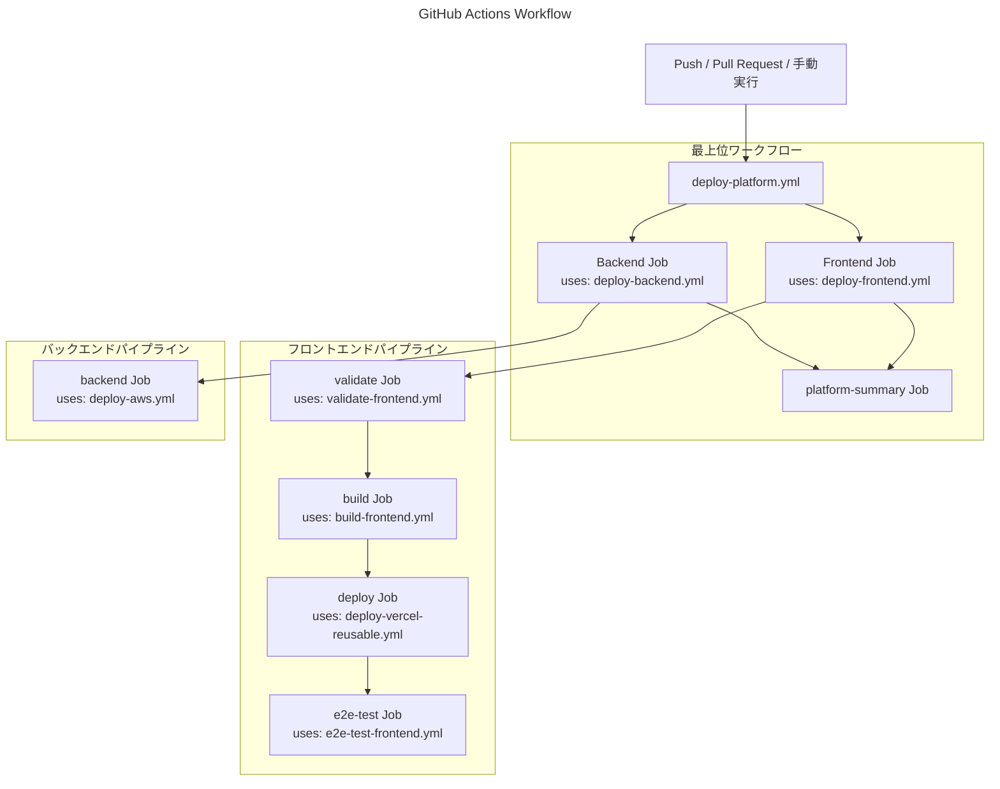

```mermaid
---
title: "GitHub Actions Workflow"
config.theme: neutral
config.sequence.showSequenceNumbers: false
---
graph TD
    %% Node Definitions
    A["Push / Pull Request / 手動実行"]
    B["deploy-platform.yml"]
    C["Frontend Job<br>uses: deploy-frontend.yml"]
    D["Backend Job<br>uses: deploy-backend.yml"]
    E["platform-summary Job"]
    F["validate Job<br>uses: validate-frontend.yml"]
    G["build Job<br>uses: build-frontend.yml"]
    H["deploy Job<br>uses: deploy-vercel-reusable.yml"]
    I["e2e-test Job<br>uses: e2e-test-frontend.yml"]
    J["backend Job<br>uses: deploy-aws.yml"]

    %% Link Definitions
    A --> B
    B --> C & D
    C --> E
    D --> E
    C --> F
    F --> G --> H --> I
    D --> J

    %% Subgraph Grouping
    subgraph "最上位ワークフロー"
        B
        C
        D
        E
    end

    subgraph "フロントエンドパイプライン"
       F
       G
       H
       I
    end

    subgraph "バックエンドパイプライン"
       J
    end
```