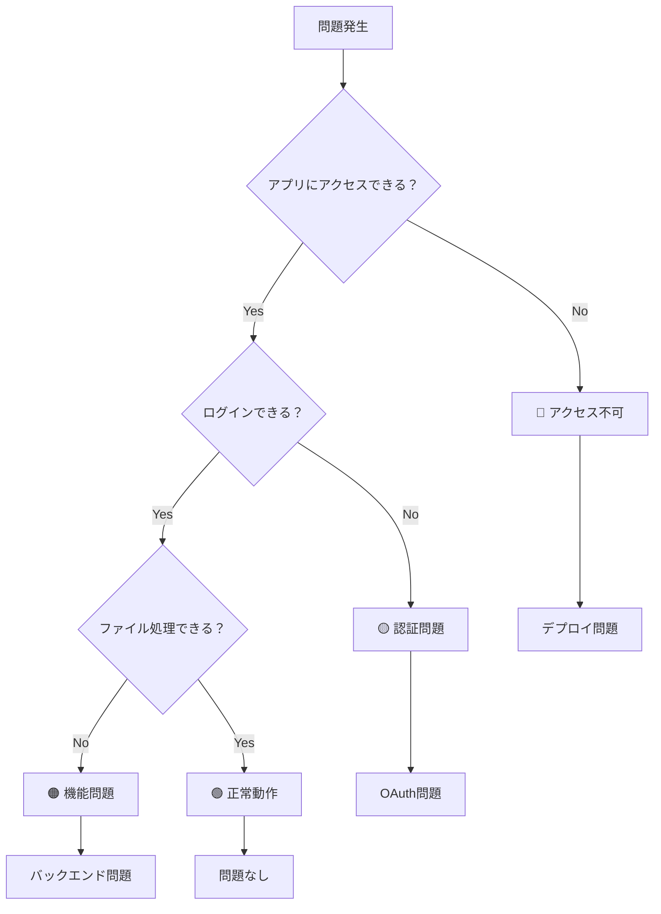
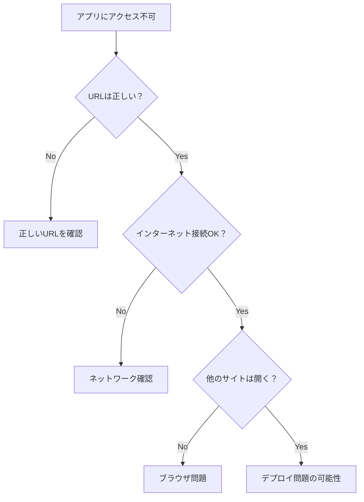
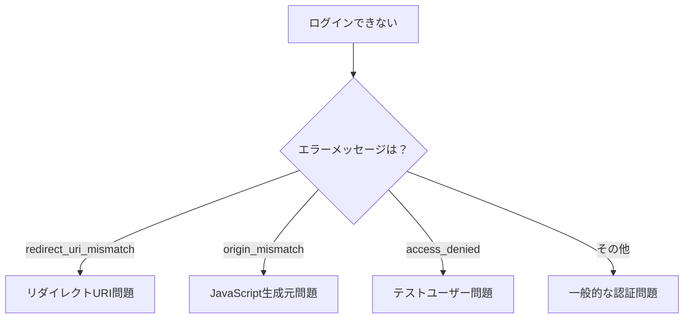
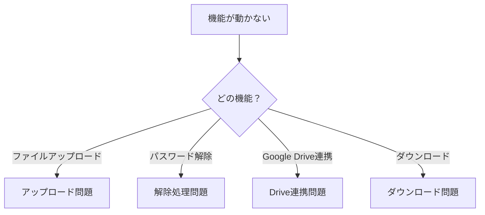
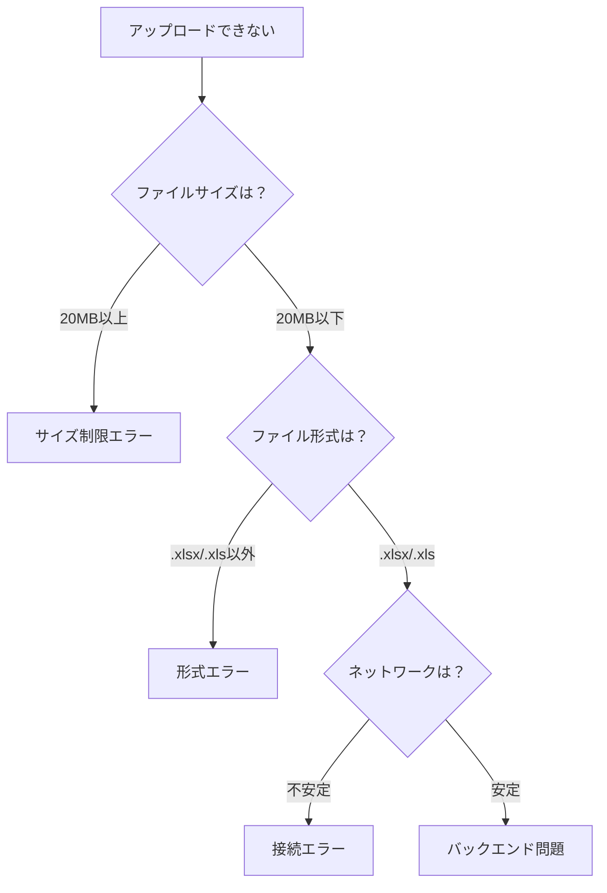
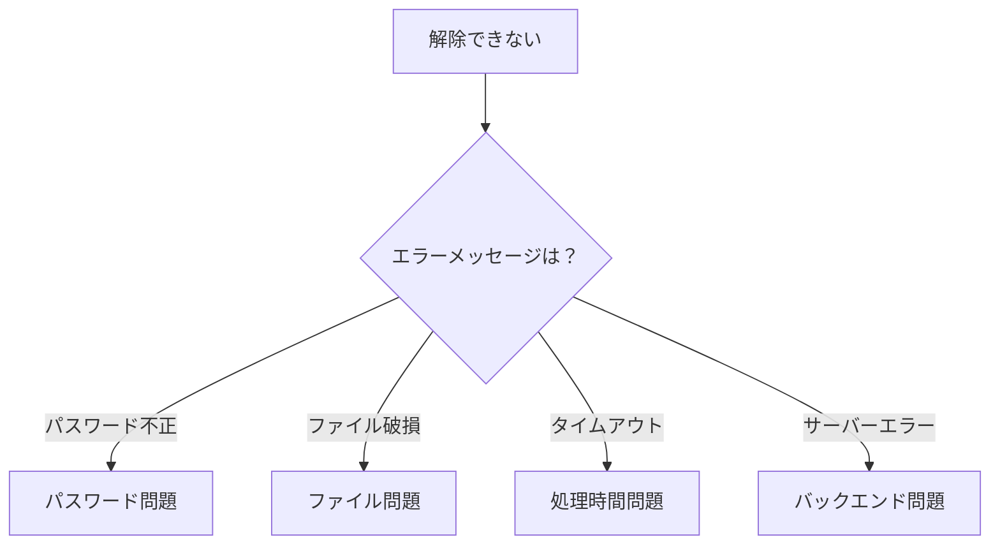
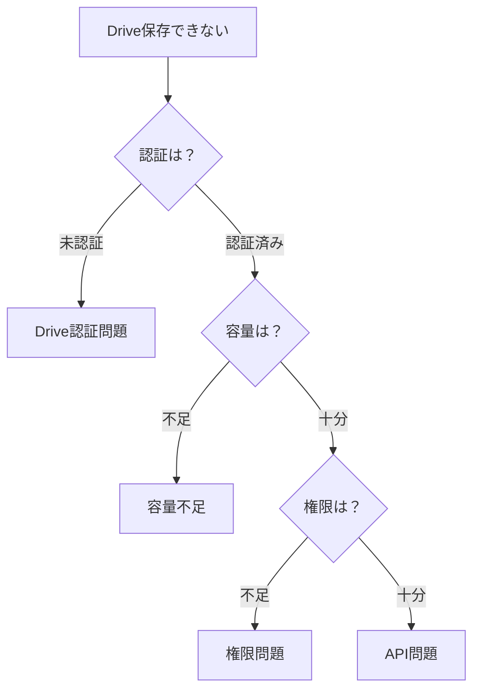

# 🔧 Excel Unlocker トラブルシューティング診断フローチャート

## 📋 このガイドについて

Excel Unlockerで問題が発生した際の診断フローチャートです。問題の種類に応じて、段階的に原因を特定し、解決策を提示します。

---

## 🚨 緊急時クイック診断（5分以内）

### 問題の種類を特定



### 緊急度別対応

| 問題レベル | 症状 | 緊急度 | 対応時間 |
|-----------|------|--------|----------|
| 🔴 **アクセス不可** | アプリが全く開かない | 最高 | 即座 |
| 🟡 **認証問題** | ログインできない | 高 | 30分以内 |
| 🟠 **機能問題** | 一部機能が動かない | 中 | 2時間以内 |
| 🟢 **正常動作** | 問題なし | 低 | - |

---

## 🔴 アクセス不可問題の診断

### ステップ1: 基本確認（2分）



#### 確認項目
- [ ] **URL確認**: `https://your-app.vercel.app` が正しいか
- [ ] **ネットワーク**: 他のWebサイトが開くか
- [ ] **ブラウザ**: 別のブラウザで試す
- [ ] **キャッシュ**: ブラウザキャッシュをクリア（Ctrl+F5）

### ステップ2: デプロイ状況確認（3分）

#### Vercel Dashboard確認
1. **Vercel Dashboard**にアクセス
   ```
   https://vercel.com/dashboard
   ```

2. **プロジェクト状況確認**
   - [ ] プロジェクトが存在するか
   - [ ] 最新デプロイが成功しているか
   - [ ] エラーメッセージがないか

#### GitHub Actions確認
1. **GitHub Actions**にアクセス
   ```
   https://github.com/your-repo/actions
   ```

2. **ワークフロー状況確認**
   - [ ] 最新実行が成功しているか
   - [ ] エラーログがないか
   - [ ] デプロイが完了しているか

### 解決策

#### 即座に実行可能な対処法
```bash
# 1. GitHub Actionsで再デプロイ
1. GitHub → Actions → Deploy Full Stack
2. Run workflow → development
3. 実行完了まで待機（5-10分）

# 2. Vercelで手動デプロイ
1. Vercel Dashboard → プロジェクト
2. Deployments → Redeploy
3. デプロイ完了まで待機
```

---

## 🟡 認証問題の診断

### ステップ1: エラーメッセージ確認（1分）



#### エラーメッセージ別対処法

| エラーメッセージ | 原因 | 解決策 |
|-----------------|------|--------|
| `redirect_uri_mismatch` | リダイレクトURIが未登録 | Google Cloud ConsoleでURI追加 |
| `origin_mismatch` | JavaScript生成元が未登録 | Google Cloud Consoleでオリジン追加 |
| `access_denied` | テストユーザー未登録 | OAuth同意画面でユーザー追加 |
| `invalid_client` | クライアントID/シークレット間違い | GitHub Secretsを確認 |

### ステップ2: Google OAuth設定確認（5分）

#### Google Cloud Console確認手順
1. **Google Cloud Console**にアクセス
   ```
   https://console.cloud.google.com/
   ```

2. **OAuth設定確認**
   - APIとサービス → 認証情報
   - OAuth クライアントIDを選択
   - 以下を確認：

#### 必須設定項目
```bash
# 承認済みのJavaScript生成元
https://your-domain.com
https://*.vercel.app
http://localhost:3000

# 承認済みのリダイレクトURI
https://your-domain.com/api/auth/callback/google
https://*.vercel.app/api/auth/callback/google
http://localhost:3000/api/auth/callback/google
```

#### テストユーザー確認
- OAuth同意画面 → テストユーザー
- 利用予定のGoogleアカウントが追加されているか確認

### 解決策

#### 設定修正手順
```bash
# 1. リダイレクトURI追加
1. Google Cloud Console → APIとサービス → 認証情報
2. OAuth クライアントIDを編集
3. 承認済みのリダイレクトURIに現在のドメインを追加
4. 保存

# 2. テストユーザー追加
1. OAuth同意画面 → テストユーザー
2. ユーザーを追加
3. 利用予定のGoogleアカウントを入力
4. 保存
```

---

## 🟠 機能問題の診断

### ステップ1: 問題の特定（2分）



### ファイルアップロード問題

#### 診断フロー


#### 確認項目
- [ ] **ファイルサイズ**: 20MB以下か
- [ ] **ファイル形式**: .xlsx または .xls か
- [ ] **ファイル名**: 日本語・特殊文字が含まれていないか
- [ ] **ネットワーク**: 安定した接続か

### パスワード解除問題

#### 診断フロー


#### 確認項目
- [ ] **パスワード**: 正しいパスワードを入力しているか
- [ ] **ファイル状態**: ファイルが破損していないか
- [ ] **処理時間**: 大きなファイルで時間がかかっていないか
- [ ] **複数候補**: 複数のパスワード候補を試したか

### Google Drive連携問題

#### 診断フロー


#### 確認項目
- [ ] **Drive認証**: Google Driveへのアクセス許可を与えているか
- [ ] **Drive容量**: Google Driveに十分な容量があるか
- [ ] **フォルダ権限**: 選択したフォルダに書き込み権限があるか
- [ ] **ネットワーク**: Google APIへの接続が安定しているか

---

## 🔍 詳細診断手順

### ブラウザ開発者ツールでの確認

#### 1. コンソールエラー確認
```bash
# 開発者ツールを開く
Windows: F12
Mac: Command + Option + I

# Consoleタブを確認
- 赤色のエラーメッセージを確認
- エラーの詳細をコピー
```

#### 2. ネットワークタブ確認
```bash
# Networkタブを開く
- ページをリロード
- 失敗したリクエスト（赤色）を確認
- ステータスコードを確認（404, 500など）
```

#### 3. アプリケーションタブ確認
```bash
# Applicationタブを開く
- Local Storage を確認
- Session Storage を確認
- Cookies を確認
```

### AWS CloudWatch ログ確認

#### 1. Lambda関数ログ確認
```bash
# AWS Management Console
1. CloudWatch → ログ → ロググループ
2. /aws/lambda/excel-unlocker-* を選択
3. 最新のログストリームを確認
4. エラーメッセージを確認
```

#### 2. API Gateway ログ確認
```bash
# API Gateway コンソール
1. API Gateway → APIs → excel-unlocker-api
2. Stages → prod → Logs/Tracing
3. CloudWatch Logs を有効化
4. ログを確認
```

---

## 🛠️ 解決策データベース

### よくある問題と解決策

#### 問題1: ログイン後に白い画面が表示される
```bash
原因: NextAuth設定問題
解決策:
1. NEXTAUTH_URL環境変数を確認
2. NEXTAUTH_SECRET環境変数を確認
3. Vercelで環境変数を再設定
```

#### 問題2: ファイルアップロード時に「Network Error」
```bash
原因: CORS設定問題
解決策:
1. API GatewayのCORS設定を確認
2. template.yamlのCORS設定を確認
3. 再デプロイを実行
```

#### 問題3: パスワード解除時に「Internal Server Error」
```bash
原因: Lambda関数エラー
解決策:
1. CloudWatchログを確認
2. IAM権限を確認
3. S3バケット設定を確認
```

#### 問題4: Google Drive保存時に「Permission denied」
```bash
原因: OAuth スコープ不足
解決策:
1. Google Cloud ConsoleでOAuthスコープを確認
2. drive.file スコープが含まれているか確認
3. ユーザーに再認証を依頼
```

### 緊急時の一時的対処法

#### 1. アプリ全体が動かない場合
```bash
# 緊急復旧手順
1. GitHub Actions → Deploy Full Stack
2. Environment: development
3. 全オプションにチェック
4. Run workflow
5. 完了まで待機（10-15分）
```

#### 2. 認証だけが動かない場合
```bash
# OAuth設定リセット
1. Google Cloud Console → OAuth同意画面
2. テストユーザーを再追加
3. OAuth クライアントIDを再作成
4. GitHub Secretsを更新
```

#### 3. ファイル処理だけが動かない場合
```bash
# バックエンド再デプロイ
1. GitHub Actions → Deploy Backend
2. Environment: development
3. Run workflow
4. 完了まで待機（5-10分）
```

---

## 📞 エスカレーション手順

### レベル1: 自己解決（30分以内）
- [ ] このフローチャートに従って診断
- [ ] よくある問題の解決策を試行
- [ ] 基本的な設定確認を実施

### レベル2: 社内IT部門（1時間以内）
- [ ] 問題の詳細を記録
- [ ] エラーメッセージをスクリーンショット
- [ ] 実行した対処法を記録
- [ ] IT部門に連絡

### レベル3: 開発者・外部サポート（2時間以内）
- [ ] 全ての診断結果を整理
- [ ] ログファイルを収集
- [ ] 設定ファイルを確認
- [ ] 開発者に詳細報告

### 報告テンプレート

```
=== Excel Unlocker 問題報告 ===

【基本情報】
発生日時: 2025年__月__日 __時__分
報告者: ________________
影響範囲: ________________

【問題の詳細】
症状: ________________________________
エラーメッセージ: ____________________
再現手順: ____________________________

【実行した対処法】
1. ________________________________
2. ________________________________
3. ________________________________

【添付資料】
□ スクリーンショット
□ エラーログ
□ 設定ファイル
□ ブラウザ開発者ツールの情報

【緊急度】
□ 高（業務停止）
□ 中（一部機能停止）
□ 低（軽微な問題）
```

---

## 🎯 予防策・定期メンテナンス

### 月次チェック項目
- [ ] **動作確認**: 全機能の動作テスト
- [ ] **ログ確認**: エラーログの確認
- [ ] **容量確認**: AWS使用量の確認
- [ ] **セキュリティ**: 認証設定の確認

### 四半期チェック項目
- [ ] **依存関係更新**: ライブラリの更新
- [ ] **セキュリティパッチ**: セキュリティ更新の適用
- [ ] **パフォーマンス**: 処理速度の確認
- [ ] **バックアップ**: 設定情報のバックアップ

### 年次チェック項目
- [ ] **全体見直し**: システム構成の見直し
- [ ] **セキュリティ監査**: 包括的なセキュリティ確認
- [ ] **災害復旧**: 復旧手順の確認・テスト
- [ ] **ドキュメント更新**: 手順書の更新

---

**🔧 このフローチャートを使用して、Excel Unlockerの問題を迅速に解決してください！**

問題が解決しない場合は、遠慮なく社内IT部門または開発者にご相談ください。