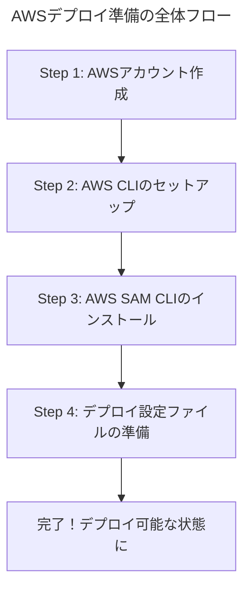

# AWSデプロイ準備：アカウント作成からSAM CLI設定までの手順書

このドキュメントは、開発したExcelパスワード解除APIをAWS上にデプロイするために、ユーザー様自身で行っていただく必要がある準備作業をまとめたものです。

図解を交えながら、ステップバイステップで進められるように解説します。

## 全体の流れ

デプロイ準備は、大きく分けて以下の4つのステップで完了します。



---

## Step 1: AWSアカウントの作成

**作業時間目安: 約10分**

まずは、AWSのサービスを利用するためのアカウントを作成します。すでにアカウントをお持ちの場合は、このステップは不要です。

1.  **公式サイトへアクセス**: 
    *   [AWS公式サイト](https://aws.amazon.com/jp/)にアクセスし、画面右上の「コンソールにサインイン」をクリック後、「新しいAWSアカウントの作成」へ進みます。

2.  **必要情報の入力**:
    *   画面の指示に従い、Eメールアドレス、パスワード、AWSアカウント名などを入力します。
    *   連絡先情報（住所、氏名、電話番号）を入力します。
    *   クレジットカード情報を登録します。AWSには無料利用枠がありますが、それを超えた場合に備えて登録が必要です。

3.  **本人確認**:
    *   電話またはSMSによる本人確認が行われます。

4.  **サポートプランの選択**:
    *   「ベーシックサポート」（無料）を選択して、サインアップを完了します。

**【成果物】**
*   AWSにログインできるアカウント

---

## Step 2: AWS CLIのインストールと設定

**作業時間目安: 約15分**

AWS CLI (Command Line Interface) は、ご自身のPCのコマンドプロンプトやターミナルからAWSを操作するための公式ツールです。今後のデプロイ作業で必須となります。

### 2.1. AWS CLIのインストール

お使いのOSに合ったインストーラーをダウンロードして実行してください。

*   **Windows**: [こちら](https://awscli.amazonaws.com/AWSCLIV2.msi)から64bit版インストーラーをダウンロードして実行します。
*   **macOS**: [こちら](https://awscli.amazonaws.com/AWSCLIV2.pkg)からインストーラーをダウンロードして実行します。

インストール後、コマンドプロンプト（またはターミナル）を再起動し、以下のコマンドを実行してバージョンが表示されれば成功です。

```bash
aws --version
```

### 2.2. IAMユーザーの作成と認証情報の設定

セキュリティのベストプラクティスとして、普段の作業はルートアカウント（最初に作成したアカウント）ではなく、権限を限定したIAMユーザーで行います。CLIもこのIAMユーザーとして実行します。

1.  **IAMユーザーの作成**:
    *   AWSコンソールにサインインし、サービス検索で「IAM」と入力してIAMダッシュボードに移動します。
    *   左側のメニューから「ユーザー」を選択し、「ユーザーを作成」をクリックします。
    *   ユーザー名を（例: `api-deploy-user`）入力します。
    *   「次へ」をクリックし、「ポリシーを直接アタッチする」を選択します。
    *   ポリシーの一覧から `AdministratorAccess` を検索してチェックを入れます。（これにより、このユーザーは管理者権限を持ちます）
    *   「次へ」をクリックし、内容を確認して「ユーザーを作成」をクリックします。

2.  **アクセスキーの作成**:
    *   作成したユーザー（`api-deploy-user`）の名前をクリックします。
    *   「セキュリティ認証情報」タブを開き、「アクセスキー」セクションで「アクセスキーを作成」をクリックします。
    *   ユースケースとして「コマンドラインインターフェイス (CLI)」を選択し、確認のチェックを入れて「次へ」をクリックします。
    *   （オプション）説明タグを設定し、「アクセスキーを作成」をクリックします。
    *   **重要**: 表示された「**アクセスキーID**」と「**シークレットアクセスキー**」を必ず控えてください。特にシークレットアクセスキーはこの画面でしか確認できません。`.csv`ファイルをダウンロードして保管するのが確実です。

3.  **AWS CLIの設定**:
    *   コマンドプロンプト（またはターミナル）で以下のコマンドを実行します。
    ```bash
    aws configure
    ```
    *   先ほど控えた認証情報を順番に入力します。
        *   `AWS Access Key ID`: (控えたアクセスキーID)
        *   `AWS Secret Access Key`: (控えたシークレットアクセスキー)
        *   `Default region name`: `ap-northeast-1` (東京リージョン)
        *   `Default output format`: `json`

これで、AWS CLIがセットアップされ、IAMユーザーとしてAWSを操作できるようになりました。

**【成果物】**
*   AWS CLIがインストールされ、認証設定が完了したPC環境

---

## Step 3: AWS SAM CLIのインストール

**作業時間目安: 約10分**

AWS SAM (Serverless Application Model) CLIは、LambdaやAPI Gatewayといったサーバーレスアプリケーションの構築とデプロイを簡単にするための拡張ツールです。

*   **Windows**: [こちら](https://github.com/aws/aws-sam-cli/releases/latest/download/aws-sam-cli-msi-x86_64.msi)から64bit版インストーラーをダウンロードして実行します。
*   **macOS**: Homebrewを使ってインストールするのが簡単です。
    ```bash
    brew tap aws/tap
    brew install aws-sam-cli
    ```

インストール後、コマンドプロンプト（またはターミナル）を再起動し、以下のコマンドを実行してバージョンが表示されれば成功です。

```bash
sam --version
```

**【成果物】**
*   AWS SAM CLIがインストールされたPC環境

---

## Step 4: デプロイ設定ファイルの準備

**作業時間目安: 5分**

最後に、私たちのプロジェクトをSAMが理解できるように、デプロイするAWSリソースを定義した設定ファイル `template.yaml` を作成します。この作業は私（AI）が行います。

**ユーザー様に行っていただく作業はありません。** 私が次のステップでこのファイルを作成し、プロジェクトに追加します。

---

以上のステップが完了すると、いよいよAWSへのデプロイが可能になります。
まずは **Step 1 から Step 3 まで**の作業をお願いいたします。不明な点があれば、いつでもお声がけください。

---

## Step 5: アプリケーションのビルドとデプロイ

**作業時間目安: 10分**

お疲れ様でした！AWSアカウントと各種CLIツールの準備が整いました。

先ほど私が作成した `template.yaml` を使って、いよいよアプリケーションをAWSにデプロイします。この作業は、コマンドプロンプト（またはターミナル）で2つのコマンドを実行するだけです。

**重要**: 以下のコマンドは、プロジェクトのルートディレクトリ（`template.yaml` がある場所）で実行してください。

### 5.1. ビルド

まず、以下のコマンドを実行して、Lambda関数と依存ライブラリをパッケージ化します。

```bash
sam build
```

このコマンドは、`template.yaml` の定義に従い、`backend/requirements.txt` に記載されたライブラリをインストールし、デプロイ用のファイル一式を `.aws-sam` というディレクトリに作成します。

### 5.2. デプロイ

次に、以下のコマンドを実行して、対話形式でデプロイを進めます。

```bash
sam deploy --guided
```

コマンドを実行すると、いくつか質問されます。基本的にはデフォルト値（Enterキーを押すだけ）で問題ありませんが、以下の点を確認・入力してください。

*   `Stack Name`: `excel-unlocker-api` のような、このアプリケーションを管理するための名前を入力します。
*   `AWS Region`: `ap-northeast-1` と表示されていることを確認します。
*   `Confirm changes before deploy`: `y` (Yes) を入力します。デプロイ内容の確認ステップが入ります。
*   `Allow SAM CLI IAM role creation`: `y` (Yes) を入力します。デプロイに必要なIAMロールの作成を許可します。
*   `Disable rollback`: `n` (No) のままにします。デプロイ失敗時に自動でロールバックされます。
*   `Save arguments to configuration file`: `y` (Yes) を入力します。今回の設定が `samconfig.toml` というファイルに保存され、次回以降は `sam deploy` だけでデプロイできるようになります。

すべての質問に答えると、デプロイが開始されます。完了すると、`Outputs`セクションにAPIのエンドポイントURLなどが表示されます。これが、APIにアクセスするためのURLです。

**【成果物】**
*   AWS上にデプロイされたAPIエンドポイント

---

これで、開発からデプロイまでの全ての準備が整いました。ユーザー様のタイミングで、手順書に沿って作業を進めてみてください。
