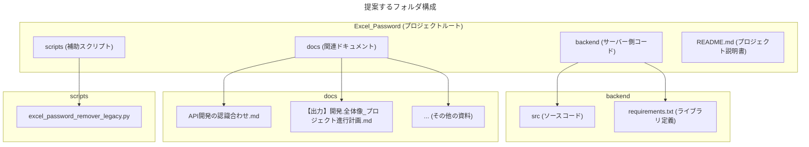

# 開発プロジェクトのフォルダ構成案

この資料は、本開発プロジェクトにおけるフォルダの構成案とその目的について説明するものです。
コード、ドキュメント、その他の関連ファイルを体系的に整理することで、開発の効率性とメンテナンス性を高めることを目指します。

## 提案するフォルダ構成

現在のプロジェクトルートには、ソースコードの元となったファイルや複数のドキュメントファイルが混在しています。
そこで、各ファイルの役割に応じてフォルダを分離し、より見通しの良い構成にすることを提案します。

### 各フォルダ・ファイルの役割

| 名前 | 役割 |
| :--- | :--- |
| **`backend/`** | **サーバーサイドの全ファイルを格納する** AWS Lambdaで動作するPythonのソースコード、必要なライブラリを定義する`requirements.txt`などを管理します。 |
| ├ `src/` | 実際のロジックを記述するPythonスクリプト（`.py`）を配置します。 |
| ├ `requirements.txt` | プロジェクトで利用するPythonライブラリ（`msoffcrypto-tool`など）とそのバージョンを記載します。 |
| **`docs/`** | **関連ドキュメントをすべて集約する** これまで作成した「API開発の認識合わせ」や「プロジェクト進行計画」など、設計・計画に関するドキュメントを保管します。 |
| **`scripts/`** | **直接のアプリケーションコードではない補助的なスクリプトを格納する** 開発の参考にした旧バージョンの`excel_password_remover.py`などをここに移動します。 |
| **`README.md`** | **プロジェクトの顔となる説明ファイル** プロジェクトの概要、セットアップ方法、使い方などを記述します。初めてこのプロジェクトを見る人が最初に読むファイルです。 |

### この構成のメリット

*   **関心の分離**: 「バックエンドのコード」「ドキュメント」「その他スクリプト」が明確に分離されるため、どこに何があるか一目でわかります。
*   **保守性の向上**: 将来、機能を追加したり、他の開発者が参加したりする場合でも、構造が整理されているためスムーズに対応できます。
*   **拡張性**: 将来的にフロントエンド（画面）を開発することになった場合、ルートに`frontend`フォルダを追加するだけで、綺麗に拡張できます。

この構成は、小規模なプロジェクトから大規模なプロジェクトまで幅広く採用されている、モダンな開発における一般的なベストプラクティスです。 