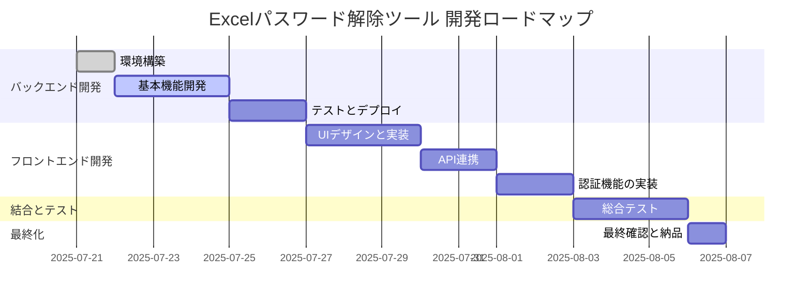
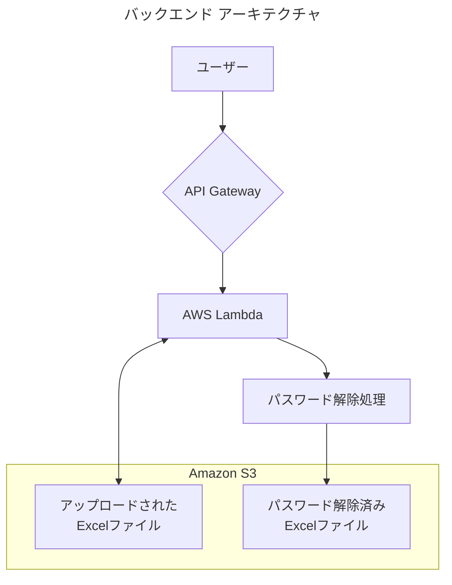

# Excelパスワード解除ツール開発：プロジェクト全体の流れ

この資料は、「Excelパスワード解除ツール」開発プロジェクトの開始から完了までの全体の流れを、フェーズごとに図解を交えて説明するものです。
ユーザー様がプロジェクトの全体像を把握し、安心して開発を進められるようにすることを目的としています。

## プロジェクト全体の流れ（全体像）

本プロジェクトは、大きく分けて以下の4つのフェーズで進行します。まずはバックエンド（サーバー側の処理）を完成させ、その後フロントエンド（画面側の処理）を開発し、最後に両者を結合してテストを行います。

## フェーズ1：バックエンド開発（単一ファイル処理APIの構築）

このフェーズの目標は、**「1つのExcelファイルと2つのパスワード候補を受け取り、パスワードが解除されたファイルを返す」**というコア機能を持つAPIを完成させることです。

### アーキテクチャ図

バックエンドは、AWSのサービス（API Gateway, Lambda, S3）を組み合わせて構築します。

### 開発ステップ

1.  **AWS環境構築**:
    *   S3バケットを作成します（ファイルの一時保管場所）。
    *   Lambda関数を作成し、必要なライブラリ（`msoffcrypto-tool`など）を設定します。
    *   API Gatewayを設定し、Lambda関数を呼び出すためのエンドポイント（URL）を作成します。
2.  **Lambda関数開発**:
    *   API Gatewayからトリガーを受け取り、リクエスト内容（ファイル情報、パスワード候補）を解析します。
    *   S3にアップロードされたExcelファイルをLambdaの一時領域にダウンロードします。
    *   **`msoffcrypto-tool`ライブラリを使用**して、受け取った2つのパスワードで順番に解除を試みます。
    *   **成功**: パスワードが解除されたファイルを生成し、結果をS3の出力用フォルダにアップロードします。
    *   **失敗**: 全てのパスワードで解除できなかった場合、その旨を記録します。
    *   処理結果（成功時はダウンロード用URL、失敗時はそのステータス）をAPI Gatewayに返します。
    *   (注) ファイル名はS3の仕様に準拠するため、ローカル環境で発生しうる「長すぎる」「空白が含まれる」等の問題は発生しにくい想定です。
3.  **テストとデプロイ**:
    *   単体テストを行い、関数が正しく動作することを確認します。
    *   API Gateway経由で実際にAPIを呼び出し、一連の流れをテストします。

**【このフェーズの成果物】**
*   単一のExcelファイルを処理できるAPIエンドポイント（URL）

---

## フェーズ2：フロントエンド開発（ユーザーが操作する画面の作成）

このフェーズの目標は、ユーザーがファイルをアップロードし、処理結果を受け取るためのWeb画面を作成することです。

### 開発ステップ

1.  **UI/UX設計と実装**:
    *   ファイルを選択するボタン、パスワードを入力するフィールド、処理開始ボタンなどを備えた、シンプルで使いやすい画面を作成します。
2.  **API連携**:
    *   フェーズ1で作成したバックエンドAPIを呼び出す処理を実装します。
    *   複数のファイルが選択された場合、1ファイルずつAPIを呼び出すループ処理を実装します。
    *   処理の進捗（例：「3個中2個のファイル処理が完了」）がわかるように表示します。
3.  **認証機能の実装**:
    *   Googleアカウントでのログイン機能を実装し、許可されたユーザーのみがツールを利用できるようにします。
4.  **結果の表示**:
    *   パスワード解除に成功したファイルのダウンロードリンクや、失敗したファイルの一覧を表示します。

**【このフェーズの成果物】**
*   バックエンドと通信できる、Vercel上で動作するWebアプリケーション

---

## フェーズ3：結合テスト

このフェーズの目標は、バックエンドとフロントエンドを結合した状態で、全体の動作に問題がないかを確認することです。

### テスト内容

1.  **E2E（エンドツーエンド）テスト**:
    *   ユーザーが実際にファイルをアップロードしてから、結果をダウンロードするまでの一連の流れを、様々なパターン（成功、失敗、複数ファイルなど）でテストします。
2.  **最終確認**:
    *   ユーザー様に実際に触っていただき、使い勝手や機能に問題がないかを確認していただきます（UAT: User Acceptance Test）。

---

## フェーズ4：最終化と納品

このフェーズでプロジェクトは完了です。

### タスク

1.  **最終デプロイ**:
    *   テストで発見された問題を修正し、完成版をVercelにデプロイします。
2.  **ドキュメント整備と納品**:
    *   最終的な構成や使い方をまとめたドキュメントを整備し、ソースコードとともにお渡しします。

以上がプロジェクト完了までの全体の流れです。各フェーズが完了するごとにご報告し、ご確認いただきながら進めてまいりますので、ご安心ください。 