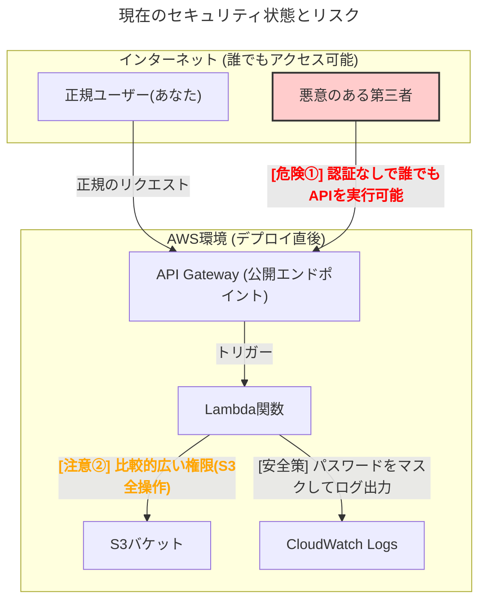

# 現時点でのセキュリティレベルと注意点

このドキュメントは、現在開発中のExcelパスワード解除APIをAWSへデプロイした時点でのセキュリティ状態、潜在的なリスク、および今後の対策についてまとめたものです。

**結論: 現在のデプロイ状態は開発・テスト段階のものであり、本番運用には適していません。APIエンドポイントのURLは外部に漏れないよう、厳重に管理してください。**

## 現在のセキュリティ状態の図解

## リスクと対策の詳細

### 危険①: APIの無認証アクセス

*   **現状**: API Gatewayのエンドポイントはインターネットに公開されており、URLを知っていれば誰でもAPIを実行できる状態です。認証・認可の仕組みは実装されていません。
*   **潜在的リスク**: 
    *   第三者による不正なAPI利用（ファイル窃取、サービス妨害攻撃など）。
    *   AWS利用料金の意図的な高騰。
    *   パスワード総当たり攻撃の踏み台にされる可能性。
*   **今後の対策**: プロジェクト計画通り、**Google OAuth 2.0認証を導入**し、許可された正規ユーザーのみがAPIを実行できるようにします。

### 注意②: Lambda関数の過大な権限

*   **現状**: Lambda関数には、デプロイ先のS3バケットに対する全ての操作（読み取り、書き込み、削除など）が可能な `S3CrudPolicy` が付与されています。
*   **潜在的リスク**: Lambda関数のコードに脆弱性があった場合、攻撃者にS3バケット内の全ファイルを操作される可能性があります。「必要最小限の権限の原則」に照らすと、権限が広すぎます。
*   **今後の対策**: 本番運用前にIAMポリシーを見直し、権限を「特定のフォルダからの読み取り(`GetObject`)」と「特定のフォルダへの書き込み(`PutObject`)」のみに限定します。

### 注意③: オープンなCORS設定

*   **現状**: S3バケットとAPI GatewayのCORS（Cross-Origin Resource Sharing）設定が、すべてのオリジン（`*`）からのリクエストを許可しています。
*   **潜在的リスク**: どのウェブサイトからでも、このAPIに対してリクエストを送信できてしまいます。
*   **今後の対策**: フロントエンドアプリケーションを開発後、そのアプリケーションがホストされるドメインからのみリクエストを許可するように設定を限定します。

## 実施済みのセキュリティ対策

以下の対策は、現時点でも実装済みです。

*   **通信の暗号化**: API Gatewayとクライアント間の通信はHTTPSにより暗号化されています。
*   **ログにおけるパスワードのマスキング**: アプリケーションログにパスワードが平文で記録されることを防いでいます。

## まとめ

現在のシステムは、機能実装を優先した開発フェーズの構成です。セキュリティは今後のフェーズで段階的に強化していきます。

繰り返しになりますが、**デプロイによって生成されたAPIのURLは、テスト目的でのみ使用し、外部には絶対に公開しないようお願いいたします。**
