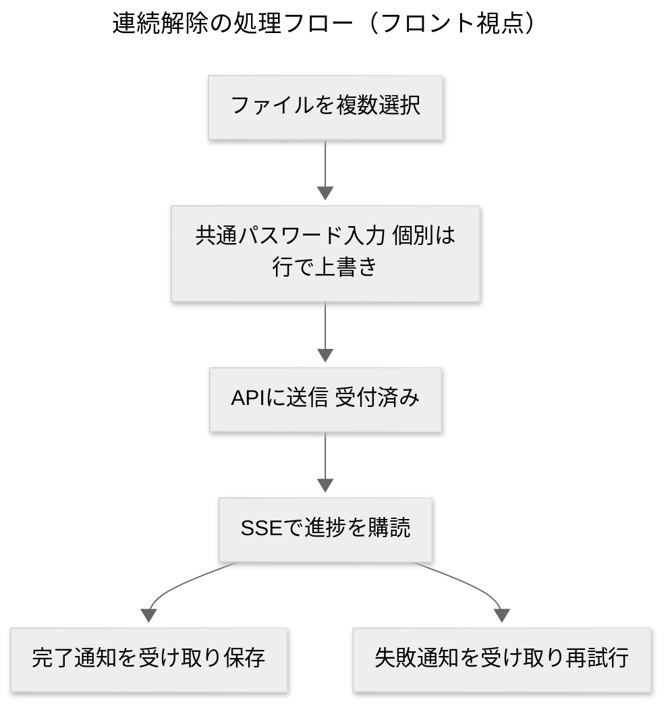
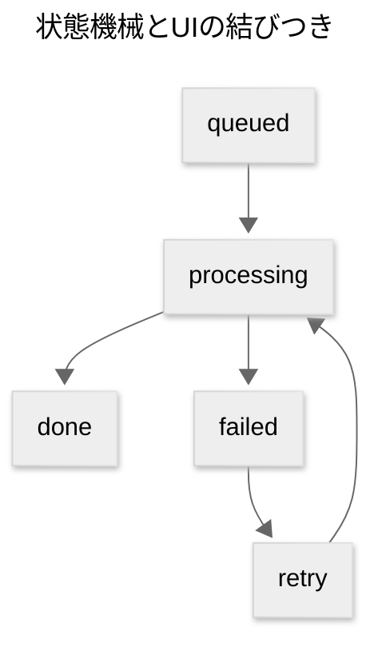

> 本ページはAI支援で生成した設計資料です。最終判断や正確性は元リポジトリと運用規約・コードを参照してください。

---

## ゴールと適用範囲

* 目的
  実験リポジトリのUI設定・設計を抽出し、[[2025-08-21]]時点の**Excelパスワード連続解除Webアプリ**（全デバイス同一体験）へ**そのまま反映可能**な形にまとめる。
* 対象
  [[shadcn_ui]]×[[Radix_UI]]×[[Tailwind_CSS]]×[[Next_js]]でUIを実装する[[AI]]/開発者。
* 成果物
  デザイントークン、コンポーネント規約、状態モデル、マイクロコピー、A11y、計測、エラー設計、API契約、テスト規約、CIの雛形。

---

## 1. デザイン基盤（テーマ・フォント・トークン）

### 1.1 テーマ管理

* ライブラリ：[[next_themes]]
* 要件：`attribute=class defaultTheme=system enableSystem`
* 実装位置：`app/layout.tsx`（最上位）

### 1.2 フォント

* 推奨：`Noto Sans JP`（日本語可読性）＋`Geist`または等幅に`JetBrains Mono`
* 規約：`--font-sans`に`Noto Sans JP`、`--font-mono`に等幅

### 1.3 カラートークン（OKLCH）

* 方針：OKLCHベースのブランド階調（例：`--brand-1`〜`--brand-12`）
* 用途：ボタン・リンク・フォーカス・通知・進捗に一貫適用

```css
:root {
  --brand-9: oklch(0.67 0.12 250);
  --brand-10: oklch(0.72 0.12 250);
  --focus-ring: var(--brand-10);
}
:root[data-theme="dark"] {
  --brand-9: oklch(0.72 0.12 250);
  --brand-10: oklch(0.77 0.12 250);
}
```

---

## 2. コンポーネント規約（shadcn_ui拡張）

### 2.1 ベースセット

* 利用：[[Button]] [[Input]] [[Card]] [[Dialog]] [[Popover]] [[Tooltip]] [[Tabs]] [[Table]] [[Badge]] [[Progress]] [[Dropdown_Menu]] [[Alert_Dialog]] [[Separator]]
* 拡張ポリシー：`data-slot`で内部要素を明示（例：`data-slot="title"`）

### 2.2 バリエーション管理（cva）

* ライブラリ：[[class_variance_authority]]（`cva`）
* ルール：`intent`と`size`を標準化

  * `intent`: `default` `primary` `success` `warning` `destructive` `ghost`
  * `size`: `sm` `md` `lg`

```ts
// ui/button.ts（要旨）
const buttonVariants = cva(
  "inline-flex items-center justify-center rounded-xl font-medium transition-colors focus-visible:outline-none focus-visible:ring-2 focus-visible:ring-offset-2",
  {
    variants: {
      intent: {
        primary: "bg-brand-10 text-white hover:bg-brand-9",
        success: "bg-green-600 text-white hover:bg-green-500",
        destructive: "bg-red-600 text-white hover:bg-red-500",
        default: "bg-muted text-foreground hover:bg-muted/80",
        ghost: "bg-transparent hover:bg-muted/50"
      },
      size: { sm: "h-9 px-3", md: "h-10 px-4", lg: "h-11 px-5" }
    },
    defaultVariants: { intent: "primary", size: "md" }
  }
);
```

### 2.3 通知（sonner）

* ライブラリ：[[sonner]]
* 規約：`Toaster richColors position="top-right"`
* 文言：現在地→次の一手（例：`解除中`→`完了時は保存を押してください`）

---

## 3. 連続解除UIの画面設計

### 3.1 画面一覧

* `UnlockPage`：**一括投入→連続解除→保存**の主画面
* `PasswordOverrideDialog`：個別パスワード上書き
* `CleanupDialog`：一覧クリアの確認
* `HelpDrawer`：失敗理由と次の一手

### 3.2 主要UI（骨格）

* 一括投入（D&D＋複数選択）：`.xlsx .xls`バッジと上限明記
* 共通パスワード＋個別上書き（優先順位：個別＞共通）
* キュー一覧（状態・操作・進捗）
* トースト（開始→進行→完了→失敗）と画面内ヘルプ

```tsx
// app/unlock/page.tsx（要旨）
<Card>
  <UploadDropzone accept={[".xlsx",".xls"]} multiple onFiles={enqueue} />
  <div className="mt-4 flex gap-3">
    <Input type="password" placeholder="共通パスワード（任意）" />
    <Button onClick={startBatch}>解除を開始</Button>
  </div>
</Card>
<QueueList items={items} onRetry={retry} onDownload={download} />
```

---

## 4. 状態モデルとUI対応

### 4.1 状態と遷移

* `queued` → `processing` → `done`／`failed` → `retry`
* 属性：`progress` `errorCode` `downloadUrl` `passwordOverride`

### 4.2 表現ルール

| 状態         | 短文   | バッジ              | 操作     | 音声読み上げ    |
| ---------- | ---- | ---------------- | ------ | --------- |
| queued     | 受付済み | secondary        | 開始不可   | polite    |
| processing | 解除中  | default＋Progress | キャンセル可 | polite    |
| done       | 保存完了 | success          | ダウンロード | assertive |
| failed     | 失敗   | destructive      | 再試行    | assertive |

---

## 5. マイクロコピー辞書（ja-JP）

```json
{
  "upload.pick": "ファイルを選択",
  "upload.drop": "ここにドラッグ＆ドロップ",
  "password.common.placeholder": "共通パスワード（任意）",
  "password.override.set": "設定済み",
  "action.start": "解除を開始",
  "status.queued": "受付済み",
  "status.processing": "解除中",
  "status.done": "保存完了",
  "status.failed": "解除に失敗",
  "toast.start": "連続解除を開始しました",
  "toast.done": "保存できました",
  "toast.failed": "解除に失敗 詳細を確認して再試行してください",
  "dialog.clear.title": "一覧を空にしますか",
  "dialog.clear.desc": "取り消せません。よろしいですか"
}
```

---

## 6. アクセシビリティ（A11y）規約

* フォーカス：`focus-visible`でリング色は`--focus-ring`
* スキップリンク：`Skip to content`を最上部
* 読み上げ：進捗は`aria-live="polite"`、完了・失敗は`assertive`
* ダイアログ：フォーカストラップ、`aria-describedby`で説明文を結合
* ドラッグ不可環境：クリック選択で機能が等価に動作

---

## 7. パフォーマンス予算とUX基準

* 初回可視：1.5s以内（4G相当）
* 反応速度：主要操作100ms以内
* バッチ：同時`concurrency=3`（ネットワーク混雑を避ける）
* 進捗：1秒以上の処理は必ず可視化
* Skeleton：一覧が空→**Empty状態**、処理中→**Skeleton行**表示

---

## 8. 計測・テレメトリ（匿名・最小）

* イベント

  * `unlock_start`：件数、共通PW有無
  * `unlock_progress`：処理中件数、平均進捗
  * `unlock_done`：成功件数、平均時間
  * `unlock_fail`：失敗件数、`error_code`内訳
* 送信タイミング：開始時、30%/60%/100%、完了時
* PII排除：ファイル名はハッシュ化（先頭6桁のみ表示）

---

## 9. エラーコード設計（UIに出す文言を固定）

| code    | UI文言            | 次の一手           |
| ------- | --------------- | -------------- |
| E_PASS | パスワードが違います      | 入力を確認して再試行     |
| E_FMT  | 対応していない形式です     | .xlsx .xls を使用 |
| E_SIZE | ファイルサイズ上限を超えました | 分割して実行         |
| E_NET  | 通信状況が不安定です      | 安定した回線で再試行     |
| E_SRV  | サーバーでエラーが発生しました | しばらくして再試行      |
| E_EXP  | ダウンロード期限が切れました  | 再発行して取得        |

---

## 10. バックエンド連携（API契約・擬似）

### 10.1 ルート

* `POST /api/unlock`：multipart（`files[]`、`passwordCommon`、`passwords[]`）
* 応答：ジョブIDと各ファイルの受理ID
* 進捗：`GET /api/unlock/:jobId/stream`（[[SSE]]）
* 取得：`GET /api/unlock/file/:fileId`（[[署名付きURL]]リダイレクト）

### 10.2 SSEイベント（例）

```json
{ "type": "progress", "fileId": "abc", "value": 42 }
{ "type": "done", "fileId": "abc", "downloadUrl": "..." }
{ "type": "failed", "fileId": "abc", "error": "E_PASS" }
```

---

## 11. フロントの処理モデル（擬似コード）

```ts
// concurrency=3 のワーカープール
const queue = new Queue(files);
const workers = Array.from({ length: 3 }, () => worker());

async function worker() {
  while (queue.hasNext()) {
    const item = queue.next();
    setStatus(item.id, "processing");
    try {
      const res = await unlock(item, passwords);
      await waitDownload(res.downloadUrl);
      setStatus(item.id, "done");
    } catch (e) {
      setError(item.id, e.code || "E_SRV");
      setStatus(item.id, "failed");
    }
  }
}
```

---

## 12. セキュリティ運用（フロント観点）

* アカウント：**事前登録されたGoogleアカウント**のみ利用可
* 保存：一時的リンク（短寿命）で受け渡し、フロントには長期保存しない
* ログ：必要最小限、ファイル名はハッシュ化
* 共有：クリップボードコピーは**手動操作**のみ（自動コピー禁止）

---

## 13. 環境変数・設定

| 変数                           | 用途      | 例                   |
| ---------------------------- | ------- | ------------------- |
| NEXT_PUBLIC_APP_NAME      | 表示名     | Secure Excel Unlock |
| NEXT_PUBLIC_MAX_FILES     | 一括上限    | 50                  |
| NEXT_PUBLIC_MAX_SIZE_MB  | 1ファイル上限 | 25                  |
| NEXT_PUBLIC_CONCURRENCY    | 同時処理数   | 3                   |
| NEXT_PUBLIC_SSE_RETRY_MS | SSE再接続  | 1500                |

---

## 14. ディレクトリと命名規約

```
app/
  unlock/page.tsx
components/
  unlock/UploadDropzone.tsx
  unlock/QueueList.tsx
  unlock/PasswordOverrideDialog.tsx
  ui/（shadcn_ui）
lib/
  utils.ts（cn）
  telemetry.ts
  types.ts（状態・エラー型）
styles/
  globals.css（OKLCHトークン）
```

* 命名：UIは名詞＋機能（`QueueList`）、ハンドラは動詞始まり（`startBatch`）

---

## 15. テスト規約

* ユニット：状態遷移（done/failed/ retry）
* コンポーネント：`QueueList`のレンダリング（queued/processing/done/failed）
* アクセシビリティ：フォーカストラップ、`aria-live`、タブ移動順
* ビジュアル：主要画面のスナップ（ライト/ダーク）

---

## 16. 図解





---

## 17. 参考リンク

* [[Shadcn_UI]]: [https://ui.shadcn.com](https://ui.shadcn.com)
* [[Radix_UI]]: [https://www.radix-ui.com](https://www.radix-ui.com)
* [[Tailwind_CSS]]: [https://tailwindcss.com](https://tailwindcss.com)
* [[Next_js]] App Router: [https://nextjs.org/docs/app](https://nextjs.org/docs/app)
* [[sonner]]: [https://sonner.emilkowal.ski](https://sonner.emilkowal.ski)
* [[OKLCH]]: [https://oklch.com](https://oklch.com)

---

## 18. 実装チェックリスト（短縮版）

* テーマとフォントが`layout.tsx`で有効
* OKLCHトークンに統一
* `cva`で`intent`と`size`が一元管理
* 一括投入・個別上書き・進捗・再試行がUI上で確認可能
* `aria-live`とスキップリンクを実装
* トーストが開始・進行・完了・失敗を出し分け
* 同時処理`3`、進捗表示あり
* エラーコード表の文言で統一
* テレメトリが匿名で送信（PII排除）

---

## 19. 補足（AI向け指示テンプレ）

* 目的：**全デバイス同一体験**で**複数Excelの連続解除**を提供
* 優先度：1) 進捗と失敗の可視化 2) 入力の単純化 3) 文言の短文化
* 禁止：自動ダウンロード連打、過度なアニメーション、長文の通知
* 完了条件：主要フローが**3クリック以内**、`E2E`で完走、A11yチェック合格

---

必要なら、実際の`tailwind.config`や`globals.css`を貼り替える**完全雛形版**も作れる。さらに密度を上げたいポイント（例：`UploadDropzone`内部実装、`QueueList`の仮想化、`SSE`購読の再接続戦略）があれば指定して。