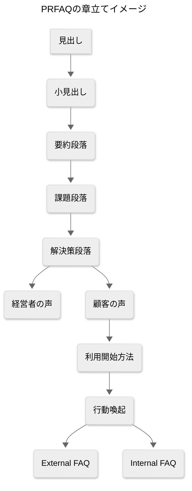

> この文書はAIが補助的に生成した草案です。最終的な正確性は元コードや一次情報で必ず検証してください。

## はじめに（ゴールの確認）

本ドキュメントは、[[Amazon]]式の[[PRFAQ]]（プレスリリースとFAQ）を作る前に、あなたとAIで重要ポイントを10問に分解して**同じ前提**に立つための認識合わせです。各質問には、背景、用語メモ、選択肢（3つ以上）、それぞれのメリット/デメリット、そして**推奨案**を示します。回答していけば、そのままPRFAQの各セクション（見出し/小見出し/要約/課題/解決策/引用/How to/CTA/外部FAQ/内部FAQ）を埋められるように設計しています。

---

## 1) プロダクト名（見出し）をどうしますか？

**背景**：PRの一行目は命。誰向けの何かが一瞬で伝わる必要があります。社内コードネームではなく、顧客語で分かる名前がPRFAQの基礎になります。

**用語メモ**

* [[見出し]]（Headline）：PRのタイトル。一目で便益が伝わる名前。

**選択肢**

* A. 「Excel Password Unlocker」（英語ストレート）

  * 利点：用途が瞬時に分かる。検索性高い。
  * 欠点：一般向けに硬い。差別化が弱い。
* B. 「Excel鍵あけ」（日本語カジュアル）

  * 利点：覚えやすく、口頭で伝えやすい。
  * 欠点：B2Bには軽く聞こえる可能性。
* C. 「Secure Excel Unlock」（安全性を強調）

  * 利点：[[セキュリティ]]配慮を一言で伝達。
  * 欠点：機能よりも抽象的に見える。
* D. 「Team Excel Unlock」（チーム利用を強調）

  * 利点：業務ユースを想起。導入の後押し。
  * 欠点：個人用途が対象外に見える。

**推奨**：Cをベースに日本語サブコピーで補強（例：Secure Excel Unlock ― 仕事の止まりを即解消）。
**理由**：本製品の価値は「安全に、早く、業務を前に進める」。安全性の旗を立てると差別化しやすい。

### プロジェクトオーナーの回答
- Cがいいです

---

## 2) 主要ターゲット顧客（小見出し）は誰に絞りますか？

**背景**：顧客像が曖昧だと文脈が散ります。PRFAQは「誰の何を救うか」を尖らせるほど強くなります。

**用語メモ**

* [[小見出し]]（Sub-Headline）：対象顧客と最重要便益を一行で伝える文。

**選択肢**

* A. 中小企業のバックオフィス（経理/総務）

  * 〇：月次の締めで「開けないExcel」が業務停止になりやすい。導入決裁も早い。
  * ✕：IT運用が弱いとS3などの理解に時間。
* B. 営業/コールセンター（資料更新・引用が多い部門）

  * 〇：即時性の価値が高い。現場の声が集めやすい。
  * ✕：セキュリティ承認が別部門に依存。
* C. SI/BPO事業者（顧客ファイルを大量処理）

  * 〇：ボリュームが出やすい。API連携需要あり。
  * ✕：要件が厳格。カスタム前提になりがち。
* D. 個人（確定申告/学校/PTAなど）

  * 〇：広い裾野。導入障壁が低い。
  * ✕：単価が低くサポートが割高化。

**推奨**：A → 次点でC。
**理由**：初速と検証の速さ重視。Aでプロダクト-マーケットフィットを作り、Cで規模化。

### プロジェクトオーナーの回答
- Dに近い
- 具体的にはNSC（私が勤めている会社）で膨大な鍵付きのExcelファイルを毎回手動で解除している和美さんの負担を軽減するために、PCがなくてもiPhoneなどから簡単にパスワード付きのExcelファイルのパスワード解除ができるようにしたいです。
- また、このパスワード解除の作業は、ソフトバンクから届くExcelがパスワード付きのものが多いので、約70名の前スタッフに効果があります
---

## 3) 核心価値（要約段落）で最も押す便益は？

**背景**：要約段落は「この段落だけで全体像が分かる」ことが目的。便益の主語を一つにしぼると伝わります。

**用語メモ**

* [[要約段落]]：製品の正体・便益・解決する課題を自己完結で示す一段落。

**選択肢**

* A. 「業務の停止時間を最小化する速さ」

  * 〇：現場メリットが明確。効果が測りやすい（分・時間）。
  * ✕：競合もスピードを主張しがち。
* B. 「社内持ち出し不要の安全運用」

  * 〇：[[S3]]や[[署名付きURL]]での限定公開を押せる。監査観点で強い。
  * ✕：安全策は裏側の価値で、顧客に伝わりにくいことも。
* C. 「面倒を自動化して運用コストを削減」

  * 〇：複数ファイルのバッチ処理・再DLまでの導線を強調可。
  * ✕：削減額の具体化がないと弱く見える。

**推奨**：A＋Bの複合（「止まりを即時に、安全に解消」）。
**理由**：現場は速さで動き、承認は安全で決まる。

### プロジェクトオーナーの回答
- Aです
- パスワード解除にかかる時間を最小にする
- パスワード解除が煩わしいために、重要なファイルを敬遠してしまうスタッフの心理的ブロックの低減
---

## 4) 課題段落で描く“痛み”はどれを主軸にしますか？

**背景**：共感がないPRは刺さりません。実際の業務停止シーンを描くと読み手が自分事化します。

**用語メモ**

* [[課題段落]]：顧客の視点で「なぜ今つらいのか」を具体シーンで描く。

**選択肢**

* A. 月次締めで開かない請求管理ファイル→チーム全体が待ち

  * 〇：B2Bで普遍的。意思決定者に刺さる。
  * ✕：経理以外にはやや遠い。
* B. 外部から受領したExcelの閲覧だけでも待ち時間発生

  * 〇：幅広い部門に該当。
  * ✕：痛みの深さがやや浅く見えるかも。
* C. 情シス依頼・管理者承認待ちで1日ロス

  * 〇：手戻り・人待ちの非効率を強調。
  * ✕：会社規模により共感差。

**推奨**：A→Cの順で構成。
**理由**：Aで強い痛みを描き、Cで体制の詰まりを重ねて温度を上げる。

### プロジェクトオーナーの回答
- これは、私たちソフトバンクチームで、ソフトバンクから展開される実績のExcelファイルのパスワード解除がファイル数が多いと非常に面倒
- このプロジェクトは、Google認証によるログインに対応するので、パスワード解除したファイルをそのまま自分のGoogle Driveに保存することもできるので、保存後のファイルの共有が早い
- Googleスプレッドシートはパスワード付きのファイルを操作できないので、Googleドキュメントでも簡単に観覧、編集できる
- Excelのパスワード解除はiPhoneでは無料では不可能。（観覧はできるが、編集はできない）

---

## 5) 解決策段落での差別化ポイントは何を先頭に出しますか？

**背景**：機能列挙ではなく、「他より良い・安い・速い」の*どれを主語にするか*を決めます。

**用語メモ**

* [[API Gateway]]/[[AWS Lambda]]/[[S3]]：サーバーレスで処理・保管を行う基盤。
* [[CORS]]：ブラウザからの許可ドメイン制御。
* [[署名付きURL]]：期限付きの限定アクセスURL。

**選択肢**

* A. 速さ（同期処理・即時DL）

  * 〇：体感価値が最も分かりやすい。
  * ✕：巨大ファイルでは限界あり。
* B. 安全（短寿命URL・最小権限・公開ブロック）

  * 〇：監査・法務で通しやすい。
  * ✕：価値が伝わるには説明が必要。
* C. 運用（複数ファイル/バッチ・履歴・通知）

  * 〇：継続利用の理由になる。
  * ✕：初期は実装コスト増。

**推奨**：Aを先頭、Bをすぐ後ろに重ねる。
**理由**：「速い×安全」の組み合わせが最短で刺さる。

### プロジェクトオーナーの回答
- 推奨の回答でOK

---

## 6) 価格モデルはどう設計しますか？

**背景**：PRFAQの外部FAQは価格を必ず聞かれます。初期はシンプルで、実態に合わせて拡張しやすい設計が吉。

**用語メモ**

* [[SLA]]：サービス品質の合意。
* [[サブスクリプション]]：月額など定額課金。

**選択肢**

* A. 従量課金（1ファイルあたり）

  * 〇：フェアで分かりやすい。小さく試せる。
  * ✕：予算化しにくい。変動が不安。
* B. サブスク（席数/チーム単位）上限つき

  * 〇：予算が立てやすい。定着しやすい。
  * ✕：小口の初回導入ハードルが上がる。
* C. ハイブリッド（基本料＋従量）

  * 〇：スケールに強い。B2B向けに安定。
  * ✕：説明が複雑化。

**推奨**：B（Small/Standard/Proの3段）＋超過時は軽い従量。
**理由**：企業導入の稟議が通しやすく、成長に合わせて拡張可能。

### プロジェクトオーナーの回答
- 社内利用は無料

---

## 7) データフロー方式はどこまで同期にしますか？

**背景**：体験の速さとシステムの耐性はトレードオフ。PRFAQで「どう速く」「どう安全か」を語る基礎です。

**用語メモ**

* 同期：呼んだらその場で結果が返る。
* 非同期：[[SQS]]/[[Step Functions]]で後から結果が届く。

**選択肢**

* A. 完全同期（今の構成のまま）

  * 〇：体験がシンプル。実装が最短。
  * ✕：大容量・多数同時でタイムアウト。
* B. 完全非同期（キュー投入→完了通知）

  * 〇：スケール強い。失敗リトライが容易。
  * ✕：体験が一段複雑。通知実装が必要。
* C. ハイブリッド（しきい値で分岐）

  * 〇：体験と耐性のバランスが良い。
  * ✕：判定ロジックと運用が増える。

**推奨**：C（サイズ/拡張子/暗号方式で分岐）。
**理由**：初期の速さを守りつつ、成長に耐える。

### プロジェクトオーナーの回答
- 基本はB
- 多分S3を使って、同時に並行して複数のファイルを処理できるようになるはず
- データベースを使う予定はないです。サイトを開いているときだけ使える感じでOK

---

## 8) セキュリティ/コンプライアンスの深さはどこまで？

**背景**：PRFAQの「安心材料」。どこまでやるかを先に決めると仕様がブレません。

**用語メモ**

* [[KMS]]：鍵管理サービス。
* [[CloudTrail]]/[[WAF]]：監査ログ/攻撃対策。

**選択肢**

* A. ベーシック：CORS制限・短寿命[[署名付きURL]]・最小権限IAM・S3パブリックブロック

  * 〇：軽量で効果大。初期に最適。
  * ✕：厳格業界には不足。
* B. エンハンスド：[[KMS]]カスタムキー、[[CloudTrail]]、[[WAF]]、IP許可制

  * 〇：多くのB2B要件を満たす。
  * ✕：コスト・運用が増える。
* C. エンタープライズ：専用VPC/PrivateLink、監査証跡拡充、DLP

  * 〇：大企業調達を突破しやすい。
  * ✕：初期負荷が大きい。

**推奨**：Bを目標、Aでローンチ。
**理由**：早く出して学び、必要な顧客で段階的に強化。

### プロジェクトオーナーの回答
- AでローンチでOK

---

## 9) サポート範囲（ファイル/機能）の初期スコープは？

**背景**：PRFAQは「何をやらないか」も明記すると信頼されます。

**用語メモ**

* [[msoffcrypto-tool]]：Excelの「開くためのパスワード」復号に使うライブラリ。
* [[シート保護]]：編集ロック。開封パスワードとは別物。

**選択肢**

* A. 開封パスワードの解除（.xlsx/.xls）に限定

  * 〇：明確・早い・品質を上げやすい。
  * ✕：編集保護の解除に期待される可能性。
* B. A＋シート保護解除（別経路）

  * 〇：現場の「ついでに」需要を取れる。
  * ✕：法務/倫理の検討が増える。技術も別。
* C. A＋フォーマット変換（CSV化など）

  * 〇：データ取り出しという別価値。
  * ✕：要件爆発のリスク。

**推奨**：A。
**理由**：最小で強い価値に集中し、依頼が多いものから順に拡張。

### プロジェクトオーナーの回答
- AでOK

---

## 10) 成功指標（KPI）とローンチ戦略は？

**背景**：PRFAQの外部FAQ/内部FAQで「成功の定義」が問われます。何を追うかを先に決めます。

**用語メモ**

* [[KPI]]/[[KGI]]：成果指標/最終目標。
* [[NPS]]：顧客推奨度。

**選択肢（KPI）**

* A. 1回目の解除成功率（初回成功率）

  * 〇：体験を直撃。改善対象が明確。
  * ✕：難ファイル比率に影響される。
* B. 平均処理時間（アップ→DLまで）

  * 〇：速度価値を定量化。
  * ✕：回線・サイズに左右。
* C. 失敗理由の特定率（再現/分類）

  * 〇：品質改善の土台。
  * ✕：分類コストがかかる。

**選択肢（ローンチ）**

* D. Private Beta（招待制）（Aターゲットの5社）

  * 〇：密に学べる。フィードバック濃い。
  * ✕：事例が増えるまで時間。
* E. Public Beta（誰でも試せる）

  * 〇：サンプルが多く集まる。
  * ✕：サポート負荷が急増。
* F. 業種特化パイロット（会計/BPO）

  * 〇：課題の深さが取れる。事例化しやすい。
  * ✕：横展開に調整が必要。

**推奨**：KPIはA+B+Cの三本柱。ローンチはD→Fの順。
**理由**：品質を素早く磨き、濃い事例でPRを強くできる。

### プロジェクトオーナーの回答
- まず成功率も何もパスワードはユーザーが提供するので、そのパスワードが合ってるかどうかだけです。
- パスワードの暗号化解除機能はダメです。要りません。
- 特にKPIいる？利用率じゃない？やるとするなら

- 使用できるユーザーはNSCの社員で、事前に利用したいスタッフのGmailアドレスを収集して、ホワイトリストで許可出す予定

---

## 参考：PRFAQの構成イメージ（図解）

---

## 回答テンプレ（そのまま上に埋めてOK）

* 1. プロダクト名：A/B/C/D（自由記入可）
* 2. ターゲット顧客：A/B/C/D
* 3. 核心価値：A/B/C（組み合わせ可）
* 4. 課題主軸：A/B/C
* 5. 差別化主軸：A/B/C
* 6. 価格モデル：A/B/C
* 7. データフロー：A/B/C
* 8. セキュリティ深さ：A/B/C
* 9. スコープ：A/B/C
* 10. KPI/ローンチ：A+B+C と D/E/F から選択

---

## 次の一歩（小さく前へ）

* 上のテンプレに回答→AIに「この回答でPRFAQ本文を書いて」と依頼すれば、一気通貫でドラフトが出せます。
* 迷う箇所は、まず**Aターゲット（中小企業バックオフィス）**に合わせて選ぶ。後から広げればOK。
* 技術用語や判断の根拠は、[[AWS]]/[[Next.js]]/[[shadcn UI]]/[[API Gateway]]/[[AWS Lambda]]/[[S3]]/[[CORS]]/[[署名付きURL]]/[[msoffcrypto-tool]] の設計メモを横に置いて進めるとブレません。