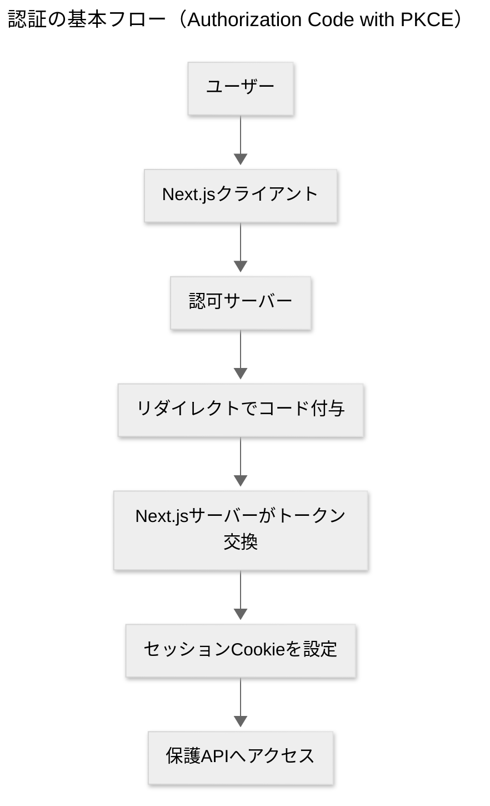

> 本ページはAIによる補助的な下書きです。最終的な正確性は原資料・コード・添付リポジトリを参照してください。

---

## 前提の共有（第3弾のねらい）

* 目的：**あなたの考えをより正確に反映するPRFAQ**の仕上げ。第2弾の重複を避け、**認証（AuthN）・認可（AuthZ）**と**見た目（Design/UI）**に絞って深掘りします。
* 参照リポジトリ：

  * メイン：Excel解除Webアプリ（[[Next.js]] + [[React]] + [[shadcn_ui]]、バックエンドは[[AWS]]構成を前提）。確認日 [[2025-08-21]]。
  * 見た目検証用：shadcnベースのプレイグラウンド（トークン・コンポーネント群・Toast/Progress/Skeleton・フォーム検証・ロギング等の実装メモあり、更新履歴 [[2025-08-18]] 付近）。
* 記法：用語はそのまま使い、**小学生でもわかる説明**を併記します。各問は**選択肢3つ以上**・**メリデメ**・**推奨**・**私の解答欄**を含みます。

---

---

# 認証と見た目の追加10問（第3弾）

> 形式：**質問 → 背景 → 用語メモ（必要時） → 選択肢（メリデメ） → 推奨 → 私の解答欄**

---

## 1) 認証方式の採用先はどれにしますか？（Cognito / Auth.js / マネージドIDaaS）

**背景**：初期は速さと安全の両立が重要。B2Bや将来の[[SSO]]拡張も視野に、**どこに寄せるか**を決めます。
**用語メモ**：[[OIDC]]は[[OAuth2]]の上に**IDトークン**を追加した標準、ログインの事実を安全に伝えます。

**選択肢**

* **A. [[AWS Cognito]]**

  * メリット：AWS連携が容易、将来の[[SAML]]や企業導入に強い
  * デメリット：初期の学習コスト、UIカスタムや細かなDXは重め
* **B. [[Auth.js]]（Next.jsサーバーで自己ホスト）**

  * メリット：Next.jsとの親和性、軽量に始められる
  * デメリット：将来の企業SSOやガバナンス要件は自前で拡張
* **C. マネージドIDaaS（例：[[Clerk]] / [[Auth0]]）**

  * メリット：開発速度が最速、UIやMFAが揃っている
  * デメリット：月額費用、ベンダーロックイン

**推奨**：**Bで開始 → 将来CまたはAへ**。短期は実装速度と制御性のバランスがよい。

### 私の解答欄
- B
- これってGoogleのAuth認証ってことですか？どうなんだろう？

#### AIの回答
**結論**  
Bの**Auth.js**は「Googleの認証（Sign in with Google）」**を含む**複数プロバイダ対応のライブラリです。  
= Google専用ではありません。**Googleを使いたいなら**Auth.jsの**Google Provider（OIDC）**を有効化すればOK。

**仕組みの要点（用語の短い解説）**  
- **OAuth2**：他サービスに「アクセス許可」を渡す仕組み（本人確認そのものではない）。  
- **OIDC**：OAuth2に**IDトークン**を足して「誰がログインしたか」を安全に伝える標準。  
- **PKCE**：盗聴・差し替えに強いコード交換方式（モバイル/SPAに適する）。

**初期のおすすめ（社内利用想定）**  
- Auth.js + **Google Provider（OIDC+PKCE）**  
- **ドメイン制限**（例：`@yourcompany.com` のみ）  
- **httpOnly+Secure Cookie**（SameSite=Lax/Strict）でセッション管理

**将来拡張**  
SSOやSAMLが要れば**Cognito/別IDaaS**へ移行可。Auth.js側は**プロバイダ差替え**で大枠を維持できます。

---

## 2) 認証フローは何を基本にしますか？（PKCE / パスワードレス / デバイスコード）

**ねらい**：ログインの“通り道”を決めます。ここを先に決めると、あとで作り直す手間が減ります。

**やさしい一言**：安全で一般的な道（[[PKCE]]）を“標準”に、メールだけで入れる道（パスワードレス）を“補助”にする、が分かりやすいです。

**専門用語の解説**
- **[[OAuth2]]**：他サービスに「この人にこの範囲でアクセスを許すよ」と伝える仕組み（“許可”の仕組み）。
- **[[OIDC]]**：OAuth2に**IDトークン**を足して「誰がログインしたか」を伝える標準。
- **[[PKCE]]**：盗み見に強い“合言葉の交換手順”。モバイルやSPAでも安全に使える。

**選択肢**
- **A. [[Authorization Code]] with [[PKCE]]（OIDC）を標準ルートにする**  
  - メリット：標準・安全・将来の拡張（MFAやSSO）にそのまま乗りやすい  
  - デメリット：最初の設定項目がやや多い
- **B. パスワードレス（Magic Link / Email OTP）を併用する**  
  - メリット：パスワード不要でラク、社内導入の摩擦が小さい  
  - デメリット：メール遅延時にイライラしやすい
- **C. デバイスコードフロー（PCとスマホで連携する方式）**  
  - メリット：マルチデバイスに便利  
  - デメリット：説明が必要で、初期は過剰なことが多い

**おすすめ**：**Aを基本、Bを補助**。まずはAで安定運用→必要が出たらBを足す。

### 私の解答欄
- これもつまり、GoogleのAuth認証ってことかな？Google Auth認証ならOKです

#### AIの補足
- **はい、OKです。**「Googleでログイン」は**[[OIDC]]プロバイダの一つ**です。実装としては **Auth.js の Google Provider** を有効化すれば、A（PKCE）と両立できます。  
- 社内だけで使うなら**ドメイン制限（例：@example.com）**を合わせると運用が安定します。

---

## 3) セッション管理とトークン保管はどうしますか？（Cookie / Storage / 混在）

**ねらい**：ログイン後の“鍵（トークン）”を**どこに置くか**を決めます。置き場所しだいで**攻撃への強さ**と**作りやすさ**が変わります。

**やさしい一言**：ブラウザに“触れない金庫（httpOnly Cookie）”を使い、鍵は**短い有効期限**にして定期的に**取り替える（回転）**のが安全です。

**専門用語の解説**
- **httpOnly Cookie**：JavaScriptから読めないCookie。盗み見（[[XSS]]）に強い。
- **Secure/[[SameSite]]**：HTTPSだけ送る、他サイトから勝手に送られないようにする設定。[[CSRF]]対策。
- **[[JWT]]**：署名つきの小さな“通行手形”。長く持たせるとリスクが上がる。
- **Refreshトークン回転**：短命な“通行手形”を定期的に更新して安全性を保つこと。

**選択肢**
- **A. httpOnly + Secure Cookie（SameSite=Strict）で保管**  
  - メリット：JSから読めず安全、設定がシンプル  
  - デメリット：クロスドメイン構成だとSameSite調整が必要
- **B. localStorageに[[JWT]]保存**  
  - メリット：実装が簡単  
  - デメリット：XSSに弱く、漏れたら取り戻しにくい
- **C. A + Refreshトークン回転（アクセストークンは短命）**  
  - メリット：漏えい被害を小さくできる、長期運用に強い  
  - デメリット：やや実装が増える

**おすすめ**：**C**。まずはAで動かし、早期にRefresh回転を足すとバランスが良いです。

### 私の解答欄
- これがなぜ必要なのかがわかりません。
- この質問について、もっと解説してください

#### AIの回答（やさしい解説）
- **なぜ必要？** ログイン後の“鍵”が誰かに盗まれると、**その人になりすまされる**からです。盗まれにくい置き方（httpOnly）と、盗まれても**すぐ無効になる仕組み（短命＋回転）**の両方があると安心です。  
- **悪い例**：localStorageに長生き[[JWT]]を入れる → [[XSS]]で読み出されると、しばらく不正ログインされ続ける。  
- **良い例**：httpOnly Cookieで短命トークン。定期的にRefreshで入れ替え。→ 盗まれても被害は短時間で終わります。

### 私の解答欄
- CでOK

---

## 4) 認可設計：どの粒度で権限を切りますか？（最小ロール / RBAC / スコープ）

**ねらい**：「誰が**どこまで**できるか」を線引きします。誤操作を減らし、情報の見せすぎを防ぎます。

**やさしい一言**：まずは**役割ごと**（ロール）にざっくり分け、細かい制御はあとから足す、が現実的です。

**専門用語の解説**
- **認可（AuthZ）**：ログインした“本人”に、**どの機能を許すか**を決めること。
- **[[RBAC]]**：Role-Based Access Control。役割単位で権限を束ねる考え方。
- **スコープ**：APIの操作単位の許可（例：`unlock:write`）。

**選択肢**
- **A. 最小3ロール（admin / staff / auditor）**  
  - メリット：分かりやすく導入が速い  
  - デメリット：特殊ケースは拾いづらい
- **B. RBAC + スコープ併用**  
  - メリット：APIの門番を細かくできる  
  - デメリット：設計・運用コストが増える
- **C. 機能フラグ併用（段階的公開）**  
  - メリット：危ない機能を**すぐ止める**保険になる  
  - デメリット：フラグ管理が必要

**おすすめ**：**A + C**で開始、必要に応じて**B**を追加。

### 私の解答欄
- ウェブからはログインして機能が使えればOKなので、どのユーザーに対しても全く同じ権限になるようにしてください

---

## 5) サインアップの入口をどう制御しますか？（招待 / ドメイン / フリー）

**ねらい**：誰でも入れるのか、社内だけなのか、入口を決めます。

**やさしい一言**：最初は**招待と社内ドメイン**に絞ると運用が安定します。

**選択肢**
- **A. 招待制（メールで招待リンク発行）**  
  - メリット：品質を保てる  
  - デメリット：拡大はゆっくり
- **B. ドメイン制限（`@company.com`のみ）**  
  - メリット：社内利用に向く  
  - デメリット：外部協力会社の参加には別対応が必要
- **C. フリーサインアップ（Captcha＋レート制限）**  
  - メリット：誰でも使える  
  - デメリット：サポート負荷・濫用リスクが増える

**おすすめ**：**A + B**から開始。

### 私の解答欄
- 招待制で許可したGoogleアカウントだけ利用できるようにしたいです
---

## 6) デザインシステムの土台はどうしますか？（最小テーマ / トークン拡張 / フルカスタム）

**ねらい**：見た目の“共通ルール”を先に決め、後から迷わないようにします。

**やさしい一言**：まずは**色・余白・角丸・影**などの**Design Token**だけ決め、必要になったら増やします。

**専門用語の解説**
- **Design Token**：色や余白など“見た目の基本値”。  
- **[[shadcn_ui]]**：アクセシブルな[[React]]コンポーネント集（[[Radix UI]]ベース）。

**選択肢**
- **A. 最小テーマ（primary色・角丸・影のみ上書き）**  
  - メリット：最速で統一感  
  - デメリット：ブランド個性は控えめ
- **B. トークン拡張 + 薄いラッパ（`<AppButton/>`など）**  
  - メリット：再利用性が高く、迷いが減る  
  - デメリット：初期に少し設計が必要
- **C. フルカスタム（[[Figma]]で全面設計）**  
  - メリット：個性最大  
  - デメリット：現段階では過剰

**おすすめ**：**B**（必要ならA→Bへ短期移行）。
- Aここは一旦最小構成でOK
- 私が既に作っているリポジトリの内容を流用できる部分は流用するようにして
---

## 7) フィードバックUIの標準を決めますか？（Toast / Alert / Progress）

**ねらい**：ユーザーに「今どうなっているか」を伝える“お作法”を統一します。

**やさしい一言**：**待ち**は[[Progress]]、**結果**は[[Toast]]、**重大**は[[AlertDialog]]で固定表示。

**選択肢**
- **A. Toast中心（成功・失敗・次の一手）**  
  - メリット：軽快で目に入る  
  - デメリット：流れて消える
- **B. Alert/Calloutで重要事項を固定**  
  - メリット：見落としにくい  
  - デメリット：操作が一手増える
- **C. Progress + Skeletonで“待ち”の不安を減らす**  
  - メリット：体感速度UP  
  - デメリット：少し実装が増える

**おすすめ**：**C + A**（重大時のみB）。

### 私の解答欄
- おすすめでOK

---

## 8) フォーム検証の方式は？（zod + react-hook-form / HTML標準 / 独自）

**ねらい**：入力ミスを**送信前**に気づけるようにします。

**やさしい一言**：**ルール（スキーマ）を一箇所**に書き、エラーメッセージを**同じ言い方**にします。

**選択肢**
- **A. [[zod]] + [[react-hook-form]]（単一スキーマ）**  
  - メリット：型安全・メッセージ統一・保守しやすい  
  - デメリット：最初に少し学習が必要
- **B. HTML標準バリデーション中心**  
  - メリット：最小工数  
  - デメリット：細かい条件分岐が苦手
- **C. 独自実装**  
  - メリット：自由度  
  - デメリット：保守が大変

**おすすめ**：**A**。

### 私の解答欄
- おすすめでOK

---

## 9) アクセシビリティの最低ラインをどこに置きますか？（フォーカス / コントラスト / キーボード）

**ねらい**：誰でも使える最低限の“やさしさ”を決めます。

**やさしい一言**：**フォーカス見える・コントラスト確保・キーボードだけで操作できる**の3点は最初から。

**選択肢**
- **A. 3点すべて対応（フォーム・ボタン・モーダルまで）**  
  - メリット：全員に優しいUI  
  - デメリット：一部デザイン調整が必要
- **B. 主要操作のみ対応**  
  - メリット：工数を抑えられる  
  - デメリット：抜け漏れリスク
- **C. 段階導入（まずフォームとボタン、次にモーダル等）**  
  - メリット：着実に改善  
  - デメリット：止まりがち

**おすすめ**：**A**（チェックリストで運用）。

### 私の解答欄
- おすすめでOK

---

## 10) ファイルアップロードのUIパターンは？（シンプル / ドロップゾーン / チャンク対応表示）

**ねらい**：アップロード中の不安を減らし、失敗時に**次の一手**をすぐ出せるUIにします。

**やさしい一言**：**ドラッグ&amp;ドロップ＋進捗バー＋再発行ボタン**が安心です。

**選択肢**
- **A. シンプルな`&lt;input type=file&gt;`のみ**  
  - メリット：実装最小  
  - デメリット：状態が分かりにくい
- **B. ドロップゾーン + プレビュー + 失敗時の署名URL再発行ボタン**  
  - メリット：直感的で分かりやすい  
  - デメリット：実装はAより増える
- **C. チャンク（分割）アップロードの進捗表示**  
  - メリット：大きいファイルでも安心  
  - デメリット：バックエンドの対応が必要

**おすすめ**：**B**を基本、必要が出たら**C**へ。

### 私の解答欄
- おすすめでOK

---

## 付録：このページの使い方

1. 各セクションの**私の解答欄**に回答（A/B/C複数可＋自由記述）。タイムスタンプは [[2025-08-21]] の時点でOK。
2. 回答を反映し、**PRFAQ本文**と**UIガイドライン**、**Auth設計**（プロバイダ・フロー・セッション・RBAC）を更新します。
3. 別リポジトリのUI実装（Toast/Progress/Skeleton/フォーム検証/トークン設定）を、プロダクトに安全に持ち込みます。

---