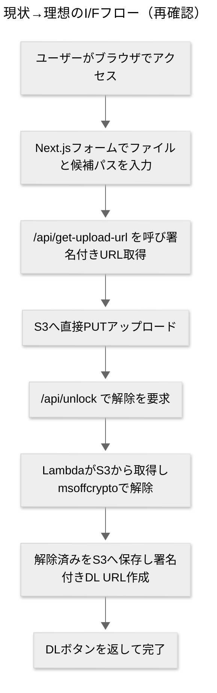
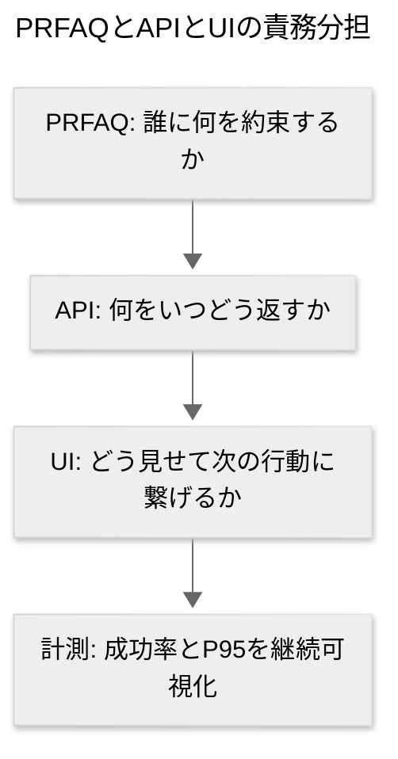

> 本ページはAIによる下書きです。最終的な正確性は元資料・原典コードを参照してください。

---

## 背景と前提（ここまでの合意の再掲）

* 対象プロダクト：Excelの「開くための暗号化」を、**既知のパスワード候補**で解除してダウンロードできるWebアプリ。総当りは対象外。[[msoffcrypto]] を使用（バックエンドは[[Python]] / [[AWS Lambda]]、入出力は[[S3]]、I/Fは[[API Gateway]]）。
* フロントは [[Next.js]] + [[React]] + [[shadcn_ui]] のシンプル構成で、**S3署名付きURL**で直接アップロード→解除→DLの流れを想定。
* 既存資料：

  * docs/企画/PRFAQ/ の **PRFAQ認識合わせ** と **API認識合わせ** の内容を踏まえる（当ページは「さらに精度を上げるための追加10問」）。
* 本日のリポジトリ状況（スナップショット [[2025-08-21]]）：

  * `backend/src/main.py` に [[msoffcrypto]] 利用の解除処理と [[S3]] I/O が実装（ログと例外処理の骨子あり）。
  * `frontend/` は [[Next.js]] の雛形と `FileUpload.tsx` が存在。**shadcn/uiの導入は未反映**、`/api/get-upload-url`・`/api/unlock` のルートも未実装。
  * 企画資料として **PRFAQ** と **API認識合わせ** のMDが存在（docs/企画/PRFAQ/ 配下）。

---

---

# さらに効果的なPRFAQのための「追加10問」

> 形式：各項目は**質問 → 背景 → 選択肢（メリデメ） → 推奨 → 私の解答欄**の順。専門用語は簡潔に解説します。

---

## 1) 主要ペルソナの一本化はどれにしますか？

**背景**：[[PRFAQ]] の「プレスリリース一枚目」は**誰に向けて**書くかで文体・価値訴求・成功指標が変わります。三兎を追うとメッセージが薄まります。

**選択肢**

* **A. 現場スタッフ（店舗・コールセンター）**

  * メリット：即効性のある「業務時短」「顧客対応の迅速化」を訴求しやすい
  * デメリット：IT管理や法務の論点はPRで触れにくい
* **B. 情シス/セキュリティ担当**

  * メリット：ログ、データ保持、[[SLA]]/監査などを軸に信頼を獲得できる
  * デメリット：現場の「すぐ助かる」手触りは薄くなる
* **C. フリーランス/個人事業主**

  * メリット：導入意思決定が速く、価格弾力性が高い
  * デメリット：B2Bスケールの説得材料になりにくい

**推奨**：**A（現場スタッフ）**に一本化し、Bの安心材料はFAQに折込む。理由：現行機能は「速い×簡単」がコア。一次価値が伝わる。
**私の解答欄（例：A/B/Cから選択）**

### 私の解答欄
- A
- Bは社内にないです。
---

## 2) 成功の定義（KPI/SLO）はどれを採用しますか？

**背景**：PR文中の定量は信頼を作ります。**KPI**は成果指標、**SLO**は体験品質の約束値。

**選択肢**

* **A. 初回解除成功率 ≥ 90%・P95処理時間 ≤ 8秒・失敗理由の可視化**

  * メリット：ユーザー体験に直結
  * デメリット：チューニングの継続投資が要る
* **B. 月間アクティブ解除ユーザー数・再訪率**

  * メリット：ビジネス成長が見える
  * デメリット：体験品質が曖昧になりやすい
* **C. 問い合わせ削減率（前月比）**

  * メリット：現場価値を説明しやすい
  * デメリット：外的要因に左右される

**推奨**：**A**をKPI+SLOとして明記、BとCは補助指標に。
**用語**：**P95**=遅い方から5%を除いた95%の処理時間。

### 私の解答欄
- A
---

## 3) 対応範囲・非対応範囲をどこまで明文化しますか？

**背景**：[[msoffcrypto]] の対応差・古い[[.xls]] 暗号などはFAQで誤解が起きやすい。

**選択肢**

* **A. 「開くための暗号化」限定、**総当り不可**、**シート保護解除は対象外** を明記

  * メリット：誤用とクレームを回避
  * デメリット：機能要望が増える
* **B. シート保護はベータで検討（期日：[[2025-10-01]] 目標）**

  * メリット：将来像を提示
  * デメリット：スコープ肥大化リスク
* **C. パスワード候補は最大2個（将来はN個）**

  * メリット：UIとAPIが単純
  * デメリット：一部ニーズを逃す

**推奨**：**A + C** を現時点の確定範囲に。Bはロードマップに分離。

### 私の解答欄
- 
---

## 4) データ保持とコンプライアンスの方針は？

**背景**：企業導入時に必ず問われます。**保持期間・保存場所・ログ粒度**をPRFAQで一貫表現。

**選択肢**

* **A. 入力ファイルは解除後すぐ削除・ログはメタ情報のみ・保持7日**

  * メリット：最小保持で安心
  * デメリット：トラブル調査の余地が少ない
* **B. 入力/出力とも暗号化保存・保持30日・監査ログ詳細**

  * メリット：企業監査に強い
  * デメリット：コスト・運用が増える
* **C. テナント/環境で選択可能（Free=A, Pro=B）**

  * メリット：価格差別化が可能
  * デメリット：実装が複雑

**推奨**：**C**（プランで選択）を将来像、**現状はA**で開始。

### 私の解答欄

---

## 5) 失敗時のUX文言をどう標準化しますか？

**背景**：現場は「何がダメだったか」が知りたい。**標準エラー語彙**は混乱を減らします。

**選択肢**

* **A. `password_incorrect` / `unsupported_format` / `timeout` をUIに人間語で表示**

  * メリット：対処が明確
  * デメリット：分類の保守が必要
* **B. すべて「解除できませんでした」のみ**

  * メリット：実装が最小
  * デメリット：不満が溜まりやすい
* **C. 失敗理由と**次の一手**（例：別候補を試す、古い.xlsは非対応の可能性）を同時提示**

  * メリット：次の行動に繋がる
  * デメリット：文言設計の工数

**推奨**：**C**（Aのコード＋対策案）。**例**：「2つの候補で失敗。別候補をお試しください」。[[2025-07-06]] の指示も踏まえる。

### 私の解答欄

---

## 6) 課金モデルの初期設計は？

**背景**：PRのFAQでは**価格**が最頻出。運用コストは[[S3]]/[[Lambda]]/転送料金に依存。

**選択肢**

* **A. 従量課金：1ファイルごと**

  * メリット：単純・納得感
  * デメリット：大量利用に不向き
* **B. 回数パック（例：100回）**

  * メリット：請求簡素化・割引で心理的障壁を下げる
  * デメリット：残回数管理が必要
* **C. 月額サブスク（上限あり）**

  * メリット：収益安定
  * デメリット：ライトユーザーに割高感

**推奨**：**A+B** で開始、需要を見て **C** を追加。

### 私の解答欄

---

## 7) パフォーマンス目標と制限は？

**背景**：PRFAQの信頼性は**数値の明記**で上がります。API/フロント双方に影響。

**選択肢**

* **A. P95 ≤ 8秒、最大ファイル 20MB、同時実行 50**

  * メリット：初期でも現実的
  * デメリット：一部大容量が弾かれる
* **B. P95 ≤ 3秒、最大 5MB**

  * メリット：体験は最高
  * デメリット：要大規模最適化
* **C. P95 ≤ 12秒、最大 50MB**

  * メリット：柔軟性
  * デメリット：タイムアウトやコスト増

**推奨**：**A**（将来は非同期キュー化で拡張）。

### 私の解答欄

---

## 8) セキュリティ設計の要点はどれを必須化しますか？

**背景**：[[署名付きURL]] の**期限短**・**最小権限**、バケット分離は最低ライン。

**選択肢**

* **A. 署名URL60秒・バケット公開ブロックON・出力は期限付き取得のみ**

  * メリット：実装容易で効果大
  * デメリット：URL期限切れの再発行が必要
* **B. KMSサーバーサイド暗号化 + VPCエンドポイント**

  * メリット：企業要件に強い
  * デメリット：コスト/構築が増える
* **C. IPレート制限 + WAF**

  * メリット：悪用対策
  * デメリット：チューニングが要る

**推奨**：**A**を必須、**B/C**は上位プランや将来の強化点。

### 私の解答欄

---

## 9) API I/Fの粒度は「同期」か「ジョブ型」か？

**背景**：大きいファイルや多数並列は**非同期（ジョブ型）**が安定。小～中は**同期**で体験が良い。

**選択肢**

* **A. 同期API（今の設計）**

  * メリット：UIが簡単
  * デメリット：タイムアウトに弱い
* **B. ジョブ型：`POST /jobs` → `GET /jobs/{id}`**

  * メリット：拡張性と耐障害性
  * デメリット：実装が増える
* **C. 同期 + ジョブ型の**ハイブリッド**（サイズ閾値で自動切替）**

  * メリット：体験と堅牢性の両立
  * デメリット：設計の複雑化

**推奨**：**C**（閾値例：10MBでジョブ化）。まずは **A** を短期でリリースして切替。

### 私の解答欄

---

## 10) フロントエンド構成の最小セットは？

**背景**：現在の `frontend` は雛形＋`FileUpload.tsx` のみ。**shadcn/ui** と **/api** ルートが未導入（[[2025-08-21]] 時点）。

**選択肢**

* **A. shadcn/ui導入（Button, Input, Progress, Toast）＋ `/api/get-upload-url` `/api/unlock` を実装**

  * メリット：実装最小で価値を出せる
  * デメリット：デザインの自由度は後回し
* **B. UIは素朴にCSSで開始、APIのみ追加**

  * メリット：最速で試せる
  * デメリット：可用性/可読性が落ちる
* **C. 先にテスト自動化（Playwright）とエラー文言辞書を整える**

  * メリット：運用品質が上がる
  * デメリット：初期の速度は落ちる

**推奨**：**A**を先に。Cは並行で軽く着手（文言辞書）。

### 私の解答欄

---

## 認識合わせのための短期チェックリスト（実装寄り）

* [[Next.js]] に `/api/get-upload-url` と `/api/unlock` を追加（サーバー側環境変数：`AWS_REGION` `S3_BUCKET_NAME` `UNLOCKER_API_URL`）。
* [[shadcn_ui]] を導入（Input, Button, Progress, Toast）し、**署名URL→S3 PUT→解除→DL** の直列処理をUIに実装。
* 失敗理由の標準語彙（`password_incorrect` など）と対処案を**UI文言辞書**に統一。
* ログは**メタ情報のみ**（平文パスワード・中身を残さない）。
* P95/成功率の計測を**最初から**仕込む（後付けは高くつく）。

---

## 参考：PRFAQに入れると効く一文テンプレ（叩き台）

* プレス文：
  「現場スタッフが**数クリック**で暗号化Excelの解除に再挑戦できます。多くのケースで**P95 8秒以内**に結果を返し、理由つきの失敗表示で次の一手を示します。」
* 外部FAQ：
  「このサービスは**既知のパスワード候補**を試す仕組みです。総当りは行いません。**ファイルは処理後に即時削除**し、DLリンクは**期限付き**です。」

---

### 補助図：PRFAQ→API→UIの責務分担

---

## 次の一歩（あなたと私の分担案）

* あなた：上の「**私の解答欄**」を埋める（各設問A/B/C…と自由記述）。期限の目安 [[2025-08-23]]。
* 私：回答を受けて、**PRFAQ本文（プレス+FAQ）**の更新版と、**APIスキーマ案**の整形を返します（`/api` 実装の雛形込み）。

---

**付記**

* 本ページは docs/企画/PRFAQ/ 内の既存認識合わせ資料と、実装方針メモ（署名URL2ルートなど）を統合して作成しています。

---