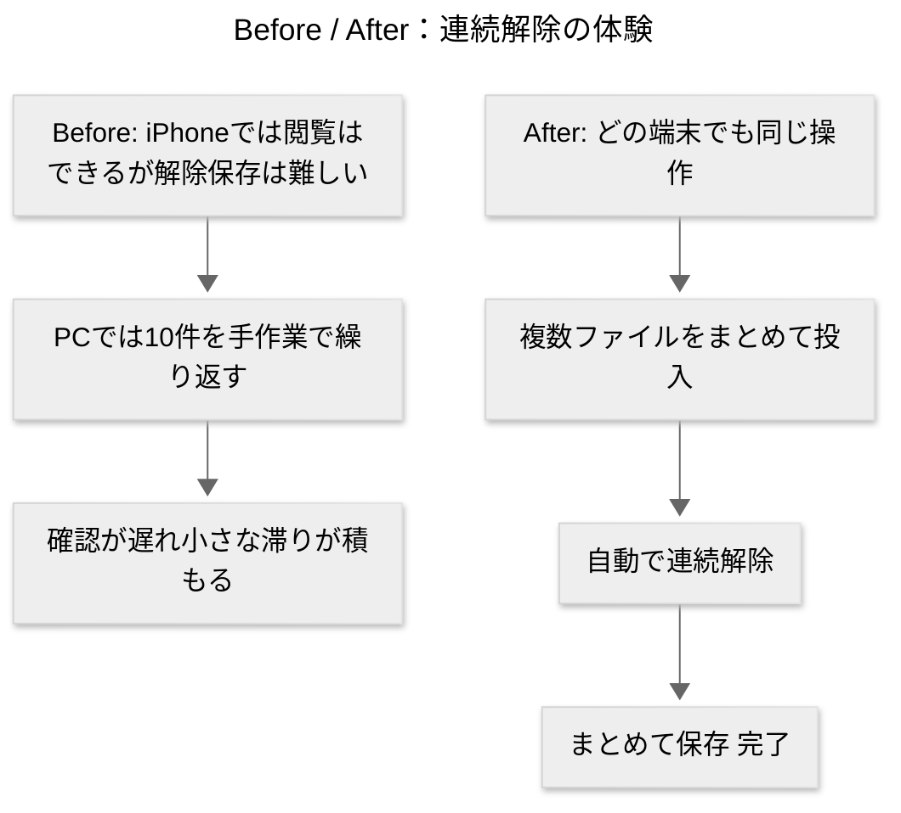
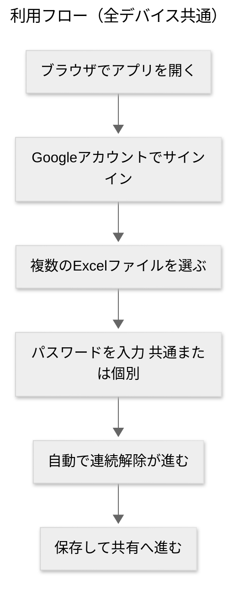

> この文書はAI支援で作成したドラフトです。最終判断や正確な情報は元資料・実装ドキュメントをご確認ください。

---

## PRセクション（プレスリリース）

### 見出し（Headline）

Secure Excel Unlock

### 小見出し（Sub-Headline）

スマホ・タブレット・PC・Macの**どれからでも**、パス付きExcelを**まとめて一気に**解除。

### 要約（Summary Paragraph）

東京、2025-09-01 — **Secure Excel Unlock** は、パスワード付きExcelを**複数ファイルまとめて**解除できる社内向けWebアプリです。使い方はシンプル。ブラウザで開き、ファイルを放り込み、パスワード（共通でも個別でもOK）を入力するだけ。あとは自動で連続処理され、保存まで一直線。
iPhoneでは「閲覧」はできても「解除して保存」は難しい、PCでも10件を手作業で解除するのは手間——その**日々の小さなつっかえ**を、端末を選ばず**一気に外す**のがこのサービスです。

### 課題（Problem Paragraph）

* **iPhoneの現実**：標準機能で閲覧はできるが、**解除して保存**ができない。現場で「後でPCでやろう」が積み重なる。
* **PCの現実**：Excelがあれば解除は可能。でも**10件連続**でやると、開く→入力→保存→閉じるの繰り返しで**手間と時間**がかかる。
* **結果**：確認・共有が遅れ、仕事の流れが**小さく滞る**。数字を見るのが後ろ倒しになり、意思決定も鈍る。

### 解決策（Solution Paragraph）

**Secure Excel Unlock** は、**端末を選ばず**同じ操作で使える**連続解除**ツール。
1回の操作で**複数ファイルを投入**→**自動で順番に解除**→**まとめて保存**。
難しい設定は不要。ブラウザさえあれば、スマホでもPCでも**同じ感覚**で扱えます。今日届いた10件も、**数分で片付く**イメージです。

### 経営者の声（Leader's Quote）

「”あとでやる”が消えると、現場は軽く速くなる。Secure Excel Unlock は、その小さな詰まりを**毎日**ほどくための道具です。」

### 顧客の声（Customer Quote）

「10件来た日も、**まとめて放り込んで終了**。作業の合間に片付くから、**確認が今日のうち**に終わるようになった。」

### 利用開始方法（How to Get Started）

1. 事前に**登録されたGoogleアカウント**でサインイン（社内管理者が登録します）。
2. ブラウザでアプリを開き、**解除したいExcelを複数まとめて選択**。
3. パスワードを入力（共通でも個別でもOK）。
4. **自動で連続解除**→**保存**。そのまま社内共有へ。

### 行動喚起（Call to Action）

**ベータ利用の申し込み**・**登録アカウントの追加**は管理者まで。実際の利用シーンや改善点のフィードバックも歓迎です。

---

## External FAQ（社外想定のよくある質問）

### 価格と提供時期

* **価格はいくらですか？**
  社内提供のため**利用者負担はありません**（インフラ費は組織負担）。
* **いつから利用できますか？**
  段階的なベータ提供を実施中。部門単位で順次拡大します。

### 機能と利用方法

* **主な機能は何ですか？**
  パスワード付きExcelの**連続解除（バッチ処理）**、**複数ファイルの一括投入**、**まとめて保存**。
  対応形式は一般的なExcelファイル（.xlsx/.xls）です。
* **どうやって使うの？**
  ブラウザでアクセス→**サインイン**→**ファイルをまとめて選ぶ**→**パスワード入力**→**自動で連続解除**→**保存**。端末は**スマホ・タブレット・PC・Mac**いずれもOK。

### 互換性とセキュリティ

* **既存サービスと連携できますか？**
  まずは**端末への保存**から。共有フォルダやクラウドへの保存は、利用状況を見て検討します。
* **私のデータは安全に扱われますか？**
  サインイン時は**Googleアカウント**を使います（本人確認の仕組み）。ファイルの受け渡しには**有効期限つきの特別なリンク**を使い、時間が過ぎると使えなくなります。ログは**必要最小限**のみ扱い、運用上不要な保管は行いません。
  ※用語ミニ解説：

  * **サインイン**…あなたが本人であることを確認すること。
  * **有効期限つきリンク**…一定時間だけダウンロードできる安全なリンク。

### 競合・バージョン比較

* **他と比べてどこが優れていますか？**
  ExcelやPC操作だけで**10件連続**をこなすより、**一括投入→自動連続解除**で**早く・楽に・ミス少なく**進められます。端末を選ばないので、**その時に手元にある機器**で処理できます。
* **現行バージョンとの違いは？**
  v2では、**全デバイス前提の体験**と**連続解除のわかりやすさ**を強化。導線・文言も非エンジニアに合わせて調整しました。

### サポートとロジスティクス

* **困ったときは？**
  失敗時は画面に**理由と対処のヒント**が表示されます。解決しない場合は、アプリ内の案内からサポートへご連絡ください。
* **解約や停止は？**
  社内提供のため返金はありません。アカウントの**停止・削除**は管理者が対応します。

---

## Internal FAQ（社内向け）

### 戦略とビジョン

* **最重要の意思決定ポイントは？**

  1. **全デバイスで同じ体験** 2) **連続解除で日々の詰まりを除去** 3) **小さく始めて素早く磨く**。

* **なぜ今この課題に取り組むのか？**
  「閲覧はできるが解除保存ができない」「手作業の連続解除が重い」という**毎日の小さな遅延**をつぶすことで、現場の**意思決定の速度**を上げるため。

* **採用しなかった代替案は？**
  PC前提の手順徹底、重い統合システム先行導入、完全自動の大規模連携からの着手。**運用負荷と初期コスト**が大きいので見送り。

* **製品のTenets（拠り所）は？**

  * **同じ操作で、どの端末でも**
  * **複数ファイルを、まとめて**
  * **安全は空気のように当たり前に**

* **失敗要因トップ3と手当て**

  1. パスワード不一致 → **分かりやすい再入力導線**
  2. 回線や端末の一時不良 → **リトライボタン**
  3. 大量投入時の待ち時間 → **進捗表示と順次保存**

### 市場と競合

* **ターゲット顧客は？**
  社内のショップ運営・バックオフィスのメンバー。日常的にパス付きExcelを扱う人。
* **差別化ポイントは？**
  **全デバイス対応の一括投入→自動連続解除**。時間と手間を着実に削減。
* **乗り換え障壁は？**
  ブラウザでアクセスするだけ。初回サインイン後は**直感操作**で利用開始。

### 財務とビジネスモデル

* **価格設定モデルは？**
  社内無料（インフラ費は組織負担）。
* **効果の見立ては？**
  1ファイルあたりの**操作時間短縮**と**後回し削減**が主要効果。処理件数×短縮時間で便益を算出。
* **初期投資・損益分岐は？**
  小規模スタートで検証し、利用率に応じてスケール。明確な損益分岐点より**時間価値**を重視。

### 技術とオペレーション

* **最大の技術課題は？（平易に）**

  * **古い形式のExcel**：パスワードの仕組みが古いと失敗が起きやすい
  * **大量連続処理**：同時にたくさん動いても安定させる必要
  * **通信品質**：モバイル回線でも途切れにくく
* **主要運用指標（KPI）は？**
  **利用率**、**1ファイルあたり平均処理時間**、**失敗率と理由の内訳**。
* **関係部署は？**
  管理者（アカウント登録）、情報システム（運用ルール・ポリシー整備）。

### 市場投入とローンチ

* **ローンチ戦略は？**
  小さく始め、**よく使う部門から順次横展開**。フィードバックで言葉と導線を磨く。
* **主要リスクは？**
  ファイル形式差や大量投入時の待ち時間。→**ガイド文と進捗表示**で不安を下げる。
* **初期バージョンの不足点は？**
  まずは**端末保存に集中**。共有先連携は利用実態に合わせて段階導入。
* **成功指標は？**
  **連続解除でどれだけ作業が前倒しになったか**（利用率・処理時間・後回し削減の定性コメント）。

### 法務とコンプライアンス

* **適用される規定は？**
  社内の情報取り扱いポリシーに準拠。**権限のあるファイルのみ**を対象。総当たりのような不正な試行は行いません。
* **アカウントとデータの扱いは？**
  **事前に登録されたGoogleアカウント**のみ利用可。ファイルの受け渡しは**有効期限つきリンク**を用い、不要な保管はしません。

---

## 図解

---

## 付記（運用メモ）

* アカウントは**事前登録制**。管理者が対象ユーザーのGoogleアカウントを登録します（ホワイトリストという呼称は使いません）。
* 利用ガイドは**画面内の案内**に統一。ヘルプは「原因→対処」を短く提示します。
* まずは**連続解除の安定と分かりやすさ**に集中。連携機能は利用状況を見て段階導入します。