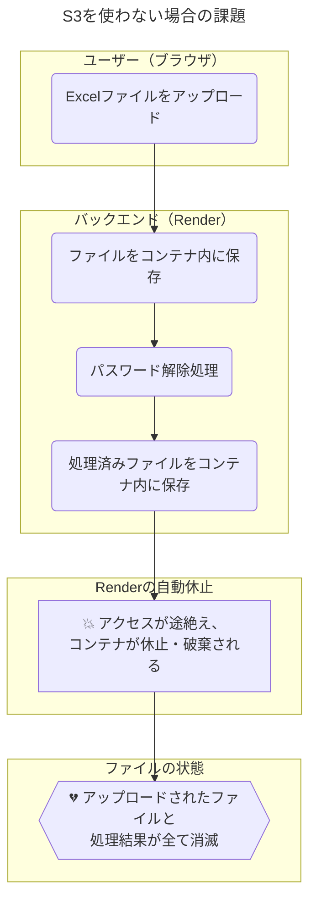
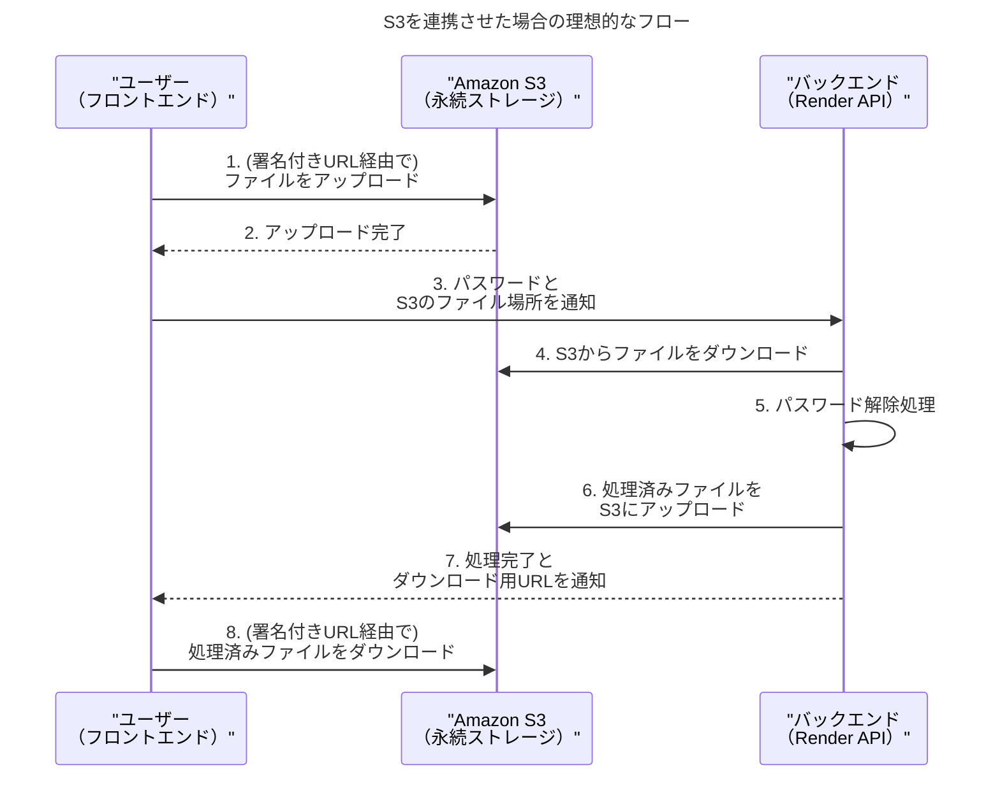

# 【解説】RenderにおけるS3連携の必要性

## 1. はじめに

この資料は、`[[API開発の認識合わせ]]`で定義した要件、特に**フロントエンドとバックエンドを分離し、バックエンドをRenderで構築する**という構成において、なぜAmazon S3のような外部のファイルストレージとの連携が重要になるのかを解説するものです。

## 2. 結論：なぜS3連携が必要なのか？

結論から言うと、**Renderの実行環境（コンテナ）は一時的なものであり、アップロードされたファイルや処理結果を永続的に保存しておくことができないから**です。

Renderのサービス（Web ServiceやOne-Off Job）は、コスト効率を高めるために、処理が終了したり、一定時間アクセスがなかったりすると、自動的に**休止（スリープ）または破棄**されます。このとき、実行環境のファイルシステムに保存されていたデータは**全て失われます**。

この「状態を保持しない（ステートレス）」という性質のため、ファイルの置き場所として、Renderの実行環境とは独立した永続的なストレージ、すなわち**S3**が必要不可欠となります。

## 3. 図解：処理フローの比較

S3を使わない場合と使う場合で、APIの処理フローがどのように変わるかを比較します。

### S3を使わない場合の問題点

この図のように、Renderのコンテナが休止・破棄されると、ユーザーが次にアクセスした際にファイルが存在せず、処理を続行できません。

### S3を連携させた理想的な処理フロー

S3を間に挟むことで、Renderの実行環境の状態に依存せず、ファイルを安全に管理できます。

## 4. 詳細解説

### Renderの「ステートレス」な性質

`[[【入力】開発_2025年7月時点で各クラウドバッチ実行サービスをコスト・速度・運用負荷で比較]]`の資料にもある通り、Renderのサービスは、特にコストを抑えるプランやバッチ処理（One-Off Job）において、以下のような特徴を持ちます。

- **自動スリープ**: `[[API開発の認識合わせ]]`でご要望のあった「プログラム開始時にレジュームして、プログラムが終了したら休止状態にする」という運用は、まさにこの性質を利用したものです。しかし、休止するとメモリやディスク上のデータは失われます。
- **一時的なファイルシステム**: 実行中のコンテナが持つディスクは、そのコンテナが生きている間しか使えません。

### API要件とステートレス性の課題

`[[API開発の認識合わせ]]`で決めた以下の要件を考えたとき、Renderのステートレス性は課題となります。

- **要件**: ユーザーがファイルをアップロードし、処理済みのファイルをダウンロードする。
- **課題**: アップロードされたファイルを処理し、ユーザーがダウンロードするまでの間、そのファイルをどこに置いておくか？

Renderのコンテナ内では、いつファイルが消えるか分かりません。そのため、信頼性のある保管場所が必要になります。

### S3がもたらす解決策

Amazon S3（またはCloudflare R2, Google Cloud Storageなどの互換サービス）は、この問題を解決するための最適なソリューションです。

- **永続性**: S3に保存されたファイルは、明示的に削除しない限り消えません。Renderのコンテナが何度休止・再起動しても安全です。
- **独立性とアクセス性**: S3はRenderの環境から独立しており、安全な認証情報（APIキーなど）を使えば、フロントエンドとバックエンドの両方から直接アクセスできます。これにより、Renderサーバーに大きなファイルの負荷をかけることなく、効率的なアップロード・ダウンロードが実現できます。
- **セキュリティ**: S3は「署名付きURL」という仕組みを提供します。これは、一時的に有効なURLを発行し、そのURLを知っている人だけが特定のファイルをアップロード・ダウンロードできるようにする機能です。これにより、認証されたユーザーだけが安全にファイルを扱えるようになります。

## 5. S3のコストについて

S3を利用する上で気になるのがコストですが、**S3は非常に低コストで利用できる**のが大きな利点です。料金体系は少し複雑ですが、主に以下の3つの要素で決まります。

1.  **ストレージ料金**: ファイルを保存している容量と期間に応じた料金。
2.  **リクエスト料金**: ファイルのアップロード（PUT）やダウンロード（GET）などの操作回数に応じた料金。
3.  **データ転送料金**: S3からインターネットへデータをダウンロード（転送）した量に応じた料金。

### 今回のAPI利用におけるコストシミュレーション

仮に、**1ヶ月に平均5MBのExcelファイルを1,000個処理する**と想定して、東京リージョンでS3を利用した場合の料金を試算します。
（※料金は2025年7月時点の概算値であり、為替レートによって変動します）

| 項目 | 利用量 | 単価（概算） | 月額料金（概算） | 備考 |
| :--- | :--- | :--- | :--- | :--- |
| **ストレージ料金** | 5GB | ¥3.75 / GB | **約 ¥19** | 5MB × 1,000ファイル |
| **リクエスト料金** | 4,000リクエスト | ¥0.6〜7.5 / 1,000回 | **約 ¥16** | アップロード、ダウンロード、処理前後で計4,000回と想定 |
| **データ転送料金** | 5GB | **無料** | **¥0** | AWSの無料利用枠（月100GBまで）の範囲内 |
| **合計** | | | **約 ¥35 / 月** | |

このシミュレーションの通り、月間で1,000ファイルという比較的多めの利用を想定しても、**月額数十円程度**という非常に低いコストで、信頼性と永続性の高いファイルストレージを利用できます。

### コスト削減のための考慮事項

さらにコストを最適化するために、以下のような施策も有効です。

-   **ライフサイクルポリシー**: 古くなったファイル（例: 30日以上経過した処理済みファイル）を自動的に削除するように設定し、不要なストレージ料金を削減する。
-   **適切なストレージクラスの選択**: アクセス頻度が低いファイルを、より安価なストレージクラス（S3標準-IAなど）に移動させる。（今回のユースケースではS3標準が最適です）

このように、S3は単に技術的な問題を解決するだけでなく、**コストパフォーマンスの面でも非常に優れた選択肢**と言えます。

## 6. まとめ

**`[[API開発の認識合わせ]]`で目指す「低コストで安全なAPI」を実現するためには、Renderのステートレスな実行環境を、S3の永続的なファイルストレージで補うアーキテクチャが不可欠です。**

-   **Render**は、パスワード解除という「処理」そのものを担当します。
-   **S3**は、処理対象となるファイルと、処理結果のファイルを安全に「保管」する役割を担います。

この役割分担により、スケーラブルで堅牢、かつ低コストなシステムを構築することができます。 