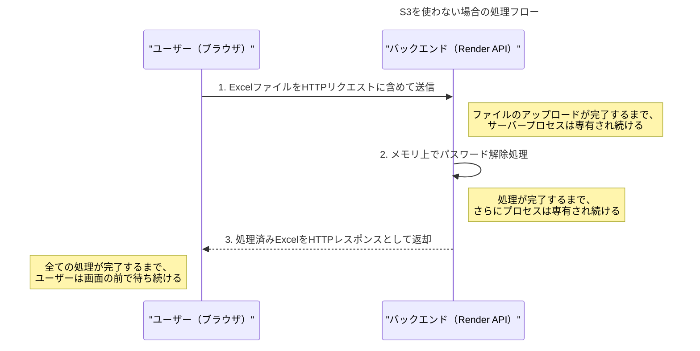
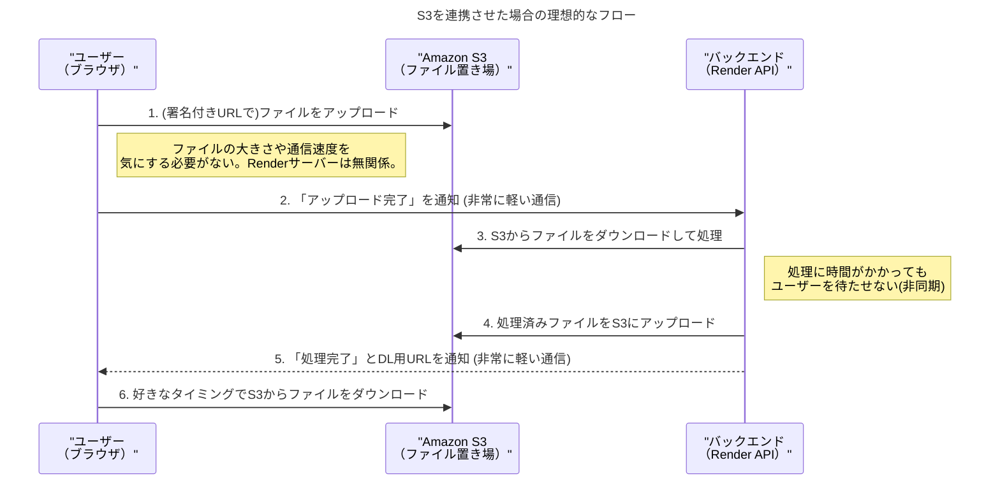

# 【解説】なぜ「すぐ消すファイル」にもS3が必要なのか？

## 1. ご質問の背景

「Excelをアップロードし、パスワード解除済みのファイルを返せれば、その後のファイルは不要。このシンプルな処理になぜS3が必要なのか？」

この資料は、上記のご質問にお答えするものです。結論から言うと、**たとえファイルが一時的なものであっても、S3を介する方が、技術的な問題が少なく、結果としてシンプルで安定したシステムを構築できるから**です。

## 2. S3を使わない「最もシンプルな構成」とその問題点

まず、S3を使わずにバックエンド（Render）だけで処理を完結させる構成を考えてみます。

一見、最も直接的でシンプルに見えますが、この構成にはWebアプリケーション特有の**3つの大きな技術的制約**が存在します。

### 問題点１：HTTPリクエストのタイムアウト
Webサーバーは、一つのリクエストを無限に待ち続けることはできません。通常、**30秒〜60秒**でタイムアウトするように設定されています。もしユーザーが大きなExcelファイルをアップロードしたり、パスワード解除処理に時間がかかったりして、この時間を超えてしまうと、処理の途中でも**接続が強制的に切断され、エラー**になります。

-   **懸念**: 10MBのファイルを低速な回線でアップロード → タイムアウトの可能性
-   **懸念**: 複雑なExcelファイルの処理に時間がかかる → タイムアウトの可能性

### 問題点２：リクエストサイズの制限
サーバーが一度に受け取れるリクエストのサイズには上限があります。Renderや多くのホスティングサービスでは、この上限は数MB〜数十MB程度に設定されています。これを超えるサイズのファイルは、**そもそもアップロード自体がブロックされてしまいます**。

-   **懸念**: 50MBのExcelファイル → アップロード失敗の可能性

### 問題点３：メモリ使用量の増大
この構成では、アップロードされたファイルと処理中のファイルが、すべてRenderサーバーのメモリ上に展開されます。もし複数のユーザーが同時に大きなファイルをアップロードすると、サーバーの**メモリを使い果たし、サーバーダウン**を引き起こす可能性があります。他のユーザーもサービスを使えなくなってしまいます。

-   **懸念**: 複数ユーザーが同時に利用 → サーバー全体のパフォーマンス低下・ダウンの可能性

## 3. S3がこれらの問題をどう解決するか

S3を導入することは、これらの問題をまとめて解決する、最も現実的でシンプルな「解決策」となります。

### S3による解決策

-   **タイムアウト問題の解決**: ファイルの送受信は、時間制限のないS3が担当します。Renderは「処理の開始」と「完了通知」という軽い通信だけを受け持つため、タイムアウトの心配がありません。

-   **サイズ制限問題の解決**: S3は数TB（テラバイト）のファイルまで扱えるため、実質的にファイルサイズの制限はなくなります。

-   **メモリ問題の解決**: ファイルの実体はS3にあるため、Renderサーバーのメモリを圧迫しません。安定したサービス提供が可能になります。

## 4. まとめ：なぜS3が「必要十分」なのか

| | S3を使わない構成 | S3を使う構成 |
|:---|:---:|:---:|
| **シンプルさ** | 見た目はシンプル | コンポーネントは増える |
| **安定性** | **低い**（タイムアウト、サイズ制限、メモリ枯渇リスク） | **高い** |
| **ユーザー体験** | 悪い（長時間待たされる、エラーが起きやすい） | 良い（アップロード・ダウンロードが安定） |
| **結果** | **安定的ではなく、実用性に欠ける** | **シンプルで堅牢な「必要十分」なシステム** |

「APIを呼び出したら、あとは良きに計らってくれる」という安心感のあるシステムを作るためには、ファイルのアップロード・ダウンロードという「重い処理」を、その道のプロであるS3に任せることが不可欠です。

S3は一見すると「追加の部品」に見えますが、実際には**Webアプリケーションの弱点を補い、システムをシンプルかつ堅牢にするための最も効果的な選択肢**なのです。 