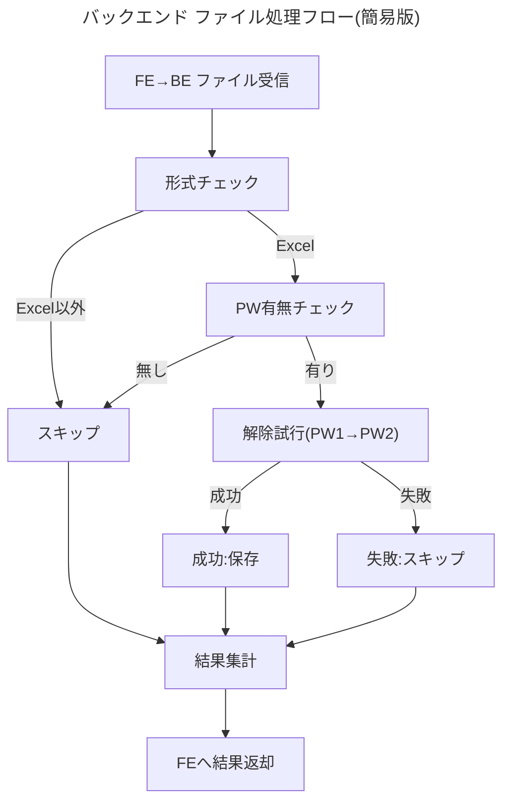

# バックエンド ファイル処理とエラーハンドリング仕様

ここでは、パスワード付き[[Excel]]ファイルを安全かつ効率的に処理するためのバックエンド仕様をまとめます。

## 1. 基本ポリシー
1. すべてのファイル判定をバックエンドで実施。
2. Excel以外 or パスワード無しファイルはスキップし、全体処理は継続。
3. 詳細なエラー情報をフロントエンドへ返却。

## 2. 処理対象
- 対象: `.xlsx`, `.xls` でパスワード保護されているファイル
- 除外: パスワード無しExcel、Excel以外の全ファイル

## 3. 処理フロー


## 4. 主要関数(擬似コード)
```python
from datetime import datetime
import io, msoffcrypto

class UnlockResult:  # 簡易データクラス
    def __init__(self, success: bool, file=None, used_password: str | None=None, message=""):
        self.success = success
        self.file = file
        self.used_password = used_password
        self.message = message


def is_excel_file(file):
    allowed = [".xlsx", ".xls"]
    return any(file.filename.lower().endswith(ext) for ext in allowed)


def has_password(file):
    try:
        of = msoffcrypto.OfficeFile(file)
        return of.is_encrypted()
    except Exception:
        return True  # 解析できない=何かしら保護


def unlock_excel(file, pw1, pw2):
    for pw in (pw1, pw2):
        try:
            of = msoffcrypto.OfficeFile(file)
            of.load_key(password=pw)
            buf = io.BytesIO()
            of.decrypt(buf)
            return UnlockResult(True, buf, pw, "解除成功")
        except Exception:
            continue
    return UnlockResult(False, message="解除失敗")
```

## 5. エラー分類 & レスポンス例
| type | status | message |
|------|--------|---------|
| 非Excel | skipped | Excel以外のファイル |
| PW無し | skipped | パスワード未設定 |
| 解除失敗 | failed  | 提供PWで解除不可 |

```json5
{
  "overall_status": "completed",
  "results": [
    {"filename": "doc.xlsx", "status": "success"},
    {"filename": "pic.png", "status": "skipped", "reason": "非Excel"}
  ]
}
```

## 6. セキュリティ & パフォーマンス
- 処理後24hでファイル自動削除
- 50MB/ファイル、同時10ファイルまで
- ストリーミング処理でメモリ節約

---
より詳細な実装例やログ出力仕様は今後拡充予定です。
