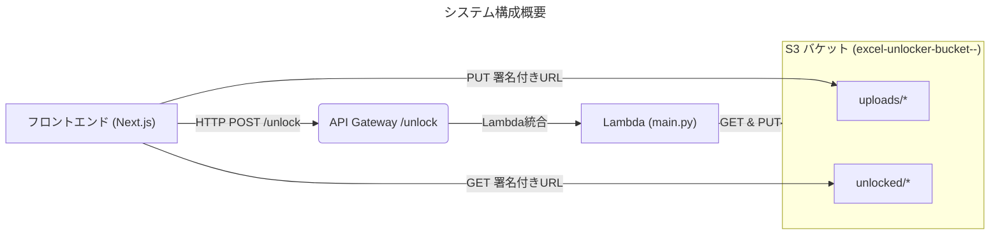
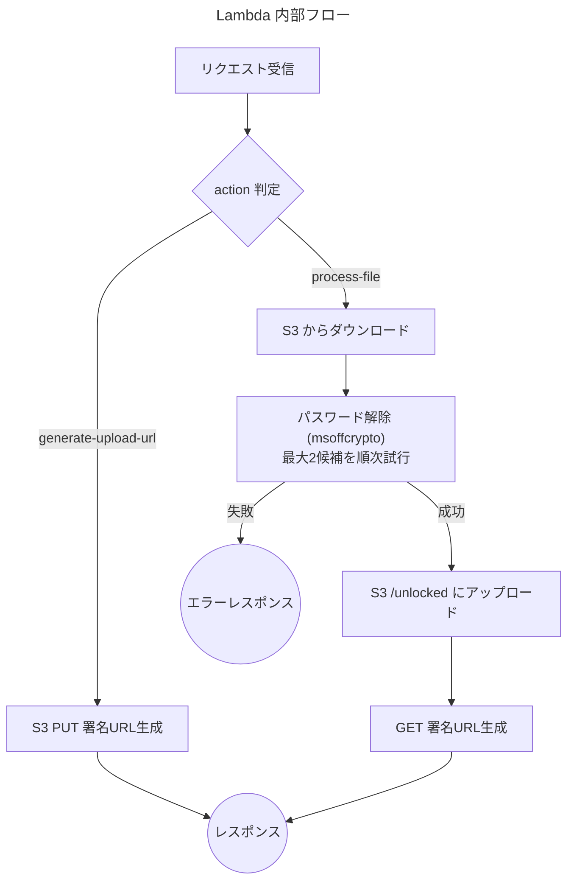

# Excelパスワード解除ツール  
## バックエンド総合仕様書

> **目的**: フロントエンド開発者が "このドキュメントだけ" で現行バックエンドの動作を正確に理解できるよう、実装・インフラ・運用の要点を網羅します。

---

## 1. 全体アーキテクチャ



* **API Gateway**: リソースパス `/unlock` (POST)。
* **Lambda**: 1本のみ (`backend/src/main.py`)。
* **S3**: 1バケットに `uploads/` と `unlocked/` プレフィックスを切り分けて格納。

---

## 2. エンドポイント仕様

| 項目 | 値 |
| --- | --- |
| URL | `/unlock` (API Gateway のみ定義) |
| HTTP メソッド | `POST` |
| 認証 | なし (開発環境) ※本番では CORS & IAM で制御推奨 |
| Content-Type | `application/json` |
| CORS | `Access-Control-Allow-Origin: *` (開発用) |

### 2.1 アクション分岐
`body.action` により 2 種類のサブ機能を同一パスで提供します。

1. `generate-upload-url` … フロントエンドが S3 にファイルを直接 PUT するための署名付き URL を発行
2. `process-file` … S3 上の暗号化ファイルをダウンロードし、パスワード解除 → アップロード → DL URL 返却

> **注意**: これらは今後、API Gateway レベルで `/generate-upload-url` と `/unlock` に分ける拡張計画あり。

#### 2.1.1 署名付きURL発行 `generate-upload-url`
```
POST /unlock
{
  "action": "generate-upload-url",
  "file_name": "sample.xlsx"
}
```
レスポンス例
```
200 OK
{
  "upload_url": "https://excel-unlocker-bucket-...amazonaws.com/uploads/uuid/sample.xlsx?X-Amz-...",
  "s3_key": "uploads/uuid/sample.xlsx"
}
```

#### 2.1.2 パスワード解除実行 `process-file`
```
POST /unlock
{
  "action": "process-file",
  "s3_key": "uploads/uuid/sample.xlsx",
  "password_1": "1234",
  "password_2": "abcd"
}
```
レスポンス例 (成功)
```
200 OK
{
  "message": "File unlocked successfully!",
  "download_url": "https://excel-unlocker-bucket-.../unlocked/sample_unlocked.xlsx?X-Amz-..."
}
```

エラー例 (全パスワード失敗)
```
400 Bad Request
{ "error": "All provided passwords failed to unlock the file." }
```

---

## 3. Lambda 実装概要 (`backend/src/main.py`)



### 3.1 主な関数
| 関数 | 役割 |
| --- | --- |
| `generate_presigned_url(bucket, key, http_method)` | S3 署名付き URL 生成 (PUT/GET) |
| `download_file_from_s3(bucket, key)` | `/tmp` に一時保存 |
| `unlock_excel_file(file_path, passwords)` | `msoffcrypto-tool` で解除を試行 |
| `upload_file_to_s3(local, bucket, key)` | 解除後ファイルをアップロード |
| `handle_generate_upload_url(body)` | アップロード URL 発行アクション処理 |
| `handle_process_file(body)` | 解除アクション処理 |
| `lambda_handler(event, context)` | エントリーポイント |

### 3.2 環境変数
| 変数 | 意味 | 必須 | 例 |
| --- | --- | --- | --- |
| `AWS_REGION` | S3 クライアント初期化用 | ✔️ | `ap-northeast-1` |
| `S3_BUCKET_NAME` | 入出力バケット名 | ✔️ | `excel-unlocker-bucket-123456789012-ap-northeast-1` |
| `LOG_LEVEL` | `INFO/DEBUG` など | ❌ (`INFO` デフォルト) | `DEBUG` |

### 3.3 依存ライブラリ (`backend/src/requirements.txt`)
- `msoffcrypto-tool`
- `boto3`

---

## 4. CloudFormation テンプレート (`template.yaml`)

```yaml
AWSTemplateFormatVersion: '2010-09-09'
Transform: AWS::Serverless-2016-10-31
Description: Excel Password Remover API
Globals:
  Function:
    Timeout: 30
    MemorySize: 128
    Runtime: python3.9
Resources:
  ExcelBucket:               # S3 バケット
    Type: AWS::S3::Bucket
    Properties:
      BucketName: excel-unlocker-bucket-<account>-<region>
      CorsConfiguration:
        CorsRules:
          - AllowedMethods: [ GET, PUT, HEAD ]
            AllowedOrigins: [ "*" ]     # TODO: 本番はドメイン制限
  UnlockFunction:            # Lambda 本体
    Type: AWS::Serverless::Function
    Properties:
      FunctionName: excel-unlocker-function
      CodeUri: backend/src/
      Handler: main.lambda_handler
      Policies:
        - S3ReadPolicy:
            BucketName: !Ref ExcelBucket
        - S3WritePolicy:
            BucketName: !Ref ExcelBucket
      Environment:
        Variables:
          S3_BUCKET_NAME: !Ref ExcelBucket
      Events:                # API Gateway 設定
        ApiEvent:
          Type: Api
          Properties:
            Path: /unlock
            Method: post
Outputs:
  ApiUrl:        # 例: https://xxxxx.execute-api.<region>.amazonaws.com/Prod/unlock
  BucketName:    # S3 バケット名
```

---

## 5. セキュリティ & 運用メモ
1. **署名付き URL 有効期限**: デフォルト 300 秒。要件に応じて `SIGNED_URL_EXPIRATION` を変更。
2. **CORS 制限**: 開発中は `*`。本番ではフロントエンドのドメインに絞る。
3. **ログ**: `LOG_LEVEL` で動的切替。デフォルト `INFO`。解除時にパスワードは `******` マスク表示。
4. **一時ファイル**: 解除処理後に `/tmp` のファイルを必ず削除。
5. **IAM ポリシー**: 読み書き対象バケットを限定する最小権限設計。

---

## 6. 今後の改善計画 (参考)
- `/generate-upload-url` エンドポイントを API Gateway で別リソース化し、フロントエンドからの呼び出しを簡潔化。
- パスワード候補を可変長リストとして受け取れるよう拡張。
- ファイルサイズ制限 (例: 20 MB) のバリデーションを追加。
- 単体テスト・E2E テストの整備 (pytest / Playwright など)。

---

以上でバックエンドの仕様は網羅的に把握できます。ご不明点・追加要望があればお知らせください。
