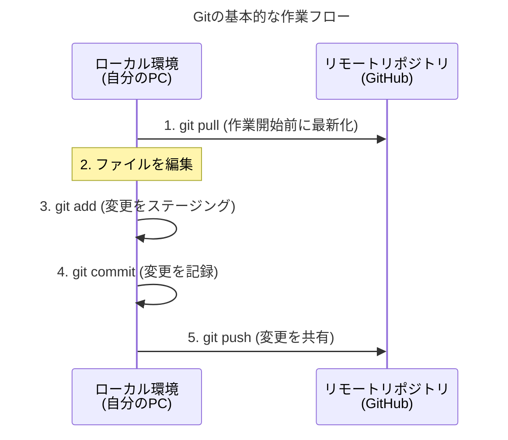
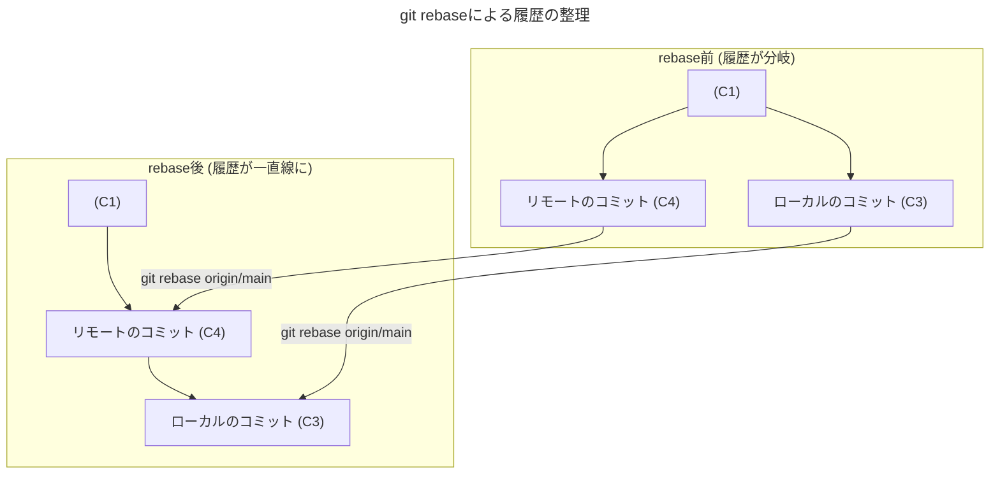

# 【入力】開発.Git主要コマンドとトラブルシューティング

このドキュメントは、日々の開発で頻繁に使用するGitの主要コマンドと、今回経験したような「履歴の分岐（Diverged）」といったイレギュラーケースの解決方法をまとめたものです。

## 1. Gitの基本サイクル（日常の作業フロー）

開発における最も基本的な作業の流れは、以下の図のようになります。

1.  **`pull`**: 作業を開始する前に、リモートリポジトリの最新の変更内容を取り込みます。
2.  **（編集）**: コードの追加や修正を行います。
3.  **`add`**: 変更したファイルをステージングエリアに追加します。（コミット対象のファイルを選ぶ）
4.  **`commit`**: ステージングエリアに追加された変更を、ローカルリポジトリに記録します。
5.  **`push`**: ローカルリポジトリに記録したコミットを、リモートリポジトリにアップロードして共有します。

## 2. 主要コマンドリファレンス

| コマンド | 説明 |
| :--- | :--- |
| `git status` | リポジトリの現在の状態（変更されたファイル、ブランチの状態など）を確認します。**迷ったらまずこのコマンドを打ちましょう。** |
| `git add <ファイル名>` | 指定したファイルの変更を、コミット対象としてステージングエリアに追加します。`git add .`とすると、カレントディレクトリ以下の全ての変更が対象になります。 |
| `git commit -m "コミットメッセージ"` | ステージングエリアにある変更を、ローカルリポジトリに記録（コミット）します。メッセージは「何を変更したか」を簡潔に書きます。（例: `feat: ログイン機能を追加`, `fix: バグを修正`） |
| `git push origin <ブランチ名>` | ローカルリポジトリのコミットを、リモートリポジトリに送信します。 |
| `git pull origin <ブランチ名>` | リモートリポジトリの最新のコミットを、ローカルリポジトリに取り込みます。 |
| `git log` | これまでのコミット履歴を一覧で表示します。 |

---

## 3. 【ケーススタディ】履歴が分岐（Diverged）した場合の対処法

今回まさに直面したのがこのケースです。ローカルでコミットを行った後、リモートの履歴も更新されていると発生します。

### 状況
- ローカル: `main`ブランチに新しいコミット（C3）がある。
- リモート: `origin/main`ブランチにも、別の新しいコミット（C4）がある。

### 解決策: `git rebase` を使う

`git rebase`は、**コミット履歴をきれいに一直線に整え直す**ためのコマンドです。

**手順**
1.  `git status` で状況を確認。`diverged`と表示されているはずです。
2.  `git add .` と `git commit` で、ローカルの変更をすべてコミットします。
3.  `git rebase origin/main` を実行します。
    - これにより、まずリモートの新しいコミット(C4)が取り込まれ、その**後**に、ローカルで行ったコミット(C3)が移動して付け加えられます。
4.  `git push --force-with-lease` で、整え直した履歴をリモートにプッシュします。

#### なぜ `git merge` ではなく `git rebase` なのか？

`git merge`でも履歴を統合できますが、マージコミット（例: "Merge branch 'main' of ... "）という新しいコミットが作られてしまい、履歴が複雑になりがちです。

一方、`git rebase`は履歴を一直線に保つため、後から「誰がいつどんな変更をしたか」を追いかけるのが非常に簡単になります。特に小規模なチームや個人開発では、`rebase`で履歴をきれいに保つメリットは非常に大きいです。

#### `--force-with-lease` とは？
`--force` の安全版です。プッシュ先に、自分の知らない新しいコミットがないことを確認してから強制プッシュを行います。万が一、`rebase`した後に誰かがリモートにプッシュしていた場合、それに気づかずに上書きしてしまう事故を防げます。

## 4. 知っていると便利なコマンド

| コマンド | 説明 |
| :--- | :--- |
| `git log --oneline --graph` | コミット履歴を1行で、かつブランチの分岐や合流をグラフ形式で表示してくれます。履歴の流れが視覚的にわかりやすくなります。 |
| `git reset --hard <コミットID>` | **（危険な操作）**指定したコミットIDの状態まで、リポジトリを完全に戻します。それ以降のコミットは消えてしまうため、使用には注意が必要です。プッシュ済みのコミットを消すのは原則NGです。 |
| `git stash` | まだコミットしたくないけど、ブランチを切り替える必要がある、といった場合に、変更内容を一時的に退避させます。退避した変更は `git stash pop` で元に戻せます。 |
| `git diff` | まだステージングしていない変更内容の差分を表示します。 |

---

この資料が、今後のGit操作の一助となれば幸いです。不明な点があれば、いつでも聞いてください。 