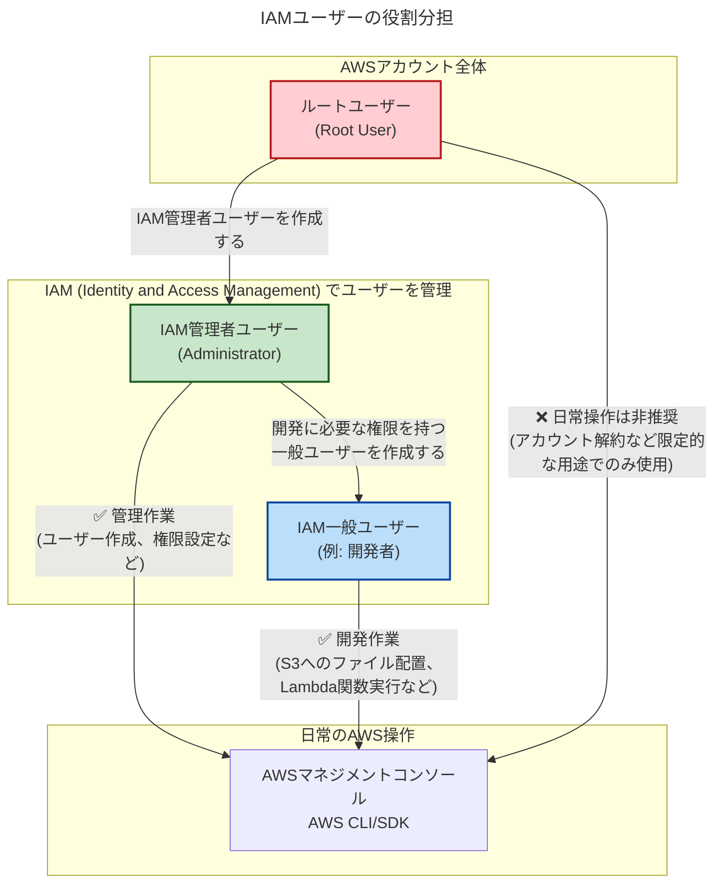

# 【入力】開発.IAM管理者ユーザーの解説

このドキュメントでは、AWSを安全に利用するために不可欠な「IAM管理者ユーザー」の重要性と役割について解説します。

## 1. ルートユーザーとIAMユーザーの違い

まず、AWSアカウントにおける2種類のユーザーについて理解することが重要です。

| ユーザー種類 | 説明 | 主な用途 |
| :--- | :--- | :--- |
| **ルートユーザー** | AWSアカウント作成時に最初に作られる、**最高権限を持つ**ユーザー。全てのサービスとリソースに無制限にアクセスできます。 | ・アカウントの解約 ・請求情報の詳細な設定 ・IAMユーザーがアクセスできない一部の操作 **日常的な作業には使用しません** |
| **IAMユーザー** | IAM (Identity and Access Management) サービスを通じて作成されるユーザー。必要な権限（ポリシー）を個別に付与して利用します。 | ・AWSリソースの管理 ・アプリケーション開発 ・日々のインフラ運用 **日常的な作業全般** |

## 2. なぜIAM管理者ユーザーが必要か？

AWSでは、セキュリティのベストプラクティスとして**「最小権限の原則」**が強く推奨されています。これは、「ユーザーには、その業務を遂行するために必要な最小限の権限のみを与えるべき」という考え方です。

ルートユーザーは権限が強力すぎるため、万が一、認証情報（パスワードやアクセスキー）が漏洩した場合、アカウント全体が乗っ取られる甚大な被害に繋がる可能性があります。

そこで、日常的な管理作業を行うために、管理者権限（`AdministratorAccess`）を持ったIAMユーザー、すなわち**「IAM管理者ユーザー」**を作成します。

### IAM管理者ユーザーを利用するメリット
- **セキュリティリスクの低減**: ルートユーザーの認証情報を普段使わないことで、漏洩リスクを大幅に下げます。
- **責任の明確化**: IAMユーザーごとに操作履歴（AWS CloudTrailで記録）が残るため、誰が・いつ・何を行ったかを正確に追跡できます。
- **柔軟な権限管理**: 今後、開発者など他のメンバーが加わった際に、その役割に応じた権限を持つ新しいIAMユーザーを安全に作成できます。

## 3. IAMユーザーの役割分担（図解）

IAMを利用することで、以下のように役割に応じたユーザーを作成し、安全な運用体制を構築できます。

## 4. 今後の作業について

`docs/開発資料/【入力】開発_個人が初めてAmazon S3をクレジットカードで使い始める最短手順まとめ（2025年・自宅・個人・AWS S3利用開始）.md` の案内に従って、まずは**ルートユーザーでログインし、最初のIAM管理者ユーザーを作成してください。**

IAM管理者ユーザーの作成が完了したら、**必ず一度サインアウトし、今作成したIAM管理者ユーザーで再ログインしてください。**

これ以降のAWSに関する作業は、原則としてすべてこの**IAM管理者ユーザー**で行います。ルートユーザーの出番は、基本的にありません。 
