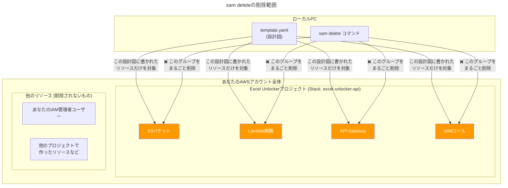

# 【出力】解説_APIのセキュリティと後片付け

このドキュメントでは、デプロイ直後のAPIがなぜテスト目的であれば安全と言えるのか、その理由と、テスト完了後に行うべき「後片付け」の方法について解説します。

## なぜテスト中はAPIを放置しても大丈夫なのか？

デプロイが完了したAPIは、インターネット上で技術的には「公開」されています。しかし、短時間のテストであれば、過度に心配する必要はありません。理由は以下の通りです。

### 1. URLの推測が事実上不可能であること

デプロイされたAPIのエンドポイントURLを見てみましょう。

`https://[ランダムな文字列].execute-api.[リージョン].amazonaws.com/Prod/unlock`

この`[ランダムな文字列]`の部分（例: `gc2c53dlsl`）は、AWSが自動で生成した非常に推測困難なIDです。私たちがこのURLを誰かに教えない限り、第三者がこのURLを自力で見つけ出すことは、宝くじで1等が何度も当たる確率よりも低く、現実的には不可能です。

つまり、現時点ではこのURLは**「知る人ぞ知る秘密の入口」**の状態です。

### 2. 金銭的リスクが限定的であること

仮に、万が一URLが漏洩して第三者に利用されたとしても、考えられる最大のリスクは**金銭的なもの（意図しないAWS利用料の発生）**です。

しかし、AWSには寛大な**無料利用枠**が設定されています。
-   **AWS Lambda**: 毎月100万リクエストまで無料
-   **Amazon API Gateway**: 毎月100万コールまで無料

個人開発のテストでこの無料枠を超えることはまずありえません。したがって、短時間のテストで意図せず課金が発生する可能性はほぼゼロです。

---

## テスト後の「後片付け」が最も重要なセキュリティ対策

「知る人ぞ知る」とはいえ、不要なリソースをインターネット上に放置しておくことは、セキュリティのベストプラクティスに反します。

そこで、クラウド開発では**「Infrastructure as Code (IaC)」**、つまり「インフラをコードで管理する」という考え方が非常に重要になります。私たちが使っている`template.yaml`が、まさにその「コード」です。

IaCを利用する最大のメリットの一つは、後片付けが一瞬で、かつ完璧に行えることです。

### 「リソース」とは何か？ ～削除される範囲を理解する～

まず、「何を」「どこまで」削除するのかを正確に理解しましょう。

AWSにおける**「リソース」**とは、サービスを構成する個々の部品を指します。私たちのプロジェクトでは、主に以下の部品（リソース）を`template.yaml`という設計図に定義しました。

-   **S3バケット**: ファイルを保管する場所
-   **Lambda関数**: パスワード解除処理を行うプログラム
-   **API Gateway**: Lambdaを呼び出すためのURL窓口
-   **IAMロール**: LambdaがS3にアクセスするための許可証

`sam delete`コマンドは、この**`template.yaml`に書かれたリソース群（スタック）「のみ」を、ごっそりと削除します。** あなたが作成したIAM管理者ユーザーや、今後作成するかもしれない他のプロジェクトのリソースには一切影響を与えません。



### `sam delete` コマンドによる完全なリソース削除

テストが完了し、一旦リソースが不要になった場合は、ターミナルで以下のコマンドを一度実行するだけです。

```bash
sam delete --stack-name excel-unlocker-api
```
*(※ `--stack-name` には、`sam deploy --guided`で指定したStack Nameを指定します)*

このコマンドを実行すると、**CloudFormation**が再び動き出し、`template.yaml`を元に作成した**全てのAWSリソース（API Gateway, Lambda, S3バケット, IAMロールなど）を、関連する設定も含めて自動で、跡形もなく削除してくれます。**

手動で一つずつ消していくと消し忘れが発生しがちですが、この方法ならその心配は一切ありません。

> **【開発の基本サイクル】**
> 1.  コードを書き、`sam deploy`で環境を構築する（建設）。
> 2.  テストを行う。
> 3.  テストが終わったら`sam delete`で環境を完全に破壊する（解体）。
>
> このサイクルを繰り返すことで、安全かつクリーンに開発を進めることができます。 