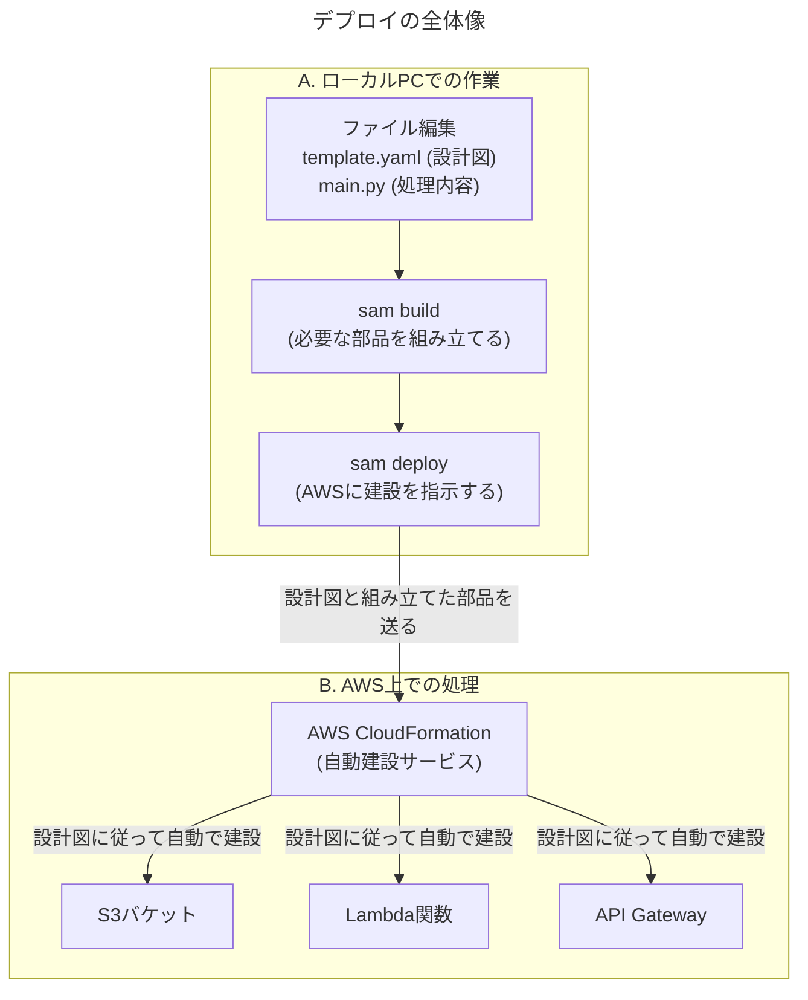

# 【出力】解説_SAMデプロイの裏側～ローカルからAWSへ～

このドキュメントは、先ほど実行した`sam build`から`sam deploy`に至る一連のプロセスで、「何が」「どこで」行われていたのか、その裏側を分かりやすく解説するものです。

## 全体像：ローカルでの準備からAWSでの自動構築まで

まず、全体の流れを把握しましょう。私たちの作業は、ローカルPCでの「準備」と、AWS上での「自動構築」の2つに大きく分かれています。`sam deploy`コマンドが、その橋渡し役を担っています。

## Step 1: `sam build` - ローカルPCでの「組み立て」作業

`sam build`コマンドは、**全てあなたのローカルPC上**で実行されます。
これは、デプロイに必要な部品を1つのパッケージに「組み立てる」作業です。

-   **入力**:
    -   `template.yaml`（どんなリソースを作るかの設計図）
    -   `backend/src/main.py`（Lambda関数の中身）
    -   `backend/src/requirements.txt`（必要な追加ライブラリのリスト）
-   **処理内容**:
    1.  `.aws-sam`という作業用ディレクトリを作成します。
    2.  `main.py`をコピーします。
    3.  `requirements.txt`を読み込み、`msoffcrypto-tool`と`boto3`をインターネットからダウンロードしてきます。
    4.  コードとライブラリを、Lambdaが理解できる形式でパッケージ化します。
-   **出力**:
    -   デプロイの準備が整ったパッケージ（`.aws-sam/build`ディレクトリ）

## Step 2: `sam deploy` - AWSへの「建設指示」

`sam deploy`コマンドは、ローカルPCとAWSの**橋渡し**役です。

1.  ローカルPC上で、`sam build`で組み立てたパッケージを圧縮します。
2.  AWSに接続し（`aws configure`で設定した認証情報を使います）、その圧縮ファイルを**AWS上の特別なS3バケット**にアップロードします。
3.  アップロード完了後、AWSの中心的なサービスである**AWS CloudFormation**に対して、「アップロードした設計図と部品を使って、リソースの建設を開始してください」と指示を出します。

## Step 3: AWS CloudFormation - 自動で「建設」を行う執事

ここからが、デプロイ中にターミナルに表示されていた**自動化処理の正体**です。

**CloudFormation**は、`template.yaml`（設計図）に書かれた内容を1行ずつ読み解き、必要なAWSリソースを**全自動で作成し、設定し、互いに連携させてくれる**サービスです。

デプロイ中に表示された`CREATE_IN_PROGRESS`や`CREATE_COMPLETE`のログは、まさにこのCloudFormationが「S3バケットを作成中です」「Lambda関数が完成しました」と、**現場の進捗状況をリアルタイムで報告してくれていた**のです。

---

## `sam deploy --guided`の対話プロンプト 全解説

対話形式で聞かれた質問は、CloudFormationに建設指示を出す際の「オプション指定」です。

| 質問 | 日本語訳と解説 |
| :--- | :--- |
| `Stack Name` | これから作成するAWSリソース一式を管理するための「工事名」です。CloudFormationではこの一式を**スタック**と呼びます。 |
| `AWS Region` | どの地域のデータセンターにリソースを作成しますか？（今回は`ap-northeast-1`＝東京リージョン） |
| `Confirm changes before deploy` | デプロイ前に「今回は何が新規作成/変更されます」というプレビューを表示しますか？（`y`にすると安全です） |
| `Allow SAM CLI IAM role creation` | SAMがリソース（Lambdaなど）に必要な権限（IAMロール）を作成することを許可しますか？（必須なので`y`） |
| `Disable rollback` | もしデプロイ途中でエラーが起きた場合、それまでに作成したリソースを自動で全て削除して、元の状態に戻す（ロールバック）機能を無効にしますか？（安全のため無効にしない`n`が推奨） |
| **`UnlockFunction has no authentication. Is this okay?`** | （手順書になかった質問）「今回作成するAPIには認証機能が設定されていませんが、本当に大丈夫ですか？」という**セキュリティに関する確認**です。今回は「OK（`y`）」としましたが、これはAPIのURLを知っていれば誰でもアクセスできる状態を意味します。私たちの計画では、将来フロントエンド側でGoogle認証を実装してアクセスを制御するため、現時点ではこれで問題ありません。 |
| `Save arguments to configuration file` | ここまでの回答内容を`samconfig.toml`というファイルに保存しますか？（`y`にすると、次回から`sam deploy`だけで同じ設定でデプロイでき、非常の便利です） |

以上がデプロイの裏側で起きていたことの全貌です。`SAM`という便利な道具が、裏側で`CloudFormation`というすごい執事を動かしてくれていた、とイメージしていただけると分かりやすいかと思います。 