# 【出力】解説_フロントエンド開発の全体像

このドキュメントは、フロントエンド開発が初めての方向けに、フロントエンドとは何か、バックエンドとの関係性、そして今回のプロジェクトでの役割を図解を交えて分かりやすく解説します。

---

## フロントエンドとバックエンドの基本概念

### Webアプリケーションの全体構造

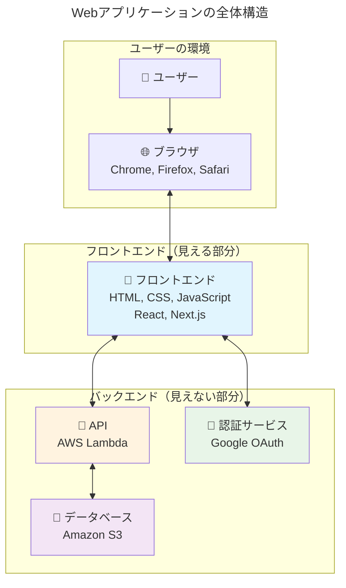

### フロントエンドとバックエンドの役割分担

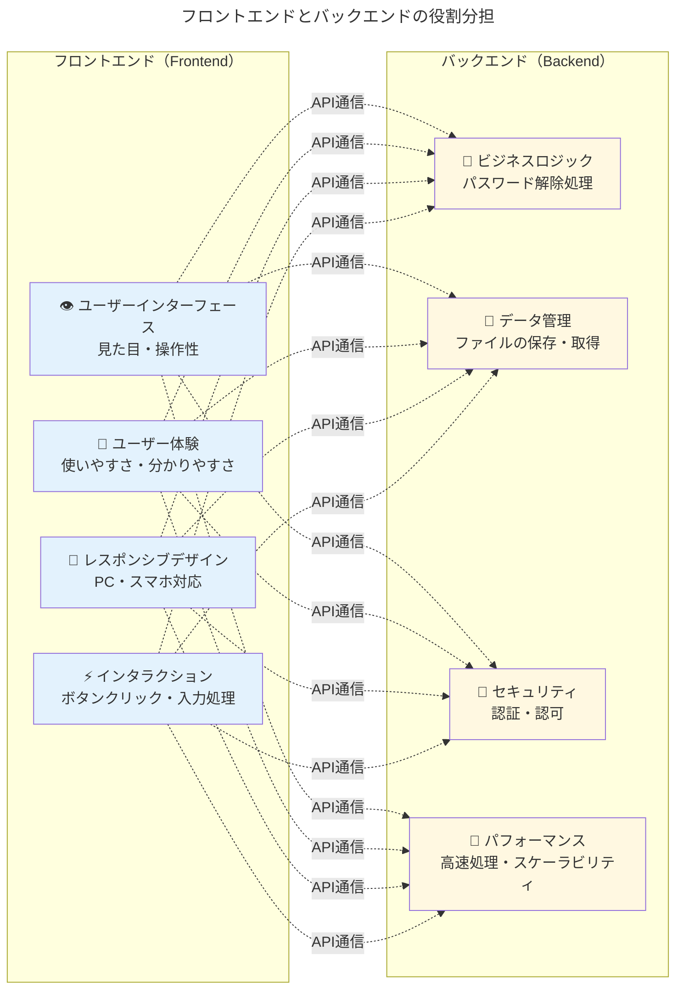

---

## 今回のプロジェクトでの具体的な構成

### システム全体のアーキテクチャ

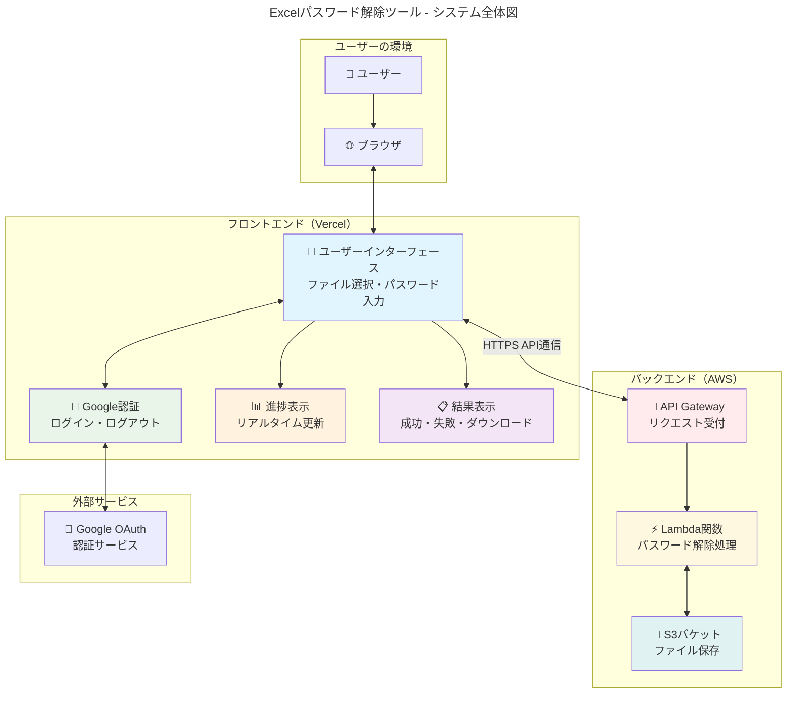

### データフローの詳細

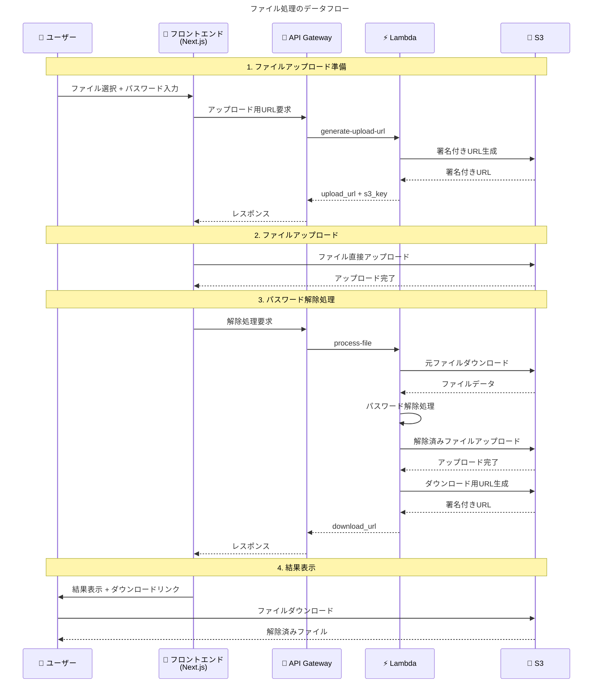

---

## フロントエンド技術スタックの解説

### 使用技術とその役割

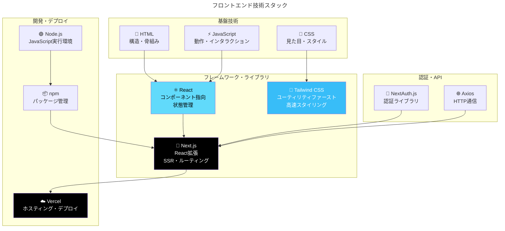

### React コンポーネントの概念

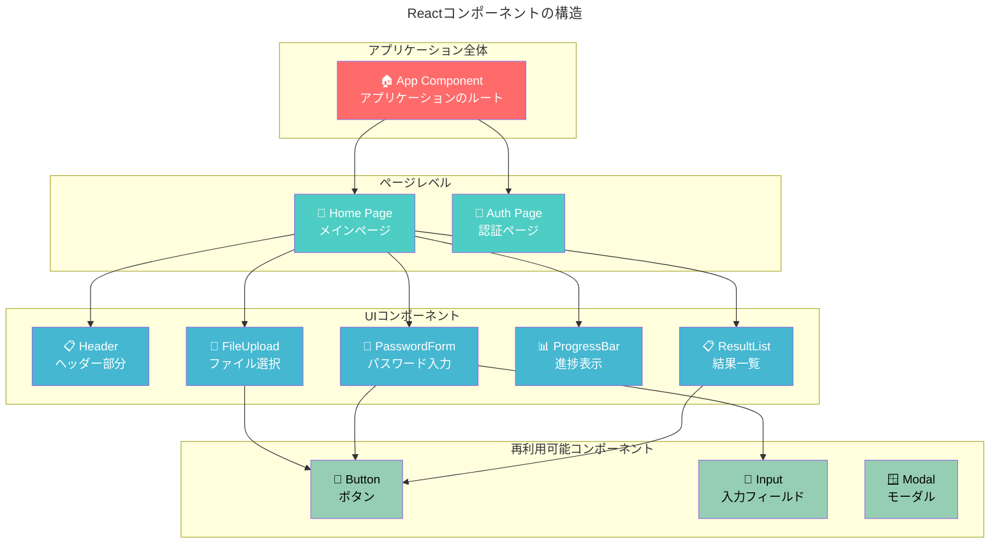

---

## 開発環境とファイル構造

### プロジェクトのディレクトリ構造

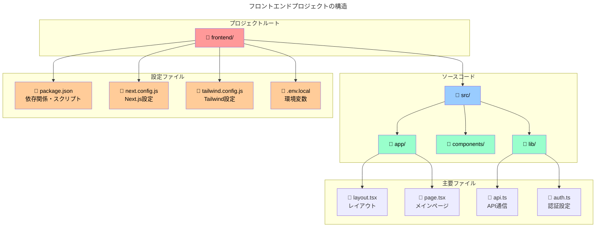

### 開発からデプロイまでの流れ

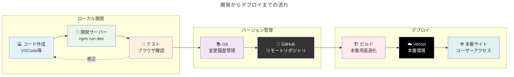

---

## 状態管理とデータフロー

### Reactの状態管理

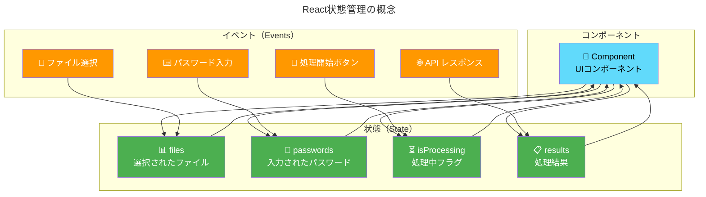

### API通信のパターン

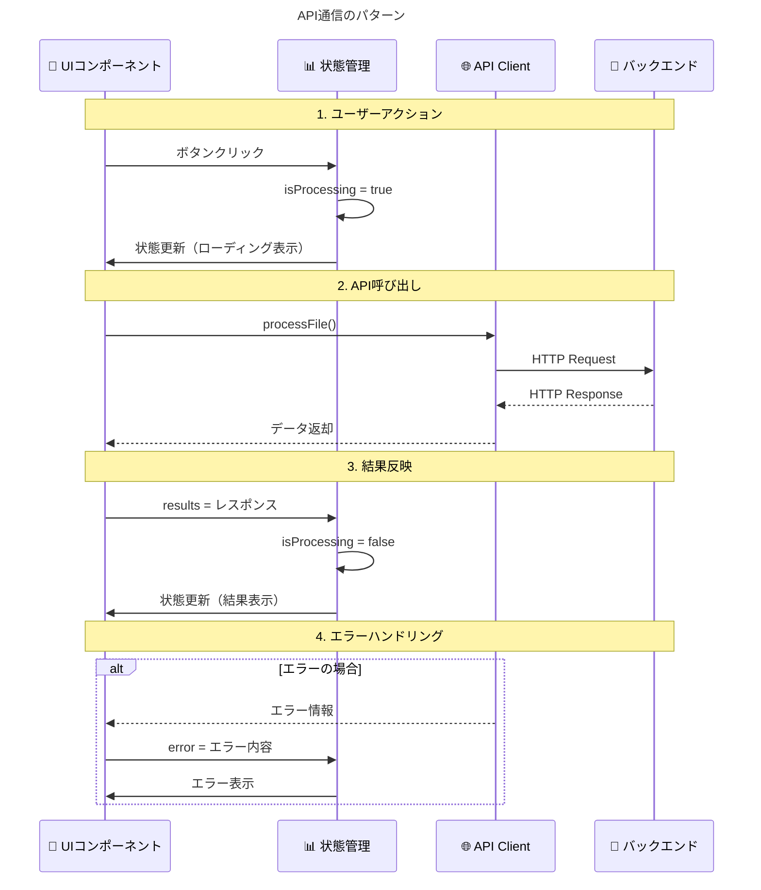

---

## セキュリティとパフォーマンス

### フロントエンドのセキュリティ考慮事項

```mermaid
---
title: "フロントエンドセキュリティ"
---
graph TB
    subgraph "認証・認可"
        Auth[🔐 Google OAuth<br>ユーザー認証]
        JWT[🎫 JWT Token<br>セッション管理]
        Guard[🛡️ Route Guard<br>ページアクセス制御]
    end
    
    subgraph "データ保護"
        HTTPS[🔒 HTTPS通信<br>暗号化]
        Env[🔐 環境変数<br>秘密情報管理]
        CSP[🛡️ CSP<br>XSS攻撃防止]
    end
    
    subgraph "入力検証"
        Validation[✅ 入力検証<br>ファイル形式・サイズ]
        Sanitize[🧹 サニタイズ<br>危険な文字除去]
        CSRF[🛡️ CSRF対策<br>偽造リクエスト防止]
    end
    
    Auth --> JWT
    JWT --> Guard
    HTTPS --> Env
    Env --> CSP
    Validation --> Sanitize
    Sanitize --> CSRF
    
    style Auth fill:#4caf50,color:#fff
    style JWT fill:#2196f3,color:#fff
    style Guard fill:#ff9800,color:#fff
    style HTTPS fill:#f44336,color:#fff
    style Env fill:#9c27b0,color:#fff
    style CSP fill:#607d8b,color:#fff
    style Validation fill:#795548,color:#fff
    style Sanitize fill:#009688,color:#fff
    style CSRF fill:#e91e63,color:#fff
```

### パフォーマンス最適化

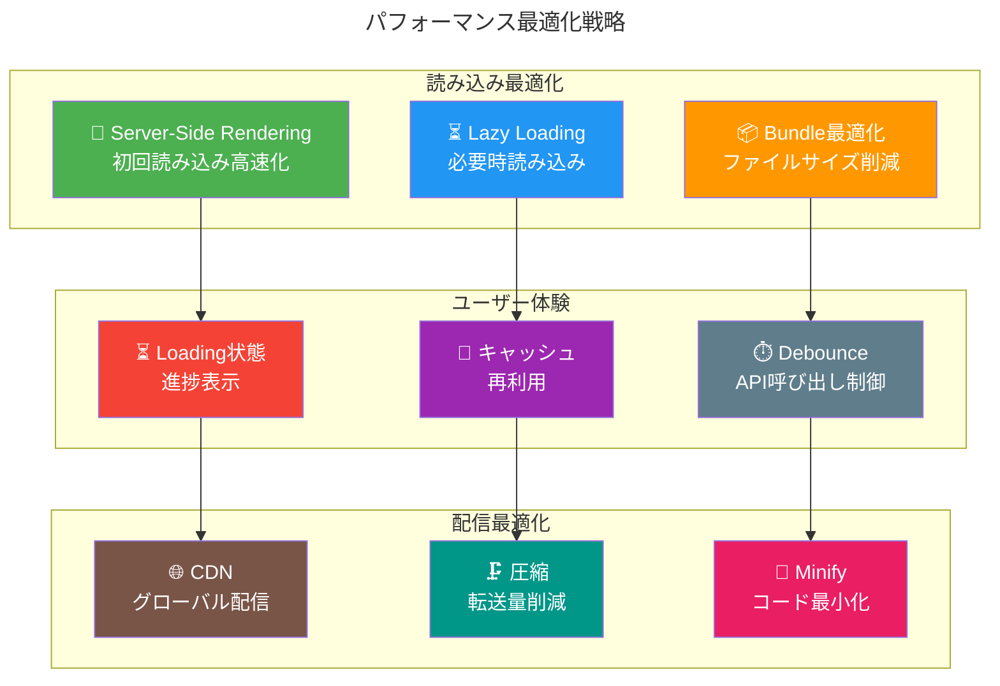

---

## 学習の進め方

### 段階的な学習アプローチ

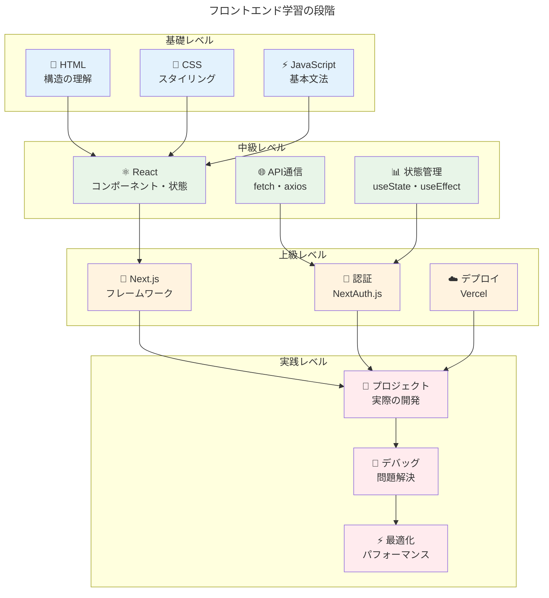

---

## まとめ

### 今回のプロジェクトで学べること

1. **モダンなフロントエンド開発**
   - React/Next.jsの基本概念
   - コンポーネント指向の設計
   - 状態管理の実践

2. **API連携**
   - RESTful APIとの通信
   - 非同期処理の実装
   - エラーハンドリング

3. **認証システム**
   - OAuth2.0の実装
   - セキュアなアプリケーション設計

4. **デプロイメント**
   - 本番環境への配信
   - CI/CDの基本概念

5. **ユーザー体験**
   - レスポンシブデザイン
   - パフォーマンス最適化
   - アクセシビリティ

このプロジェクトを通じて、現代的なWebアプリケーション開発の全体像を実践的に学ぶことができます。各段階で新しい概念を学びながら、最終的には完全に機能するWebアプリケーションを完成させることができます。
