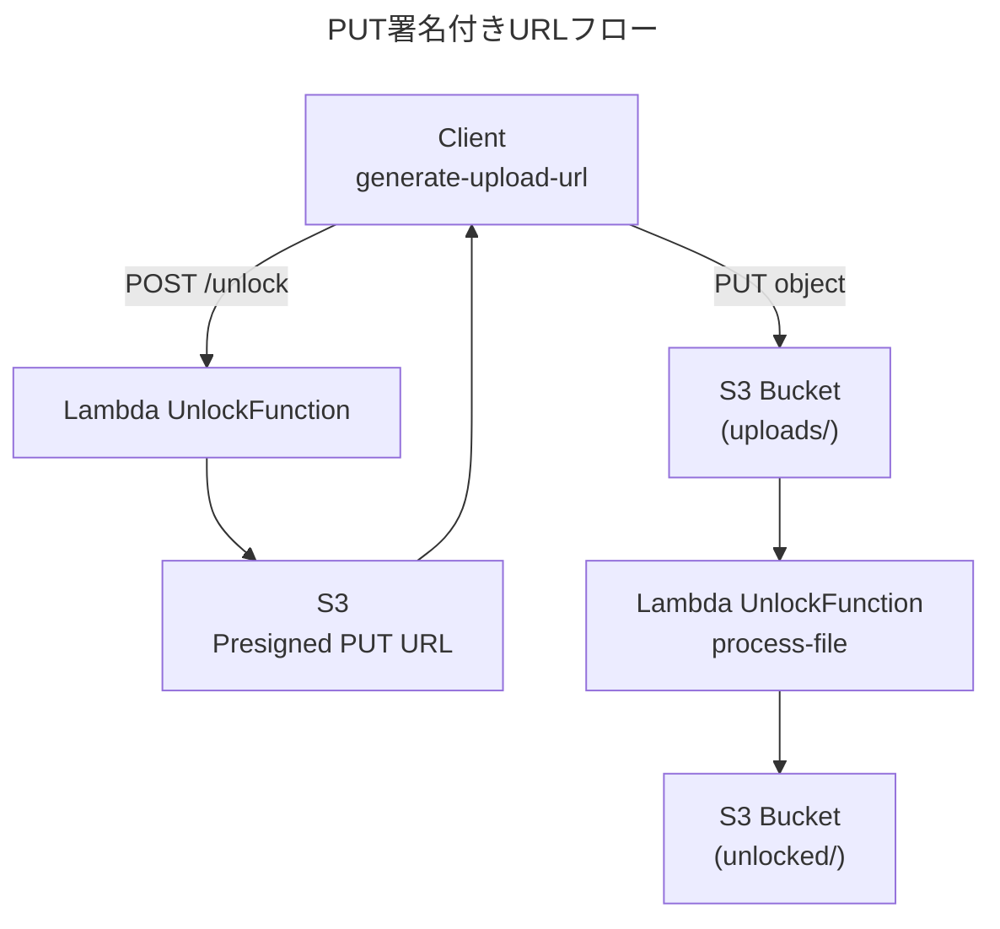

# Excel Unlocker API  修正チェック & 今後の改善ポイント

このドキュメントでは、直近のコード修正内容の妥当性チェック結果と、今後検討すべき改善事項を整理します。

## 1. チェックした修正内容

| 項目 | 変更内容 | 意図・効果 |
| :--- | :--- | :--- |
| S3 クライアントのリージョン明示 | `region_name = AWS_REGION` を `boto3.client()` に追加 | 署名付き URL 生成と **同じリージョン** を強制することで、`TemporaryRedirect` (307/308) を防止 |
| 署名バージョンの固定 | `Config(signature_version='s3v4', s3={'addressing_style': 'path'})` を追加 | すべての環境で v4 署名を使用 & エンドポイント解決を安定化 |
| 依存ライブラリ記載 | `backend/src/requirements.txt` に `msoffcrypto-tool`, `boto3` を記載 | **SAM build** 時に Layer へ確実に取り込む |
| ハンドラ内ロギング | `logger.info / debug / warning / exception` を適切に配置 | CloudWatch で原因分析しやすくする |

### ✅ 結論
上記修正により **署名付き PUT** でのリージョン不一致問題は解消される見込みです。ユニットテストおよび手動テストを経てデプロイへ進めて問題ありません。

## 2. 今後への改善ポイント

1. **パスワード入力仕様の柔軟化**  
   `password_1` が必須、`password_2` が空欄の場合でも処理できるようバリデーションを緩和。
2. **メモリサイズ調整**  
   128 MB → 256 MB へ引き上げ、大きな Excel ファイル (≥10 MB) でも OOM を防止。
3. **Lambda Layer 化**  
   `msoffcrypto-tool` を Layer に分離し、関数コード zip を軽量化。
4. **CloudWatch Alarm**  
   ErrorCount > 0, Duration ≧ 25s などで通知。SLA 監視を早期に整備。
5. **統合テスト (pytest + moto3)**  
   `tests/` で S3 モックを使いエンドツーエンドの自動テストを実装。
6. **Presigned URL 期限の動的設定**  
   デフォルト 300s → フロントエンド側で調整できるよう、リクエストパラメータ化を検討。

## 3. 処理フロー図
以下は **署名付き URL 生成 & PUT** の成功シーケンスを示します。

> **補足**: ノード間の通信はすべて **HTTPS**。実運用では `AllowedOrigins` をフロントエンドのドメインに限定してください。

---

### 参考リンク
- AWS 公式: [Generate Presigned URLs](https://docs.aws.amazon.com/AmazonS3/latest/userguide/ShareObjectPreSignedURL.html)
- AWS 公式: [Using AWS SAM CLI](https://docs.aws.amazon.com/serverless-application-model/latest/developerguide/serverless-sam-cli.html) 