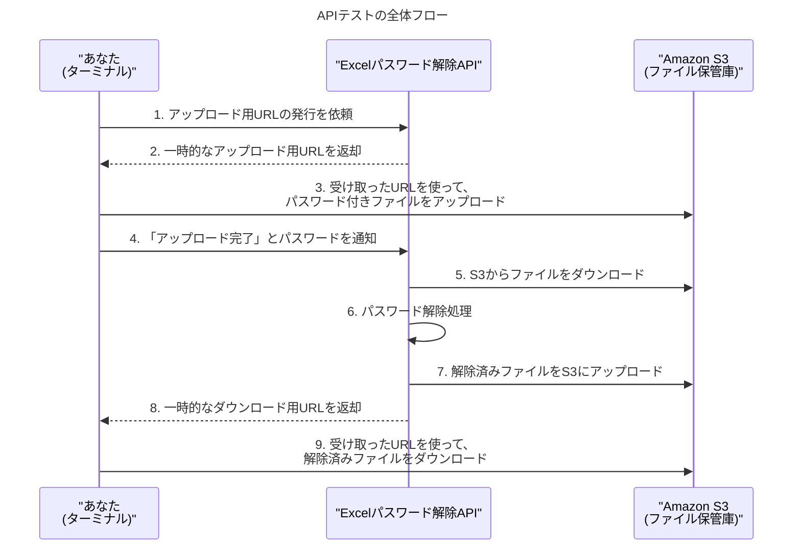

# 【出力】手順書_API動作テストガイド

このドキュメントは、先ほどAWS上にデプロイした「Excelパスワード解除API」が、想定通りに正しく動作するかを確認するためのテスト手順を解説するものです。

APIのテストには`Postman`などの専門ツールも便利ですが、この手順書では、macOSやWindowsの標準的なターミナルに搭載されている`curl`（カール）というコマンドのみを使用して、誰でも簡単にテストを再現できるように解説します。

---

## テストの全体像

私たちのAPIは、2段階のステップを踏んで処理を行います。テストもこの流れに沿って行います。

1.  **Step 1**: ファイルをアップロードするための「特別なURL」を発行してもらう。
2.  **Step 2**: そのURLを使ってファイルをアップロードする。
3.  **Step 3**: アップロードしたファイルの「パスワード解除処理」を依頼する。
4.  **Step 4**: 処理結果として発行された「特別なURL」から、解除済みファイルをダウンロードする。



---

## 準備

テストを始める前に、以下のものを準備してください。

1.  **APIのエンドポイントURL**:
    -   `sam deploy`の実行結果に表示されたURLです。
    -   例: `https://xxxxxxxxxx.execute-api.ap-northeast-1.amazonaws.com/Prod/unlock`
2.  **テスト用のパスワード付きExcelファイル**:
    -   実際にパスワード解除を試したいファイルを用意してください。
    -   この手順書では、ファイル名を `test.xlsx` と仮定して進めます。
3.  **解除用のパスワード**:
    -   テスト用ファイルに設定されている正しいパスワードを1つと、間違ったパスワードを1つ用意してください。

---

## テスト手順

### Step 1: アップロード用URLを取得する

まず、ファイルをS3にアップロードするための、一時的な許可証（署名付きURL）をAPIに発行してもらいます。

以下のコマンドをターミナルに貼り付けて実行してください。
**※ `[APIのエンドポイントURL]` と `[テスト用のファイル名]` の部分は、ご自身のものに書き換えてください。**

```bash
curl -X POST "[APIのエンドポイントURL]" \
-H "Content-Type: application/json" \
-d '{
  "action": "generate-upload-url",
  "file_name": "[テスト用のファイル名]"
}'
```

**【成功時の応答（例）】**
```json
{
  "upload_url": "https://excel-unlocker-bucket-....s3.ap-northeast-1.amazonaws.com/uploads/..../test.xlsx?AWSAccessKeyId=...",
  "s3_key": "uploads/xxxxxxxx-xxxx-xxxx-xxxx-xxxxxxxxxxxx/test.xlsx"
}
```
-   **`upload_url`**: このURLが、ファイルアップロード専用の特別なURLです。**次のステップで使うので、全文をコピーしておいてください。**
-   **`s3_key`**: S3上でファイルを一意に識別するためのキーです。これも後で使います。

### Step 2: ファイルをアップロードする

次に、Step 1で取得した`upload_url`を使って、ローカルのファイルをS3にアップロードします。

**※ `[コピーしたupload_url]` と `[テスト用ファイルのパス]` の部分を書き換えてください。**
（`test.xlsx`がコマンドを実行しているのと同じディレクトリにある場合、パスは`test.xlsx`でOKです）

```bash
curl -X PUT -H "Content-Type: application/vnd.openxmlformats-officedocument.spreadsheetml.sheet" \
-T "[テスト用ファイルのパス]" \
"[コピーしたupload_url]"
```
このコマンドが成功すると、何も表示されずに終了します。

### Step 3: パスワード解除処理を依頼する

ファイルがS3に準備できたので、いよいよパスワード解除処理をAPIに依頼します。

**※ `[APIのエンドポイントURL]`、`[Step1で取得したs3_key]`、`[正しいパスワード]`、`[間違ったパスワード]`を書き換えてください。**

```bash
curl -X POST "[APIのエンドポイントURL]" \
-H "Content-Type: application/json" \
-d '{
  "action": "process-file",
  "s3_key": "[Step1で取得したs3_key]",
  "password_1": "[正しいパスワード]",
  "password_2": "[間違ったパスワード]"
}'
```
**【成功時の応答（例）】**
```json
{
  "message": "File unlocked successfully!",
  "download_url": "https://excel-unlocker-bucket-....s3.ap-northeast-1.amazonaws.com/unlocked/..../test.xlsx?AWSAccessKeyId=..."
}
```
-   **`download_url`**: 解除済みファイルをダウンロードするための特別なURLです。**これをコピーしてください。**

### Step 4: 解除済みファイルをダウンロードする

最後に、Step 3で取得した`download_url`を使って、パスワードが解除されたファイルをダウンロードします。

**※ `[コピーしたdownload_url]` と `[保存するファイル名]`を書き換えてください。**

```bash
curl "[コピーしたdownload_url]" -o "[保存するファイル名]"
```
例: `curl "https://..." -o unlocked_test.xlsx`

このコマンドが完了したら、指定したファイル名（例: `unlocked_test.xlsx`）でファイルが保存されているはずです。
そのファイルを開いて、パスワードなしで開けることを確認できれば、**テストはすべて成功です！** 