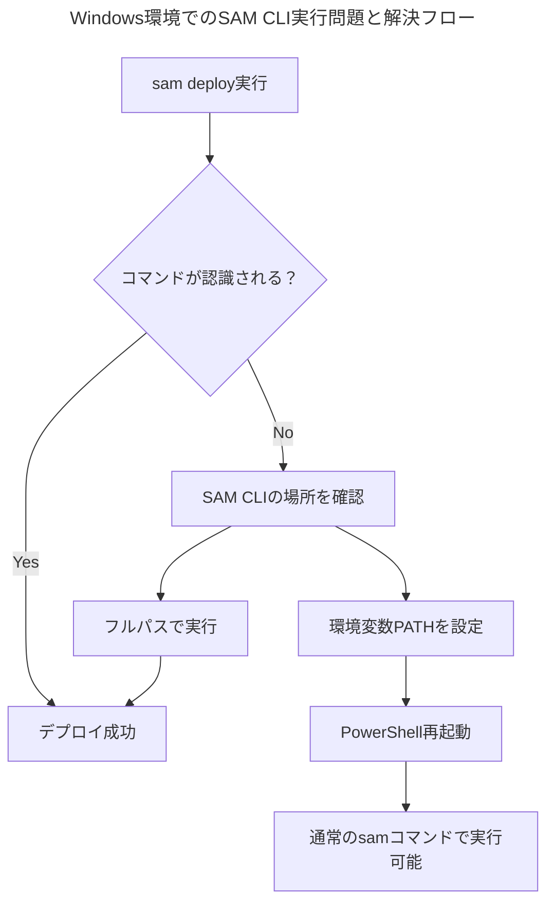

# 【出力】手順書_Windows環境でのSAM CLI実行ガイド

このドキュメントは、Windows環境でAWS SAM CLIを使用する際の実行方法と、発生しやすい問題の解決方法をまとめたものです。

---

## 問題の概要

Windows環境では、SAM CLIのパスが環境変数に正しく設定されていない場合があり、通常の`sam`コマンドが認識されないことがあります。



---

## 解決方法

### 1. SAM CLIの場所確認

まず、SAM CLIがインストールされている場所を確認します。

```powershell
# SAM CLIのインストール場所を確認
Get-ChildItem "C:\Program Files\Amazon\AWSSAMCLI" -ErrorAction SilentlyContinue
```

通常、以下の場所にインストールされています：
- `C:\Program Files\Amazon\AWSSAMCLI\bin\sam.cmd`

### 2. フルパスでの実行（即座に使える方法）

環境変数の設定を変更せずに、すぐに使える方法です。

```powershell
# バージョン確認
& "C:\Program Files\Amazon\AWSSAMCLI\bin\sam.cmd" --version

# デプロイ実行
& "C:\Program Files\Amazon\AWSSAMCLI\bin\sam.cmd" deploy

# ビルド実行
& "C:\Program Files\Amazon\AWSSAMCLI\bin\sam.cmd" build

# ローカル実行
& "C:\Program Files\Amazon\AWSSAMCLI\bin\sam.cmd" local start-api
```

**重要**: PowerShellでは`&`演算子を使用してフルパスの実行ファイルを呼び出します。

### 3. 環境変数PATHの設定（推奨設定）

今後、通常の`sam`コマンドで実行できるようにするための設定です。

#### 方法A: PowerShellで一時的に設定

```powershell
# 現在のセッションのみ有効
$env:PATH += ";C:\Program Files\Amazon\AWSSAMCLI\bin"

# 確認
sam --version
```

#### 方法B: システム環境変数で永続的に設定

1. **Windowsキー + R** を押して「`sysdm.cpl`」を実行
2. **「詳細設定」タブ** → **「環境変数」** をクリック
3. **「システム環境変数」** の **「Path」** を選択して **「編集」**
4. **「新規」** をクリックして以下のパスを追加：
   ```
   C:\Program Files\Amazon\AWSSAMCLI\bin
   ```
5. **「OK」** で保存
6. **PowerShellを再起動**

#### 方法C: PowerShellプロファイルで自動設定

```powershell
# PowerShellプロファイルの場所を確認
$PROFILE

# プロファイルファイルを編集（存在しない場合は作成）
notepad $PROFILE

# 以下の内容を追加
$env:PATH += ";C:\Program Files\Amazon\AWSSAMCLI\bin"
```

---

## よくある問題と対処法

### 問題1: 「sam」コマンドが認識されない

**エラーメッセージ**:
```
sam : 用語 'sam' は、コマンドレット、関数、スクリプト ファイル、または操作可能なプログラムの名前として認識されません。
```

**対処法**:
- フルパスで実行: `& "C:\Program Files\Amazon\AWSSAMCLI\bin\sam.cmd" deploy`
- 環境変数PATHを設定（上記参照）

### 問題2: PowerShellでの構文エラー

**エラーメッセージ**:
```
式またはステートメントのトークン 'version' を使用できません。
```

**対処法**:
- `&`演算子を使用: `& "パス" --オプション`
- または、コマンドプロンプト（cmd）で実行

### 問題3: sam.exeが見つからない

**対処法**:
- 実際のファイル名は`sam.cmd`です
- `sam.exe`ではなく`sam.cmd`を指定してください

---

## 推奨設定

### 1. PowerShellプロファイルの設定

毎回フルパスを入力するのを避けるため、PowerShellプロファイルに設定を追加することをお勧めします。

```powershell
# プロファイルファイルの作成・編集
if (!(Test-Path -Path $PROFILE)) {
    New-Item -ItemType File -Path $PROFILE -Force
}
notepad $PROFILE
```

プロファイルに以下を追加：
```powershell
# SAM CLI パスの追加
$env:PATH += ";C:\Program Files\Amazon\AWSSAMCLI\bin"

# エイリアスの設定（オプション）
Set-Alias sam "C:\Program Files\Amazon\AWSSAMCLI\bin\sam.cmd"
```

### 2. 便利なエイリアス

```powershell
# よく使うコマンドのエイリアス
function sam-deploy { & "C:\Program Files\Amazon\AWSSAMCLI\bin\sam.cmd" deploy }
function sam-build { & "C:\Program Files\Amazon\AWSSAMCLI\bin\sam.cmd" build }
function sam-local { & "C:\Program Files\Amazon\AWSSAMCLI\bin\sam.cmd" local start-api }
```

---

## 実行例

### 基本的なデプロイフロー

```powershell
# 1. プロジェクトディレクトリに移動
cd "C:\Users\hirok\Documents\Windsurf\811【開発】\python-excel-unlocker"

# 2. ビルド（必要に応じて）
& "C:\Program Files\Amazon\AWSSAMCLI\bin\sam.cmd" build

# 3. デプロイ
& "C:\Program Files\Amazon\AWSSAMCLI\bin\sam.cmd" deploy

# 4. デプロイ確認で 'y' を入力
```

### 設定後の実行（環境変数設定済み）

```powershell
# 通常のコマンドとして実行可能
sam --version
sam build
sam deploy
```

---

## トラブルシューティング

### SAM CLIが見つからない場合

1. **インストール確認**:
   ```powershell
   Get-ChildItem "C:\Program Files\Amazon\AWSSAMCLI" -Recurse -Name "sam.cmd"
   ```

2. **再インストール**:
   - [[AWS SAM CLI]]の公式サイトから最新版をダウンロード
   - 管理者権限でインストール

3. **代替インストール場所の確認**:
   ```powershell
   Get-ChildItem "C:\Users\$env:USERNAME\AppData\Local\aws-sam-cli" -ErrorAction SilentlyContinue
   ```

### 権限エラーの場合

```powershell
# PowerShellを管理者権限で実行
# または、実行ポリシーを変更
Set-ExecutionPolicy -ExecutionPolicy RemoteSigned -Scope CurrentUser
```

---

## まとめ

Windows環境でSAM CLIを使用する際は、以下の点に注意してください：

1. **フルパスでの実行**が最も確実な方法
2. **環境変数PATHの設定**で通常のコマンドとして使用可能
3. **PowerShellプロファイル**の活用で作業効率向上
4. **実行ファイルは`sam.cmd`**（`sam.exe`ではない）

これらの設定により、Windows環境でも快適にAWS SAMを使用できるようになります。
