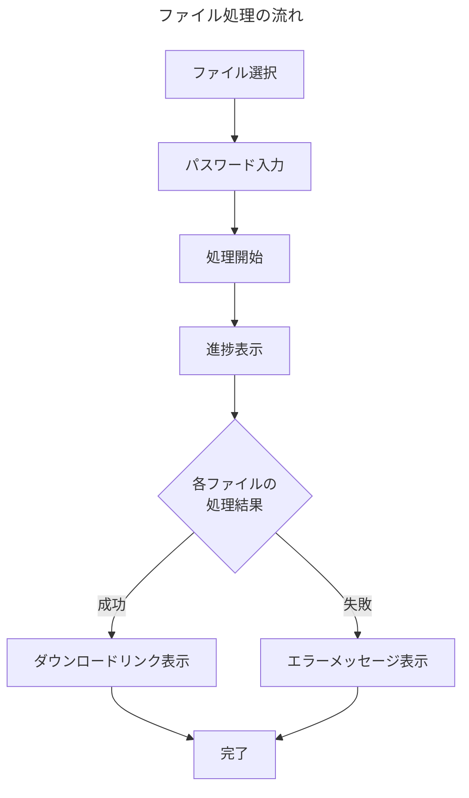

# Excelパスワード解除ツール フロントエンド開発に向けた認識合わせ

このドキュメントは、フロントエンド開発に着手する前に、私（AIアシスタント [[Cascade]]）とユーザー様の間の認識を合わせるためのものです。

## 更新ルール

1. **質問は消さない**: 私からの質問は、編集・削除せずそのまま残してください。
2. **回答を追記する**: 各質問の下にある「回答欄」に、ユーザー様の考えやご希望をご記入ください。
3. **視覚的な区別**: 私（AI）の質問と、ユーザー様の回答が分かりやすいようにフォーマットを分けて管理します。

---

## プロジェクト概要の確認

バックエンド開発で確認された要件を基に、フロントエンド開発の方向性を確認します。

### 既に確定している要件
- **バックエンド**: [[AWS Lambda]] + [[Amazon S3]] + [[API Gateway]]
- **フロントエンド**: [[Vercel]]でのデプロイ
- **認証**: [[Google]]認証（[[OAuth2.0]] + [[JWT]]）によるユーザー制限
- **処理対象**: 複数の[[Excel]]ファイルに対する2段階パスワード解除

---

## 認識合わせのためのご質問

### **【質問1】 どんな技術でWebサイトを作りますか？**

**🔍 この質問の意味**
Webサイトを作るには、いろいろな「道具」（技術）があります。例えば、家を建てるときに「木造」「鉄筋コンクリート」「鉄骨」などの選択肢があるのと同じです。

**📚 技術の解説**
- **[[Next.js]]**: 現在最も人気のあるWebサイト作成ツール。[[Google]]や[[Netflix]]なども使用
- **[[React]]**: [[Facebook]]が作った、画面を作るための基本的なツール
- **[[TypeScript]]**: より安全にプログラムを書けるようにする仕組み（エラーを事前に発見）
- **[[JavaScript]]**: Webサイトに動きをつけるプログラミング言語
- **[[Tailwind CSS]]**: 見た目を美しくするためのデザインツール

**🎯 おすすめの選択肢**
- **A案**: [[Next.js]] + [[TypeScript]] + [[Tailwind CSS]]（一番おすすめ）
  - 理由：[[Vercel]]（無料でWebサイトを公開できるサービス）と相性抜群
  - 多くの企業で使われているので、情報が豊富
  - 将来的にも長く使える技術

- **B案**: [[React]] + [[JavaScript]]（シンプル版）
  - 理由：A案より少し簡単だが、機能は少し制限される

**❓ 質問を簡単に言うと**
「最新で人気の技術を使いますか？それとも、シンプルで分かりやすい技術を使いますか？」

**【回答欄】**
> 

---

### **【質問2】 Webサイトの見た目はどんな感じにしますか？**

**🔍 この質問の意味**
Webサイトの「見た目」や「使いやすさ」をどんな風にするかを決めます。お店に例えると、「高級感のある落ち着いた雰囲気」「親しみやすくカジュアルな雰囲気」「最新でスタイリッシュな雰囲気」などの違いです。

**🎨 デザインの種類**
- **A案**: [[Google]]のようなシンプルで清潔感のあるデザイン
  - 特徴：白を基調とした、すっきりした見た目
  - 良い点：誰でも使いやすい、迷わない
  
- **B案**: 企業の業務ツールのような信頼感のあるデザイン
  - 特徴：青やグレーを基調とした、落ち着いた見た目
  - 良い点：仕事で使うツールらしい安心感
  
- **C案**: 現代的でカラフルなデザイン
  - 特徴：明るい色を使った、親しみやすい見た目
  - 良い点：楽しく使える、印象に残りやすい

**📱 必要な機能**
- **ファイルをドラッグ&ドロップ**: ファイルを画面にドラッグして簡単にアップロード
- **進捗表示**: 「3つのファイルのうち、2つ目を処理中...」のような表示
- **エラー時の分かりやすい説明**: 何が問題だったかを日本語で表示
- **スマホ対応**: パソコンでもスマートフォンでも使いやすい

**【回答欄】**
> 

---

### **【質問3】 誰がこのWebサイトを使えるようにしますか？**

**🔍 この質問の意味**
このWebサイトは「誰でも使える」ではなく、「特定の人だけが使える」ようにしたいです。そのために、[[Google]]アカウントでログインしてもらいます。

**🔐 [[Google]]ログインとは？**
多くのWebサイトで見かける「[[Google]]でログイン」ボタンのことです。ユーザーはいつも使っている[[Gmail]]のアカウントで簡単にログインできます。

**📝 誰を許可しますか？**
- **A案**: あなたが指定した特定の[[Google]]アカウントだけ
  - 例：「taro@gmail.com」「hanako@gmail.com」のみ許可
  - メリット：最も安全、完全にコントロール可能
  
- **B案**: 特定の会社のメールアドレスを持つ人だけ
  - 例：「@yourcompany.com」で終わるメールアドレスの人だけ
  - メリット：会社のメンバーなら誰でも使える
  
- **C案**: 初回ログイン時にあなたが承認した人だけ
  - 例：新しい人がログインしたら、あなたに通知が来て、「OK」を押した人だけ使える
  - メリット：柔軟に対応できる

**⏰ ログイン状態の維持**
一度ログインしたら、どのくらいの間ログインしたままにしますか？
- **24時間**: 毎日ログインが必要（セキュリティ重視）
- **1週間**: 適度なバランス（おすすめ）
- **1ヶ月**: 便利だが、セキュリティは低め

**【回答欄】**
> 

---

### **【質問4】 ファイルのアップロードと処理はどんな感じにしますか？**

**🔍 この質問の意味**
ユーザーが複数の[[Excel]]ファイルをアップロードして、パスワードを解除するときの「体験」をどんな感じにするかを決めます。

**📁 ファイルの選び方**
- **A案**: 「ファイルを選択」ボタンで複数ファイルを一度に選択
  - 例：フォルダからCtrlキーを押しながら複数ファイルを選んで「開く」
  - メリット：慣れ親しんだ方法
  
- **B案**: ファイルをドラッグして画面に落とす
  - 例：フォルダからファイルをつかんで、ブラウザの画面にポイっと落とす
  - メリット：直感的で簡単
  
- **C案**: A案とB案の両方が使える（おすすめ）
  - メリット：ユーザーが好きな方法を選べる

**📊 処理の進捗表示**
複数ファイルを処理するとき、ユーザーに今何が起こっているかを表示します：

**📝 具体的に表示される情報**
- **全体の進捗**: 「5個のファイルのうち、3個処理完了」
- **各ファイルの状態**: 
  - 「待機中」（まだ処理していない）
  - 「処理中」（今パスワードを試している）
  - 「完了」（パスワード解除成功）
  - 「エラー」（パスワードが間違っているなど）
- **時間の目安**: 「あと約２分で完了予定」
- **一括ダウンロード**: 成功したファイルをまとめてダウンロード

**【回答欄】**
> 

---

### **【質問5】 エラーが起こったときはどんな表示にしますか？**

**🔍 この質問の意味**
何か問題が起こったとき、ユーザーにどんな風にお知らせするかを決めます。

**⚠️ どんなエラーが起こりうるか**
- **間違ったファイル**: [[Excel]]以外のファイルをアップロードした
- **ファイルが大きすぎ**: サイズ制限を超えたファイル
- **パスワードが間違い**: 入力した2つのパスワードでも解除できない
- **ネットワークエラー**: インターネットの接続が悪い
- **ログイン切れ**: セッションが終了した

**💬 エラーのお知らせ方法**
- **A案**: 画面上部にポップアップ表示（数秒で消える）
- **B案**: ポップアップウィンドウ（「OK」ボタンを押すまで消えない）
- **C案**: エラーが起こった箇所に直接表示

**【回答欄】**
> 

---

### **【質問6】 セキュリティやパフォーマンスで気にすることはありますか？**

**🔍 この質問の意味**
セキュリティ（安全性）やパフォーマンス（動作の速さ）で特に気にすることがあるかを確認します。

**⚡ パフォーマンス関連**
- 大きなファイル（例：50MB以上）でもスムーズに処理
- 同時に処理するファイル数の制限

**🔒 セキュリティ関連**
- パスワードの安全な送信
- ファイルの一時保存期間の制限

**【回答欄】**
> 

---

### **【質問7】 テストはどの程度しますか？**

**🔍 この質問の意味**
作ったシステムがちゃんと動くかを確認する「テスト」をどの程度しますか？

**🧪 テストの種類**
- **基本テスト**: ボタンを押したらちゃんと動くか
- **連携テスト**: バックエンドとの通信がうまくいくか
- **シナリオテスト**: ユーザーが実際に使う流れで動くか

**【回答欄】**
> 

---

### **【質問8】 開発期間はどのくらいを予定していますか？**

**🔍 この質問の意味**
フロントエンドの開発にどのくらいの時間をかける予定か、急いでいるかを確認します。

**📅 目安のスケジュール**
- **準備・設計**: 2-3日
- **基本機能開発**: 1週間
- **UI/UX開発**: 3-4日
- **テスト・デプロイ**: 2-3日

**合計**: 約2週間程度

**【回答欄】**
> 

---

## 📋 開発の進め方

上記の質問にご回答いただいた後、以下の順序で開発を進めます：

### 🎯 **ステップ1**: 技術の決定（1日）
- どの技術を使うかを最終決定
- 開発環境の準備

### 🔐 **ステップ2**: ログイン機能（2-3日）
- [[Google]]ログインの実装
- ユーザー制限機能の実装

### 📁 **ステップ3**: ファイル機能（2-3日）
- ファイルアップロード機能
- 複数ファイル対応

### 🔗 **ステップ4**: バックエンド連携（2-3日）
- API通信の実装
- エラーハンドリング

### 🎨 **ステップ5**: 見た目の調整（2-3日）
- デザインの実装
- スマホ対応

### 🧪 **ステップ6**: テスト・公開（2-3日）
- 動作確認
- [[Vercel]]での公開

---

## 🚀 次のステップ

この認識合わせが完了したら、具体的な開発に着手します！

各ステップで詳しい実装方法を一緒に確認しながら進めていきます。

---

## 📚 参考資料

- [プロジェクト全体像](../../../backend/design/【出力】開発.全体像_プロジェクト進行計画.md)
- [API開発の認識合わせ](../../../backend/design/API開発の認識合わせ.md)
- [フロントエンド開発ガイド](../【出力】手順書_フロントエンド開発ガイド.md)
