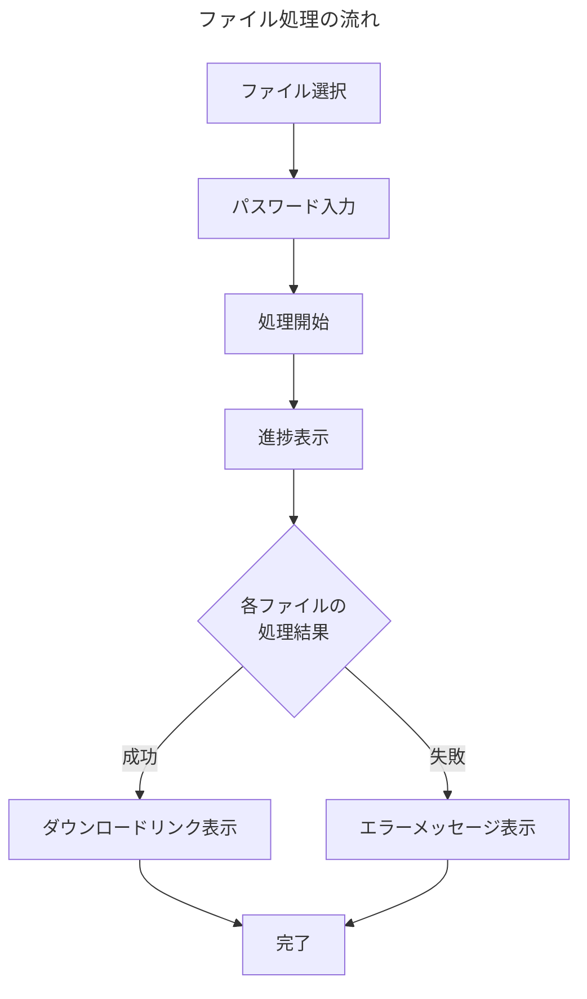

# Excelパスワード解除ツール フロントエンド開発に向けた認識合わせ

このドキュメントは、フロントエンド開発に着手する前に、私（AIアシスタント [[Cascade]]）とユーザー様の間の認識を合わせるためのものです。

## 更新ルール

1. **質問は消さない**: 私からの質問は、編集・削除せずそのまま残してください。
2. **回答を追記する**: 各質問の下にある「回答欄」に、ユーザー様の考えやご希望をご記入ください。
3. **視覚的な区別**: 私（AI）の質問と、ユーザー様の回答が分かりやすいようにフォーマットを分けて管理します。

---

## プロジェクト概要の確認

バックエンド開発で確認された要件を基に、フロントエンド開発の方向性を確認します。

### 既に確定している要件
- **バックエンド**: [[AWS Lambda]] + [[Amazon S3]] + [[API Gateway]]
- **フロントエンド**: [[Vercel]]でのデプロイ
- **認証**: [[Google]]認証（[[OAuth2.0]] + [[JWT]]）によるユーザー制限
- **処理対象**: 複数の[[Excel]]ファイルに対する2段階パスワード解除

---

## 認識合わせのためのご質問

### **【質問1】 どんな技術でWebサイトを作りますか？**

**🔍 この質問の意味**
Webサイトを作るには、いろいろな「道具」（技術）があります。例えば、家を建てるときに「木造」「鉄筋コンクリート」「鉄骨」などの選択肢があるのと同じです。

**📚 技術の解説**
- **[[Next.js]]**: 現在最も人気のあるWebサイト作成ツール。[[Google]]や[[Netflix]]なども使用
- **[[React]]**: [[Facebook]]が作った、画面を作るための基本的なツール
- **[[TypeScript]]**: より安全にプログラムを書けるようにする仕組み（エラーを事前に発見）
- **[[JavaScript]]**: Webサイトに動きをつけるプログラミング言語
- **[[Tailwind CSS]]**: 見た目を美しくするためのデザインツール

**🎯 おすすめの選択肢**
- **A案**: [[Next.js]] + [[TypeScript]] + [[Tailwind CSS]]（一番おすすめ）
  - 理由：[[Vercel]]（無料でWebサイトを公開できるサービス）と相性抜群
  - 多くの企業で使われているので、情報が豊富
  - 将来的にも長く使える技術

- **B案**: [[React]] + [[JavaScript]]（シンプル版）
  - 理由：A案より少し簡単だが、機能は少し制限される

**❓ 質問を簡単に言うと**
「最新で人気の技術を使いますか？それとも、シンプルで分かりやすい技術を使いますか？」

**【回答欄】**
> A案でいきましょう。現時点ではよく分かってませんが大丈夫です。学習します。

---

### **【質問2】 Webサイトの見た目はどんな感じにしますか？**

**🔍 この質問の意味**
Webサイトの「見た目」や「使いやすさ」をどんな風にするかを決めます。お店に例えると、「高級感のある落ち着いた雰囲気」「親しみやすくカジュアルな雰囲気」「最新でスタイリッシュな雰囲気」などの違いです。

**🎨 デザインの種類**
- **A案**: [[Google]]のようなシンプルで清潔感のあるデザイン
  - 特徴：白を基調とした、すっきりした見た目
  - 良い点：誰でも使いやすい、迷わない
  
- **B案**: 企業の業務ツールのような信頼感のあるデザイン
  - 特徴：青やグレーを基調とした、落ち着いた見た目
  - 良い点：仕事で使うツールらしい安心感
  
- **C案**: 現代的でカラフルなデザイン
  - 特徴：明るい色を使った、親しみやすい見た目
  - 良い点：楽しく使える、印象に残りやすい

**📱 必要な機能**
- **ファイルをドラッグ&ドロップ**: ファイルを画面にドラッグして簡単にアップロード
- **進捗表示**: 「3つのファイルのうち、2つ目を処理中...」のような表示
- **エラー時の分かりやすい説明**: 何が問題だったかを日本語で表示
- **スマホ対応**: パソコンでもスマートフォンでも使いやすい

**【回答欄】**
> 迷うけどA案でいいかな。
> ファイルのドラックアンドドロップはOKです。しかし、使っている端末の標準のファイルシステムから直接選択する方法も欲しいです。また、iPhoneだと、標準のファイルが、異なるフォルダのファイルを同時に選択できないクソ仕様なので、ファイル選択は追加もできるようにしてもらえるとiPhone、iPadユーザーにも優しいと思います。また、スマホ画面でも使いやすいUIにして欲しい。進捗表示もいいですね。大切なのはユーザーが「やってる感を感じれて、ある意味楽しさや有能感を感じれること」です。それが演出であっても私は大切だと思います。また、現時点ではバックエンドサービスがパスワード付きのエクセルファイルのみ受け付ける仕様になってると思います（本当にそうか確認して）。テスト段階では、動作を優先するため、パスワードなしのエクセルファイルやエクセル以外のファイルの自動除外については今後実装するというのがユーザーに伝わるように表示してほしい。これで、現在はテスト段階という認識と、将来に向けた期待感をユーザーに与えることができると思っています。

**【Cascadeからの追記】**
> 承知いたしました。ご要望をまとめると以下のようになりますね。
> - **デザイン**: A案（[[Google]]風シンプルデザイン）
> - **ファイル選択**: ①ファイル選択ボタン、②ドラッグ＆ドロップ、③追加でファイル選択、の3つの方法を実装します。
> - **UI**: スマートフォンでも操作しやすいレスポンシブデザインを採用します。
> - **進捗表示**: ユーザーが楽しめるような演出を加えます。（詳細は後述の【質問4.5】で詰めましょう）
> 
> **バックエンドの仕様に関するご確認について**
> > 現時点ではバックエンドサービスがパスワード付きのエクセルファイルのみ受け付ける仕様になってると思います（本当にそうか確認して）
> 
> はい、その通りです。現在のバックエンド（[ファイル処理とエラーハンドリング仕様](../../../backend/design/【出力】設計.ファイル処理とエラーハンドリング仕様.md)）では、パスワードが設定されていない[[Excel]]ファイルや、[[Excel]]以外のファイルはエラーとして処理し、パスワード解除処理は行いません。
> 
> **テスト段階であることの表示について**
> > テスト段階では、動作を優先するため、パスワードなしのエクセルファイルやエクセル以外のファイルの自動除外については今後実装するというのがユーザーに伝わるように表示してほしい。
> 
> 素晴らしいアイデアです。画面の分かりやすい位置に「ベータ版」や「テスト運用中」といった表示を行い、マウスオーバーすると「現在はパスワード付きExcelファイルのみ対応しています。今後のアップデートで対応範囲を拡大予定です。」といったメッセージが表示されるようにしましょう。

---

### **【質問3】 誰がこのWebサイトを使えるようにしますか？**

**🔍 この質問の意味**
このWebサイトは「誰でも使える」ではなく、「特定の人だけが使える」ようにしたいです。そのために、[[Google]]アカウントでログインしてもらいます。

**🔐 [[Google]]ログインとは？**
多くのWebサイトで見かける「[[Google]]でログイン」ボタンのことです。ユーザーはいつも使っている[[Gmail]]のアカウントで簡単にログインできます。

**📝 誰を許可しますか？**
- **A案**: あなたが指定した特定の[[Google]]アカウントだけ
  - 例：「taro@gmail.com」「hanako@gmail.com」のみ許可
  - メリット：最も安全、完全にコントロール可能
  
- **B案**: 特定の会社のメールアドレスを持つ人だけ
  - 例：「@yourcompany.com」で終わるメールアドレスの人だけ
  - メリット：会社のメンバーなら誰でも使える
  
- **C案**: 初回ログイン時にあなたが承認した人だけ
  - 例：新しい人がログインしたら、あなたに通知が来て、「OK」を押した人だけ使える
  - メリット：柔軟に対応できる

**⏰ ログイン状態の維持**
一度ログインしたら、どのくらいの間ログインしたままにしますか？
- **24時間**: 毎日ログインが必要（セキュリティ重視）
- **1週間**: 適度なバランス（おすすめ）
- **1ヶ月**: 便利だが、セキュリティは低め

**【回答欄】**
> A案がいいです。1週間でいいと思います。
> 相談です。ログイン認証の実装は、フロントエンドのデザインがある程度決まって、実際に動作するのをテストしてからの実装でもいいですか？一度システム全体が動くようになったら上司に相談したいです。ただ、これはあくまで相談です。これでいいのかどうか回答を追記してほしい。

**【Cascadeからの追記】**
> ご提案ありがとうございます。技術的には全く問題ありません。
> 
> **認証機能を後から実装するメリット・デメリット**
> - **メリット**: まずはファイル処理というコア機能の開発に集中でき、素早く動くもの（プロトタイプ）を作成できます。上司の方への説明もしやすいかと思います。
> - **デメリット**: 後から認証機能を組み込む際に、既存のコードの一部を修正する必要が出てくる可能性があります。
> 
> **結論として**
> 今回のケースでは、まずプロトタイプを完成させるメリットの方が大きいと判断します。ご提案通り、**認証機能は後回し**にして、まずはファイルアップロードからダウンロードまでの一連の流れを実装しましょう。開発ステップもそのように調整します。

---

### **【質問4】 ファイルのアップロードと処理はどんな感じにしますか？**

**🔍 この質問の意味**
ユーザーが複数の[[Excel]]ファイルをアップロードして、パスワードを解除するときの「体験」をどんな感じにするかを決めます。

**📁 ファイルの選び方**
- **A案**: 「ファイルを選択」ボタンで複数ファイルを一度に選択
  - 例：フォルダからCtrlキーを押しながら複数ファイルを選んで「開く」
  - メリット：慣れ親しんだ方法
  
- **B案**: ファイルをドラッグして画面に落とす
  - 例：フォルダからファイルをつかんで、ブラウザの画面にポイっと落とす
  - メリット：直感的で簡単
  
- **C案**: A案とB案の両方が使える（おすすめ）
  - メリット：ユーザーが好きな方法を選べる

**📊 処理の進捗表示**
複数ファイルを処理するとき、ユーザーに今何が起こっているかを表示します：

**📝 具体的に表示される情報**
- **全体の進捗**: 「5個のファイルのうち、3個処理完了」
- **各ファイルの状態**: 
  - 「待機中」（まだ処理していない）
  - 「処理中」（今パスワードを試している）
  - 「完了」（パスワード解除成功）
  - 「エラー」（パスワードが間違っているなど）
- **時間の目安**: 「あと約２分で完了予定」
- **一括ダウンロード**: 成功したファイルをまとめてダウンロード

**【回答欄】**
> C案でOK。複数ファイルを処理したとき、ダウンロードを一括にできる？一括にするときはZIPファイルにするような処理をバックエンドに追加しなきゃいけないのかな？その辺りが初学者の私にはわからない。ユーザーに対してリアルタイムに表示される進捗表示はユーザー体験に非常に重要だと考えます。いいと思います。

**【Cascadeからの追記】**
> C案（ファイル選択ボタンとドラッグ＆ドロップの両方）で承知いたしました。
> 
> **一括ダウンロードについて**
> > 複数ファイルを処理したとき、ダウンロードを一括にできる？一括にするときはZIPファイルにするような処理をバックエンドに追加しなきゃいけないのかな？
> 
> 良い質問ですね。おっしゃる通り、複数のファイルを一つにまとめてダウンロードするには、サーバー側（バックエンド）でファイルをZIP形式に圧縮する処理を追加する必要があります。これは非常に便利な機能ですので、ぜひ実装しましょう。
> 
> バックエンドの改修が必要になりますが、まずはフロントエンド側で「一括ダウンロードボタン」を準備しておき、後からバックエンドと連携する形で進めるのが効率的です。

---

### **【✨追加質問4.5】 処理の進捗表示は、どんな演出にしますか？**

**🔍 この質問の意味**
質問2で「やってる感」「楽しさ」「有能感」が大切だとおっしゃっていました。これを実現するために、進捗表示にどのような「演出」を加えるか具体的に決めたいと思います。

**💡 演出のアイデア**
- **A案: シンプルなプログレスバー型**
  - 各ファイル名の横に、進捗率（0% -> 100%）を示すバーを表示する、最も標準的なタイプです。
  - メリット：分かりやすい、実装が比較的簡単

- **B案: チェックリスト型**
  - `[ ] ファイル形式チェック` -> `[✔] ファイル形式チェック` のように、各工程が終わるたびにチェックマークが付いていくタイプです。
  - メリット：「タスクをこなしている感」が強く、満足度が高い

- **C案: アニメーション型**
  - 処理中のファイルに虫眼鏡のアニメーションを表示したり、完了したら紙吹雪が舞うような、視覚的に楽しい演出を加えます。
  - メリット：使っていて楽しい、ポジティブな印象を与える

**❓ 質問を簡単に言うと**
「進捗表示は、シンプルで分かりやすいのが良いですか？それとも、タスク完了感が味わえるものが良いですか？あるいは、見ていて楽しいアニメーション付きが良いですか？」

**【回答欄】**
> Bが良さそうだけど、見た目が複雑になるならAでOK。任せます。

---

### **【質問5】 エラーの表示方法はどうしますか？（修正案）**

**🔍 この質問の意味**
ファイル処理中にエラーが発生した際、その内容をユーザーにどう伝えるかを具体的に決めます。分かりやすいエラー表示は、ユーザーのストレスを軽減し、次のアクションを促すために非常に重要です。

**🎨 エラー表示の具体的な方法**
- **A案: ポップアップ通知**
  - 画面の隅（例: 右上）に「ファイル〇〇の処理に失敗しました」というメッセージが数秒間表示される方式。
  - **長所**: 画面全体を邪魔しない。
  - **短所**: すぐに消えるため、重要な情報を見逃す可能性がある。

- **B案: 各ファイル欄に直接表示**
  - アップロードしたファイルリストの中で、エラーが発生したファイルの欄に直接「❌ パスワードが一致しません」のように理由を表示する方式。（おすすめ）
  - **長所**: どのファイルで何が起きたか一目瞭然。
  - **短所**: 全体の進捗が見えにくくなる場合がある。

- **C案: エラーサマリー表示**
  - 全ての処理が終わった後に、「5件中2件のエラーがありました」と概要を表示し、「詳細を見る」ボタンでエラー内容の一覧を確認できる方式。
  - **長所**: 多くのファイルを処理した際に、結果が整理されて見やすい。
  - **短所**: リアルタイム性が低い。

**❓ 質問を簡単に言うと**
「エラーは、発生の都度ポップアップでお知らせしますか？ それとも、各ファイルに直接表示しますか？ あるいは、最後にまとめて表示しますか？」

**【回答欄】**
> 最後にまとめてがいいんじゃないかな？ユーザーがここを見れば大丈夫って安心感を持ってもらう方法がいいです。

---

### **【質問6】 パフォーマンスについて、具体的な制限を設けますか？（修正案）**

**🔍 この質問の意味**
サーバーに過度な負荷がかかるのを防ぎ、安定したサービスを提供するために、ユーザーが一度にアップロードできるファイルの「数」と「サイズ」に制限を設けるかどうかを決めます。

**⚖️ 制限の選択肢**
- **A案: 制限を緩くする**
  - **一度にアップロードできるファイル数**: 50個まで
  - **1ファイルあたりの最大サイズ**: 50MBまで
  - **メリット**: 多くのファイルを一度に処理したいユーザーにとって便利。
  - **デメリット**: サーバー負荷が高くなり、処理時間が長くなる可能性がある。

- **B案: バランスの取れた制限（おすすめ）**
  - **一度にアップロードできるファイル数**: 20個まで
  - **1ファイルあたりの最大サイズ**: 20MBまで
  - **メリット**: 一般的な利用シーンをカバーしつつ、サーバー負荷も抑制できる。
  - **デメリット**: 一部のヘビーユーザーには物足りないかもしれない。

- **C案: 制限を厳しくする**
  - **一度にアップロードできるファイル数**: 10個まで
  - **1ファイルあたりの最大サイズ**: 10MBまで
  - **メリット**: サーバー負荷を最小限に抑え、高速なレスポンスを維持できる。
  - **デメリット**: ユーザーの利便性が低い。

**📝 補足**
- これらの制限値は、いつでも変更可能です。
- セキュリティ（パスワードの安全な送信、ファイル保存期間など）については、業界のベストプラクティスに沿って、こちらで責任を持って実装しますのでご安心ください。

**【回答欄】**
> 50までにしましょう。

---

### **【質問7】 テストはどの程度しますか？**

**🔍 この質問の意味**
作ったシステムがちゃんと動くかを確認する「テスト」をどの程度しますか？

**🧪 テストの種類**
- **基本テスト**: ボタンを押したらちゃんと動くか
- **連携テスト**: バックエンドとの通信がうまくいくか
- **シナリオテスト**: ユーザーが実際に使う流れで動くか

**【回答欄】**
> シナリオテストまでですね。実際に動くのを確認したい。

---

### **【質問8】 開発期間はどのくらいを予定していますか？**

**🔍 この質問の意味**
開発にかかるおおよその時間を見積もります。これはあくまで目安であり、途中で変更することも可能です。

**📅 目安のスケジュール**
- **準備・設計**: 2-3日
- **基本機能開発**: 1週間
- **UI/UX開発**: 3-4日
- **テスト・デプロイ**: 2-3日

**合計**: 約2週間程度

**【回答欄】**
> スケジュールは一旦無視でOK。現在は私の趣味の範囲で行ってるので、スケジュールはざっくりでOK

---

