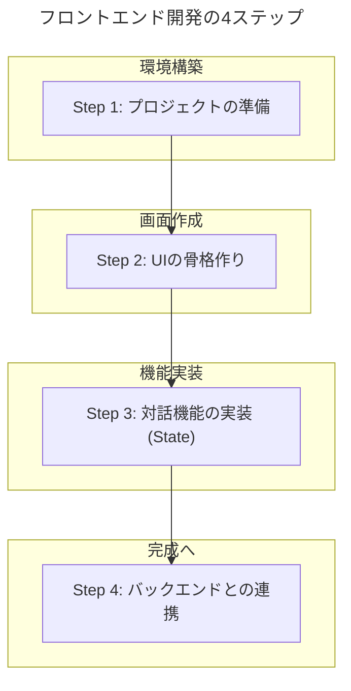
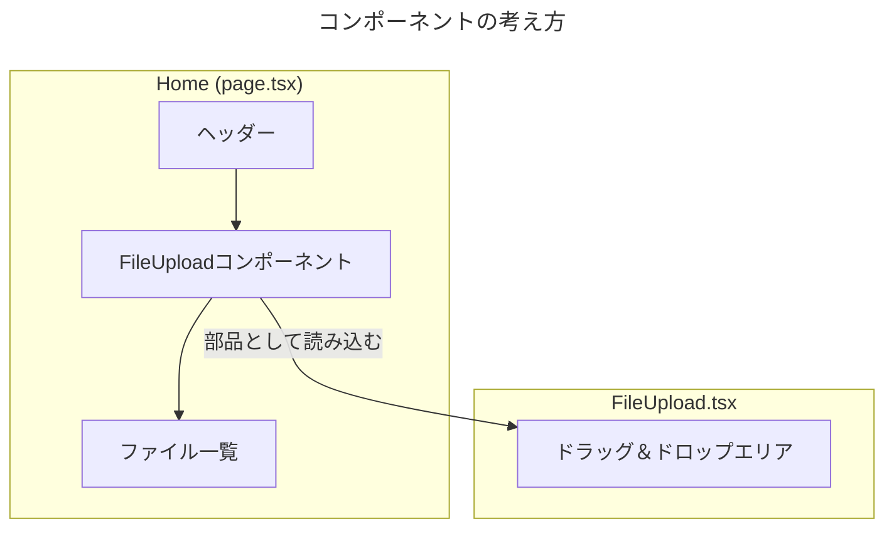
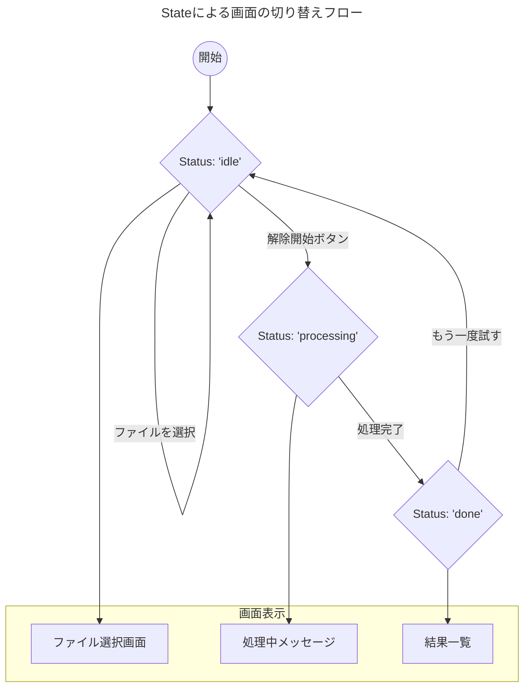
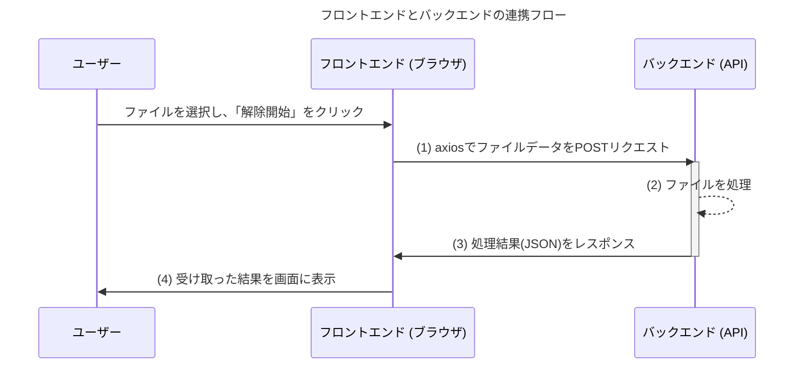

# フロントエンド開発のステップバイステップガイド

こんにちは！ここまでのフロントエンド開発で実施した内容を、一つずつ丁寧に解説していきます。専門用語もできるだけ分かりやすく説明し、図解を交えながら進めますので、ご自身のペースで読み進めてみてください。

このドキュメントを読むことで、「何が」「なぜ」そのように作られたのかが分かり、今後の開発にも役立つはずです。

---

## 開発の流れ（全体像）

今回のフロントエンド開発は、大きく分けて4つのステップで進んできました。

それでは、各ステップを詳しく見ていきましょう。

---

## Step 1: プロジェクトの準備 🏗️

まず、開発を始めるための「土台」を作りました。

### 1. Next.jsプロジェクトの作成

**🔍 何をしたか？**
`npx create-next-app@latest frontend` というコマンドを実行し、`frontend` という名前のフォルダにWebアプリケーションの雛形を作成しました。

**🤔 なぜNext.js？**
[認識合わせのドキュメント](../design/フロントエンド開発の認識合わせ.md)で決定した通り、モダンで高機能なWebアプリを効率的に作るためのフレームワーク（枠組み）である[[Next.js]]を採用しました。

**✨ ポイント**
作成時に、以下の設定を選択しました。
- **TypeScript**: コードの品質と安全性を高めるため。
- **Tailwind CSS**: デザインを効率的に実装するため。
- **App Router**: Next.jsの最新推奨機能で、ページの管理がしやすいため。

### 2. npmの権限問題を修正

**🔍 何をしたか？**
プロジェクト作成中に「権限エラー」が発生したため、`sudo chown -R $(whoami) ~/.npm` というコマンドで、PC内のnpm（Node.jsのパッケージ管理ツール）が使うフォルダの所有者をあなた自身に変更しました。

**🤔 なぜ必要だった？**
これはPCの設定に起因する問題で、npmがファイルを自由に読み書きできるようにするために必要な、一度きりの「おまじない」のようなものです。

### 3. 開発サーバーの起動

**🔍 何をしたか？**
`npm run dev` コマンドで、開発用のWebサーバーを起動しました。これにより、作成中のWebページを `http://localhost:3000` でリアルタイムに確認できるようになりました。

---

## Step 2: UIの骨格作り 🦴

次に、ユーザーが見る画面の「骨格」を作りました。

### 1. 初期ページのクリーンアップ

**🔍 何をしたか？**
Next.jsが自動で作成したサンプルページ（`frontend/src/app/page.tsx`）の中身を一度空っぽにして、シンプルな見出しだけを表示するようにしました。

**🤔 なぜ？**
まっさらな状態から、私たちが必要な部品だけを組み立てていくためです。

### 2. `FileUpload`コンポーネントの作成

**🔍 何をしたか？**
ファイルアップロード機能を持つUI部品（`FileUpload.tsx`）を `components` フォルダに作成しました。これを**コンポーネント**と呼びます。

**🤔 なぜコンポーネント？**
UIを「部品」として作ることで、再利用しやすくなり、コードの見通しも良くなります。例えば、将来別のページでも同じアップロード機能を使いたくなったら、この部品を再利用できます。

--- 

## Step 3: 対話機能の実装 (State) 🧠

画面がユーザーの操作に反応するように、「記憶力」を持たせました。これを**State（状態）管理**と呼びます。

### 1. `useState`フックの導入

**🔍 何をしたか？**
`page.tsx` に `useState` という[[React]]の機能を導入しました。これは、コンポーネントに「記憶」させたい情報を管理するための道具です。

**🤔 なぜ必要？**
Webページは通常、一度表示されたら内容は変わりません。しかし、`useState` を使うと、例えば「ユーザーが選択したファイル」を記憶し、その内容が変化したら自動的に画面を再描画してくれます。

今回、以下の3つの「状態」を管理するようにしました。
- `selectedFiles`: 選択されたファイルのリスト
- `processingStatus`: 現在の処理状況（待機中、処理中、完了）
- `results`: ファイルの処理結果

### 2. 状態に応じた画面の切り替え

**🔍 何をしたか？**
`processingStatus` の値によって、表示する内容を切り替えるようにしました。

- **'idle' (待機中)**: ファイルアップロードエリアを表示
- **'processing' (処理中)**: 「処理中です...」というメッセージを表示
- **'done' (完了)**: 処理結果の一覧を表示

**🤔 なぜ？**
これにより、ユーザーは現在の状況を直感的に理解でき、スムーズにアプリを操作できます。これを**Conditional Rendering（条件付きレンダリング）**と呼びます。

---

## Step 4: バックエンドとの連携 🤝

最後に、フロントエンド（画面）とバックエンド（裏側の処理）を繋ぎました。

### 1. `axios`のインストール

**🔍 何をしたか？**
`npm install axios` コマンドで、`axios` というライブラリをインストールしました。

**🤔 なぜ？**
フロントエンドとバックエンドは、HTTP通信という方法で会話します。`axios` は、このHTTP通信を簡単かつ安全に行うための人気の道具です。

### 2. APIのURLを環境変数に設定

**🔍 何をしたか？**
`.env.local` というファイルを作成し、バックエンドAPIのURL（`http://127.0.0.1:3000/unlock`）を記述しました。

**🤔 なぜ？**
URLのような設定値をコードに直接書くと、後で変更するのが大変です。また、公開してはいけない情報（APIキーなど）を誤って公開してしまう危険もあります。設定を別ファイルに分けることで、これらの問題を解決できます。

### 3. API通信処理の実装

**🔍 何をしたか？**
「解除開始」ボタンが押されたときの処理を、ダミーから実際のAPI通信に書き換えました。

**✨ ポイント**
- **`FormData`**: ファイルを送信するために、`FormData` という形式でデータを梱包しました。
- **`axios.post`**: `axios` を使って、梱包したデータをバックエンドに `POST` メソッドで送信しました。
- **非同期処理 (`async/await`)**: API通信には時間がかかるため、処理が終わるのを待ってから次のステップに進む `async/await` という仕組みを使いました。

--- 

以上が、ここまでのフロントエンド開発の流れです。ご不明な点があれば、いつでも質問してくださいね！
