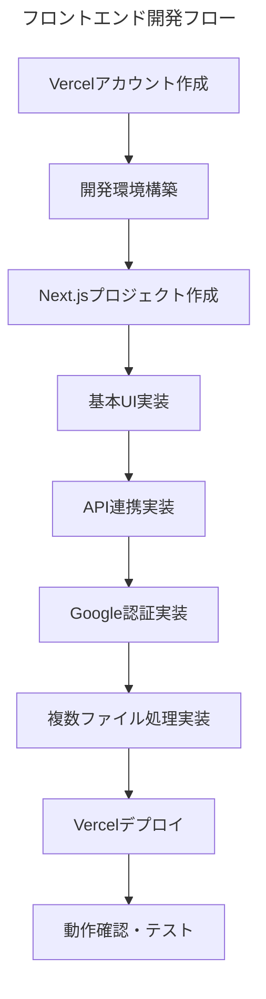

# 【出力】手順書_フロントエンド開発ガイド

このドキュメントは、Excelパスワード解除ツールのフロントエンド開発を、Vercelアカウントの作成から完成まで、ステップバイステップで解説します。

---

## 開発の全体像

フロントエンド開発は以下の流れで進めます：



---

## Phase 1: 事前準備

### 1.1 Vercelアカウントの作成

1. **Vercelの公式サイトにアクセス**
   - https://vercel.com/ を開く

2. **アカウント作成**
   - 「Sign Up」をクリック
   - **GitHubアカウントでの登録を推奨**（デプロイが簡単になります）
   - GitHubアカウントがない場合は、GitHubも併せて作成

3. **アカウント確認**
   - メール認証を完了
   - ダッシュボードにアクセスできることを確認

### 1.2 Node.jsの確認・インストール

フロントエンド開発にはNode.jsが必要です。

```powershell
# Node.jsのバージョン確認
node --version

# npmのバージョン確認
npm --version
```

**Node.jsがインストールされていない場合**:
1. https://nodejs.org/ から最新のLTS版をダウンロード
2. インストーラーを実行
3. PowerShellを再起動して、上記コマンドで確認

### 1.3 GitHubリポジトリの準備

```powershell
# プロジェクトディレクトリに移動
cd "C:\Users\hirok\Documents\Windsurf\811【開発】\python-excel-unlocker"

# 現在のGitの状態確認
git status

# 変更をコミット（必要に応じて）
git add .
git commit -m "バックエンド開発完了 - フロントエンド開発開始前"

# GitHubにプッシュ
git push origin main
```

---

## Phase 2: Next.jsプロジェクトの作成

### 2.1 フロントエンドディレクトリの作成

```powershell
# プロジェクトルートに移動
cd "C:\Users\hirok\Documents\Windsurf\811【開発】\python-excel-unlocker"

# フロントエンド用ディレクトリを作成
mkdir frontend
cd frontend

# Next.jsプロジェクトを作成
npx create-next-app@latest . --typescript --tailwind --eslint --app --src-dir --import-alias "@/*"
```

### 2.2 必要なパッケージのインストール

```powershell
# 追加パッケージのインストール
npm install @next-auth/prisma-adapter next-auth axios lucide-react

# 開発用パッケージのインストール
npm install -D @types/node
```

### 2.3 プロジェクト構造の確認

作成後のディレクトリ構造：
```
frontend/
├── src/
│   ├── app/
│   │   ├── globals.css
│   │   ├── layout.tsx
│   │   └── page.tsx
│   └── components/
├── public/
├── package.json
└── next.config.js
```

---

## Phase 3: 基本UI実装

### 3.1 メインページの作成

**ファイル**: `src/app/page.tsx`

```typescript
'use client'

import { useState } from 'react'
import { Upload, Lock, Download, AlertCircle } from 'lucide-react'

export default function Home() {
  const [files, setFiles] = useState<FileList | null>(null)
  const [password1, setPassword1] = useState('')
  const [password2, setPassword2] = useState('')
  const [isProcessing, setIsProcessing] = useState(false)
  const [results, setResults] = useState<any[]>([])

  const handleFileChange = (e: React.ChangeEvent<HTMLInputElement>) => {
    setFiles(e.target.files)
  }

  const handleSubmit = async (e: React.FormEvent) => {
    e.preventDefault()
    // TODO: API連携処理を実装
    console.log('処理開始:', { files, password1, password2 })
  }

  return (
    <div className="min-h-screen bg-gray-50 py-8">
      <div className="max-w-4xl mx-auto px-4">
        <div className="bg-white rounded-lg shadow-md p-6">
          <div className="text-center mb-8">
            <Lock className="mx-auto h-12 w-12 text-blue-600 mb-4" />
            <h1 className="text-3xl font-bold text-gray-900">
              Excelパスワード解除ツール
            </h1>
            <p className="text-gray-600 mt-2">
              パスワード付きExcelファイルを解除します
            </p>
          </div>

          <form onSubmit={handleSubmit} className="space-y-6">
            {/* ファイル選択 */}
            <div>
              <label className="block text-sm font-medium text-gray-700 mb-2">
                Excelファイルを選択
              </label>
              <div className="border-2 border-dashed border-gray-300 rounded-lg p-6 text-center">
                <Upload className="mx-auto h-8 w-8 text-gray-400 mb-2" />
                <input
                  type="file"
                  multiple
                  accept=".xlsx,.xls"
                  onChange={handleFileChange}
                  className="hidden"
                  id="file-upload"
                />
                <label
                  htmlFor="file-upload"
                  className="cursor-pointer text-blue-600 hover:text-blue-500"
                >
                  ファイルを選択またはドラッグ&ドロップ
                </label>
                {files && (
                  <p className="mt-2 text-sm text-gray-600">
                    {files.length}個のファイルが選択されています
                  </p>
                )}
              </div>
            </div>

            {/* パスワード入力 */}
            <div className="grid grid-cols-1 md:grid-cols-2 gap-4">
              <div>
                <label className="block text-sm font-medium text-gray-700 mb-2">
                  第一パスワード
                </label>
                <input
                  type="password"
                  value={password1}
                  onChange={(e) => setPassword1(e.target.value)}
                  className="w-full px-3 py-2 border border-gray-300 rounded-md focus:outline-none focus:ring-2 focus:ring-blue-500"
                  placeholder="第一パスワードを入力"
                  required
                />
              </div>
              <div>
                <label className="block text-sm font-medium text-gray-700 mb-2">
                  第二パスワード
                </label>
                <input
                  type="password"
                  value={password2}
                  onChange={(e) => setPassword2(e.target.value)}
                  className="w-full px-3 py-2 border border-gray-300 rounded-md focus:outline-none focus:ring-2 focus:ring-blue-500"
                  placeholder="第二パスワードを入力"
                  required
                />
              </div>
            </div>

            {/* 処理開始ボタン */}
            <button
              type="submit"
              disabled={!files || !password1 || !password2 || isProcessing}
              className="w-full bg-blue-600 text-white py-3 px-4 rounded-md hover:bg-blue-700 disabled:bg-gray-400 disabled:cursor-not-allowed flex items-center justify-center"
            >
              {isProcessing ? (
                <>
                  <div className="animate-spin rounded-full h-4 w-4 border-b-2 border-white mr-2"></div>
                  処理中...
                </>
              ) : (
                <>
                  <Lock className="h-4 w-4 mr-2" />
                  パスワード解除を開始
                </>
              )}
            </button>
          </form>

          {/* 結果表示エリア */}
          {results.length > 0 && (
            <div className="mt-8 border-t pt-6">
              <h2 className="text-xl font-semibold mb-4">処理結果</h2>
              <div className="space-y-3">
                {results.map((result, index) => (
                  <div
                    key={index}
                    className={`p-4 rounded-lg border ${
                      result.success
                        ? 'bg-green-50 border-green-200'
                        : 'bg-red-50 border-red-200'
                    }`}
                  >
                    <div className="flex items-center justify-between">
                      <div className="flex items-center">
                        {result.success ? (
                          <Download className="h-5 w-5 text-green-600 mr-2" />
                        ) : (
                          <AlertCircle className="h-5 w-5 text-red-600 mr-2" />
                        )}
                        <span className="font-medium">{result.fileName}</span>
                      </div>
                      {result.success && (
                        <a
                          href={result.downloadUrl}
                          className="bg-blue-600 text-white px-4 py-2 rounded-md hover:bg-blue-700 text-sm"
                        >
                          ダウンロード
                        </a>
                      )}
                    </div>
                    <p className="text-sm text-gray-600 mt-1">
                      {result.message}
                    </p>
                  </div>
                ))}
              </div>
            </div>
          )}
        </div>
      </div>
    </div>
  )
}
```

### 3.2 レイアウトの設定

**ファイル**: `src/app/layout.tsx`

```typescript
import type { Metadata } from 'next'
import { Inter } from 'next/font/google'
import './globals.css'

const inter = Inter({ subsets: ['latin'] })

export const metadata: Metadata = {
  title: 'Excelパスワード解除ツール',
  description: 'パスワード付きExcelファイルを安全に解除します',
}

export default function RootLayout({
  children,
}: {
  children: React.ReactNode
}) {
  return (
    <html lang="ja">
      <body className={inter.className}>
        {children}
      </body>
    </html>
  )
}
```

### 3.3 開発サーバーの起動

```powershell
# 開発サーバーを起動
npm run dev
```

ブラウザで `http://localhost:3000` にアクセスして、UIが表示されることを確認してください。

---

## Phase 4: API連携実装

### 4.1 API設定ファイルの作成

**ファイル**: `src/lib/api.ts`

```typescript
// APIのベースURL（あなたのAPIエンドポイント）
export const API_BASE_URL = 'https://gc2c53dlsl.execute-api.ap-northeast-1.amazonaws.com/Prod'

// APIクライアントの設定
export const apiClient = {
  // アップロード用URL取得
  generateUploadUrl: async (fileName: string) => {
    const response = await fetch(`${API_BASE_URL}/unlock`, {
      method: 'POST',
      headers: {
        'Content-Type': 'application/json',
      },
      body: JSON.stringify({
        action: 'generate-upload-url',
        file_name: fileName,
      }),
    })

    if (!response.ok) {
      throw new Error(`HTTP error! status: ${response.status}`)
    }

    return response.json()
  },

  // ファイルをS3にアップロード
  uploadFile: async (uploadUrl: string, file: File) => {
    const response = await fetch(uploadUrl, {
      method: 'PUT',
      headers: {
        'Content-Type': 'application/vnd.openxmlformats-officedocument.spreadsheetml.sheet',
      },
      body: file,
    })

    if (!response.ok) {
      throw new Error(`Upload failed! status: ${response.status}`)
    }

    return true
  },

  // パスワード解除処理
  processFile: async (s3Key: string, password1: string, password2: string) => {
    const response = await fetch(`${API_BASE_URL}/unlock`, {
      method: 'POST',
      headers: {
        'Content-Type': 'application/json',
      },
      body: JSON.stringify({
        action: 'process-file',
        s3_key: s3Key,
        password_1: password1,
        password_2: password2,
      }),
    })

    if (!response.ok) {
      throw new Error(`HTTP error! status: ${response.status}`)
    }

    return response.json()
  },
}
```

### 4.2 メインページのAPI連携実装

**ファイル**: `src/app/page.tsx` を更新

```typescript
'use client'

import { useState } from 'react'
import { Upload, Lock, Download, AlertCircle, CheckCircle } from 'lucide-react'
import { apiClient } from '@/lib/api'

interface ProcessResult {
  fileName: string
  success: boolean
  message: string
  downloadUrl?: string
}

export default function Home() {
  const [files, setFiles] = useState<FileList | null>(null)
  const [password1, setPassword1] = useState('')
  const [password2, setPassword2] = useState('')
  const [isProcessing, setIsProcessing] = useState(false)
  const [results, setResults] = useState<ProcessResult[]>([])
  const [progress, setProgress] = useState({ current: 0, total: 0 })

  const handleFileChange = (e: React.ChangeEvent<HTMLInputElement>) => {
    setFiles(e.target.files)
    setResults([]) // 新しいファイルが選択されたら結果をクリア
  }

  const processFile = async (file: File): Promise<ProcessResult> => {
    try {
      // Step 1: アップロード用URL取得
      const uploadResponse = await apiClient.generateUploadUrl(file.name)
      
      // Step 2: ファイルをS3にアップロード
      await apiClient.uploadFile(uploadResponse.upload_url, file)
      
      // Step 3: パスワード解除処理
      const processResponse = await apiClient.processFile(
        uploadResponse.s3_key,
        password1,
        password2
      )
      
      return {
        fileName: file.name,
        success: true,
        message: 'パスワード解除に成功しました',
        downloadUrl: processResponse.download_url,
      }
    } catch (error) {
      return {
        fileName: file.name,
        success: false,
        message: `エラー: ${error instanceof Error ? error.message : '不明なエラー'}`,
      }
    }
  }

  const handleSubmit = async (e: React.FormEvent) => {
    e.preventDefault()
    
    if (!files || files.length === 0) return

    setIsProcessing(true)
    setResults([])
    setProgress({ current: 0, total: files.length })

    const newResults: ProcessResult[] = []

    // ファイルを1つずつ処理
    for (let i = 0; i < files.length; i++) {
      const file = files[i]
      setProgress({ current: i + 1, total: files.length })
      
      const result = await processFile(file)
      newResults.push(result)
      setResults([...newResults]) // 結果を随時更新
    }

    setIsProcessing(false)
  }

  return (
    <div className="min-h-screen bg-gray-50 py-8">
      <div className="max-w-4xl mx-auto px-4">
        <div className="bg-white rounded-lg shadow-md p-6">
          <div className="text-center mb-8">
            <Lock className="mx-auto h-12 w-12 text-blue-600 mb-4" />
            <h1 className="text-3xl font-bold text-gray-900">
              Excelパスワード解除ツール
            </h1>
            <p className="text-gray-600 mt-2">
              パスワード付きExcelファイルを解除します
            </p>
          </div>

          <form onSubmit={handleSubmit} className="space-y-6">
            {/* ファイル選択 */}
            <div>
              <label className="block text-sm font-medium text-gray-700 mb-2">
                Excelファイルを選択
              </label>
              <div className="border-2 border-dashed border-gray-300 rounded-lg p-6 text-center">
                <Upload className="mx-auto h-8 w-8 text-gray-400 mb-2" />
                <input
                  type="file"
                  multiple
                  accept=".xlsx,.xls"
                  onChange={handleFileChange}
                  className="hidden"
                  id="file-upload"
                />
                <label
                  htmlFor="file-upload"
                  className="cursor-pointer text-blue-600 hover:text-blue-500"
                >
                  ファイルを選択またはドラッグ&ドロップ
                </label>
                {files && (
                  <div className="mt-2 text-sm text-gray-600">
                    <p>{files.length}個のファイルが選択されています</p>
                    <div className="mt-1 text-xs">
                      {Array.from(files).map((file, index) => (
                        <div key={index}>{file.name}</div>
                      ))}
                    </div>
                  </div>
                )}
              </div>
            </div>

            {/* パスワード入力 */}
            <div className="grid grid-cols-1 md:grid-cols-2 gap-4">
              <div>
                <label className="block text-sm font-medium text-gray-700 mb-2">
                  第一パスワード
                </label>
                <input
                  type="password"
                  value={password1}
                  onChange={(e) => setPassword1(e.target.value)}
                  className="w-full px-3 py-2 border border-gray-300 rounded-md focus:outline-none focus:ring-2 focus:ring-blue-500"
                  placeholder="第一パスワードを入力"
                  required
                />
              </div>
              <div>
                <label className="block text-sm font-medium text-gray-700 mb-2">
                  第二パスワード
                </label>
                <input
                  type="password"
                  value={password2}
                  onChange={(e) => setPassword2(e.target.value)}
                  className="w-full px-3 py-2 border border-gray-300 rounded-md focus:outline-none focus:ring-2 focus:ring-blue-500"
                  placeholder="第二パスワードを入力"
                  required
                />
              </div>
            </div>

            {/* 進捗表示 */}
            {isProcessing && (
              <div className="bg-blue-50 border border-blue-200 rounded-lg p-4">
                <div className="flex items-center justify-between mb-2">
                  <span className="text-sm font-medium text-blue-900">
                    処理中: {progress.current} / {progress.total}
                  </span>
                  <span className="text-sm text-blue-700">
                    {Math.round((progress.current / progress.total) * 100)}%
                  </span>
                </div>
                <div className="w-full bg-blue-200 rounded-full h-2">
                  <div
                    className="bg-blue-600 h-2 rounded-full transition-all duration-300"
                    style={{ width: `${(progress.current / progress.total) * 100}%` }}
                  ></div>
                </div>
              </div>
            )}

            {/* 処理開始ボタン */}
            <button
              type="submit"
              disabled={!files || !password1 || !password2 || isProcessing}
              className="w-full bg-blue-600 text-white py-3 px-4 rounded-md hover:bg-blue-700 disabled:bg-gray-400 disabled:cursor-not-allowed flex items-center justify-center"
            >
              {isProcessing ? (
                <>
                  <div className="animate-spin rounded-full h-4 w-4 border-b-2 border-white mr-2"></div>
                  処理中...
                </>
              ) : (
                <>
                  <Lock className="h-4 w-4 mr-2" />
                  パスワード解除を開始
                </>
              )}
            </button>
          </form>

          {/* 結果表示エリア */}
          {results.length > 0 && (
            <div className="mt-8 border-t pt-6">
              <h2 className="text-xl font-semibold mb-4">処理結果</h2>
              <div className="space-y-3">
                {results.map((result, index) => (
                  <div
                    key={index}
                    className={`p-4 rounded-lg border ${
                      result.success
                        ? 'bg-green-50 border-green-200'
                        : 'bg-red-50 border-red-200'
                    }`}
                  >
                    <div className="flex items-center justify-between">
                      <div className="flex items-center">
                        {result.success ? (
                          <CheckCircle className="h-5 w-5 text-green-600 mr-2" />
                        ) : (
                          <AlertCircle className="h-5 w-5 text-red-600 mr-2" />
                        )}
                        <span className="font-medium">{result.fileName}</span>
                      </div>
                      {result.success && result.downloadUrl && (
                        <a
                          href={result.downloadUrl}
                          className="bg-blue-600 text-white px-4 py-2 rounded-md hover:bg-blue-700 text-sm flex items-center"
                        >
                          <Download className="h-4 w-4 mr-1" />
                          ダウンロード
                        </a>
                      )}
                    </div>
                    <p className="text-sm text-gray-600 mt-1">
                      {result.message}
                    </p>
                  </div>
                ))}
              </div>
            </div>
          )}
        </div>
      </div>
    </div>
  )
}
```

---

## Phase 5: 動作確認

### 5.1 開発サーバーでのテスト

```powershell
# 開発サーバーを起動
npm run dev
```

1. ブラウザで `http://localhost:3000` にアクセス
2. テスト用のExcelファイルを選択
3. パスワードを入力
4. 「パスワード解除を開始」ボタンをクリック
5. 処理結果を確認

### 5.2 エラーハンドリングの確認

- 間違ったパスワードでのテスト
- ネットワークエラーのシミュレーション
- 大きなファイルでのテスト

---

## Phase 6: Vercelデプロイ

### 6.1 環境変数の設定

**ファイル**: `.env.local`

```env
# 本番環境用の設定
NEXT_PUBLIC_API_URL=https://gc2c53dlsl.execute-api.ap-northeast-1.amazonaws.com/Prod
```

### 6.2 Vercelプロジェクトの作成

```powershell
# Vercel CLIのインストール
npm install -g vercel

# Vercelにログイン
vercel login

# プロジェクトをデプロイ
vercel --prod
```

### 6.3 デプロイ設定

1. **プロジェクト名**: `excel-password-unlocker`
2. **フレームワーク**: Next.js（自動検出）
3. **ビルドコマンド**: `npm run build`（デフォルト）
4. **出力ディレクトリ**: `.next`（デフォルト）

---

## Phase 7: Google認証の実装（オプション）

### 7.1 Google Cloud Consoleでの設定

1. **Google Cloud Console**にアクセス
2. **新しいプロジェクト**を作成
3. **APIs & Services** → **Credentials**
4. **OAuth 2.0 Client IDs**を作成
5. **承認済みのリダイレクトURI**を設定

### 7.2 NextAuth.jsの設定

**ファイル**: `src/app/api/auth/[...nextauth]/route.ts`

```typescript
import NextAuth from 'next-auth'
import GoogleProvider from 'next-auth/providers/google'

const handler = NextAuth({
  providers: [
    GoogleProvider({
      clientId: process.env.GOOGLE_CLIENT_ID!,
      clientSecret: process.env.GOOGLE_CLIENT_SECRET!,
    }),
  ],
  callbacks: {
    async signIn({ user, account, profile }) {
      // 許可されたユーザーのメールアドレスをチェック
      const allowedEmails = [
        'your-email@example.com', // あなたのメールアドレス
        // 他の許可されたメールアドレス
      ]
      
      return allowedEmails.includes(user.email || '')
    },
  },
})

export { handler as GET, handler as POST }
```

---

## トラブルシューティング

### よくある問題と解決方法

1. **CORS エラー**
   - APIのCORS設定を確認
   - ブラウザの開発者ツールでエラー詳細を確認

2. **ファイルアップロードエラー**
   - ファイルサイズの制限を確認
   - Content-Typeヘッダーの設定を確認

3. **認証エラー**
   - 環境変数の設定を確認
   - Google Cloud Consoleの設定を確認

### デバッグ方法

```typescript
// APIレスポンスのログ出力
console.log('API Response:', response)

// エラーの詳細ログ
console.error('Error details:', error)
```

---

## 次のステップ

1. **基本機能の動作確認**
2. **Google認証の実装**（必要に応じて）
3. **UI/UXの改善**
4. **エラーハンドリングの強化**
5. **本番環境での最終テスト**

このガイドに従って開発を進めることで、完全に機能するフロントエンドアプリケーションが完成します。各ステップで問題が発生した場合は、トラブルシューティングセクションを参照してください。
