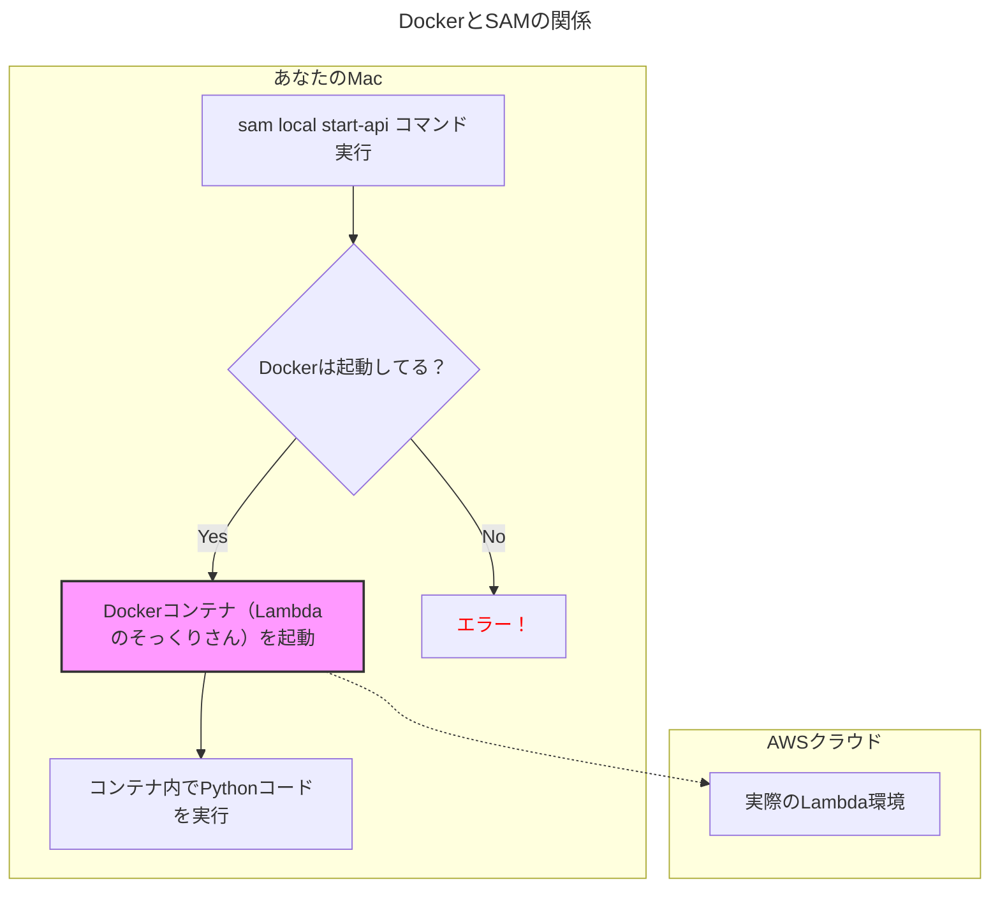

# Dockerのインストールと設定ガイド

AWS SAMを使ってローカルで開発を進める際に「Dockerが必要」というエラーが出た場合の対処法を解説します。

## なぜDockerが必要なの？

AWS SAMの `local` コマンド（`start-api`など）は、AWSのLambda関数をあなたのPC上で忠実に再現するために、**Dockerコンテナ**という技術を使います。

- **Dockerとは？**: アプリケーションを「コンテナ」という隔離された箱に入れて動かすための技術です。
- **なぜSAMで使う？**: この「箱」がAWSのクラウド環境とそっくりなため、開発中のコードがクラウド上でも同じように動くことを保証してくれます。



## インストール手順 (Mac)

1.  **Docker Desktopのダウンロード**
    以下の公式サイトから、あなたのMacに合ったDocker Desktopをダウンロードします。
    - [Docker公式サイト：Docker Desktop for Mac](https://www.docker.com/products/docker-desktop/)
    - 通常は「Apple Chip」（M1, M2, M3など）か「Intel Chip」かを選択します。

2.  **インストール**
    ダウンロードした `.dmg` ファイルを開き、DockerアイコンをApplicationsフォルダにドラッグ＆ドロップしてインストールします。

3.  **Dockerの起動**
    アプリケーションフォルダから「Docker」を起動します。初回起動時は利用規約への同意などが求められる場合があります。

4.  **起動の確認**
    メニューバーにクジラのアイコンが表示され、クリックして「Docker Desktop is running」と表示されていれば起動成功です。

    

## インストール後の再挑戦

Docker Desktopが「running」状態になったことを確認したら、もう一度ターミナルに戻り、プロジェクトのルートディレクトリ (`Excel_Password`) で以下のコマンドを再実行してください。

```bash
sam local start-api
```

今度はDockerが起動しているため、SAMは正常にローカルサーバーを起動できるはずです。
