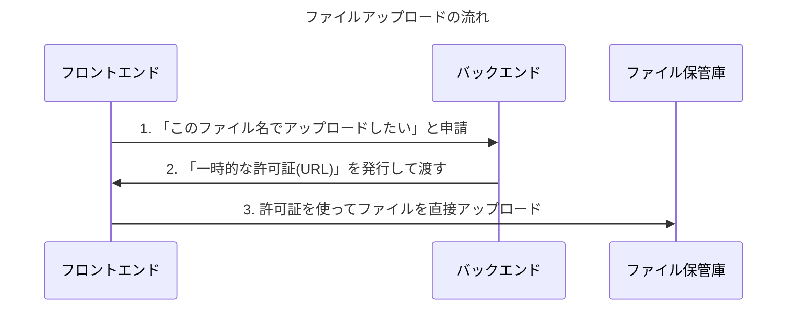
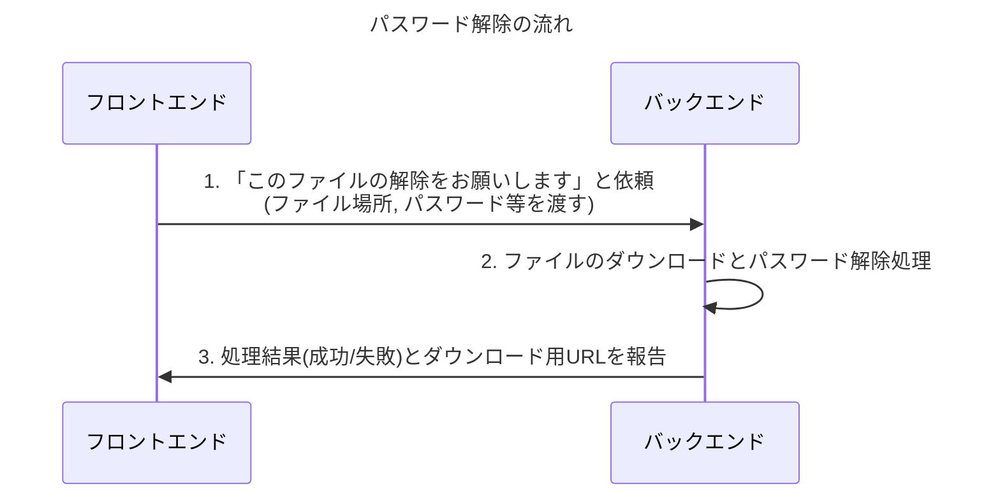

# フロントエンドとバックエンドの連携方法 (ご質問とご確認)

このドキュメントは、Web画面（フロントエンド）と、パスワード解除を行う裏側の仕組み（バックエンド）をどのようにつなぎこむか、私たちの間の認識を合わせるためのものです。
お手数ですが、以下の質問にご回答ください。

## 1. 更新ルール

1.  **質問は消さない**: 私からの質問は、編集・削除せずそのまま残してください。
2.  **回答を追記する**: 各質問の下にある「✅ 回答欄」に、考えやご希望をご記入ください。
3.  **視覚的な区別**: 私（AI）の質問と、ユーザー様の回答が分かりやすいようにフォーマットを分けて管理します。

---

## 2. 連携に関するご質問

### **質問1：ファイルアップロードの流れについて**

**🔍 この質問の意味**
安全かつ高速にファイルをアップロードするための、一連の正しい手順を確認します。ご指摘の通り、バックエンドには既に「一時的な許可証（署名付きURL）」を発行する機能がありました。私の確認不足で大変失礼いたしました。

**ご質問**
ファイルアップロードは、以下の図の流れで行います。この手順でよろしいでしょうか？



**✅ 回答欄**

（こちらにご回答ください）

---

### **質問2：パスワード解除の流れについて**

**🔍 この質問の意味**
ファイルがアップロードされた後、いよいよパスワード解除を実行します。このための機能も、バックエンドに既に存在します。その使い方と役割を確認させてください。

**ご質問**
パスワード解除は、以下の図の流れで行います。この手順でよろしいでしょうか？



**✅ 回答欄**

（こちらにご回答ください）

---

### **質問3：バックエンドの修正点について**

**🔍 この質問の意味**
現在のバックエンドは、1つのLambda関数が「URL発行」と「パスワード解除」の両方を担当できる作りになっています。しかし、API Gatewayの設定（`template.yaml`）では、`/unlock` という入口しか定義されていません。そのため、`/generate-upload-url` という「アップロード受付専用の入口」を新しく追加する必要があります。

**ご質問**
バックエンドの修正として、以下の2点を実施する、という認識でよろしいでしょうか？

1.  **APIの入口を追加**: `template.yaml` を修正し、`/generate-upload-url` という新しい入口を追加する。
2.  **処理の振り分け**: `main.py` を修正し、来た道（`/unlock` か `/generate-upload-url`）によって、処理を正しく振り分ける仕組みを追加する。

```mermaid
--- 
title: "バックエンドの修正イメージ"
--- 
flowchart TD
    subgraph API Gateway (template.yaml)
        A("/unlock") --> C{Lambda関数}
        B("/generate-upload-url") --> C
    end

    subgraph Lambda関数 (main.py)
        C -- "来た道は？" --> D{処理の振り分け}
        D -- "/unlockなら" --> E["パスワード解除処理"]
        D -- "/generate-upload-urlなら" --> F["URL発行処理"]
    end
```

**✅ 回答欄**

（こちらにご回答ください）
