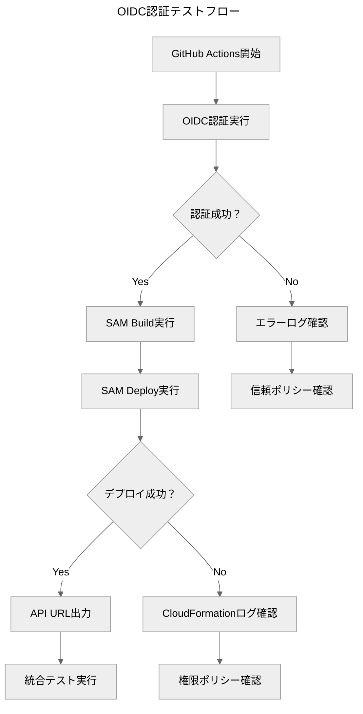

> **AI生成物の注意書き**：内容の最終確認が必要です。数値・日付は原典と照合してください。

**結論**：GitHub OIDCによりアクセスキー不要の安全なAWS認証を実現し、短期クレデンシャルで自動デプロイを可能にする  
**対象**：GitHub ActionsでAWSデプロイを行う開発者・DevOpsエンジニア  
**所要時間**：初回設定30分、テスト確認15分  
**次の一手**：1) AWS OIDC設定 → 2) GitHub Secrets登録 → 3) ワークフロー動作確認  
**根拠**：・長期アクセスキーのセキュリティリスク排除／・CI用IAM(OIDC)はブートストラップで管理（2025-10-04更新）／・deploy-aws.ymlのOIDC対応

## 概要

GitHub ActionsからAWSへの認証を、従来の長期アクセスキーから[[OIDC]]（OpenID Connect）による短期クレデンシャルに移行する手順を説明します。現在は、CI用のOIDCプロバイダーとAssumeRoleロールはアプリケーションスタックから分離し、手動またはブートストラップ用のIaCで管理します（2025-10-04更新）。GitHub ActionsワークフローはOIDCに対応済みです。

### OIDC認証の利点

- **セキュリティ強化**: 長期アクセスキーの漏洩リスクを排除
- **自動管理**: 短期トークンの自動発行・失効
- **細かい権限制御**: リポジトリ・ブランチ単位での権限設定
- **監査の簡素化**: CloudTrailでの追跡が容易

## 前提条件

- AWS管理者権限を持つアカウント
- GitHubリポジトリの管理者権限
- AWS CLI設定済み環境
- 本プロジェクトのtemplate.yamlとdeploy-aws.ymlが最新版

## 変更履歴（重要／今回の修正理由）

- 2025-10-04（本ドキュメント更新）
  - 変更内容:
    - CI用IAM（GitHub OIDCプロバイダーおよびGitHub Actionsロール）のスタック内自動作成に関する記述を廃止し、ブートストラップで管理する方針に統一
    - GitHub ActionsがCloudFormation経由でLambda実行ロールを作成・更新・削除できるよう、OIDCロールへ「最小限のIAM権限」を付与する手順を新規追加
  - 理由:
    - スタック更新時にCI自身のロールやOIDCプロバイダーへ変更が及ぶと、権限不足や循環依存で失敗しやすいため（運用安定性の観点から分離がベストプラクティス）
    - デプロイ時にLambda実行ロールを作る必要があるが、既存のOIDCロールにIAMロール管理権限が不足していたため


## AWS側の設定

### 手動設定（必須）

GitHub OIDC プロバイダーは、CloudFormationでの権限問題を避けるため、事前に手動作成する必要があります。

#### 1. OIDC プロバイダーの作成

```bash
# 自動作成スクリプトを実行
./scripts/create-github-oidc-provider.sh
```

または手動で作成：

```bash
# AWS CLI で直接作成
aws iam create-open-id-connect-provider \
    --url https://token.actions.githubusercontent.com \
    --client-id-list sts.amazonaws.com \
    --thumbprint-list 6938fd4d98bab03faadb97b34396831e3780aea1,1c58a3a8518e8759bf075b76b750d4f2df264fcd
```

#### 2. 作成確認

```bash
# OIDC プロバイダーの存在確認
aws iam list-open-id-connect-providers --query "OpenIDConnectProviderList[?contains(Arn, 'token.actions.githubusercontent.com')]"
```

> ℹ️ **SAMデプロイ時のポイント**: 一度プロバイダーを用意できたら、`samconfig.toml` や `sam deploy` の `parameter_overrides` では `CreateOIDCProvider=false` を指定してください。CloudFormationが新規作成を試みなくなるため、IAM権限を追加する必要がなく、CI/CDが安定します。

### 自動設定（CloudFormation）
（2025-10-04更新）現在、CI用IAM（OIDCプロバイダー／GitHub Actionsロール）はアプリケーションスタック（template.yaml）から削除済みです。ブートストラップとして手動または別IaCで作成・管理してください。

### 手動設定（トラブルシューティング用）

SAMデプロイが利用できない場合の手動設定手順：

#### 1. OIDCプロバイダーの作成

```bash
# GitHub OIDCプロバイダーの作成
aws iam create-open-id-connect-provider \
  --url https://token.actions.githubusercontent.com \
  --client-id-list sts.amazonaws.com \
  --thumbprint-list 6938fd4d98bab03faadb97b34396831e3780aea1 1c58a3a8518e8759bf075b76b750d4f2df264fcd
```

#### 2. IAMロールの作成

信頼ポリシー（trust-policy.json）:
```json
{
  "Version": "2012-10-17",
  "Statement": [
    {
      "Effect": "Allow",
      "Principal": {
        "Federated": "arn:aws:iam::ACCOUNT-ID:oidc-provider/token.actions.githubusercontent.com"
      },
      "Action": "sts:AssumeRoleWithWebIdentity",
      "Condition": {
        "StringEquals": {
          "token.actions.githubusercontent.com:aud": "sts.amazonaws.com"
        },
        "StringLike": {
          "token.actions.githubusercontent.com:sub": "repo:hirokun-hub/python-excel-unlocker:*"
        }
      }
    }
  ]
}
```

ロール作成コマンド:
```bash
# IAMロールの作成
aws iam create-role \
  --role-name GitHubActions-ExcelUnlocker-development \
  --assume-role-policy-document file://trust-policy.json

# PowerUserAccessポリシーのアタッチ
aws iam attach-role-policy \
  --role-name GitHubActions-ExcelUnlocker-development \
  --policy-arn arn:aws:iam::aws:policy/PowerUserAccess
```

#### 3. OIDCロールへの最小権限付与（Lambda実行ロール管理／新規）

CloudFormationがLambda実行ロール（例: `GetUploadUrlFunctionRole`, `UnlockFunctionRole`）を作成・更新・削除できるよう、GitHub ActionsがAssumeするOIDCロールに最小限のIAM権限を追加します。リソースはロール名パターンで厳格に絞り、`iam:PassRole`は`lambda.amazonaws.com`に限定します。

```json
{
  "Version": "2012-10-17",
  "Statement": [
    {
      "Sid": "ManageLambdaExecutionRoles",
      "Effect": "Allow",
      "Action": [
        "iam:CreateRole",
        "iam:DeleteRole",
        "iam:GetRole",
        "iam:UpdateRole",
        "iam:AttachRolePolicy",
        "iam:DetachRolePolicy",
        "iam:PutRolePolicy",
        "iam:DeleteRolePolicy",
        "iam:TagRole",
        "iam:UntagRole"
      ],
      "Resource": [
        "arn:aws:iam::<ACCOUNT_ID>:role/excel-unlocker-api-*-GetUploadUrlFunctionRole-*",
        "arn:aws:iam::<ACCOUNT_ID>:role/excel-unlocker-api-*-UnlockFunctionRole-*"
      ]
    },
    {
      "Sid": "PassLambdaExecutionRoles",
      "Effect": "Allow",
      "Action": "iam:PassRole",
      "Resource": [
        "arn:aws:iam::<ACCOUNT_ID>:role/excel-unlocker-api-*-GetUploadUrlFunctionRole-*",
        "arn:aws:iam::<ACCOUNT_ID>:role/excel-unlocker-api-*-UnlockFunctionRole-*"
      ],
      "Condition": {
        "StringEquals": { "iam:PassedToService": "lambda.amazonaws.com" }
      }
    }
  ]
}
```

> 推奨: 可能であればPermissions Boundaryを必須化し、作成される実行ロールの上限権限を制限してください。

## GitHub Secrets設定

### 必要なSecrets

GitHubリポジトリの **Settings** > **Secrets and variables** > **Actions** で以下を設定：

| Secret名 | 値の例 | 説明 |
|----------|--------|------|
| `AWS_GITHUB_ACTIONS_ROLE_ARN` | `arn:aws:iam::123456789012:role/GitHubActions-ExcelUnlocker-development` | OIDC用IAMロールのARN |
| `ALLOWED_USERS` | `user1@example.com,user2@example.com` | 許可ユーザーリスト（環境別） |
| `VERCEL_TOKEN` | `vc_1a2b3c4d5e6f...` | Vercel API トークン |

### 古いSecretsの削除

⚠️ **重要**: OIDC移行後は以下を削除してください：
- `AWS_ACCESS_KEY_ID`
- `AWS_SECRET_ACCESS_KEY`

## ワークフロー設定確認

### 対応済みワークフロー

本プロジェクトの以下ワークフローはOIDC対応済みです：

- `.github/workflows/deploy-aws.yml`（再利用可能ワークフロー）
- `.github/workflows/deploy-backend.yml`（パイプライン）
- `.github/workflows/deploy-full-stack.yml`（統合デプロイ）

### OIDC設定の確認ポイント

```yaml
# 必要な権限設定
permissions:
  id-token: write   # OIDC認証に必要
  contents: read    # リポジトリ内容の読み取り

jobs:
  deploy-aws:
    steps:
      # OIDC認証（優先）
      - name: Configure AWS credentials (OIDC)
        if: ${{ env.AWS_GITHUB_ACTIONS_ROLE_ARN != '' }}
        uses: aws-actions/configure-aws-credentials@v4
        with:
          role-to-assume: ${{ secrets.AWS_GITHUB_ACTIONS_ROLE_ARN }}
          role-session-name: GitHubActions-Backend-${{ github.run_id }}
          aws-region: ap-northeast-1

      # フォールバック認証（アクセスキー）
      - name: Configure AWS credentials (access keys)
        if: ${{ env.AWS_GITHUB_ACTIONS_ROLE_ARN == '' }}
        uses: aws-actions/configure-aws-credentials@v4
        with:
          aws-access-key-id: ${{ secrets.AWS_ACCESS_KEY_ID }}
          aws-secret-access-key: ${{ secrets.AWS_SECRET_ACCESS_KEY }}
          aws-region: ap-northeast-1
```

## 動作確認

### テスト手順

1. **ワークフローの手動実行**:
   ```
   GitHub → Actions → "Backend - Deploy to AWS" → Run workflow
   Environment: development を選択して実行
   ```

2. **ログの確認**:
   ```
   ✅ 成功例:
   Configure AWS credentials (OIDC)
   Assuming role with OIDC
   Role assumed successfully
   
   ❌ 失敗例:
   Error: Could not assume role with OIDC
   ```

3. **CloudTrailでの確認**:
   ```bash
   # AssumeRoleWithWebIdentity イベントの確認
   aws logs filter-log-events \
     --log-group-name CloudTrail/ExcelUnlocker \
     --filter-pattern "AssumeRoleWithWebIdentity"
   ```

### 環境別テスト



## トラブルシューティング

### よくあるエラーと対処法

#### 1. "Could not assume role with OIDC"

**原因**: IAMロールの信頼関係設定が不正

**対処法**:
```bash
# 信頼ポリシーの確認
aws iam get-role \
  --role-name GitHubActions-ExcelUnlocker-development \
  --query 'Role.AssumeRolePolicyDocument'

# リポジトリ名の確認（正確な形式）
echo "repo:hirokun-hub/python-excel-unlocker:*"
```

#### 2. "Access denied" エラー

**原因**: IAMポリシーの権限不足

**対処法**:
```bash
# アタッチされたポリシーの確認
aws iam list-attached-role-policies \
  --role-name GitHubActions-ExcelUnlocker-development

# CloudFormation権限の確認
aws iam simulate-principal-policy \
  --policy-source-arn arn:aws:iam::ACCOUNT:role/GitHubActions-ExcelUnlocker-development \
  --action-names cloudformation:CreateStack \
  --resource-arns "*"
```

#### 3. "Invalid identity token"

**原因**: GitHub側のOIDCトークン設定問題

**対処法**:
- ワークフローファイルの `permissions` セクション確認
- `id-token: write` が設定されているか確認
- ブランチ制限の確認（mainブランチからの実行か）

### デバッグ用コマンド

```bash
# 現在のOIDCプロバイダー確認
aws iam list-open-id-connect-providers

# ロールの詳細確認
aws iam get-role --role-name GitHubActions-ExcelUnlocker-development

# CloudFormationスタックの出力確認
aws cloudformation describe-stacks \
  --stack-name excel-unlocker-api-development \
  --query "Stacks[0].Outputs"
```

## セキュリティベストプラクティス

### 1. 最小権限の原則

template.yamlで定義されたIAMポリシーは以下の権限のみを付与：

- **CloudFormation**: スタック管理権限
- **Lambda**: 関数作成・更新権限
- **S3**: 特定バケットの操作権限
- **API Gateway**: API作成・更新権限
- **IAM**: ロール管理権限（制限付き）

### 2. 条件付きアクセス制御

信頼ポリシーで以下を制限：
- 特定リポジトリからのアクセスのみ許可
- GitHub OIDCプロバイダーからのアクセスのみ許可
- 特定のaudience（sts.amazonaws.com）のみ許可

### 3. 監査とモニタリング

```bash
# CloudTrailでのOIDC認証監視
aws logs create-log-group --log-group-name /aws/github-actions/audit

# 異常なAssumeRole呼び出しの検知
aws logs put-metric-filter \
  --log-group-name CloudTrail/ExcelUnlocker \
  --filter-name UnauthorizedAssumeRole \
  --filter-pattern "{ $.eventName = AssumeRoleWithWebIdentity && $.errorCode EXISTS }"
```

## 環境別設定

### samconfig.tomlとの連携

各環境のスタック名とロール名の対応：

| 環境 | スタック名 | ロール名 |
|------|------------|----------|
| development | `excel-unlocker-api-dev` | `GitHubActions-ExcelUnlocker-development` |
| staging | `excel-unlocker-api-staging` | `GitHubActions-ExcelUnlocker-staging` |
| production | `excel-unlocker-api-prod` | `GitHubActions-ExcelUnlocker-production` |

### GitHub Environments（推奨）

環境別のSecrets管理にはGitHub Environmentsを活用：

1. **Settings** > **Environments** で環境作成
2. 各環境に `AWS_GITHUB_ACTIONS_ROLE_ARN` を設定
3. Protection rulesで承認フローを設定

## 結論

GitHub OIDC連携により、長期アクセスキーのセキュリティリスクを排除し、自動化されたAWS認証を実現できます。本プロジェクトのtemplate.yamlとワークフローファイルは既にOIDC対応済みのため、GitHub Secretsの設定のみで移行が完了します。

定期的な権限レビューとCloudTrail監視により、継続的なセキュリティ向上を図ってください。

## 付録

### 関連ファイル

- `template.yaml`: OIDC設定を含むAWS SAMテンプレート
- `.github/workflows/deploy-aws.yml`: OIDC対応ワークフロー
- `samconfig.toml`: 環境別デプロイ設定

### 参考資料

- [GitHub Actions: Configuring OpenID Connect in Amazon Web Services](https://docs.github.com/en/actions/deployment/security-hardening-your-deployments/configuring-openid-connect-in-amazon-web-services)
- [AWS IAM: Creating OpenID Connect identity providers](https://docs.aws.amazon.com/IAM/latest/UserGuide/id_roles_providers_create_oidc.html)
- [aws-actions/configure-aws-credentials](https://github.com/aws-actions/configure-aws-credentials)
