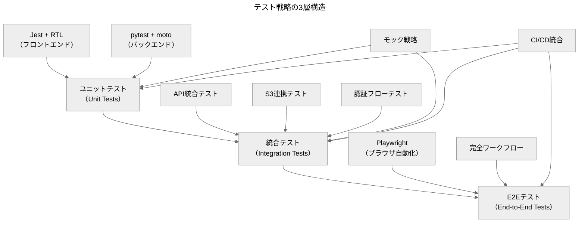

【出力】テスト.戦略_テスト戦略概要と実行ガイド

```yaml
---
layout: default
title: テスト戦略概要と実行ガイド
description: Secure Excel Unlockプロジェクトのテスト分類、統合テスト、モック方針の包括的ガイド
author: Hiroaki Endo
permalink: test-strategy-overview-and-execution-guide
date: 2025-01-19
last_modified_at: 2025-01-19
published: false
Tags:
  - testing
  - strategy
  - jest
  - playwright
  - integration_test
  - mock
  - quality_assurance
  - ci_cd
---
```

> **AI生成物の注意書き**：内容の最終確認が必要です。数値・日付は原典と照合してください。

**結論**：3層テスト戦略（ユニット/統合/E2E）でリスクを段階的に検出し、モック活用で開発効率を最大化する  
**対象**：開発チーム（フロントエンド・バックエンド・QA担当者）  
**所要時間**：10分  
**次の一手**：1) テスト分類理解 → 2) 実行環境準備 → 3) 継続的実行体制構築  
**根拠**：・現行カバレッジ80%基準／・統合テスト自動化済み／・CI/CD連携対応

## テスト戦略の全体像

Secure Excel Unlockプロジェクトでは、品質保証と開発効率のバランスを取るため、3層のテスト戦略を採用しています。



## テスト分類と責務

### ユニットテスト

**目的**: 個別コンポーネント・関数の動作確認

#### フロントエンド（Jest + React Testing Library）
- **対象**: `src/lib/`配下のユーティリティ関数、主要コンポーネント
- **実行方法**: 
  ```bash
  cd frontend
  npm run test              # 全ユニットテスト実行
  npm run test:watch        # ウォッチモード
  npm run test:coverage     # カバレッジ付き実行
  ```
- **カバレッジ基準**: 80%（branches/functions/lines/statements）
- **主要テストファイル**:
  - `__tests__/lib/api.test.ts` - API呼び出しロジック
  - `__tests__/lib/fileSecurity.test.ts` - ファイル検証機能
  - `__tests__/components/FileUpload.test.tsx` - ファイルアップロードUI

#### バックエンド（pytest + moto）
- **対象**: Lambda関数、ユーティリティモジュール
- **実行方法**:
  ```bash
  cd backend
  pytest                    # 全ユニットテスト実行
  pytest --cov             # カバレッジ付き実行
  pytest -m unit           # ユニットテストのみ
  ```
- **モック対象**: AWS SDK（S3、CloudWatch）、外部API呼び出し
- **主要テストファイル**:
  - `tests/unit/test_unlock.py` - Excel解除処理
  - `tests/unit/test_file_security.py` - ファイルセキュリティ
  - `tests/unit/test_s3_constrained_upload.py` - S3操作

### 統合テスト

**目的**: コンポーネント間連携とAWSサービス統合の確認

#### API統合テスト
- **対象**: Lambda関数とAPI Gateway、S3の連携
- **実行方法**:
  ```bash
  ./tests/run-integration-tests.sh api
  # または
  cd tests/integration && npm run test:api
  ```
- **テスト内容**:
  - 署名付きURL生成API（`/presigned-urls`）
  - Excel解除API（`/unlock`）
  - 認証・認可フロー
  - エラーハンドリング

#### S3連携テスト
- **対象**: ファイルアップロード・ダウンロード・クリーンアップ
- **実行方法**:
  ```bash
  ./tests/run-integration-tests.sh s3
  ```
- **テスト内容**:
  - 署名付きURLでのファイル操作
  - CORS設定の動作確認
  - ファイルライフサイクル管理

#### フロントエンド統合テスト
- **対象**: フロントエンドとバックエンドAPI間の連携
- **実行方法**:
  ```bash
  cd frontend
  npm run test:integration:api
  ```
- **テスト内容**:
  - 認証トークン伝搬
  - API呼び出しとレスポンス処理
  - エラー状態の表示

### E2Eテスト（End-to-End）

**目的**: ユーザー視点での完全なワークフロー検証

#### Playwrightテスト
- **対象**: ブラウザでの実際のユーザー操作
- **実行方法**:
  ```bash
  cd frontend
  npm run test:e2e          # 全E2Eテスト
  npm run test:e2e:ui       # UIモード
  npm run test:a11y         # アクセシビリティテスト
  ```
- **テスト内容**:
  - Google OAuth認証フロー
  - ファイルアップロード・処理・ダウンロード
  - Google Drive連携
  - エラーハンドリングUI

#### 完全ワークフローテスト
- **実行方法**:
  ```bash
  ./tests/run-integration-tests.sh e2e
  ```
- **テスト内容**:
  - 複数ファイル並列処理
  - パフォーマンス測定
  - 障害時の復旧フロー

## モック戦略

### 開発時モック（NEXT_PUBLIC_USE_MOCK_API）

フロントエンド開発時にバックエンドAPIを模擬する仕組みです。

```typescript
// 環境変数による切り替え
const USE_MOCK_API = process.env.NEXT_PUBLIC_USE_MOCK_API === 'true';

// モック実装例
if (USE_MOCK_API) {
  return mockApiResponse;
} else {
  return await axios.post(apiUrl, data);
}
```

**利用場面**:
- バックエンドAPI未実装時の並行開発
- ネットワーク不安定環境での開発
- UI/UXの集中的な検証

### テスト時モック

#### フロントエンドモック
- **axios**: API呼び出しのモック
- **Google Drive API**: ファイル操作のモック
- **Auth.js**: 認証状態のモック

#### バックエンドモック（moto）
- **S3**: ファイル操作のモック
- **CloudWatch**: ログ・メトリクスのモック
- **Lambda**: 関数実行環境のモック

## 実行環境とスクリプト

### 統合実行スクリプト

プロジェクトルートの `tests/run-integration-tests.sh` で全テストを統合実行できます。

```bash
# 全テスト実行
./tests/run-integration-tests.sh all

# 個別実行
./tests/run-integration-tests.sh backend    # バックエンドのみ
./tests/run-integration-tests.sh frontend   # フロントエンドのみ
./tests/run-integration-tests.sh api        # API統合テストのみ
./tests/run-integration-tests.sh s3         # S3連携テストのみ
./tests/run-integration-tests.sh e2e        # E2Eテストのみ

# クリーンアップオプション
./tests/run-integration-tests.sh all cleanup      # 自動クリーンアップ
./tests/run-integration-tests.sh all no-cleanup   # クリーンアップなし
```

### 前提条件チェック

統合テスト実行前に以下が自動確認されます：
- AWS CLI設定と認証
- Node.js・Python環境
- 必要な依存関係
- 環境変数設定

### 環境変数設定

#### フロントエンド（`.env.local`）
```bash
NEXT_PUBLIC_API_URL=https://your-api-gateway.execute-api.ap-northeast-1.amazonaws.com/prod
NEXT_PUBLIC_USE_MOCK_API=false
NEXTAUTH_SECRET=your-secret-key
GOOGLE_CLIENT_ID=your-google-client-id
GOOGLE_CLIENT_SECRET=your-google-client-secret
```

#### 統合テスト（`tests/integration/.env.test`）
```bash
AWS_REGION=ap-northeast-1
S3_BUCKET_NAME=your-test-bucket
API_BASE_URL=https://your-api-gateway.execute-api.ap-northeast-1.amazonaws.com/prod
TEST_USER_EMAIL=test@example.com
```

## パフォーマンス基準

### 期待値

| テスト項目 | 期待値 | 測定方法 |
|-----------|--------|----------|
| 署名付きURL生成 | < 5秒（P95） | 統合テスト |
| ファイルアップロード（1MB） | < 10秒 | E2Eテスト |
| Excel解除処理 | < 8秒（P95） | 統合テスト |
| 完全ワークフロー | < 15秒 | E2Eテスト |

### 測定方法

```bash
# パフォーマンステストのみ実行
cd tests/integration
npm test -- --testNamePattern="パフォーマンス"

# Playwrightでのパフォーマンス測定
cd frontend
npm run test:e2e -- --grep="performance"
```

## CI/CD統合

### GitHub Actions連携

テストは以下のタイミングで自動実行されます：
- プルリクエスト作成時
- メインブランチへのマージ時
- 定期実行（毎日深夜）

### テスト結果レポート

#### カバレッジレポート
```bash
# フロントエンド
cd frontend && npm run test:coverage
# 結果: frontend/coverage/index.html

# バックエンド
cd backend && pytest --cov --cov-report=html
# 結果: backend/htmlcov/index.html
```

#### JUnit形式レポート
```bash
# フロントエンド
npm run test -- --reporters=jest-junit
# 結果: frontend/test-results/junit-fe.xml

# Playwright
npm run test:e2e
# 結果: frontend/test-results/results.xml
```

## トラブルシューティング

### よくある問題

#### AWS認証エラー
```bash
# 認証情報確認
aws sts get-caller-identity

# プロファイル設定
export AWS_PROFILE=your-profile
```

#### テストタイムアウト
```bash
# Jest タイムアウト延長
export JEST_TIMEOUT=120000

# Playwright タイムアウト設定
npx playwright test --timeout=60000
```

#### モック設定エラー
```bash
# モックモード確認
echo $NEXT_PUBLIC_USE_MOCK_API

# モック有効化
export NEXT_PUBLIC_USE_MOCK_API=true
```

### ログ確認

```bash
# 統合テストログ
tail -f tests/integration/test-results.log

# Lambda関数ログ
aws logs tail /aws/lambda/your-function-name --follow

# フロントエンドテストログ
cd frontend && npm run test -- --verbose
```

## 継続的改善

### メトリクス収集

- テスト実行時間の追跡
- 成功率の監視（目標: 95%以上）
- カバレッジ傾向の分析
- パフォーマンス劣化の早期検出

### テスト拡張指針

1. **新機能追加時**: 対応するテストケースを必ず追加
2. **バグ修正時**: 再発防止のためのテストケース追加
3. **パフォーマンス改善時**: ベンチマークテストの更新
4. **セキュリティ強化時**: セキュリティテストの追加

## 結論

この3層テスト戦略により、開発効率を維持しながら高品質なアプリケーションを継続的に提供できます。ユニットテストで基本動作を保証し、統合テストでサービス間連携を確認し、E2Eテストでユーザー体験を検証することで、リスクを段階的に軽減しています。

モック機能の活用により、外部依存を排除した高速なテスト実行が可能で、CI/CD統合により品質ゲートとしても機能します。定期的なメトリクス確認と継続的なテスト拡張により、長期的な品質向上を実現します。

## 付録

### テスト実行コマンド一覧

#### フロントエンド
```bash
npm run test                    # 全ユニットテスト
npm run test:watch             # ウォッチモード
npm run test:coverage          # カバレッジ付き
npm run test:e2e               # E2Eテスト
npm run test:e2e:ui            # E2E UIモード
npm run test:auth              # 認証テストのみ
npm run test:a11y              # アクセシビリティテスト
npm run test:integration       # 統合テスト
npm run type-check             # 型チェック
```

#### バックエンド
```bash
pytest                         # 全テスト
pytest --cov                   # カバレッジ付き
pytest -m unit                 # ユニットテストのみ
pytest -m integration          # 統合テストのみ
pytest -m slow                 # 低速テストのみ
pytest --verbose               # 詳細出力
pytest tests/unit/test_unlock.py  # 特定ファイル
```

#### 統合テスト
```bash
./tests/run-integration-tests.sh all        # 全統合テスト
./tests/run-integration-tests.sh backend    # バックエンドのみ
./tests/run-integration-tests.sh frontend   # フロントエンドのみ
./tests/run-integration-tests.sh api        # APIテストのみ
./tests/run-integration-tests.sh s3         # S3テストのみ
./tests/run-integration-tests.sh e2e        # E2Eテストのみ
```

### 設定ファイル参照

- **Jest設定**: `frontend/jest.config.js`
- **Playwright設定**: `frontend/playwright.config.ts`
- **pytest設定**: `backend/pytest.ini`
- **統合テスト設定**: `tests/integration/package.json`
- **環境変数テンプレート**: `tests/integration/.env.test.example`

### 関連ドキュメント

- [[docs/testing/frontend.md]] - フロントエンドテスト詳細ガイド
- [[tests/integration/INTEGRATION_TESTS.md]] - 統合テスト実行ガイド
- [[docs/setup/local-development.md]] - ローカル開発環境構築
- [[docs/operations/runbook.md]] - 運用・障害対応手順