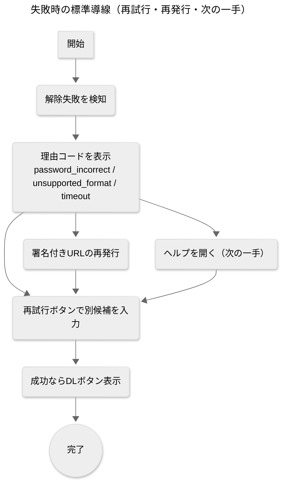

> 本ページはAIによる補助的な下書きです。最終判断や正確性は、元の資料・コード・リポジトリを必ず参照してください。

---

## 前提の共有（第1弾の要点とリポジトリ確認）

* 第1弾のPRFAQ用「認識合わせ10問」は、[[PRFAQ]]の骨格（見出し/ターゲット/価値/差別化/価格/同期・非同期/セキュリティ/スコープ/KPI/ローンチ）を網羅済み。第2弾では**重複を避け**、より実装・運用・法務・PR実務に踏み込む論点を追加します。
* API側の基本合意：**パスワード候補を最大2個**受け取り、失敗理由を明示。S3経由での入出力、[[AWS Lambda]]/[[API Gateway]]を前提。
* フロント実装方針：[[Next.js]] + [[React]] + [[shadcn_ui]] を用い、**署名付きURL**でS3にPUT→解除→DLの直列フローを想定（現行の実装指針ドラフトも参照）。

### リポジトリのZIP確認（要点・[[2025-08-21]]）

* `backend/src/main.py` にて [[msoffcrypto-tool]] と [[boto3]] を使用。複数ファイルに対応したループ処理・S3入出力・署名URL発行（関数）を実装済み。
* `backend/src/requirements.txt` に `msoffcrypto-tool`, `boto3` を明記。
* `frontend/src/components/FileUpload.tsx` と `frontend/src/app/page.tsx` が存在。現状は `NEXT_PUBLIC_API_URL` に対しフォームデータPOSTで直接送信する構成で、**S3の署名付きURL経由は未導入**。
* `docs/企画/PRFAQ/` に第1弾PRFAQ認識合わせ、およびAPI認識合わせの資料あり（本ドキュメントはそれらの**第2弾**）。

---

# PRFAQ第2弾：より正確に反映するための追加10問

> 形式：**質問 → 背景 → 用語メモ（必要に応じて） → 選択肢（メリット/デメリット） → 推奨 → 私の解答欄**
> 専門用語はそのまま使い、用語の簡単解説を添えます。文章はわかりやすさ優先。

---

## 1) プレスリリースの「引用者」は誰にしますか？（顧客の声/経営者の声/現場の声）

**背景**：第1弾では見出しや価値を決めました。第2弾では**引用の主語**を決め、PRの信頼度を上げます。引用者が誰かで、伝わる「重み」が変わります。

**選択肢**

* **A. 現場スタッフ（例：NSCの和美さん）**

  * 〇：「作業時間◯分短縮」の実感値が出しやすい
  * ✕：企業全体の意思決定層には軽く映ることも
* **B. 部門責任者（バックオフィス/営業責任者）**

  * 〇：部門のKPI改善や運用定着を語れる
  * ✕：現場の生々しさはやや薄まる
* **C. 経営層（取締役/事業責任者）**

  * 〇：導入判断への説得力が強い
  * ✕：個別の手触りが弱くなりがち

**推奨**：**A+Bの二枚構成**（冒頭はA、囲みでB）。「速さ」を感覚と数値の両面で示せます。
**私の解答欄**

### 私の解答欄
- Aですが名前はKさんにしてください
---

## 2) 対応デバイス/ブラウザと「iPhoneでの完結動線」をどう定義しますか？

**背景**：本プロダクトは**iPhoneからの利用価値**が高い前提。SafariのDL動作、[[Files]]アプリ、社内[[Google Drive]]共有までの**最短動線**をPRで約束できると強いです。

**選択肢**

* **A. iPhone Safari完全完結（アップ→解除→DL→Drive保存まで）**

  * 〇：現場の移動中ユースに刺さる
  * ✕：UI/ガイドの作り込みが必要
* **B. スマホは閲覧中心、編集や共有はPC推奨**

  * 〇：実装負荷が軽い
  * ✕：モバイル価値が弱くなる
* **C. iPhone/Android/PCの**サポートマトリクス**を明示**

  * 〇：問い合わせ削減、期待値調整ができる
  * ✕：記述がやや冗長

**推奨**：**A + C**。PRFAQに動線図、サポート表を掲載。
**私の解答欄**

### 私の解答欄
- Aです。
---

## 3) Google Drive連携の深さ（保存先/共有/制限）はどこまで出しますか？

**背景**：第1弾回答でDrive保存・共有ニーズが示唆済み。**保存先フォルダ規約/共有リンクの既定/社内ドメイン限定**など、運用ルールをPRFAQで明示すると混乱が減ります。

**選択肢**

* **A. 既定フォルダ固定 + ドメイン内共有のみ**

  * 〇：迷わない・安全
  * ✕：柔軟性は低い
* **B. 保存先選択可 + 共有は利用者に委ねる**

  * 〇：自由度が高い
  * ✕：誤共有リスク
* **C. Aを初期値、管理者ポリシーでBに切替可能**

  * 〇：標準は安全、運用で柔軟
  * ✕：設定メンテが必要

**推奨**：**C**（社内ホワイトリスト[[OAuth2]]ログイン前提）。
**私の解答欄**

### 私の解答欄
- 保存先だけ選択できればOKです。ユーザー自身のGoogle Driveに保存できればOKです。
- ただ、初期ローンチではこの機能はなくてもOK。後日のアップデートで実装でOKです
---

## 4) ログ/メトリクスの**最小十分**設計はどれにしますか？（何を残し何を残さない）

**背景**：第1弾でSLO/KPIに触れましたが、第2弾は**観測性**を決めます。平文パスワードは**残さない**、が大前提。その上で**何を計測**し、**どれだけ保持**するかを確定します。

**用語メモ**：[[メトリクス]]＝数値指標、[[ログ]]＝動作の記録、[[可観測性]]＝システムの見えやすさ。

**選択肢**

* **A. 最小ログ（時刻/処理時間/結果/拡張子/サイズ帯）保持7日**

  * 〇：安全・軽量
  * ✕：調査の粒度は粗い
* **B. A＋失敗理由コード・Lambdaコールドスタート統計、保持30日**

  * 〇：品質改善に強い
  * ✕：コスト上昇
* **C. プラン別（Free=A, Pro=B相当）**

  * 〇：柔軟な運用
  * ✕：仕様が複雑化

**推奨**：**B**（社内利用開始時点）。初期から改善サイクルを回せます。
**私の解答欄**

### 私の解答欄
- Aでいいですけど、これ保存するにはデータベース必要ですか？
- データベースが必要なら一旦最初はログ残さなくてもOK。
- それか、GitHub上に残してくれればそれでOKだけど、それは大丈夫ですか？セキュリティ上どのくらい問題があるかわからないので、教えてください

#### AIの回答

---

## 5) 失敗時のリカバリ導線（再試行/再署名URL/問い合わせ）の標準は？

**背景**：第1弾でエラーメッセージ方針は合意済。第2弾では**行動導線**（再試行ボタン、署名URL再発行、想定QA）を決めます。

**選択肢**

* **A. その場で再試行（別候補を入力）＋署名URL自動再発行**

  * 〇：離脱を防ぐ
  * ✕：実装が少し増える
* **B. 一度トップへ戻す（やり直し）**

  * 〇：実装は最小
  * ✕：体験が悪い
* **C. 失敗理由に応じた**次の一手**をUIでガイド**

  * 〇：学習と成功率UP
  * ✕：文言運用が必要

**推奨**：**A + C**。ボタンとガイドをセットに。
**私の解答欄**

### 私の解答欄

---

## 6) 法務・倫理スタンスをPRFAQでどこまで明記しますか？

**背景**：本機能は**既知のパスワード候補の検証**であり、総当り（ブルートフォース）ではありません。**利用許諾**と**責任分界**（ユーザーが権限を有するファイルのみ）をPRFAQに記載すると誤解を防げます。

**選択肢**

* **A. 利用規約リンクのみ**

  * 〇：軽量
  * ✕：PRFAQ読者に伝わらない
* **B. PRFAQ内に「やらないこと」の明記（総当り/シート保護解除/第三者ファイル）**

  * 〇：誤用を抑止
  * ✕：文量が増える
* **C. Bに加え、**社内利用想定**の一文（ホワイトリスト運用）**

  * 〇：現実に即す
  * ✕：後の一般公開時に調整が必要

**推奨**：**C**。現状に合わせて誤解を最小化。
**私の解答欄**

### 私の解答欄

---

## 7) ブランドボイスとクリエイティブ指針（トーン/画像/動画/モザイク）

**背景**：PR本文・LP・チュートリアルの**言葉のトーン**と、**スクリーンショットの個人情報マスク**ポリシーを先に決めると制作が速くなります。

**選択肢**

* **A. 率直・実務寄り（短文＋数字）＋UI静止画**

  * 〇：読みやすい・作りやすい
  * ✕：感情面は控えめ
* **B. ストーリー寄り（導入前後の物語）＋短尺動画**

  * 〇：刺さる人がいる
  * ✕：制作コスト
* **C. Aを基本、要所でBを補助（30秒チュートリアル）**

  * 〇：バランス良い
  * ✕：運用の工夫が必要

**推奨**：**C**。数字で信頼、短尺で理解。
**私の解答欄**

### 私の解答欄

---

## 8) サービス境界と責任分担（返金/サポート/問い合わせSLA）

**背景**：第1弾で価格/KPIを議論済み。第2弾では**返金可否**や**問い合わせ対応**の線引きを決め、PRFAQの外部FAQに盛り込みます。

**選択肢**

* **A. 社内利用：無料・返金なし、問い合わせはSlack/メール即時**

  * 〇：運用が軽い
  * ✕：将来の外部提供時に移行が必要
* **B. チケット制（問い合わせ番号付与、対応時間帯を明記）**

  * 〇：可観測性UP
  * ✕：初期は手間
* **C. 失敗理由コードに応じたセルフヘルプ優先＋必要時のみ有人対応**

  * 〇：スケールしやすい
  * ✕：初回は整備が必要

**推奨**：**A + C**（社内は軽く、セルフヘルプ充実）。
**私の解答欄**

### 私の解答欄

---

## 9) 運用ガードレール（SLO・エラーバジェット・機能フラグ）

**背景**：SLO（体験の約束）を下回る時、**どの機能を一時OFF**にするか、**通知先**や**公開ステータス**の扱いを決めます。

**選択肢**

* **A. P95処理時間悪化時：大容量は自動で非同期キューへ迂回**

  * 〇：体験を守る
  * ✕：実装が増える
* **B. 失敗率上昇時：同時実行数を自動制限**

  * 〇：安定化
  * ✕：ピーク時の待ちが発生
* **C. 機能フラグで「Drive連携」「複数同時」などを段階停止**

  * 〇：被害局所化
  * ✕：フラグ運用が必要

**推奨**：**A + B + C** の三段。小さく止めて全体を守る。
**私の解答欄**

### 私の解答欄

---

## 10) プリモーテム（失敗を先に想像）と緩和策の優先順位

**背景**：第1弾の設計前提（[[S3]]/[[AWS Lambda]]/[[API Gateway]]/[[msoffcrypto-tool]]/二段パス候補/モバイル重視）を踏まえ、**最も起こりそうな失敗**を先に決めておくとPRFAQの説得力が増します。

**選択肢（上位リスク例）**

* **A. 旧式[[.xls]]の暗号方式差異で解除不可**

  * 緩和：拡張子/暗号方式の早期判定、`unsupported_format` の丁寧ガイド
* **B. 署名付きURL期限切れによる連続失敗**

  * 緩和：60秒→再発行ボタン、タイムアウト文言の統一
* **C. コールドスタート/同時実行で遅い**

  * 緩和：並列数制御、非同期迂回、観測メトリクスの可視化

**推奨**：**A→B→C** の順で先に手を打つ（UI文言・判定順・計測を先出し）。
**私の解答欄**

### 私の解答欄

---

## 付録：失敗時の標準導線（図解）

---

## 使い方（このページの進め方）

1. 各セクションの「私の解答欄」に回答（[[2025-08-21]] 時点のベストでOK）。
2. 回答を受け、**第1弾のPRFAQ本文**に追記・修正して仕上げます（引用者・動線図・法務記述・運用ガードレール等）。
3. 仕様/実装の差分は**API認識合わせ**・**実装方針**のドラフトに反映し、I/F/ログ/UI文言辞書を更新。

---

**参考（出典）**

* 既存のAPI認識合わせ（2段パス候補・S3/Lambda前提）&#x20;
* 既存のPRFAQ用10問（第1弾）&#x20;
* 実装方針（Next.js/[[shadcn_ui]]/署名URL/Unlock I/F）&#x20;

---